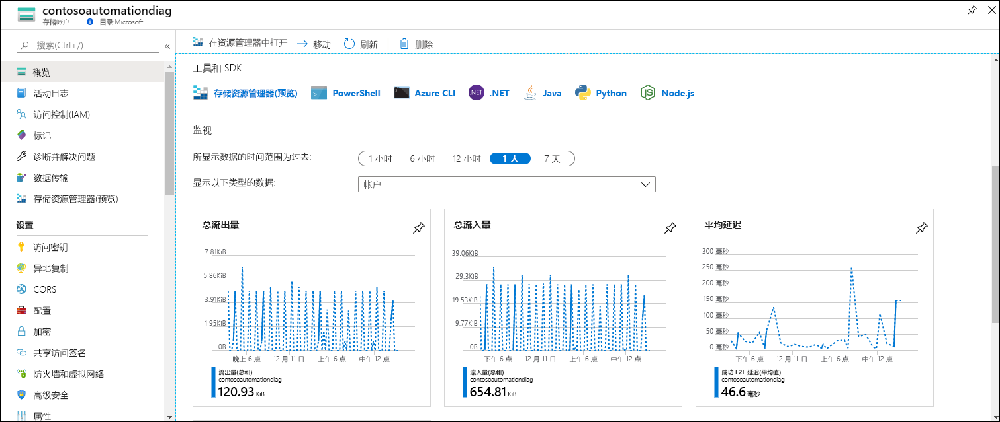
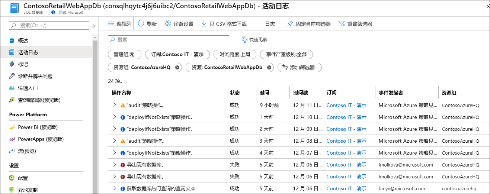
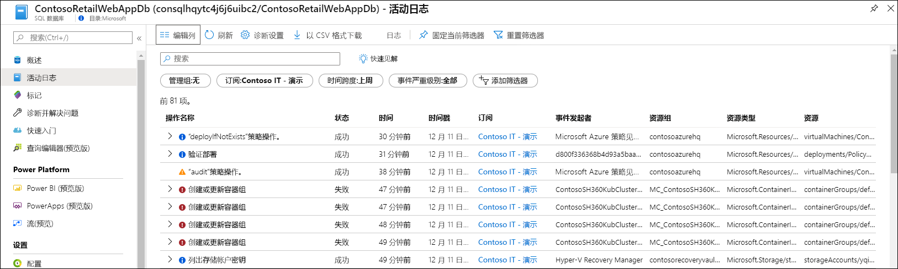
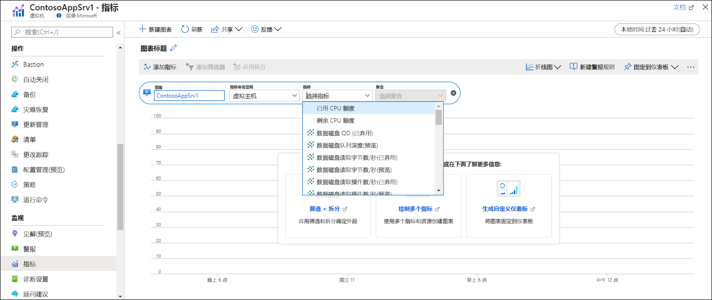
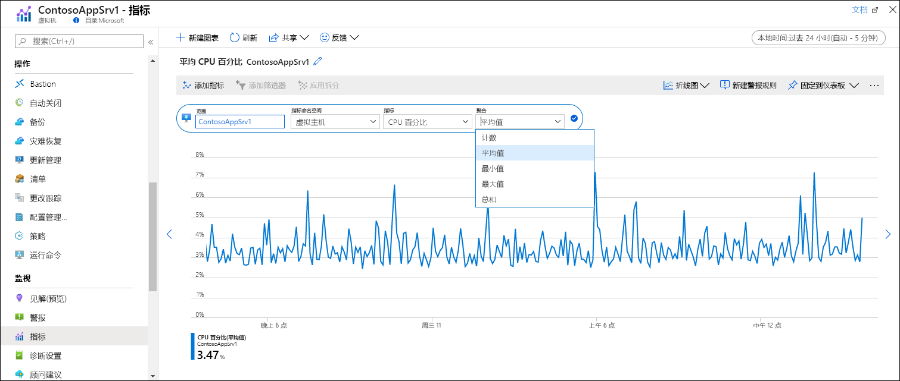
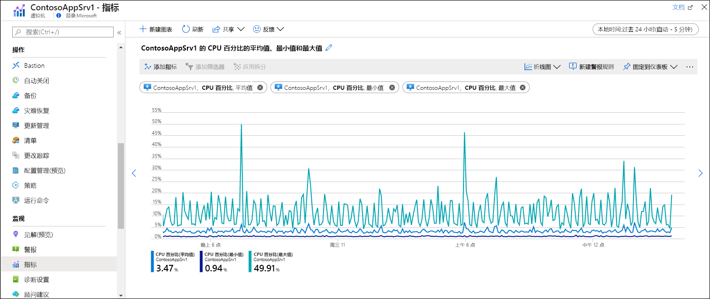

# 快速入门：使用 Azure Monitor 监视 Azure 资源
创建 Azure 资源后，[Azure Monitor](../overview.md) 即会开始从这些资源中收集数据。 本快速入门中简单演练了为资源自动收集的数据以及如何在 Azure 门户中查看特定资源的数据。 之后，你可以添加配置来收集其他数据，并可以转到 Azure Monitor 菜单中使用相同工具访问为订阅中所有资源收集的数据。

有关监视从 Azure 资源收集的数据的更详细说明，请参阅[使用 Azure Monitor 监视 Azure 资源](../insights/monitor-azure-resource.md)。

## 登录到 Azure 门户

在 [https://portal.azure.com](https://portal.azure.com) 中登录 Azure 门户。 

## 概述页
许多服务的“概述”页中会包含监视数据，以提供关于操作的快速概览  。 这通常会基于 Azure Monitor 指标中存储的平台指标子集。

1. 找到订阅中的 Azure 资源。
2. 转到“概述”页，查看其中是否显示性能数据  。 此数据将由 Azure Monitor 提供。 下方的示例是 Azure 存储帐户的“概述”页面，可以看到其中显示有多个指标  。

    

3. 单击任何图可在以下介绍的指标资源管理器中打开数据。

## 查看活动日志
活动日志提供订阅中针对各个 Azure 资源操作的见解。 其中包含的信息包括资源创建或修改的时间、作业开始的时间或者特定操作发生的时间。

1. 在资源菜单的顶部，选择“活动日志”  。
2. 当前筛选器设置为与资源相关的事件。 如果没有看见任何事件，尝试更改“时间跨度”来扩大时间范围  。

    

4. 如要查看订阅中其他资源的事件，请更改筛选器中的标准或删除筛选器属性。

    

## 查看指标
指标是描述资源某方面在特定时间的情况的数字值。 Azure Monitor 以一分钟为间隔自动从所有 Azure 资源收集平台指标。 可以使用指标资源管理器查看这些指标。

1. 在资源菜单的“监控”部分下，选择“指标”   。 这会打开指标资源管理器，其中范围集设置为你的资源。
2. 单击“添加指标”，向图表中添加指标  。
   
   
   
4. 从下拉列表中选择一个指标，然后选择“聚合”   。 这会定义各个时间间隔期间如何对收集的值进行采样。

    

5. 单击“添加指标”，向图表添加其他指标和聚合组合  。

    

## 后续步骤
在本快速入门中，你查看了活动日志以及由 Azure Monitor 自动收集的 Azure 资源的指标。 资源日志提供了针对资源的详细操作的见解，但必须经过配置后才会被收集。 继续学习教程，了解如何将资源日志收集到 Log Analytics 工作区（在其中可以通过日志查询进行分析）。

> [!div class="nextstepaction"]
> [使用 Azure Monitor 收集和分析资源日志](tutorial-resource-logs.md)
