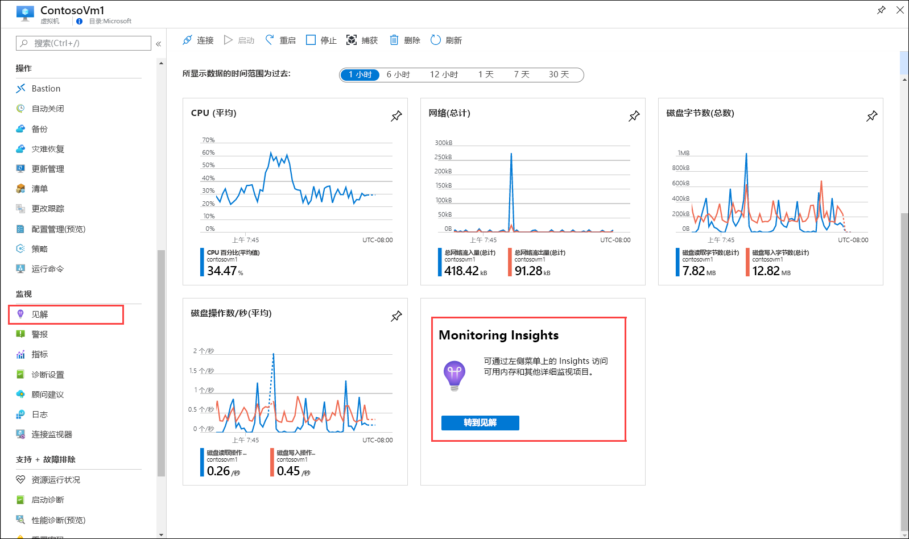
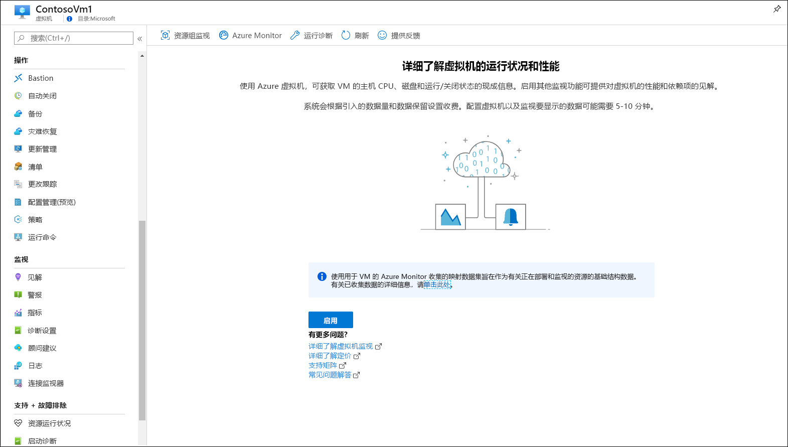
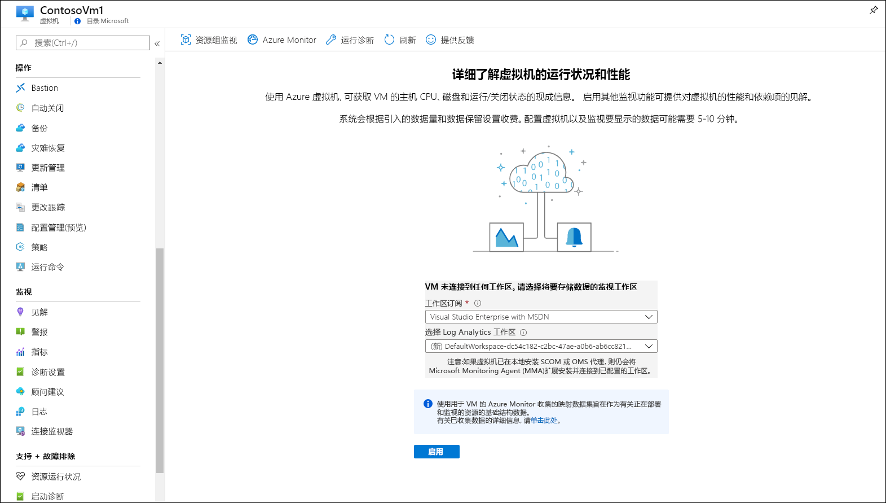
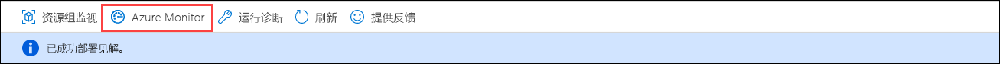
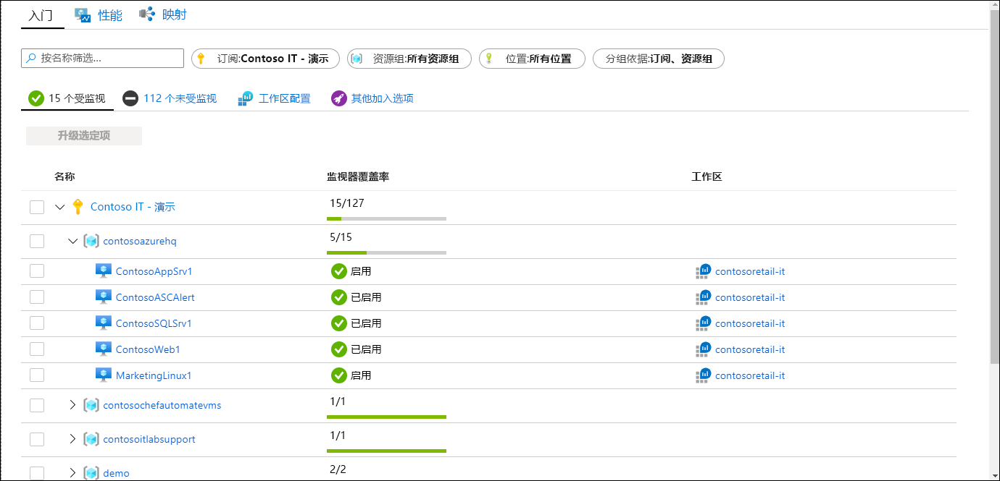
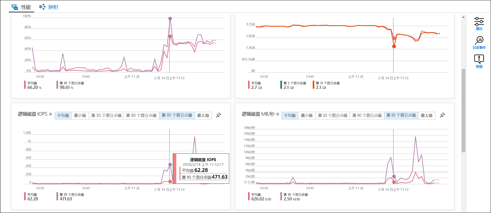
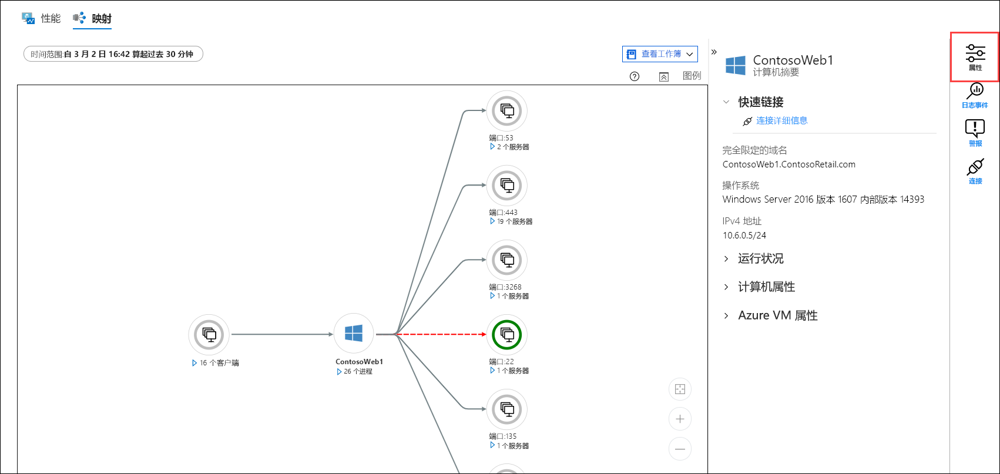
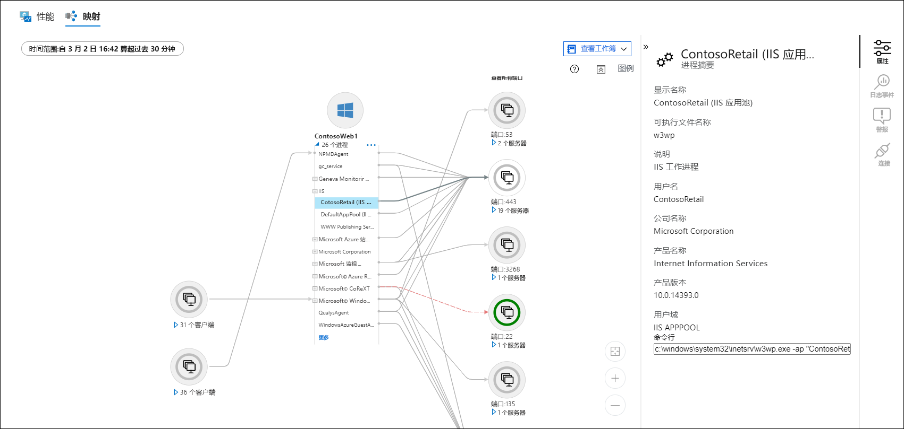
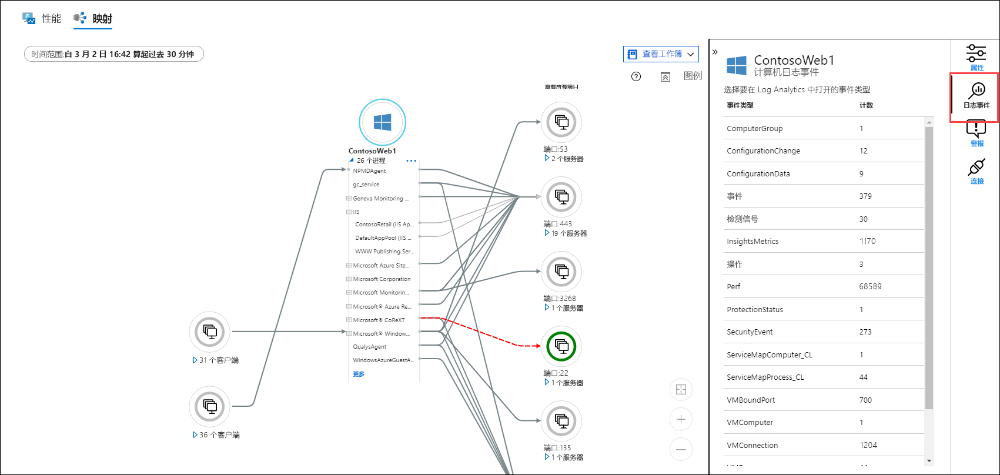
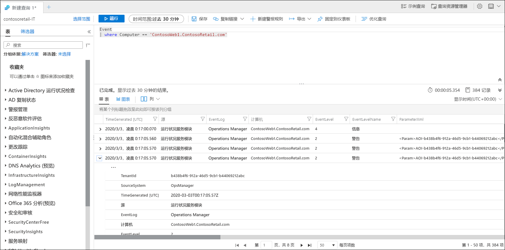

# 快速入门：使用 Azure Monitor 监视 Azure 虚拟机
创建 Azure 虚拟机后，[Azure Monitor](../overview.md) 会立即开始从这些虚拟机收集数据。 本快速入门简要说明自动收集的 Azure VM 数据，以及如何在 Azure 门户中查看这些数据。 然后，为 VM 启用[用于 VM 的 Azure Monitor](../insights/vminsights-overview.md)，使 VM 上的代理能够从来宾操作系统（包括进程及其依赖项）收集数据并对其进行分析。

本快速入门假定你拥有现有 Azure 虚拟机。 如果没有，可根据 VM 快速入门创建 [Windows VM](../../virtual-machines/windows/quick-create-portal.md) 或创建 [Linux VM](../../virtual-machines/linux/quick-create-cli.md)。

有关监视从 Azure 资源收集的数据的更详细说明，请参阅[使用 Azure Monitor 监视 Azure 虚拟机](../insights/monitor-vm-azure.md)。

## 完成“监视 Azure 资源”快速入门。
完成[使用 Azure Monitor 监视 Azure 资源](quick-monitor-azure-resource.md)，以查看订阅中 VM 的概述页、活动日志和指标。 Azure VM 收集的监视数据与任何其他 Azure 资源相同，但这一点仅适用于主机 VM。 本快速入门的余下内容将重点介绍如何监视来宾操作系统及其工作负荷。

## 启用用于 VM 的 Azure Monitor
尽管系统会收集主机 VM 的指标和活动日志，但你需要安装一个代理并完成一些配置，才能从来宾操作系统及其工作负荷收集监视数据并分析这些数据。 用于 VM 的 Azure Monitor 将安装这些代理，并提供用于监视虚拟机的其他强大功能。

1. 转到虚拟机的菜单。
2. 在“概述”页上的磁贴中单击“转到 Insights”，或者在“监视”菜单中单击“Insights”。    

    

3. 如果尚未为虚拟机启用用于 VM 的 Azure Monitor，请单击“启用”。  

    

4. 如果虚拟机尚未附加到 Log Analytics 工作区，系统会提示是要选择现有的工作区，还是创建新的工作区。 请选择默认值，即，虚拟机所在同一区域中具有唯一名称的工作区。

    

5. 加入过程将会花费几分钟时间，因为这需要启用扩展，并在虚拟机上安装代理。 完成此过程后，会出现一条消息，指出已成功部署 Insights。 单击“Azure Monitor”打开用于 VM 的 Azure Monitor。 

    

6. 此时会显示你的 VM，以及订阅中的已加入的任何其他 VM。 若要查看订阅中的未加入的虚拟机，请选择“未监视”选项卡。 

    

## 配置工作区
创建新的 Log Analytics 工作区时，需要将其配置为收集日志。 此配置仅需执行一次，因为配置将发送到与它连接的任何虚拟机。

1. 选择“工作区配置”，然后选择你的工作区。 

2. 选择“高级设置” 

    

### Windows VM 中的数据收集

2. 选择“数据”  ，然后选择“Windows 事件日志”  。

3. 键入日志名称来添加事件日志。  键入“System”，然后选择加号 ( **+** )。 

4. 在表中，选中严重性“错误”  和“警告”  。

5. 选择页面顶部的“保存”来保存配置。 

### Linux VM 中的数据收集

1. 选择“Syslog”  。  

2. 键入日志名称来添加事件日志。  键入“Syslog”，然后选择加号 ( **+** )。   

3. 在表中，取消选中严重性“信息”  、“通知”  和“调试”  。 

4. 选择页面顶部的“保存”来保存配置。 

## 查看收集的数据

7. 单击你的虚拟机，然后选择“性能”选项卡。  此时会显示从 VM 来宾操作系统收集的选定一组性能计数器。 向下滚动以查看更多计数器，然后将鼠标移到图形上，以查看不同时间的平均值和百分位数。

    

9. 选择“映射”打开映射功能，其中显示了虚拟机上运行的进程及其依赖项。  选择“属性”打开属性窗格（如果尚未打开）。 

    

11. 展开虚拟机的进程。 选择其中一个进程以查看其详细信息并突出显示其依赖项。

    

12. 再次选择你的虚拟机，然后选择“日志事件”。  

    

13. 将会看到虚拟机的 Log Analytics 工作区中存储的表列表。 此列表根据使用的是 Windows 还是 Linux 虚拟机而有所不同。 单击“事件”表。  此表包含来自 Windows 事件日志的所有事件。 Log Analytics 将会打开，其中包含一个用于检索事件日志条目的简单查询。

    

## 后续步骤
在本快速入门中，你为虚拟机启用了用于 VM 的 Azure Monitor，并配置了 Log Analytics 工作区以收集来宾操作系统的事件。 若要了解如何查看和分析数据，请继续本教程。

> [!div class="nextstepaction"]
> [在 Log Analytics 中查看或分析数据](../../azure-monitor/learn/tutorial-viewdata.md)
