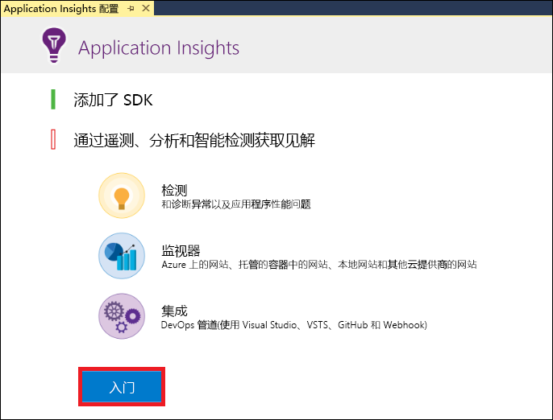
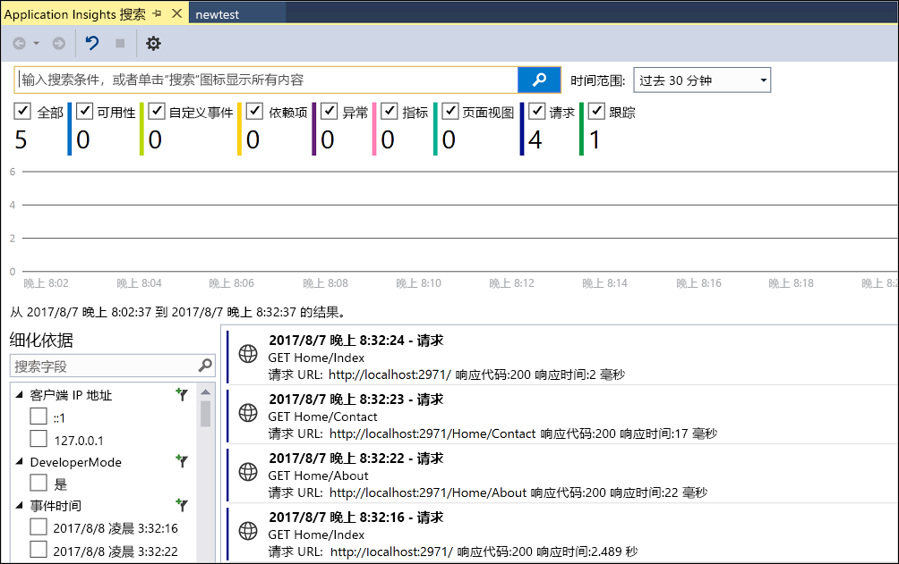
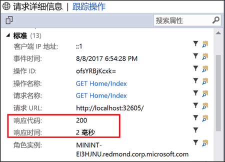
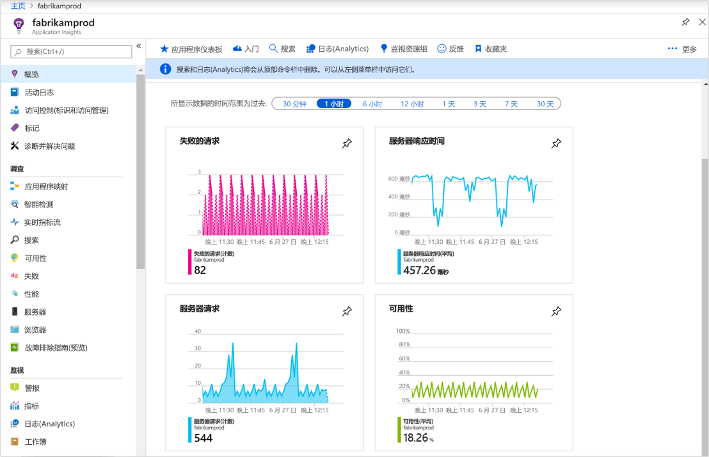
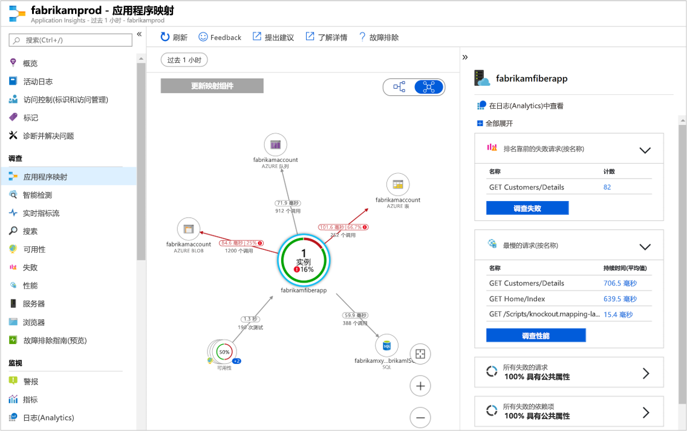
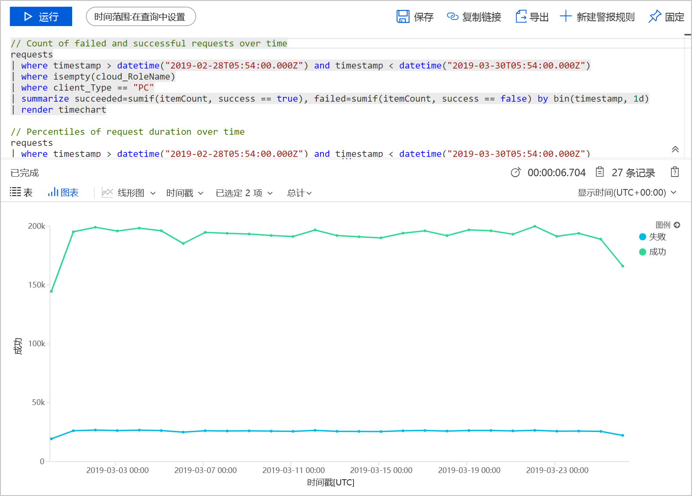
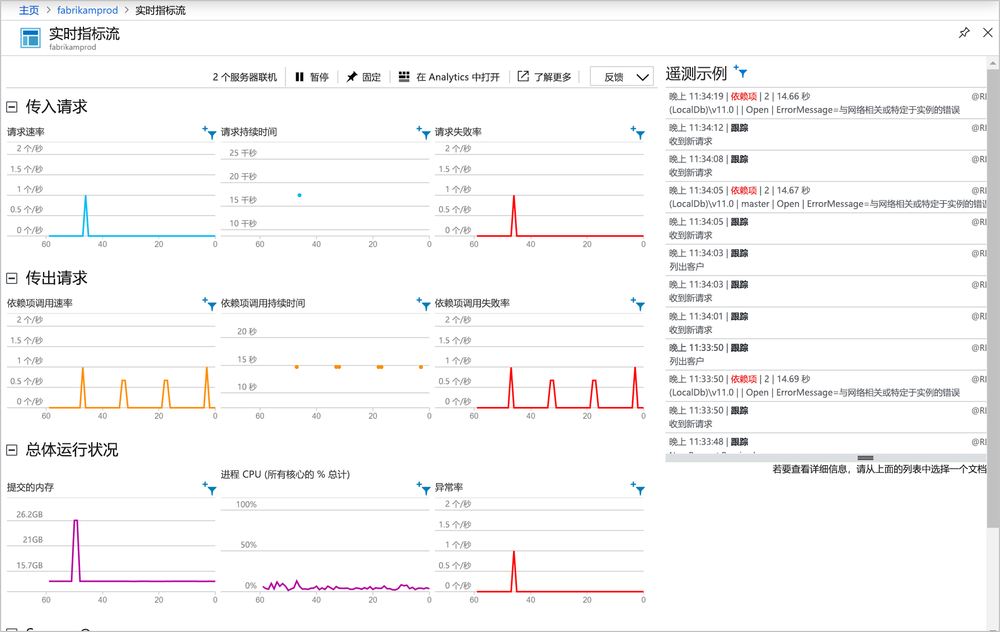

# <a name="start-monitoring-your-aspnet-web-application"></a>开始监视 ASP.NET Web 应用程序

使用 Azure Application Insights，可轻松监视 Web 应用程序的可用性、性能和使用情况。  还可以快速确定并诊断应用程序中的错误，而无需等待用户报告这些错误。  使用从 Application Insights 收集的有关应用的性能和效率的信息，可在维护和改进应用程序时做出明智的选择。

本快速入门演示如何将 Application Insights 添加到现有 ASP.NET Web 应用程序并开始分析实时统计信息，这只是可用来分析应用程序的各种方法之一。 如果没有 ASP.NET Web 应用程序，则可以按照[创建 ASP.NET Web 应用快速入门](../../app-service/app-service-web-get-started-dotnet-framework.md)创建一个。

## <a name="prerequisites"></a>必备条件
完成本快速入门教程需要：

- 使用以下工作负荷安装 [Visual Studio 2019](https://visualstudio.microsoft.com/downloads/?utm_medium=microsoft&utm_source=docs.microsoft.com&utm_campaign=inline+link&utm_content=download+vs2019)：
    - ASP.NET 和 Web 开发
    - Azure 开发


如果没有 Azure 订阅，请在开始之前创建一个[免费](https://azure.microsoft.com/free/)帐户。

## <a name="enable-application-insights"></a>启用 Application Insights

1. 在 Visual Studio 2019 中打开你的项目。
2. 从“项目”菜单中选择“配置 Application Insights”  。 Visual Studio 会将 Application Insights SDK 添加到应用程序。

    > [!IMPORTANT]
    > 添加 Application Insights 的过程因 ASP.NET 模板类型而异。 若要使用“空”或“Azure 移动应用”模板，   请选择“项目”   >   “添加 Application Insights 遥测”。 有关所有其他 ASP.NET 模板，请参阅上述步骤中的说明。 

3. 单击“开始使用”  （早期版本的 Visual Studio 会改为使用“免费开始”  按钮）。

    

4. 选择订阅并单击“注册”  。

5. 选择“项目” > “管理 NuGet 包” > “包源: nuget.org” > “更新”，将 Application Insights SDK 包更新到最新稳定版本。

6. 通过从“调试”菜单中选择“启动调试”或通过按 F5 键来运行应用程序。

## <a name="confirm-app-configuration"></a>确认应用配置

Application Insights 收集应用程序的遥测数据，而不考虑应用程序在何处运行。 按照以下步骤开始查看此数据。

1. 通过单击“查看”   -> “其他 Windows”   -> “Application Insights 搜索”  打开 Application Insights。  从当前会话查看遥测数据。<BR><br>

2. 单击列表中的第一个请求（在此示例中为“获取主页/索引”）查看请求详细信息。 请注意，包含状态代码和响应时间以及有关请求的其他重要信息。<br><br>

## <a name="start-monitoring-in-the-azure-portal"></a>开始在 Azure 门户中监视

现在可以在 Azure 门户中打开 Application Insights，查看有关正在运行的应用程序的各种详细信息。

1. 在解决方案资源管理器中展开“连接的服务”文件夹  （云和插头图标），然后右键单击 **Application Insights** 文件夹，单击“打开 Application Insights 门户”。   可以看到有关应用程序的一些信息和各种选项。

    

2. 单击“应用程序映射”  以获取应用程序组件之间依赖关系的可视布局。  每个组件均显示 KPI，如负载、性能、失败和警报。

    

3. 单击其中一个应用程序组件上的“应用分析”  图标 “在日志(分析)中查看”  。 这将打开“日志(分析)”  ，该软件提供丰富的查询语言，可用于分析 Application Insights 收集的所有数据。 在本示例中，将生成以图表形式呈现请求计数的查询。 可以编写自己的查询来分析其他数据。

    

4. 在“调查”下，单击左侧的“实时指标流”。  这将显示有关正在运行的应用程序的实时统计信息。 这包括传入请求数、这些请求的持续时间和发生的任何故障等信息。 还可以检查处理器和内存等关键性能指标。

    

    如果已准备好在 Azure 中托管应用程序，则可以立即发布它。 按照[创建 ASP.NET Web 应用快速入门](../../app-service/app-service-web-get-started-dotnet.md#update-the-app-and-redeploy)中所述的步骤进行操作。

5. 如果使用 Visual Studio 来添加 Application Insights 监视，则可自动添加客户端监视。 若要手动向应用程序添加客户端监视，请将以下 JavaScript 添加到应用程序中：

```html
<!-- 
To collect user behavior analytics about your application, 
insert the following script into each page you want to track.
Place this code immediately before the closing </head> tag,
and before any other scripts. Your first data will appear 
automatically in just a few seconds.
-->
<script type="text/javascript">
var appInsights=window.appInsights||function(a){
  function b(a){c[a]=function(){var b=arguments;c.queue.push(function(){c[a].apply(c,b)})}}var c={config:a},d=document,e=window;setTimeout(function(){var b=d.createElement("script");b.src=a.url||"https://az416426.vo.msecnd.net/scripts/a/ai.0.js",d.getElementsByTagName("script")[0].parentNode.appendChild(b)});try{c.cookie=d.cookie}catch(a){}c.queue=[];for(var f=["Event","Exception","Metric","PageView","Trace","Dependency"];f.length;)b("track"+f.pop());if(b("setAuthenticatedUserContext"),b("clearAuthenticatedUserContext"),b("startTrackEvent"),b("stopTrackEvent"),b("startTrackPage"),b("stopTrackPage"),b("flush"),!a.disableExceptionTracking){f="onerror",b("_"+f);var g=e[f];e[f]=function(a,b,d,e,h){var i=g&&g(a,b,d,e,h);return!0!==i&&c["_"+f](a,b,d,e,h),i}}return c
  }({
      instrumentationKey:"<your instrumentation key>"
  });

window.appInsights=appInsights,appInsights.queue&&0===appInsights.queue.length&&appInsights.trackPageView();
</script>
```

若要了解详细信息，请访问适用于[开源 JavaScript SDK](https://github.com/Microsoft/ApplicationInsights-JS) 的 GitHub 存储库。

## <a name="clean-up-resources"></a>清理资源
完成测试后，即可删除资源组和所有相关的资源。 为此，请执行以下步骤。
1. 在 Azure 门户的左侧菜单中，单击“资源组”  ，然后单击“myResourceGroup”  。
2. 在资源组页上单击“删除”  ，在文本框中键入 **myResourceGroup**，然后单击“删除”  。

## <a name="next-steps"></a>后续步骤
在本快速入门中，已通过 Azure Application Insights 为应用程序启用了监视。  继续学习教程，了解如何使用它来监视统计信息和检测应用程序中的问题。

> [!div class="nextstepaction"]
> [Azure Application Insights 教程](tutorial-runtime-exceptions.md)
