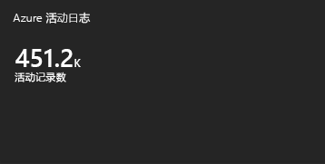
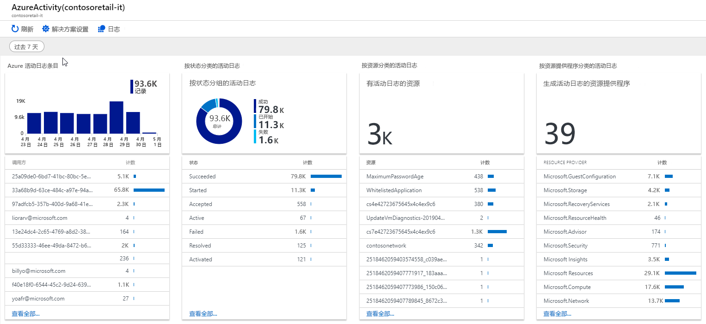

# 收集和分析 Azure Monitor 的 Log Analytics 工作区中的 Azure 活动日志

> [!NOTE]
> 你现在可以使用类似于收集资源日志的方式的诊断设置，将活动日志收集到 Log Analytics 工作区中。 请参阅[收集和分析 Azure Monitor 的 Log Analytics 工作区中的 Azure 活动日志](diagnostic-settings-subscription.md)。

[Azure 活动日志](activity-logs-overview.md)方便用户深入了解 Azure 订阅中发生的订阅级别事件。 本文介绍如何将活动日志收集到 Log Analytics 工作区，以及如何使用 Activity Log Analytics [监视解决方案](../insights/solutions.md)提供适用于分析此数据的日志查询和视图。 

将活动日志连接到 Log Analytics 工作区有以下好处：

- 将多个 Azure 订阅中的活动日志合并到一个位置进行分析。
- 将活动日志条目存储 90 天以上。
- 将活动日志数据与 Azure Monitor 收集的其他监视数据关联。
- 使用[日志查询](../log-query/log-query-overview.md)进行复杂的分析，深入了解活动日志条目的情况。

## 连接到 Log Analytics 工作区
单个工作区可以连接到同一 Azure 租户中多个订阅的活动日志。 若要跨多个租户进行收集，请参阅[将 Azure 活动日志收集到不同 Azure Active Directory 租户的订阅的 Log Analytics 工作区](activity-log-collect-tenants.md)。

> [!IMPORTANT]
> 如果没有为你的订阅注册 Microsoft.operationalinsights 和为 microsoft.operationsmanagement 资源提供程序，则可能会收到包含以下过程的错误。 若要注册这些提供程序，请参阅[Azure 资源提供程序和类型](../../azure-resource-manager/resource-manager-supported-services.md)。

通过以下过程将活动日志连接到 Log Analytics 工作区：

1. 在 Azure 门户的“Log Analytics 工作区”菜单中，选择要收集活动日志的工作区。
1. 在工作区的菜单的“工作区数据源”部分，选择“Azure 活动日志”。
1. 单击要连接的订阅。

    

1. 单击“连接”，将订阅中的活动日志连接到所选工作区。 如果订阅已连接到其他工作区，请先单击“断开连接”将其断开连接。

    

## 在 Log Analytics 工作区中进行分析
将活动日志连接到 Log Analytics 工作区时，条目会写入到工作区的名为 **AzureActivity** 的表中，该表可以使用[日志查询](../log-query/log-query-overview.md)进行检索。 该表的结构因[日志条目类别](activity-logs-overview.md#categories-in-the-activity-log)而异。 有关每个类别的说明，请参阅 [Azure 活动日志事件架构](activity-log-schema.md)。

## Activity Logs Analytics 监视解决方案
Azure Log Analytics 监视解决方案包含多个日志查询和视图，用于分析 Log Analytics 工作区中的活动日志记录。

### 安装解决方案
按照[监视解决方案](../insights/solutions.md#install-a-monitoring-solution)中的过程安装 **Activity Log Analytics** 解决方案。 无需其他配置。

### 使用解决方案
可以在 Azure 门户的“监视器”菜单中访问监视解决方案。 在“见解”部分选择“更多”，打开包含解决方案磁贴的“概览”页。 “Azure 活动日志”磁贴显示工作区中 **AzureActivity** 记录的计数。

单击“Azure 活动日志”磁贴，打开“Azure 活动日志”视图。 视图包含下表中的可视化部件。 每个部件按照指定时间范围列出了匹配该部件条件的最多 10 个项。 可通过单击部件底部的“查看全部”运行返回所有匹配记录的日志查询。

| 可视化部件 | 说明 |
| --- | --- |
| Azure 活动日志条目 | 显示所选日期范围内排名前列的 Azure 活动日志条目记录总数的条形图，并显示前 10 个活动调用方的列表。 单击该条形图可针对 `AzureActivity` 运行日志搜索。 单击某个调用方项，运行日志搜索，为该项返回所有活动日志条目。 |
| 按状态分类的活动日志 | 为所选日期范围内的 Azure 活动日志状态显示圆环图，并显示一个包含前十个状态记录的列表。 单击该图表可针对 `AzureActivity | summarize AggregatedValue = count() by ActivityStatus` 运行日志查询。 单击某个状态项，运行日志搜索，为该状态记录返回所有活动日志条目。 |
| 按资源分类的活动日志 | 显示包含活动日志的资源总数，并列出前十个为每个资源显示记录计数的资源。 单击全部区域可针对 `AzureActivity | summarize AggregatedValue = count() by Resource` 运行日志搜索，这会显示解决方案可以使用的所有 Azure 资源。 单击某个资源以运行日志查询，为该资源返回所有活动记录。 |
| 按资源提供程序分类的活动日志 | 显示生成活动日志的资源提供程序的总数，并列出前十个资源提供程序。 单击总区域可针对 `AzureActivity | summarize AggregatedValue = count() by ResourceProvider` 运行日志查询，这会显示所有 Azure 资源提供程序。 单击某个资源提供程序可以运行日志查询，为该提供程序返回所有活动记录。 |

## 后续步骤

- 详细了解[活动日志](activity-logs-overview.md)。
- 详细了解 [Azure Monitor 数据平台](data-platform.md)。
- 使用[日志查询](../log-query/log-query-overview.md)查看活动日志中的详细信息。
