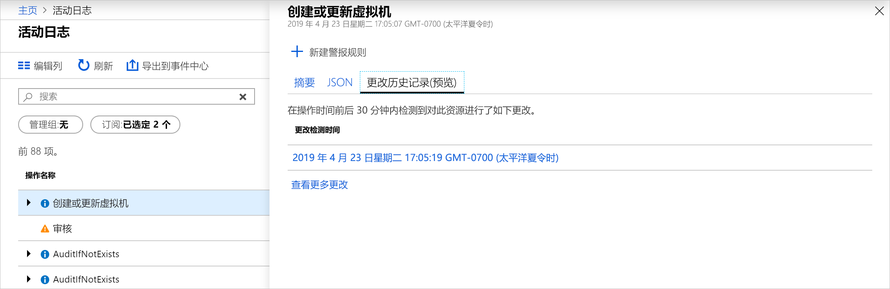
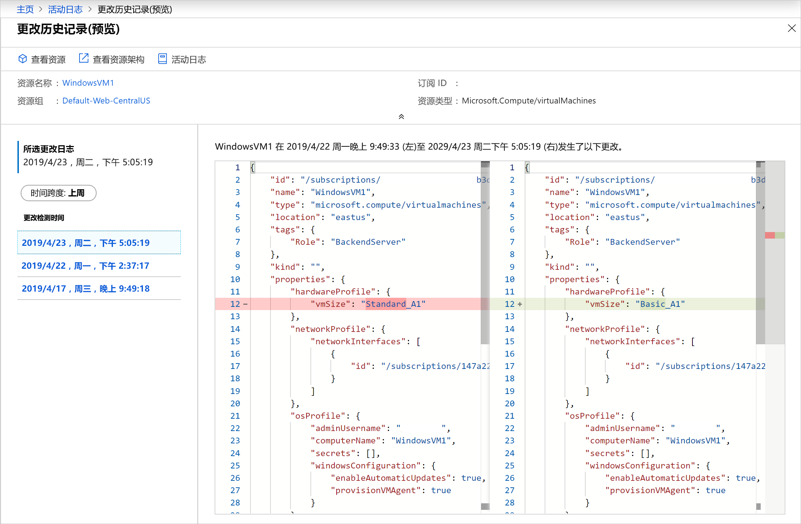

# <a name="view-and-retrieve-azure-activity-log-events"></a>查看和检索 Azure 活动日志事件

[Azure 活动日志](activity-logs-overview.md)可深入了解 Azure 中发生的订阅级别事件。 本文提供了有关查看和检索活动日志事件的不同方法的详细信息。

## <a name="azure-portal"></a>Azure 门户
在 Azure 门户的 "**监视**" 菜单中查看所有资源的活动日志。 在该资源的菜单中，从**活动日志**选项查看特定资源的活动日志。


您可以按以下字段筛选活动日志事件：

* **Timespan**：事件的开始时间和结束时间。
* **类别**：事件类别，如[活动日志](activity-log-view.md#categories-in-the-activity-log)中的类别所述。
* **订阅**：一个或多个 Azure 订阅名称。
* **资源组**：所选订阅中的一个或多个资源组。
* **资源（名称）** ：-特定资源的名称。
* **资源类型**：资源的类型，例如， _virtualmachines/_ 。
* **操作名称**-Azure 资源管理器操作的名称，例如， _SQL/servers/Write_。
* **严重性**：事件的严重级别。 可用值为 "_信息_"、"_警告_"、"_错误_" 和 "_严重_"。
* **事件发起者**：执行操作的用户。
* **打开搜索**：打开文本搜索框，可在所有事件的所有字段中搜索该字符串。

## <a name="categories-in-the-activity-log"></a>活动日志中的类别
活动日志中的每个事件都具有下表中描述的特定类别。 有关这些类别的架构的完整详细信息，请参阅 [Azure 活动日志事件架构](activity-log-schema.md)。 

| 类别 | Description |
|:---|:---|
| 管理 | 包含通过资源管理器执行的所有创建、更新、删除和操作操作的记录。 管理事件的示例包括 "_创建虚拟机_" 和 "_删除网络安全组_"。<br><br>使用资源管理器的用户或应用程序执行的每个操作都作为对特定资源类型的操作进行建模。 如果操作类型为 "_写入_"、"_删除_" 或 "_操作_"，则会在 "管理" 类别中记录该操作的开始、成功或失败记录。 管理事件还包括对订阅中基于角色的访问控制进行的任何更改。 |
| 服务运行状况 | 包含 Azure 中发生的任何服务运行状况事件的记录。 美国东部 SQL Azure 的服务运行状况事件的一个示例_是遇到停机_。 <br><br>服务运行状况事件分为六个种类：需要执行的_操作_、_辅助恢复_、_事件_、_维护_、_信息_或_安全性_。 仅当订阅中有某个资源受事件影响时，才会创建这些事件。
| 资源运行状况 | 包含已发生到 Azure 资源的任何资源运行状况事件的记录。 资源运行状况事件的一个示例是_虚拟机运行状况状态更改为 "不可用_"。<br><br>资源运行状况事件可以表示四种运行状况状态之一：_可用_、_不可用_、已_降级_和_未知_。 此外，资源运行状况事件可分类为 "_启动平台_" 或 "_用户已启动_"。 |
| 警报 | 包含 Azure 警报的激活记录。 警报事件的一个示例是_myVM 上的 CPU% 过去5分钟超过 80_。|
| 自动扩展 | 包含任何与自动缩放引擎操作相关的事件的记录，这些事件基于您在订阅中定义的任何自动缩放设置。 自动缩放事件的示例是_自动缩放扩展操作失败_。 |
| 建议 | 包含来自 Azure 顾问的建议事件。 |
| 安全性 | 包含 Azure 安全中心生成的任何警报的记录。 安全事件的一个示例是 "_可疑的双扩展文件已执行_"。 |
| 策略 | 包含 Azure 策略执行的所有效果操作操作的记录。 策略事件的示例包括 "_审核_" 和 "_拒绝_"。 Policy 执行的每个操作建模为对资源执行的操作。 |

## <a name="view-change-history"></a>查看更改历史记录

查看活动日志时，可以帮助查看在事件时间内发生了哪些更改。 可以查看**更改历史记录**中的此信息。 从活动日志中选择要深入了解的事件。 选择 "**更改历史记录（预览版）** " 选项卡，以查看与该事件相关的任何更改。



如果有与事件关联的任何更改，你将看到可选择的更改列表。 这将打开 "**更改历史记录（预览）** " 页。 在此页上，可以看到对资源所做的更改。 如以下示例中所示，我们不仅可以看到 VM 更改了大小，还可以查看在更改之前以前的 VM 大小以及更改的内容。



若要了解有关更改历史记录的详细信息，请参阅[获取资源更改](../../governance/resource-graph/how-to/get-resource-changes.md)。


## <a name="powershell"></a>PowerShell
使用[AzLog](https://docs.microsoft.com/powershell/module/az.monitor/get-azlog) Cmdlet 从 PowerShell 中检索活动日志。 下面是一些常见示例。

> [!NOTE]
> `Get-AzLog` 仅提供 15 天的历史记录。 使用 **-MaxEvents**参数可查询超过15天的最后 N 个事件。 若要访问超过15天的事件，请使用 REST API 或 SDK。 如果不包括 **StartTime**，则默认值为 **EndTime** 减去一小时。 如果不包括 **EndTime**，则默认值为当前时间。 所有时间均是 UTC 时间。


获取在特定日期时间之后创建的日志条目：

```powershell
Get-AzLog -StartTime 2016-03-01T10:30
```

获取日期时间范围内的日志条目：

```powershell
Get-AzLog -StartTime 2015-01-01T10:30 -EndTime 2015-01-01T11:30
```

从特定资源组中获取日志条目︰

```powershell
Get-AzLog -ResourceGroup 'myrg1'
```

从特定资源提供程序获取日期时间范围内的日志条目：

```powershell
Get-AzLog -ResourceProvider 'Microsoft.Web' -StartTime 2015-01-01T10:30 -EndTime 2015-01-01T11:30
```

获取特定调用方的日志条目：

```powershell
Get-AzLog -Caller 'myname@company.com'
```

获取最后的1000事件：

```powershell
Get-AzLog -MaxEvents 1000
```


## <a name="cli"></a>CLI
使用[az monitor activity-log](cli-samples.md#view-activity-log-for-a-subscription)从 CLI 中检索活动日志。 下面是一些常见示例。


查看所有可用选项。

```azurecli
az monitor activity-log list -h
```

从特定资源组中获取日志条目︰

```azurecli
az monitor activity-log list --resource-group <group name>
```

获取特定调用方的日志条目：

```azurecli
az monitor activity-log list --caller myname@company.com
```

在日期范围内，按调用方获取资源类型的日志：

```azurecli
az monitor activity-log list --resource-provider Microsoft.Web \
    --caller myname@company.com \
    --start-time 2016-03-08T00:00:00Z \
    --end-time 2016-03-16T00:00:00Z
```

## <a name="rest-api"></a>REST API
使用[Azure Monitor REST API](https://docs.microsoft.com/rest/api/monitor/)从 REST 客户端检索活动日志。 下面是一些常见示例。

获取带有筛选器的活动日志：

``` HTTP
GET https://management.azure.com/subscriptions/089bd33f-d4ec-47fe-8ba5-0753aa5c5b33/providers/microsoft.insights/eventtypes/management/values?api-version=2015-04-01&$filter=eventTimestamp ge '2018-01-21T20:00:00Z' and eventTimestamp le '2018-01-23T20:00:00Z' and resourceGroupName eq 'MSSupportGroup'
```

获取带有筛选器的活动日志，并选择：

```HTTP
GET https://management.azure.com/subscriptions/089bd33f-d4ec-47fe-8ba5-0753aa5c5b33/providers/microsoft.insights/eventtypes/management/values?api-version=2015-04-01&$filter=eventTimestamp ge '2015-01-21T20:00:00Z' and eventTimestamp le '2015-01-23T20:00:00Z' and resourceGroupName eq 'MSSupportGroup'&$select=eventName,id,resourceGroupName,resourceProviderName,operationName,status,eventTimestamp,correlationId,submissionTimestamp,level
```

获取包含 select 的活动日志：

```HTTP
GET https://management.azure.com/subscriptions/089bd33f-d4ec-47fe-8ba5-0753aa5c5b33/providers/microsoft.insights/eventtypes/management/values?api-version=2015-04-01&$select=eventName,id,resourceGroupName,resourceProviderName,operationName,status,eventTimestamp,correlationId,submissionTimestamp,level
```

获取不带筛选器的活动日志，或选择：

```HTTP
GET https://management.azure.com/subscriptions/089bd33f-d4ec-47fe-8ba5-0753aa5c5b33/providers/microsoft.insights/eventtypes/management/values?api-version=2015-04-01
```


## <a name="activity-logs-analytics-monitoring-solution"></a>活动日志分析监视解决方案
Azure Log Analytics 监视解决方案包含多个日志查询和视图，用于分析 Log Analytics 工作区中的活动日志记录。

### <a name="prerequisites"></a>必备组件
你必须创建一个诊断设置，以便将你的订阅的活动日志发送到 Log Analytics 工作区。 请参阅[在 Azure Monitor 中 Log Analytics 工作区收集 Azure 平台日志](resource-logs-collect-workspace.md)。

### <a name="install-the-solution"></a>安装解决方案
使用[安装监视解决方案](../insights/solutions.md#install-a-monitoring-solution)中的过程来安装**Activity Log Analytics**解决方案。 不需要其他配置。

### <a name="use-the-solution"></a>使用解决方案
单击**活动日志**页顶部的 "**日志**"，打开该订阅的[Activity Log Analytics 监视解决方案](activity-log-collect.md)。 或在 "订阅**监视器**" 菜单的 Azure 门户中访问所有监视解决方案。 在 "**见解**" 部分中选择 "**更多**"，打开包含 "解决方案" 磁贴的 "**概述**" 页。 " **Azure 活动日志**" 磁贴显示工作区中**AzureActivity**记录数的计数。


单击 " **Azure 活动日志**" 磁贴，打开 " **azure 活动日志**" 视图。 此视图包括下表中的可视化部件。 每个部分都列出了最多10个与该部件在指定时间范围内的条件匹配的项。 您可以通过单击部分底部的 "**查看全部**" 来运行返回所有匹配记录的日志查询。


| 可视化部件 | Description |
| --- | --- |
| Azure 活动日志条目 | 显示所选日期范围的排名靠前的 Azure 活动日志条目的条形图，并显示前10个活动调用方的列表。 单击该条形图可针对 `AzureActivity` 运行日志搜索。 单击 "调用方" 项可运行日志搜索，返回该项目的所有活动日志条目。 |
| 按状态分类的活动日志 | 显示所选日期范围的 Azure 活动日志状态的圆环图以及前十种状态记录的列表。 单击该图表以运行 `AzureActivity | summarize AggregatedValue = count() by ActivityStatus`的日志查询。 单击某一状态项可运行日志搜索，返回该状态记录的所有活动日志条目。 |
| 按资源分类的活动日志 | 显示具有活动日志的总资源数，并列出每个资源的记录计数前十个资源。 单击全部区域可针对 `AzureActivity | summarize AggregatedValue = count() by Resource` 运行日志搜索，这会显示解决方案可以使用的所有 Azure 资源。 单击资源可运行返回该资源所有活动记录的日志查询。 |
| 按资源提供程序分类的活动日志 | 显示生成活动日志的资源提供程序的总数，并列出前10个。 单击 "总计" 区域可运行 `AzureActivity | summarize AggregatedValue = count() by ResourceProvider`的日志查询，该查询将显示所有 Azure 资源提供程序。 单击资源提供程序以运行返回提供程序的所有活动记录的日志查询。 |


## <a name="next-steps"></a>后续步骤

* [阅读平台日志概述](platform-logs-overview.md)
* [创建诊断设置以将活动日志发送到其他目标](diagnostic-settings.md)
