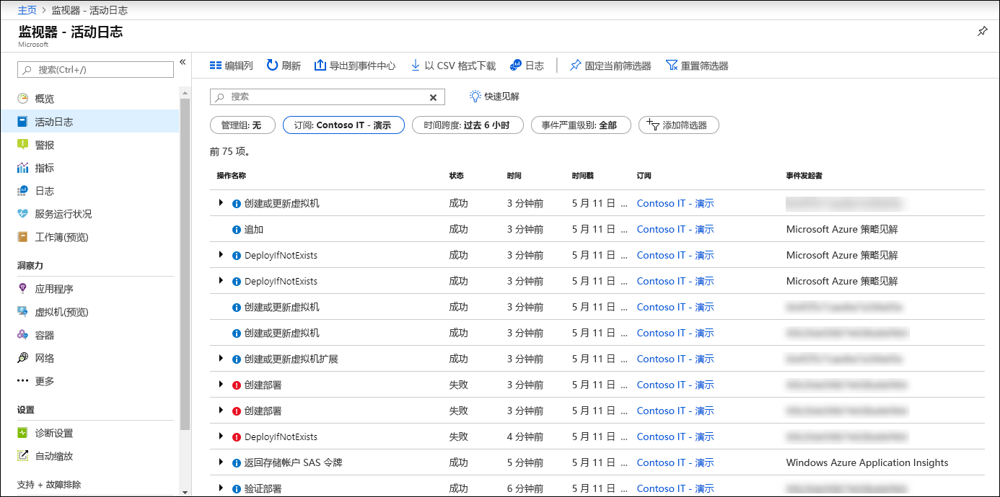

# Azure 活动日志概述

Azure 活动日志可以方便用户深入了解 Azure 中发生的订阅级别事件。 这包括从 Azure 资源管理器操作数据到服务运行状况事件更新的一系列数据。 活动日志之前称为“审核日志”或“操作日志”，因为“管理”类别报告订阅的控制平面事件。 

通过活动日志，可确定订阅中资源上进行的任何写入操作 (PUT, POST, DELETE) 的“什么操作、谁操作和操作时间”等信息。 还可以了解该操作和其他相关属性的状态。 

活动日志未包括读取 (GET) 操作或针对使用经典/RDFE 模型的资源的操作。

## 与资源日志比较
每个 Azure 订阅都有一个活动日志。 它提供从外部（“控制面”）对资源执行的操作的相关数据。 [资源日志](resource-logs-overview.md)由资源发出，并提供有关该资源（"数据平面"）的操作的信息。 必须为每个资源创建诊断设置以收集资源日志。

> [!NOTE]
> Azure 活动日志主要用于在 Azure 资源管理器中发生的活动。 它不跟踪使用经典/RDFE 模型的资源。 某些经典资源类型在 Azure 资源管理器中具有代理资源提供程序（例如 Microsoft.ClassicCompute）。 如果通过 Azure 资源管理器使用这些代理资源提供程序与经典资源类型进行交互，则操作会显示在活动日志中。 如果在 Azure 资源管理器代理外部与经典资源类型进行交互，则操作只会记录在操作日志中。 可以在门户的一个单独部分中浏览操作日志。

## 活动日志保留期
创建活动日志条目后，系统不会修改或删除它们。 另外，你也不能通过界面或编程方式更改它们。 活动日志事件会存储 90 天。 若要将此类数据存储更长的时间，请[在 Azure Monitor 中收集它](activity-log-collect.md)，或者[将它导出到存储或事件中心](activity-log-export.md)。

## 查看活动日志
在 Azure 门户的“监视器”菜单中查看所有资源的活动日志。 在该资源的菜单的“活动日志”选项中查看特定资源的活动日志。 也可通过 PowerShell、CLI 或 REST API 检索活动日志记录。  请参阅[查看和检索 Azure 活动日志事件](activity-log-view.md)。

## 收集 Azure Monitor 中的活动日志
将活动日志收集到 Azure Monitor 的 Log Analytics 工作区中，将它与其他监视数据一起分析，这样可以将数据保留 90 天以上。 请参阅[收集和分析 Azure Monitor 的 Log Analytics 工作区中的 Azure 活动日志](activity-log-collect.md)。

## 导出活动日志
将活动日志导出到 Azure 存储，以便将其存档或流式传输到事件中心，方便第三方服务或自定义分析解决方案引入。 请参阅[导出 Azure 活动日志](activity-log-export.md)。 你还可以使用[**Power BI 内容包**](https://powerbi.microsoft.com/documentation/powerbi-content-pack-azure-audit-logs/)在 Power BI 中分析活动日志事件。

## 活动日志警报
当系统在活动日志中创建特定事件时，你可以通过[活动日志警报](activity-log-alerts.md)创建警报。 也可在活动日志连接到 Log Analytics 工作区时使用[日志查询](alerts-log-query.md)创建警报，但日志查询警报有成本。 活动日志警报无成本。

## 活动日志中的类别
活动日志中的每个事件都有特定的类别，该类别在下表中进行了描述。 有关这些类别的架构的完整详细信息，请参阅 [Azure 活动日志事件架构](activity-log-schema.md)。 

| 类别 | 描述 |
|:---|:---|
| 管理 | 包含对通过资源管理器执行的所有创建、更新、删除和操作的记录。 管理事件的示例包括创建虚拟机和删除网络安全组。  用户或应用程序通过资源管理器所进行的每一个操作都会作为特定资源类型上的操作建模。 如果操作类型为“写入”、“删除”或“操作”，则该操作的开始、成功或失败记录都会记录在管理类别中。 管理事件还包括任何对订阅中基于角色的访问控制进行的更改。 |
| 服务运行状况 | 包含对任何发生在 Azure 中的服务运行状况事件的记录。 服务运行状况事件的一个示例是“美国东部的 SQL Azure 正处于故障时间”。   服务运行状况事件分为六种种类：需要操作、协助恢复、事件、维护、信息或安全性。 仅当订阅中存在会受事件影响的资源时，才会创建这些事件。
| 资源运行状况 | 包含 Azure 资源发生的任何资源运行状况事件的记录。 资源运行状况事件的示例是“虚拟机运行状况已更改为不可用”。  资源运行状况事件可以表示四种运行状况之一：可用、不可用、已降级、未知。 此外，资源运行状况事件可以归类为“平台启动”或“用户启动”。 |
| 警报 | 包含 Azure 警报的激活记录。 “过去 5 分钟内，myVM 上的 CPU 百分比已超过 80%”是警报事件的示例。|
| 自动缩放 | 包含基于在订阅中定义的任何自动缩放设置的自动缩放引擎操作相关的事件记录。 自动缩放事件的一个示例是“自动缩放纵向扩展操作失败”。 |
| 建议 | 包含 Azure 顾问提供的建议事件。 |
| 安全性 | 包含 Azure 安全中心生成的任何警报的记录。 安全事件的一个示例是“执行了可疑的双扩展名文件”。 |
| 策略 | 包含 Azure Policy 执行的所有效果操作的记录。 策略事件的示例包括审核和拒绝。 Policy 执行的每个操作建模为对资源执行的操作。 |

## 后续步骤

* [创建用于导出 Azure 活动日志的日志配置文件](activity-log-export.md)
* [将 Azure 活动日志流式传输到事件中心](activity-logs-stream-event-hubs.md)
* [将 Azure 活动日志存档到存储](archive-activity-log.md)

