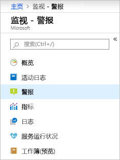
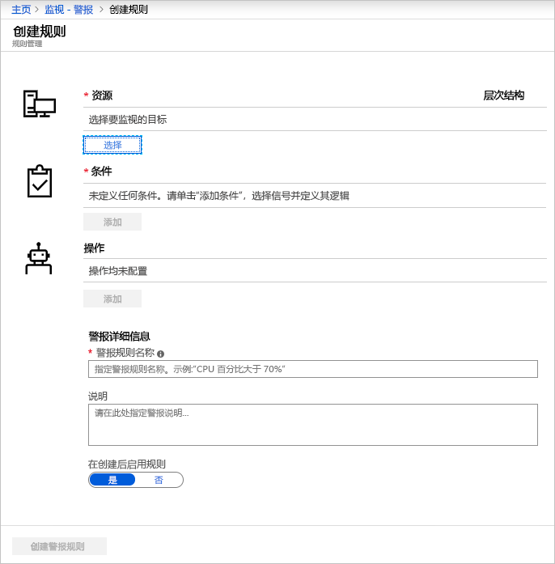
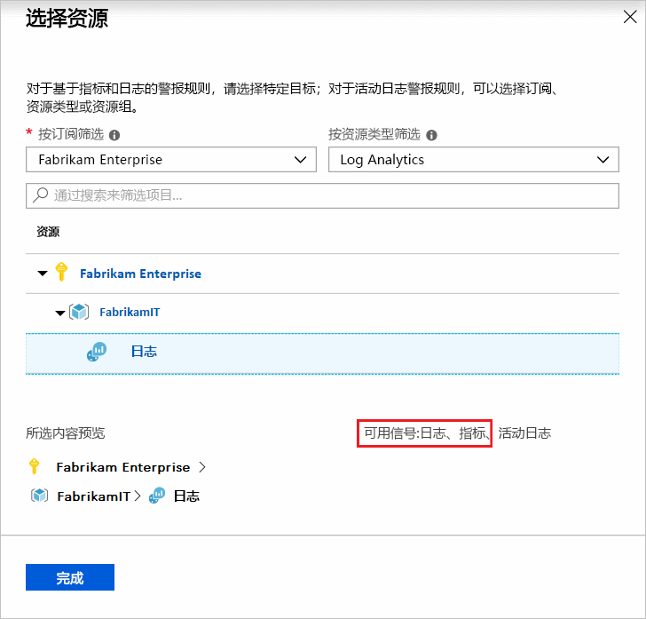
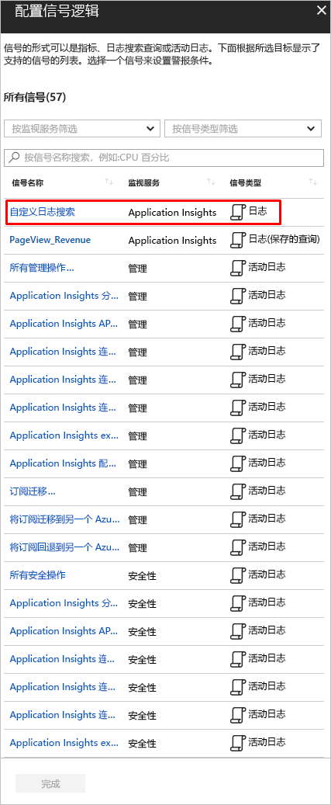
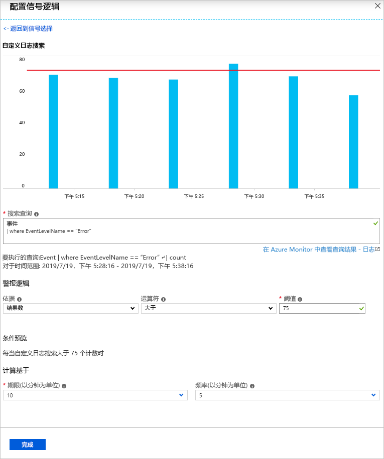
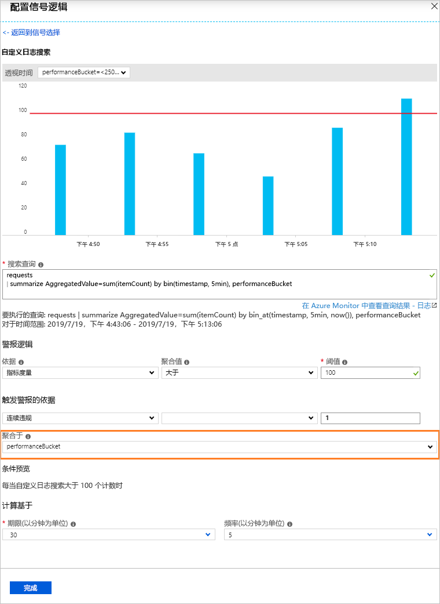
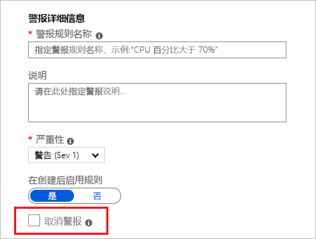
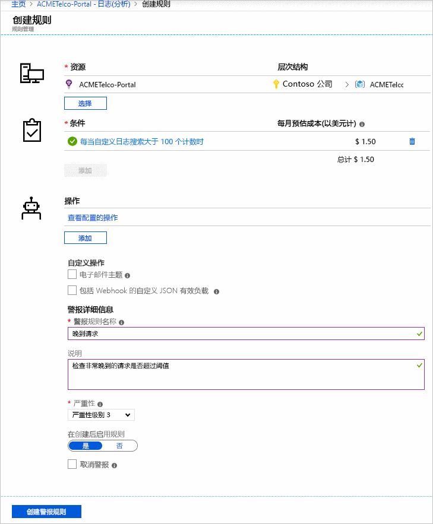
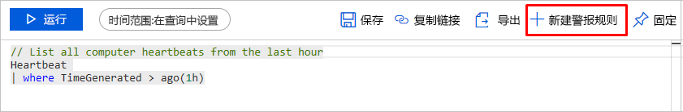

# <a name="create-view-and-manage-log-alerts-using-azure-monitor"></a>使用 Azure Monitor 创建、查看和管理日志警报  

## <a name="overview"></a>概述
本文展示了如何使用 Azure 门户中的警报界面设置日志警报。 警报规则的定义分为三个部分：
- 目标：要监视的特定 Azure 资源
- 条件：特定的条件或逻辑，出现在“信号”中时，应触发操作
- 操作：发送到通知接收方 - 电子邮件、短信、Webhook 等的特定调用。

术语**日志警报**用来描述警报，其中的信号是基于 [Log Analytics](../../azure-monitor/learn/tutorial-viewdata.md) 或 [Application Insights](../../azure-monitor/app/analytics.md) 的自定义查询。 从[日志警报 - 概述](../../azure-monitor/platform/alerts-unified-log.md)中详细了解功能、术语和类型。

> [!NOTE]
> [Azure Log Analytics](../../azure-monitor/learn/tutorial-viewdata.md) 中的常见日志数据现在也可以在 Azure Monitor 中的指标平台上查看。 有关详细信息，请查看[日志的指标警报](../../azure-monitor/platform/alerts-metric-logs.md)

## <a name="managing-log-alerts-from-the-azure-portal"></a>从 Azure 门户中管理日志警报

接下来的详细信息是通过 Azure 门户界面使用日志警报的分步指南。

### <a name="create-a-log-alert-rule-with-the-azure-portal"></a>使用 Azure 门户创建日志警报规则
1. 在[门户](https://portal.azure.com/)中选择“监视器”，然后在“监视器”部分下选择“警报”。  
    

1. 选择“新建警报规则”按钮，在 Azure 中创建新警报。
    

1. 将显示“创建警报”部分，其中包含以下三个部分：定义警报条件、定义警报详细信息和定义操作组。

    

1.  定义警报条件：使用“选择资源”链接，然后通过选择资源来指定目标。 进行筛选：选择“订阅”和“资源类型”，以及所需的资源。 

    >[!NOTE]

    > 创建日志警报 - 在继续操作之前，请验证**日志**信号是否可用于所选资源。
    

 
1. 日志警报：确保“资源类型”是分析源（例如 Log Analytics 或 Application Insights），且信号类型为“日志”，并选择相应的“资源”，然后单击“完成”。 接下来，使用“添加条件”按钮查看适用于该资源的信号选项列表，并针对所选日志监视服务（如 *Log Analytics* 或 *Application Insights*）从信号列表中选择“自定义日志搜索”选项。

   

   > [!NOTE]

   > 警报列表可以导入分析查询作为信号类型 - **日志（已保存查询）**，如上图所示。 这样用户便能够在 Analytics 中完善查询，然后保存这些查询供将来在警报中使用 - 有关使用保存的查询的详细信息，请参阅[在 Log Analytics 中使用日志搜索](../../azure-monitor/log-query/log-query-overview.md)或 [Application Insights Analytics 中的共享查询](../../azure-monitor/log-query/log-query-overview.md)。 

1.  日志警报：选择后，可以在“搜索查询”字段中指定警报查询；如果查询语法不正确，该字段将以红色显示错误。 如果查询语法正确 - 将以图表形式显示指定查询的历史数据供参考，同时显示用于调整时间范围（过去六个小时到过去一周）的选项。

 

 > [!NOTE]

    > 仅当查询结果包含时间详细信息时，才能显示历史数据可视化效果。 如果查询生成了汇总数据或特定列值 - 则以单一绘图的形式显示相同的数据。

    >  对于使用 Application insights 的指标度量类型的日志警报，可以使用“聚合基于”选项指定要使用哪个特定变量对数据进行分组，如下面所示：

    

1.  日志警报：打开可视化效果后，可以从显示的“条件”、“聚合”和“阈值”选项中选择“警报逻辑”。 最后，使用“时间段”选项在逻辑中指定评估指定条件的时间。 此外，通过选择“频率”来指定运行警报服务的频率。
**日志警报**可以基于：
   - 记录数目：如果查询返回的记录计数大于或小于提供的值，则创建警报。
   - 指标度量：如果结果中的每个聚合值超过提供的阈值并且是“分组依据”选定值，则创建警报。 警报违规数是在选定时间段内超过阈值的次数。 可以为结果集中的任何违规组合指定总违规数，或指定连续违规数以要求违规必须在连续采样时发生。 详细了解[日志警报及其类型](../../azure-monitor/platform/alerts-unified-log.md)。


1. 第二个步骤是在“警报规则名称”字段中定义警报的名称，提供**说明**用于详细描述该警报的具体信息，并从提供的选项中指定“严重性”值。 在 Azure Monitor 发送的所有警报电子邮件、通知或推送内容中，将重用这些详细信息。 此外，用户可以通过相应地切换“创建后启用规则”选项，选择在创建后立即激活该警报规则。

    在警报详细信息中可以使用一些附加的功能（仅适用于**日志警报**）：

    - **抑制警报**：如果打开警报规则的阻止功能，则新建警报之后会在定义的时间段内禁用该规则的操作。 此规则仍在运行中，并且会在满足条件的情况下创建警报记录。 这是为了让你有时间更正问题，而无需运行重复操作。

        

        > [!TIP]
        > 指定的禁止显示警报值应大于警报的频率，以确保在没有重叠的情况下停止通知

1. 第三个步骤（也是最后一个步骤）是指定在满足警报条件的情况下，是否需要对警报规则触发任何**操作组**。 可以选择包含警报的任何现有操作组，也可以创建新的操作组。 根据选定的操作组，触发警报时，Azure 将会：发送电子邮件、发送短信、调用 Webhook、使用 Azure Runbook 进行补救、推送到 ITSM 工具，等等。 详细了解[操作组](action-groups.md)。

    > [!NOTE]
    > 有关通过 Azure 操作组为日志警报触发的 Runbook 有效负载的限制，请参考 [Azure 订阅服务限制](../../azure-subscription-service-limits.md)

    对于**日志警报**，提供了一些附加功能用于替代默认操作：

    - **电子邮件通知**：如果所述操作组中存在一个或多个电子邮件操作，替代通过操作组发送的电子邮件中的电子邮件主题。 无法修改邮件正文，并且该字段不能用于电子邮件地址。
    - **包含自定义 JSON 有效负载**：如果所述操作组中存在一个或多个 Webhook 操作，请替代操作组所使用 Webhook JSON。 用户可以指定所有在关联的操作组中配置的 Webhook 所使用的 JSON 格式；有关 Webhook 格式的详细信息，请参阅[针对日志警报的 Webhook 操作](../../azure-monitor/platform/alerts-log-webhook.md)。 提供了“查看 Webhook”选项来使用示例 JSON 数据检查格式。

        


1. 如果所有字段有效并且附带绿色的勾选标记，则可以单击“创建警报规则”按钮，在“Azure Monitor - 警报”中创建警报。 可以从警报仪表板查看所有警报。

    

    几分钟后，警报将处于活动状态，并按前面所述进行触发。

用户还可以在 [Azure 门户中的 Logs Analytics 页面](../../azure-monitor/log-query/portals.md#log-analytics-page
)中完成其分析查询，然后通过“设置警报”按钮推送它来创建警报 - 然后遵循以上教程中从步骤 6 开始的说明。

 

### <a name="view--manage-log-alerts-in-azure-portal"></a>在 Azure 门户中查看和管理日志警报

1. 在[门户](https://portal.azure.com/)中选择“监视器”，然后在“监视器”部分下选择“警报”。  

1. 此时将显示**警报仪表板** - 其中，所有 Azure 警报（包括日志警报）都显示在单个面板中；包括你的日志警报规则触发时间的每个实例。 若要了解详细信息，请参阅[警报管理](https://aka.ms/managealertinstances)。
    > [!NOTE]
    > 日志警报规则包括由用户提供的基于自定义查询的逻辑，因此不存在已解决状态。 因此，每当满足日志警报规则中指定的条件时，它都会触发。 


1. 在顶部栏中选择“管理规则”按钮，导航到规则管理部分 - 其中列出了创建的所有警报规则，包括已禁用的警报。
    

## <a name="managing-log-alerts-using-azure-resource-template"></a>使用 Azure 资源模板管理日志警报
当前可根据警报所基于的分析平台（即 Log Analytics 或 Application Insights）使用两个不同的资源模板创建日志警报。

因此，以下部分提供了有关针对每个分析平台将资源模板用于日志警报的详细信息。

### <a name="azure-resource-template-for-log-analytics"></a>适用于 Log Analytics 的 Azure 资源模板
通过警报规则创建 Log Analytics 的日志警报，该规则按固定时间间隔运行保存的搜索。 如果查询结果与指定的条件相符，则会创建一个警报记录且会运行一个或多个操作。 

文档的 Log Analytics 部分提供了 Log Analytics 保存搜索和 Log Analytics 警报的资源模板。 若要了解详细信息，请参阅[添加 Log Analytics 保存搜索和警报](../../azure-monitor/insights/solutions-resources-searches-alerts.md)，其中包括说明性的示例和架构详细信息。

### <a name="azure-resource-template-for-application-insights"></a>适用于 Application Insights 的 Azure 资源模板
Application Insights 资源的日志警报的一种类型为 `Microsoft.Insights/scheduledQueryRules/`。 有关此资源类型的详细信息，请参阅 [Azure Monitor - 计划查询规则 API 参考](https://docs.microsoft.com/rest/api/monitor/scheduledqueryrules/)。

以下是基于资源模板的[计划查询规则创建](https://docs.microsoft.com/rest/api/monitor/scheduledqueryrules/createorupdate)结构，其中示例数据集作为变量。

```json
{
    "$schema": "https://schema.management.azure.com/schemas/2015-01-01/deploymentTemplate.json#",
    "contentVersion": "1.0.0.0", 
    "parameters": {      
    },   
    "variables": {
    "alertLocation": "southcentralus",
    "alertName": "samplelogalert",
    "alertTag": "hidden-link:/subscriptions/a123d7efg-123c-1234-5678-a12bc3defgh4/resourceGroups/myRG/providers/microsoft.insights/components/sampleAIapplication",
    "alertDesription": "Sample log search alert",
    "alertStatus": "true",
    "alertSource":{
        "Query":"requests",
        "SourceId": "/subscriptions/a123d7efg-123c-1234-5678-a12bc3defgh4/resourceGroups/myRG/providers/microsoft.insights/components/sampleAIapplication",
        "Type":"ResultCount"
         },
     "alertSchedule":{
         "Frequency": 15,
         "Time": 60
         },
     "alertActions":{
         "SeverityLevel": "4"
         },
      "alertTrigger":{
        "Operator":"GreaterThan",
        "Threshold":"1"
         },
       "actionGrp":{
        "ActionGroup": "/subscriptions/a123d7efg-123c-1234-5678-a12bc3defgh4/resourceGroups/myRG/providers/microsoft.insights/actiongroups/sampleAG",
        "Subject": "Customized Email Header",
        "Webhook": "{ \"alertname\":\"#alertrulename\", \"IncludeSearchResults\":true }"           
         }
  },
  "resources":[ {
    "name":"[variables('alertName')]",
    "type":"Microsoft.Insights/scheduledQueryRules",
    "apiVersion": "2018-04-16",
    "location": "[variables('alertLocation')]",
    "tags":{"[variables('alertTag')]": "Resource"},
    "properties":{
       "description": "[variables('alertDesription')]",
       "enabled": "[variables('alertStatus')]",
       "source": {
           "query": "[variables('alertSource').Query]",
           "dataSourceId": "[variables('alertSource').SourceId]",
           "queryType":"[variables('alertSource').Type]"
       },
      "schedule":{
           "frequencyInMinutes": "[variables('alertSchedule').Frequency]",
           "timeWindowInMinutes": "[variables('alertSchedule').Time]"    
       },
      "action":{
           "odata.type": "Microsoft.WindowsAzure.Management.Monitoring.Alerts.Models.Microsoft.AppInsights.Nexus.DataContracts.Resources.ScheduledQueryRules.AlertingAction",
           "severity":"[variables('alertActions').SeverityLevel]",
           "aznsAction":{
               "actionGroup":"[array(variables('actionGrp').ActionGroup)]",
               "emailSubject":"[variables('actionGrp').Subject]",
               "customWebhookPayload":"[variables('actionGrp').Webhook]"
           },
       "trigger":{
               "thresholdOperator":"[variables('alertTrigger').Operator]",
               "threshold":"[variables('alertTrigger').Threshold]"
           }
       }
     }
   }
 ]
}
```
> [!IMPORTANT]
> 使用 [Scheduled Query Rules ](https://docs.microsoft.com/rest/api/monitor/scheduledqueryrules/)（计划查询规则）API 调用或资源模板时，必须有包含目标资源隐藏链接的标记字段。 

针对此演练，上面的示例 json 可以保存为（例如）sampleScheduledQueryRule.json，并且可以使用 [Azure 门户中的 Azure 资源管理器](../../azure-resource-manager/resource-group-template-deploy-portal.md#deploy-resources-from-custom-template)进行部署。


## <a name="managing-log-alerts-using-powershell-cli-or-api"></a>使用 PowerShell、CLI 或 API 管理日志警报
当前可根据警报所基于的分析平台（即 Log Analytics 或 Application Insights）使用两个不同的符合资源管理器标准的 API 创建日志警报。

因此，以下部分提供了有关针对每个分析平台通过 Powershell 或 CLI 将 API 用于日志警报的详细信息。

### <a name="powershell-cli-or-api-for-log-analytics"></a>适用于 Log Analytics 的 PowerShell、CLI 或 API
Log Analytics 警报 REST API 为 RESTful，可通过 Azure 资源管理器 REST API 访问。 因此，API 可以从 PowerShell 命令行访问，并输出 JSON 格式的搜索结果，以便用户可通过编程方式采用多种不同的方法使用结果。

详细了解[在 Log Analytics 中通过 REST API 创建和管理警报规则](../../azure-monitor/platform/api-alerts.md)；包括从 Powershell 访问 API 的示例。

### <a name="powershell-cli-or-api-for-application-insights"></a>适用于 Application Insights 的 PowerShell、CLI 或 API
[Azure Monitor - 计划查询规则 API](https://docs.microsoft.com/rest/api/monitor/scheduledqueryrules/) 为 REST API 并与 Azure 资源管理器 REST API 完全兼容。 因此，可以使用资源管理器 cmdlet 和 Azure CLI 通过 Powershell 使用它。

下面展示了之前在[资源模板部分](#azure-resource-template-for-application-insights)中显示的示例资源模板 (sampleScheduledQueryRule.json) 通过 Azure 资源管理器 PowerShell cmdlet 进行使用的情况：
```powershell
New-AzureRmResourceGroupDeployment -ResourceGroupName "myRG" -TemplateFile "D:\Azure\Templates\sampleScheduledQueryRule.json"
```
下面展示了之前在[资源模板部分](#azure-resource-template-for-application-insights)中显示的示例资源模板 (sampleScheduledQueryRule.json) 通过 Azure CLI 中的 Azure 资源管理器命令进行使用的情况：

```azurecli
az group deployment create --resource-group myRG --template-file sampleScheduledQueryRule.json
```
成功执行操作后，将返回 201 声明新的警报规则创建，如果修改了现有警报规则，则返回 200。


  
## <a name="next-steps"></a>后续步骤

* 了解 [Azure 警报中的日志警报](../../azure-monitor/platform/alerts-unified-log.md)
* 了解[用于日志警报的 Webhook 操作](../../azure-monitor/platform/alerts-log-webhook.md)
* 详细了解 [Application Insights](../../azure-monitor/app/analytics.md)
* 详细了解 [Log Analytics](../../azure-monitor/log-query/log-query-overview.md)。 

