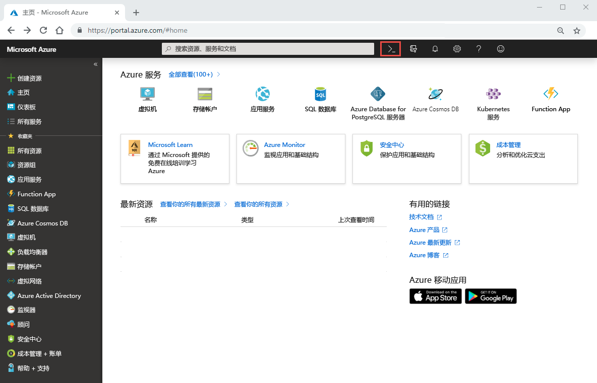

# 快速入门：设置 Azure NetApp 文件并创建 NFS 卷 

本文介绍如何快速设置 Azure NetApp 文件和创建卷。 

在本快速入门中，你将设置以下项：

- Azure NetApp 文件和 NetApp 资源提供程序注册
- 一个 NetApp 帐户
- 一个容量池
- 一个用于 Azure NetApp 文件的 NFS 卷

如果没有 Azure 订阅，请在开始之前创建一个[免费帐户](https://azure.microsoft.com/free/?WT.mc_id=A261C142F)。

## 开始之前 

> [!IMPORTANT] 
> 你需要被授予对 Azure NetApp 文件服务的访问权限。  若要请求对该服务的访问权限，请参阅 [Azure NetApp 文件候补名单提交页面](https://forms.office.com/Pages/ResponsePage.aspx?id=v4j5cvGGr0GRqy180BHbR8cq17Xv9yVBtRCSlcD_gdVUNUpUWEpLNERIM1NOVzA5MzczQ0dQR1ZTSS4u)。  你必须等待来自 Azure NetApp 文件团队的官方确认电子邮件，然后才能继续操作。 

## 注册 Azure NetApp 文件和 NetApp 资源提供程序

1. 在 Azure 门户中，单击右上角的“Azure Cloud Shell”图标。

    

2. 指定已列入 Azure NetApp 文件白名单的订阅：
    
        az account set --subscription <subscriptionId>

3. 注册 Azure 资源提供程序： 
    
        az provider register --namespace Microsoft.NetApp --wait  

    注册过程可能需要一些时间才能完成。

## 创建 NetApp 帐户

1. 在 Azure 门户的搜索框中输入“Azure NetApp 文件”，然后从显示的列表中选择“Azure NetApp 文件(预览版)”。  

      

2. 单击“+ 添加”  来创建新的 NetApp 帐户。

     

3. 在“新建 NetApp 帐户”窗口中提供以下信息： 
   1. 输入 **myaccount1** 作为帐户名称。 
   2. 选择订阅。
   3. 选择“新建”以创建新的资源组。  输入 **myRG1** 作为资源组名称。 单击“确定”。  
   4. 选择帐户位置。  

        

      

4. 单击“创建”以创建新的 NetApp 帐户。 

## 设置容量池

1. 在 Azure NetApp 文件管理边栏选项卡中，选择你的 NetApp 帐户 (**myaccount1**)。

      

2. 在 NetApp 帐户的 Azure NetApp 文件管理边栏选项卡中，单击“容量池”。 

      

3. 单击“+ 添加池”。  

      

4. 提供容量池的信息： 
    1. 输入 **mypool1** 作为池名称。
    2. 选择“高级”作为服务级别。  
    3. 指定“4 (TiB)”作为池大小。  

5. 单击“确定”。 

## 创建用于 Azure NetApp 文件的 NFS 卷

1. 在 NetApp 帐户的 Azure NetApp 文件管理边栏选项卡中，单击“卷”。 

      

2. 单击“+ 添加卷”。 

      

3. 在“创建卷”窗口中提供卷的信息： 
   1. 输入 **myvol1** 作为卷名称。 
   3. 选择容量池 (**mypool1**)。
   4. 对配额使用默认值。 
   5. 在“虚拟网络”下，单击“新建”以创建新的 Azure 虚拟网络 (VNet)。   然后填写以下信息：
       * 输入 **myvnet1** 作为 VNet 名称。
       * 指定设置的地址空间，例如 10.7.0.0/16
       * 输入 **myANFsubnet** 作为子网名称。
       * 指定子网地址范围，例如 10.7.0.0/24。 请注意，不能与其他资源共享专用子网。
       * 选择“Microsoft.NetApp/volumes”作为子网委托。 
       * 单击“确定”以创建 VNet。 
   6. 在子网中，选择新建的 VNet (**myvnet1**) 作为委托子网。

        

        

4. 单击“协议”  ，然后选择“NFS”  作为该卷的协议类型。   

    输入 **myfilepath1** 作为文件路径，该路径用于创建卷的导出路径。 

    

5. 单击“查看 + 创建”  。

      

5. 查看卷的信息，然后单击“创建”。   
    创建的卷将显示在“卷”边栏选项卡中。

      

## 清理资源

完成后，如果需要，你可以删除资源组。 删除资源组的操作不可逆。  

> [!IMPORTANT]
> 资源组中的所有资源将被永久删除，并且无法撤消。 

1. 在 Azure 门户的搜索框中输入“Azure NetApp 文件”，然后从显示的列表中选择“Azure NetApp 文件”。  

2. 在订阅列表中，单击你要删除的资源组 (myRG1)。 

    

3. 在资源组页面上，单击“删除资源组”。 

     

    此时会打开一个窗口，其中显示有关将要与资源组一起删除的资源的警告。

4. 输入资源组的名称 (myRG1) 以确认你要永久删除该资源组及其中的所有资源，然后单击“删除”  。

     

## 后续步骤  

> [!div class="nextstepaction"]
> [使用 Azure NetApp 文件管理卷](azure-netapp-files-manage-volumes.md)  
