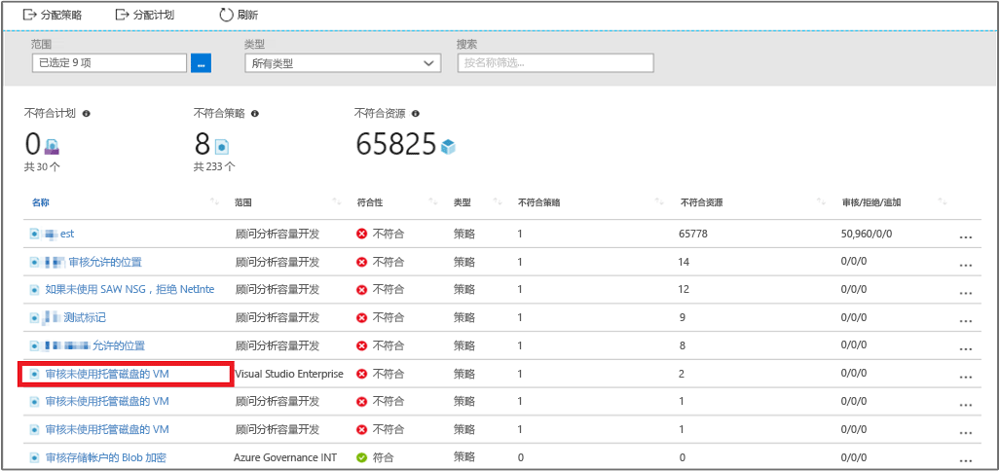

# <a name="create-a-policy-assignment-to-identify-non-compliant-resources-in-your-azure-environment-using-powershell"></a>使用 PowerShell 创建策略分配，识别 Azure 环境中的不合规资源

若要了解 Azure 中的符合性，第一步是确定资源的状态。 本快速入门教程指导你完成创建策略分配的过程，以识别未使用托管磁盘的虚拟机。

此过程结束时，就会成功识别哪些虚拟机未使用托管磁盘。 这些虚拟机*不符合*策略分配要求。

PowerShell 用于从命令行或脚本创建和管理 Azure 资源。 本指南详述如何使用 PowerShell 创建策略分配，识别 Azure 环境中的不合规资源。

本指南需要 Azure PowerShell 模块 4.0 或更高版本。 运行  `Get-Module -ListAvailable AzureRM`  即可查找版本。 如果需要进行安装或升级，请参阅[安装 Azure PowerShell 模块](/powershell/azure/install-azurerm-ps)。

在开始之前，请确保安装 PowerShell 的最新版本。 有关详细信息，请参阅[如何安装和配置 Azure PowerShell](/powershell/azureps-cmdlets-docs)。

如果你还没有 Azure 订阅，可以在开始前创建一个[免费](https://azure.microsoft.com/free/)帐户。


## <a name="create-a-policy-assignment"></a>创建策略分配

在此快速入门中，将创建一个策略分配，分配“审核不带托管磁盘的虚拟机”定义。 此策略定义可识别不符合策略定义中设置的条件的资源。

按照下列步骤操作以创建新的策略分配。

1. 若要确保订阅可使用资源提供程序，请注册策略见解资源提供程序。 若要注册资源提供程序，必须具有为资源提供程序执行注册操作的权限。 此操作包含在“参与者”和“所有者”角色中。

    运行以下命令，注册资源提供程序：

    ```
Register-AzureRmResourceProvider -ProviderNamespace Microsoft.PolicyInsights
```

    当订阅中有某个资源提供程序的资源类型时，不能注销该资源提供程序。

    有关注册和查看资源提供程序的详细信息，请参阅[资源提供程序和类型](../azure-resource-manager/resource-manager-supported-services.md)。

2. 注册资源提供程序后，运行以下命令查看所有策略定义并找到想要分配的定义：

    ```powershell
$definition = Get-AzureRmPolicyDefinition
```

    Azure 策略附带可供使用的内置策略定义。 内置策略定义示例如下：

    - 强制实施标记和值
    - 应用标记和值
    - 需要 SQL Server 版本 12.0

3. 接下来，使用 `New-AzureRmPolicyAssignment` cmdlet 将策略定义分配给所需范围。

对于本教程，对该命令使用以下信息：

- 策略分配的显示名称。 在此示例中，使用“审核不带托管磁盘的虚拟机”。
- **策略** - 策略定义，即为用于创建分配的依据。 在此示例中，即策略定义 - 审核缺少托管磁盘的虚拟机
- 范围 - 范围用于确定在其中实施策略分配的资源或资源组。 它可以从订阅延伸至资源组。 在此示例中，将向 FabrikamOMS 资源组分配该策略定义。
- $definition - 需要提供策略定义的资源 ID。在此示例中，将使用策略定义“审核不带托管磁盘的虚拟机”的 ID。

```powershell
$rg = Get-AzureRmResourceGroup -Name "FabrikamOMS"
$definition = Get-AzureRmPolicyDefinition -Id /providers/Microsoft.Authorization/policyDefinitions/e5662a6-4747-49cd-b67b-bf8b01975c4c
New-AzureRMPolicyAssignment -Name Audit Virtual Machines without Managed Disks Assignment -Scope $rg.ResourceId -PolicyDefinition $definition
```

你现已准备好识别不合规的资源，了解环境的符合性状态。

## <a name="identify-non-compliant-resources"></a>识别不合规的资源

1. 导航回 Azure 策略登录页。
2. 选择左侧窗格中的“符合性”，搜索创建的“策略分配”。

   

   如果存在与此新分配不相符的任何现有资源，这些资源会显示在“不符合的资源”选项卡下。

## <a name="clean-up-resources"></a>清理资源

本教程系列中的其他指南建立在本快速入门的基础之上。 如何打算继续浏览后续教程，请勿清除本快速入门中创建的资源。 如果不打算继续，则通过运行以下命令删除创建的分配：

```powershell
Remove-AzureRmPolicyAssignment -Name “Audit Virtual Machines without Managed Disks Assignment” -Scope /subscriptions/ bc75htn-a0fhsi-349b-56gh-4fghti-f84852/resourceGroups/FabrikamOMS
```

## <a name="next-steps"></a>后续步骤

本快速入门已分配一个策略定义用于识别 Azure 环境中的不合规资源。

若要详细了解分配策略以确保将来所创建资源的符合性，请继续以下教程：

> [!div class="nextstepaction"]
> [创建和管理策略](./create-manage-policy.md)
