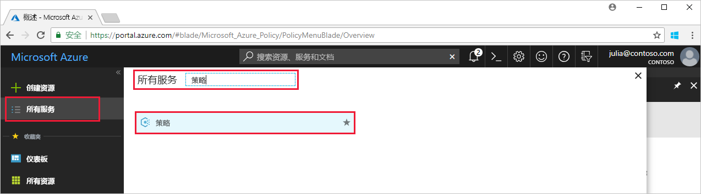
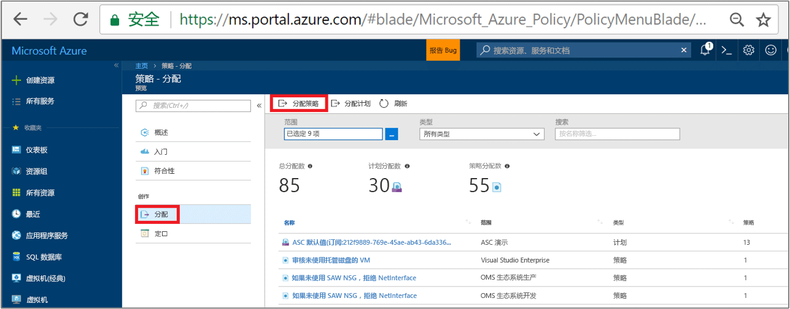
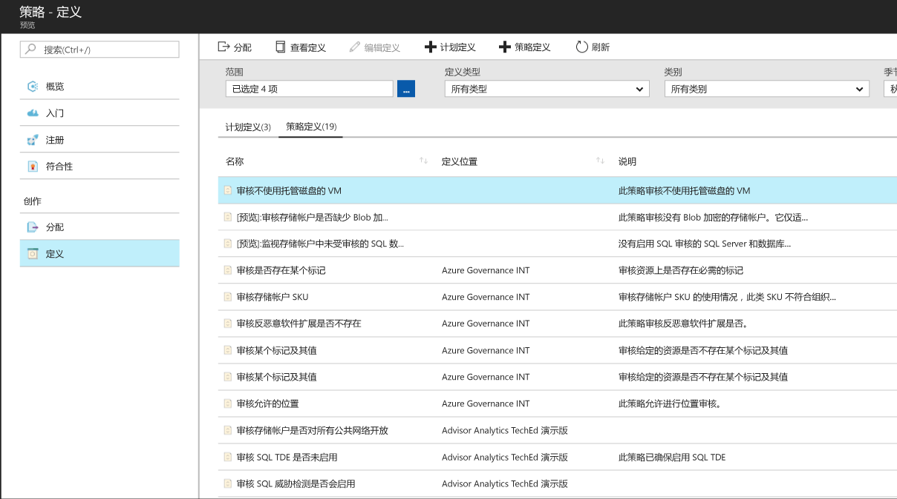
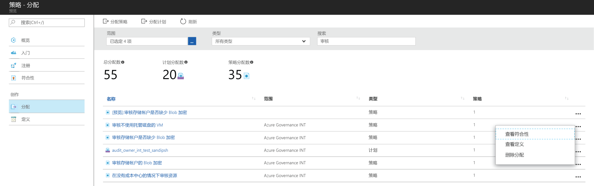

# 创建策略分配，识别 Azure 环境中的不合规资源

若要了解 Azure 中的符合性，第一步是确定资源的状态。 本快速入门教程指导你完成创建策略分配的过程，以识别未使用托管磁盘的虚拟机。

此过程结束时，就会成功识别哪些虚拟机未使用托管磁盘。 这些虚拟机*不符合*策略分配要求。

如果你还没有 Azure 订阅，可以在开始前创建一个[免费](https://azure.microsoft.com/free/)帐户。

## 创建策略分配

在本快速入门中，请创建一个策略分配，分配“审核缺少托管磁盘的虚拟机”策略定义。

1. 在 Azure 门户中单击“所有服务”，然后搜索并选择“策略”，启动 Azure 策略服务。

   

2. 选择“Azure 策略”页左侧的“分配”。 分配即为在特定范围内分配策略以供执行。
3. 在“策略 - 分配”页的顶部选择“分配策略”。

   

4. 在“分配策略”页上，单击省略号并选择订阅（必需）和资源组（可选），然后选择“范围”。 范围用于确定对其强制执行策略分配的资源或资源组。  然后在“范围”页的底部单击“选择”。

   此示例使用 **Contoso 订阅**。 你的订阅将有所不同。

5. 若要排除一个或多个资源组（如果只是以某个订阅作为范围）或者某个资源组中的特定资源（使用任一范围），可以配置策略分配中的“排除项”。 暂时将此字段留空。

6. 选择“策略定义”旁边的省略号打开可用定义的列表。 Azure 策略附带可供使用的内置策略定义。 提供了许多内置的策略定义，例如：

   - 强制实施标记和值
   - 应用标记和值
   - 需要 SQL Server 版本 12.0

    如需所有可用内置策略的完整列表，请参阅[策略示例](json-samples.md)。

7. 在策略定义列表中搜索，找到“审核未使用托管磁盘的 VM”定义。 单击该策略，再单击“选择”。

   

8. “分配名称”中自动填充了所选的策略名称，但可以更改它。 对于此示例，请保留“审核未使用托管磁盘的 VM”。 还可根据需要添加“说明”。 该说明提供有关此策略分配的详细信息。

9. 单击“分配”。

你现已准备好识别不合规的资源，了解环境的符合性状态。

## 识别不合规的资源

选择页面左侧中的“符合性”并找到你创建的“审核未使用托管磁盘的 VM”策略分配。

如果存在与此新分配不相符的任何现有资源，这些资源会在“不符合的资源”下显示。

针对现有资源评估某条件时，如果结果为 true，则会将这些资源标记为与策略不符。 下表显示了对于生成的符合性状态，不同的策略效果是如何与条件评估配合使用的。 虽然不显示 Azure 门户中的评估逻辑，但会显示符合性状态结果。 符合性状态结果为符合或不符合。

| **资源状态** | **效果** | **策略评估** | **符合性状态** |
| --- | --- | --- | --- |
| Exists | Deny、Audit、Append\*、DeployIfNotExist\*、AuditIfNotExist\* | True | 不合规 |
| Exists | Deny、Audit、Append\*、DeployIfNotExist\*、AuditIfNotExist\* | False | 符合 |
| 新建 | Audit、AuditIfNotExist\* | True | 不合规 |
| 新建 | Audit、AuditIfNotExist\* | False | 符合 |

\*Append、DeployIfNotExist 和 AuditIfNotExist 效果要求 IF 语句为 TRUE。 这些效果还要求存在条件为 FALSE 才能将资源判定为不合规。 如果为 TRUE，则 IF 条件会触发相关资源存在条件的计算。

## 清理资源

本教程系列中的其他指南建立在本快速入门的基础之上。 如何打算继续浏览后续教程，请勿清除本快速入门中创建的资源。 如果不打算继续，请在 Azure 门户中执行以下步骤来删除此快速入门创建的所有资源。

1. 选择“Azure 策略”页面左侧中的“符合性”（或“分配”）并找到你创建的“审核未使用托管磁盘的 VM”策略分配。

2. 右键单击“审核未使用托管磁盘的 VM”策略分配并选择“删除分配”。

   

## 后续步骤

在本快速入门中，你向某个范围分配了策略定义并评估了其符合性报告。 策略定义可确保范围内的所有资源都符合策略，并可标识不符合策略的资源。

若要详细了解分配策略以确保将来所创建资源的符合性，请继续以下教程：

> [!div class="nextstepaction"]
> [创建和管理策略](create-manage-policy.md)