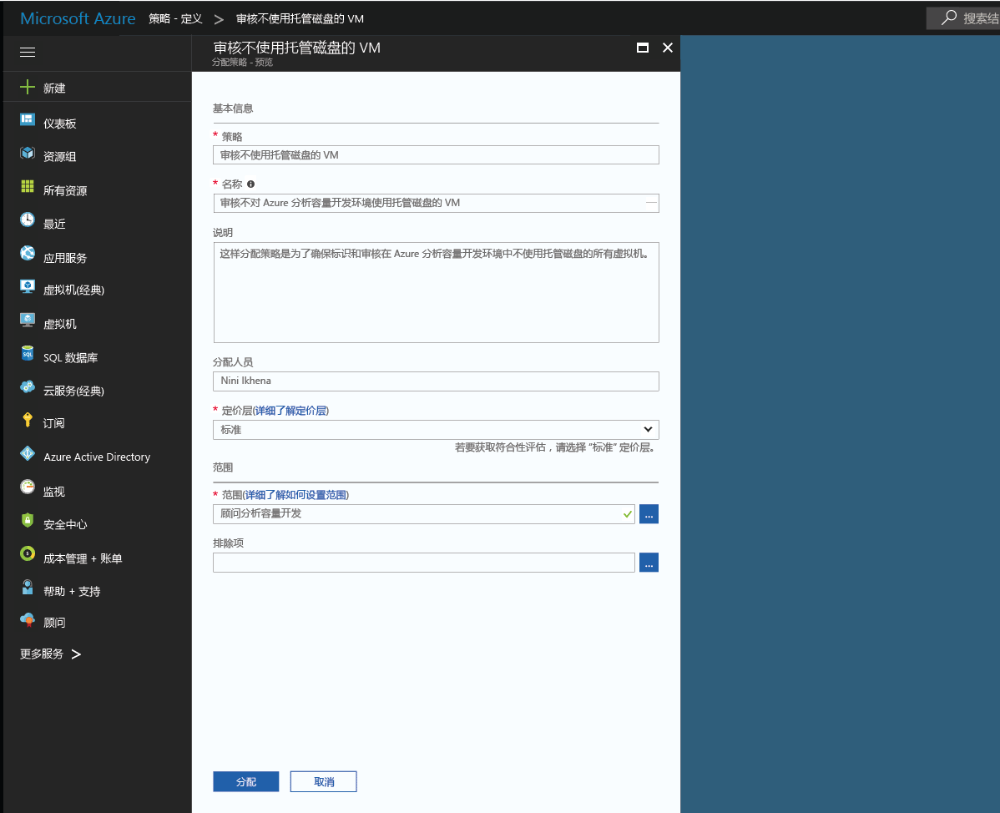

# 创建策略分配，识别 Azure 环境中的不合规资源
了解 Azure 中符合性的第一步需要了解自己当前资源的状况。 本快速入门教程指导你完成创建策略分配的过程，以识别未使用托管磁盘的虚拟机。

此过程结束时，应已成功识别哪些虚拟机未使用托管磁盘，也就是不符合要求。

如果还没有 Azure 订阅，可以在开始前创建一个 [免费帐户](https://azure.microsoft.com/free/?WT.mc_id=A261C142F)。

## 选择加入 Azure 策略

Azure 策略现已在公共预览版中提供，因此需要注册才能请求访问权限。

1. 在 https://aka.ms/getpolicy 转到 Azure 策略，然后选择左侧窗格中的“注册”。

   

2. 通过选择“订阅”列表中想要使用的订阅来选择加入 Azure 策略。 然后选择“注册”。

   

   在预览版中，将自动批准请求。 请预留 30 分钟，以便系统完成注册。

## 创建策略分配

在此快速入门中，我们将创建一个策略分配，分配“审核缺少托管磁盘的虚拟机”策略定义。

1. 选择 Azure 策略页左侧窗格中的“分配”。
2. 选择“分配”窗格顶部的“分配策略”。

   

3. 在“分配策略”页上，单击“策略”字段旁边的，打开可用定义的列表。

   

   Azure 策略附带可供使用的内置策略定义。 内置策略定义如下：

   - 强制实施标记和值
   - 应用标记和值
   - 需要 SQL Server 版本 12.0

4. 搜索策略定义，找到“审核不使用托管磁盘的 VM”定义。 单击该策略，再单击“分配”。

   

5. 提供策略分配的显示名称。 在此示例中，我们使用“审核缺少托管磁盘的 VM”。 还可根据需要添加“说明”。 该说明详细介绍了此策略分配如何标识所有在此环境中创建，而不使用托管磁盘的虚拟机。
6. 将定价层更改为“标准”，确保策略应用于现有资源。

   Azure 策略内有两个定价层 - 免费和标准。 使用免费层，只能对将来资源强制实施策略；使用标准层，还可对现有资源强制实施策略，更好地了解符合性状态。 由于我们处于受限预览版，尚未发布定价模型，因此你不会收到选择标准的帐单。 若要了解有关定价的详细信息，请参阅 [Azure 策略定价](https://acom-milestone-ignite.azurewebsites.net/pricing/details/azure-policy/)。

7. 选择要向其应用策略的范围。  范围用于确定对其强制执行策略分配的资源或资源组。 它可以从订阅延伸至资源组。
8. 选择之前在选择加入 Azure 策略时注册的订阅（或资源组）。 此示例使用此订阅 -“Azure 分析容量开发”，你的选项将有所不同。

   

9. 选择“分配”。

你现已准备好识别不合规的资源，了解环境的符合性状态。

## 识别不合规的资源

选择左侧窗格中的“符合性”，搜索创建的策略分配。

如果存在与此新分配不相符的任何现有资源，将在“不符合资源”选项卡下显示。

如果在现有资源中评估某条件，且部分结果为 true，这些资源将标记为与策略不相符。 下表介绍今天提供的各种操作如何对应条件评估结果和资源的符合性状态。

|资源  |如果策略中条件的评估结果为  |策略中的操作   |符合性状态  |
|-----------|---------|---------|---------|
|Exists     |True     |DENY     |不符合 |
|Exists     |False    |DENY     |符合     |
|Exists     |True     |附加   |不符合 |
|Exists     |False    |附加   |符合     |
|Exists     |True     |审核    |不符合 |
|Exists     |False    |审核    |不符合 |

## 清理资源

本教程系列中的其他指南建立在本快速入门的基础之上。 如何打算继续浏览后续教程，请勿清除本快速入门中创建的资源。 如果不打算继续，请在 Azure 门户中执行以下步骤来删除此快速入门创建的所有资源。
1. 选择左侧窗格中的“分配”。
2. 搜索刚刚创建的分配。

   

3.  选择“删除分配”。

## 后续步骤

本快速入门教程中，已完成向范围分配策略定义，确保该范围中所有资源都是合规的，并识别哪些资源不合规。

若要详细了解分配策略以确保将来所创建资源的符合性，请继续以下教程：

> [!div class="nextstepaction"]
> [创建和管理策略](./create-manage-policy.md)
