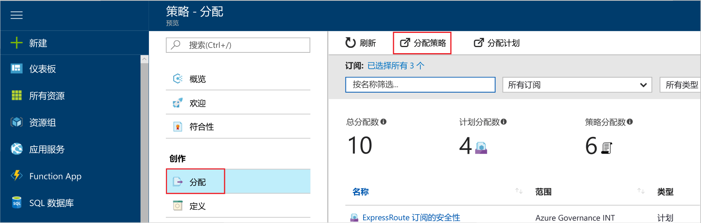
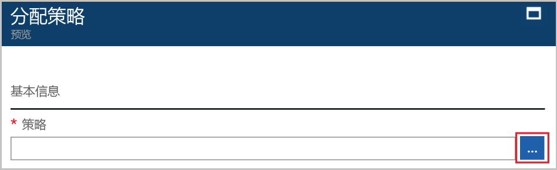

# <a name="create-and-manage-policies-to-enforce-compliance"></a>创建和管理策略以强制实施符合性

了解如何在 Azure 中创建和管理策略对于保持与公司标准和服务级别协议的符合性来说非常重要。 本教程介绍如何使用 Azure 策略来执行某些与在组织中创建、分配和管理策略相关的常见任务，例如：

> [!div class="checklist"]
> * 分配策略，对将来创建的资源强制执行条件
> * 创建并分配计划定义，跟踪多个资源的符合性
> * 解决不符合或遭拒绝的资源
> * 在组织中实施新策略

若要分配一个策略用于识别现有资源的当前符合性状态，请参阅快速入门文章。 如果你还没有 Azure 订阅，可以在开始前创建一个 [免费帐户](https://azure.microsoft.com/free/?WT.mc_id=A261C142F)。

## <a name="assign-a-policy"></a>分配策略

使用 Azure 策略强制实施符合性的第一步是分配策略定义。 策略定义用于定义实施策略的条件，以及要执行的操作。 在此示例中，我们将分配名为“需要 SQL Server 版本 12.0”的内置策略定义，强制执行“所有 SQL Server 数据库都必须是 v12.0 才视为符合”的条件。

1. 通过搜索并选择左侧窗格中的“策略”，启动 Azure 门户中的 Azure 策略服务。

   

2. 选择 Azure 策略页左侧窗格中的“分配”。 分配即为在特定范围内分配策略以供执行。
3. 选择“分配”窗格顶部的“分配策略”。

   

4. 在“分配策略”页上，单击“策略”字段旁边的，打开可用定义的列表。 可以使用“内置”来筛选策略定义的**类型**，以查看所有相关策略定义及其说明。

   

5. 选择“需要 SQL Server 版本 12.0”。 如果不能立即找到它，请在搜索框中键入“需要 SQL Server 版本 12.0”，然后按 ENTER。

   

6. 显示的**名称**是自动填充的，但可以更改它。 本示例使用了“需要 SQL Server 版本 12.0”。 还可根据需要添加“说明”。 该说明详细介绍了此策略分配如何确保此环境中创建的所有 SQL Server 版本均为 12.0。

7. 将定价层更改为“标准”，确保策略应用于现有资源。

   Azure 策略内有两个定价层 - 免费和标准。 使用免费层，只能对将来资源强制实施策略；使用标准层，还可对现有资源强制实施策略，更好地了解符合性状态。 由于 Azure 策略目前以预览版提供，尚未发布定价模型，因此选择“标准”不会产生费用。 若要了解有关定价的详细信息，请参阅 [Azure 策略定价](https://azure.microsoft.com/pricing/details/azure-policy)。

8. 选择“范围”- 之前注册的订阅（或资源组）。 范围用于确定对其强制执行策略分配的资源或资源组。 它可以从订阅延伸至资源组。

   本示例使用 **Azure 分析容量开发**订阅。 你的订阅将有所不同。

10. 选择“分配”。

## <a name="implement-a-new-custom-policy"></a>实施新的自定义策略

分配内置的策略定义后，可以使用 Azure 策略执行其他操作。 接下来创建一个新的自定义策略，确保在环境中创建的 VM 不能处于 G 系列，从而节省成本。 这样，当组织中的用户每次尝试创建 G 系列的 VM 时，请求将被拒绝。

1. 选择左侧窗格中“创作”下的“定义”。

   

2. 选择“+ 策略定义”。
3. 输入以下内容：

   - 策略定义的名称 - 需要 VM SKU 小于 G 系列
   - 想通过策略定义实现的操作的说明 - 此策略定义强制此范围中创建的所有 VM 具有的 SKU 都小于 G 系列，以减少成本。
   - 策略定义所在的订阅。 在本例中，策略定义位于“顾问分析容量开发”中。 你的订阅列表将有所不同。
   - 从现有的选项中选择，或者为此策略定义创建新的类别。
   - 复制以下 json 代码并根据需要进行更新：
      - 策略参数。
      - 策略规则/条件，此示例中为 - VM SKU 大小等于 G 系列
      - 策略效果，此示例中为“拒绝”。

    json 应如下所示。 将修改后的代码粘贴到 Azure 门户。

    ```json
{
    "policyRule": {
      "if": {
        "allOf": [
          {
            "field": "type",
            "equals": "Microsoft.Compute/virtualMachines"
          },
          {
            "field": "Microsoft.Compute/virtualMachines/sku.name",
            "like": "Standard_G*"
          }
        ]
      },
      "then": {
        "effect": "deny"
      }
    }
}
    ```

    策略规则中字段属性的值必须是下列其中一项：“名称”、“类型”、“位置”、“标记”或别名。 例如，`"Microsoft.Compute/VirtualMachines/Size"`。

    若要查看 json 代码的更多示例，请参阅 [Azure 策略的模板](json-samples.md)一文。

4. 选择“保存”。

## <a name="create-a-policy-definition-with-rest-api"></a>使用 REST API 创建策略定义

可以通过用于策略定义的 REST API 来创建策略。 借助 REST API，可创建和删除策略定义，以及获取现有定义的相关信息。
若要创建策略定义，请使用以下示例：

```
PUT https://management.azure.com/subscriptions/{subscription-id}/providers/Microsoft.authorization/policydefinitions/{policyDefinitionName}?api-version={api-version}

```
包括类似于下方示例的请求正文：

```
{
  "properties": {
    "parameters": {
      "allowedLocations": {
        "type": "array",
        "metadata": {
          "description": "The list of locations that can be specified when deploying resources",
          "strongType": "location",
          "displayName": "Allowed locations"
        }
      }
    },
    "displayName": "Allowed locations",
    "description": "This policy enables you to restrict the locations your organization can specify when deploying resources.",
    "policyRule": {
      "if": {
        "not": {
          "field": "location",
          "in": "[parameters('allowedLocations')]"
        }
      },
      "then": {
        "effect": "deny"
      }
    }
  }
}
```

## <a name="create-a-policy-definition-with-powershell"></a>使用 PowerShell 创建策略定义

在继续完成 PowerShell 示例之前，请确保已安装最新版本的 Azure PowerShell。 版本 3.6.0 中添加了策略参数。 如果使用较早版本，示例将返回一个错误，指示“找不到参数”。

可使用 `New-AzureRmPolicyDefinition` cmdlet 创建策略定义。

要在文件中创建策略定义，请将路径传递给该文件。 对于外部文件，请使用以下示例：

```
$definition = New-AzureRmPolicyDefinition `
    -Name denyCoolTiering `
    -DisplayName "Deny cool access tiering for storage" `
    -Policy 'https://raw.githubusercontent.com/Azure/azure-policy-samples/master/samples/Storage/storage-account-access-tier/azurepolicy.rules.json'
```

对于本地文件，请使用以下示例：

```
$definition = New-AzureRmPolicyDefinition `
    -Name denyCoolTiering `
    -Description "Deny cool access tiering for storage" `
    -Policy "c:\policies\coolAccessTier.json"
```

要使用内联规则创建策略定义，请使用以下示例：

```
$definition = New-AzureRmPolicyDefinition -Name denyCoolTiering -Description "Deny cool access tiering for storage" -Policy '{
  "if": {
    "allOf": [
      {
        "field": "type",
        "equals": "Microsoft.Storage/storageAccounts"
      },
      {
        "field": "kind",
        "equals": "BlobStorage"
      },
      {
        "not": {
          "field": "Microsoft.Storage/storageAccounts/accessTier",
          "equals": "cool"
        }
      }
    ]
  },
  "then": {
    "effect": "deny"
  }
}'
```

输出存储在 `$definition` 对象中，这会在策略分配过程中使用。
以下示例创建包含参数的策略定义：

```
$policy = '{
    "if": {
        "allOf": [
            {
                "field": "type",
                "equals": "Microsoft.Storage/storageAccounts"
            },
            {
                "not": {
                    "field": "location",
                    "in": "[parameters(''allowedLocations'')]"
                }
            }
        ]
    },
    "then": {
        "effect": "Deny"
    }
}'

$parameters = '{
    "allowedLocations": {
        "type": "array",
        "metadata": {
          "description": "The list of locations that can be specified when deploying storage accounts.",
          "strongType": "location",
          "displayName": "Allowed locations"
        }
    }
}'

$definition = New-AzureRmPolicyDefinition -Name storageLocations -Description "Policy to specify locations for storage accounts." -Policy $policy -Parameter $parameters
```

## <a name="view-policy-definitions"></a>查看策略定义

若要查看订阅中的所有策略定义，请运行以下命令：

```
Get-AzureRmPolicyDefinition
```

此命令可返回所有可用的策略定义，包括内置策略。 返回的每个策略的格式如下：

```
Name               : e56962a6-4747-49cd-b67b-bf8b01975c4c
ResourceId         : /providers/Microsoft.Authorization/policyDefinitions/e56962a6-4747-49cd-b67b-bf8b01975c4c
ResourceName       : e56962a6-4747-49cd-b67b-bf8b01975c4c
ResourceType       : Microsoft.Authorization/policyDefinitions
Properties         : @{displayName=Allowed locations; policyType=BuiltIn; description=This policy enables you to
                     restrict the locations your organization can specify when deploying resources. Use to enforce
                     your geo-compliance requirements.; parameters=; policyRule=}
PolicyDefinitionId : /providers/Microsoft.Authorization/policyDefinitions/e56962a6-4747-49cd-b67b-bf8b01975c4c
```

## <a name="create-a-policy-definition-with-azure-cli"></a>使用 Azure CLI 创建策略定义

可以将 Azure CLI 与策略定义命令结合使用来创建策略定义。
要使用内联规则创建策略定义，请使用以下示例：

```
az policy definition create --name denyCoolTiering --description "Deny cool access tiering for storage" --rules '{
  "if": {
    "allOf": [
      {
        "field": "type",
        "equals": "Microsoft.Storage/storageAccounts"
      },
      {
        "field": "kind",
        "equals": "BlobStorage"
      },
      {
        "not": {
          "field": "Microsoft.Storage/storageAccounts/accessTier",
          "equals": "cool"
        }
      }
    ]
  },
  "then": {
    "effect": "deny"
  }
}'
```

## <a name="view-policy-definitions"></a>查看策略定义

若要查看订阅中的所有策略定义，请运行以下命令：

```
az policy definition list
```

此命令可返回所有可用的策略定义，包括内置策略。 返回的每个策略的格式如下：

```
{                                                            
  "description": "This policy enables you to restrict the locations your organization can specify when deploying resources. Use to enforce your geo-compliance requirements.",                      
  "displayName": "Allowed locations",
  "id": "/providers/Microsoft.Authorization/policyDefinitions/e56962a6-4747-49cd-b67b-bf8b01975c4c",
  "name": "e56962a6-4747-49cd-b67b-bf8b01975c4c",
  "policyRule": {
    "if": {
      "not": {
        "field": "location",
        "in": "[parameters('listOfAllowedLocations')]"
      }
    },
    "then": {
      "effect": "Deny"
    }
  },
  "policyType": "BuiltIn"
}
```

## <a name="create-and-assign-an-initiative-definition"></a>创建并分配计划定义

通过计划定义，可以组合某些策略定义以实现首要目标。 创建计划定义，确保定义范围内的资源符合构成计划定义的策略定义。  有关计划定义的详细信息，请参阅 [Azure 策略概述](./azure-policy-introduction.md)。

### <a name="create-an-initiative-definition"></a>创建计划定义

1. 选择左侧窗格中“创作”下的“定义”。

   

2. 选择页面顶部的“计划定义”，然后将显示“计划定义”窗体。
3. 输入计划的名称和说明。

   在此示例中，请确保资源符合有关保证安全的策略定义。 因此，计划的名称为“保证安全”，说明为：“创建此计划的目的是处理所有与保护资源相关的策略定义”。

   

4. 浏览“可用定义”列表，然后选择要添加到该计划的策略定义。 对于“保证安全”计划，请**添加**以下内置策略定义：
   - 需要 SQL Server 版本 12.0
   - 在安全中心监视不受保护的 Web 应用程序。
   - 监视安全中心内的许可网络。
   - 监视安全中心内列为允许列表的可能的应用。
   - 监视安全中心内未加密的 VM 磁盘。

   

   从列表中选择策略定义后，该策略定义将显示在“策略和参数”下，如上图所示。

5. 使用“定义位置”选择用于存储定义的订阅。 选择“保存”。

### <a name="assign-an-initiative-definition"></a>分配计划定义

1. 转到“创作”下的“定义”选项卡。
2. 搜索所创建的“保证安全”计划定义。
3. 选择此计划定义，然后选择“分配”。

   

4. 输入以下示例信息以填写“分配”表单。 可以使用自己的信息。
   - 名称：保证安全分配
   - 说明：此计划分配旨在在 **Azure 顾问容量开发**订阅中强制执行这组策略定义。
   - 定价层：标准
   - 此分配的应用范围：**Azure 顾问容量开发** 可以选择自己的订阅和资源组。

5. 选择“分配”。

## <a name="exempt-a-non-compliant-or-denied-resource-using-exclusion"></a>使用“排除”豁免不符合或遭拒绝的资源

继续以上示例，在分配策略定义、要求使用 SQL server 版本 12.0 以后，通过其他版本创建的 SQL Server 将被拒绝。 本部分介绍如何通过请求排除解决拒绝尝试创建不同版本的 SQL Server 的问题。 排除实质上是阻止策略实施。 排除可以应用到资源组，或者你可以将排除范围缩小到单个资源。

1. 选择左侧窗格中的“分配”。
2. 浏览所有策略分配并打开“需要 SQL Server 版本 12.0”分配。
3. 在尝试创建 SQL Server 的资源组中**选择**排除资源。 此示例将排除 Microsoft.Sql/servers/databases：*azuremetrictest/testdb* 和 *azuremetrictest/testdb2*。

   

   可解决遭拒绝资源的其他方法包括：如果具有需要创建 SQL Server 的强有力理由，请联系与策略相关的联系人；如果具有策略的访问权限，请直接编辑策略。

4. 单击“分配”。

本部分中，通过请求对资源进行排除解决了尝试创建版本为 12.0 的 SQL Server 遭拒绝的问题。

## <a name="clean-up-resources"></a>清理资源

如果计划继续浏览后续教程，请勿清除在本指南中创建的资源。 如果不打算继续学习，请通过以下步骤删除上面创建的所有分配或定义：

1. 选择左侧窗格中的“定义”（如果尝试删除分配，则选择“分配”）。
2. 搜索刚创建的新计划或策略定义（或分配）。
3. 选择定义或分配末端的省略号，并选择“删除定义”（或“删除分配”）。

## <a name="next-steps"></a>后续步骤

在本教程中，你已成功完成以下操作：

> [!div class="checklist"]
> * 分配策略，对将来创建的资源强制执行条件
> * 创建并分配计划定义，跟踪多个资源的符合性
> * 解决不符合或遭拒绝的资源
> * 在组织中实施新策略

若要了解有关策略定义结构的详细信息，请查看以下文章：

> [!div class="nextstepaction"]
> [Azure 策略定义结构](policy-definition.md)
