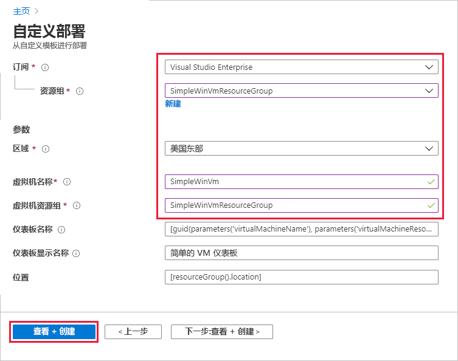
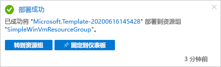
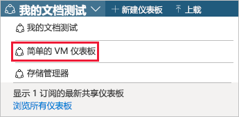
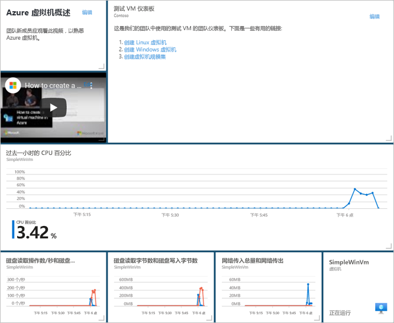

# <a name="quickstart-create-a-dashboard-in-the-azure-portal-by-using-an-arm-template"></a>快速入门：使用 ARM 模板在 Azure 门户中创建仪表板

Azure 门户中的仪表板可以集中且有组织地呈现你的云资源。 本快速入门将重点介绍部署 Azure 资源管理器模板（ARM 模板）以创建仪表板的过程。 仪表板会显示虚拟机 (VM) 的性能以及一些静态信息和链接。

[!INCLUDE [About Azure Resource Manager](../../includes/resource-manager-quickstart-introduction.md)]

如果你的环境满足先决条件，并且你熟悉如何使用 ARM 模板，请选择“部署到 Azure”按钮。 Azure 门户中会打开模板。

[](https://portal.azure.com/#create/Microsoft.Template/uri/https%3A%2F%2Fraw.githubusercontent.com%2FAzure%2Fazure-quickstart-templates%2Fmaster%2F101-azure-portal-dashboard%2Fazuredeploy.json)

## <a name="prerequisites"></a>先决条件

- 如果没有 Azure 订阅，请在开始之前创建一个[免费帐户](https://azure.microsoft.com/free/?WT.mc_id=A261C142F)。
- 现有 VM。

## <a name="create-a-virtual-machine"></a>创建虚拟机

在本快速入门的下一部分中创建的仪表板需要一台现有 VM。 按照以下步骤创建 VM。

1. 在 Azure 门户中，选择“Cloud Shell”。

    

1. 复制以下命令，然后在命令提示符中输入该命令以创建资源组。

    ```powershell
    New-AzResourceGroup -Name SimpleWinVmResourceGroup -Location EastUS
    ```

    

1. 复制以下命令，然后在命令提示符中输入该命令以在资源组中创建 VM。

    ```powershell
    New-AzVm `
        -ResourceGroupName "SimpleWinVmResourceGroup" `
        -Name "SimpleWinVm" `
        -Location "East US" 
    ```

1. 输入 VM 的用户名和密码。 这是一个新的用户名和密码；它不是用于登录 Azure 的帐户。 有关详细信息，请参阅[用户名要求](../virtual-machines/windows/faq.md#what-are-the-username-requirements-when-creating-a-vm)和[密码要求](../virtual-machines/windows/faq.md#what-are-the-password-requirements-when-creating-a-vm)。

    VM 部署现在将开始进行，通常需要几分钟才能完成。 部署完成后，请转到下一部分。

## <a name="review-the-template"></a>查看模板

本快速入门中使用的模板来自 [Azure 快速启动模板](https://azure.microsoft.com/resources/templates/101-azure-portal-dashboard/)。 本文的模板太长，无法在此处显示。 若要查看模板，请参阅 [azuredeploy.json](https://raw.githubusercontent.com/Azure/azure-quickstart-templates/master/101-azure-portal-dashboard/azuredeploy.json)。 模板 [Microsoft.Portal/dashboards](/azure/templates/microsoft.portal/dashboards) 中定义了一个 Azure 资源 - 在 Azure 门户中创建仪表板。

## <a name="deploy-the-template"></a>部署模板

1. 选择下图登录到 Azure 并打开一个模板。

    [](https://portal.azure.com/#create/Microsoft.Template/uri/https%3A%2F%2Fraw.githubusercontent.com%2FAzure%2Fazure-quickstart-templates%2Fmaster%2F101-azure-portal-dashboard%2Fazuredeploy.json)

1. 选择或输入以下值，然后选择“查看 + 创建”。

    

    除非另有指定，否则请使用默认值创建仪表板。

    * 订阅：选择一个 Azure 订阅。
    * **资源组**：选择“SimpleWinVmResourceGroup”。
    * **位置**：选择“美国东部”。
    * **虚拟机名称**：输入“SimpleWinVm”。
    * **虚拟机资源组**：输入“SimpleWinVmResourceGroup”。

1. 选择“创建”或“购买”。  仪表板部署成功后，你会收到一条通知：

    

我们使用了 Azure 门户来部署模板。 除了 Azure 门户之外，还可以使用 Azure PowerShell、Azure CLI 和 REST API。 若要了解其他部署方法，请参阅[部署模板](../azure-resource-manager/templates/deploy-powershell.md)。

## <a name="review-deployed-resources"></a>查看已部署的资源

检查仪表板是否已成功创建，以及是否可以从 VM 中查看数据。

1. 在 Azure 门户中，选择“仪表板”。

    

1. 在仪表板页面上，选择“简单的 VM 仪表板”。

    

1. 查看 ARM 模板创建的仪表板。 你可以看到某些内容是静态的，但也有一些图表显示了你在一开始创建的 VM 的性能。

    

## <a name="clean-up-resources"></a>清理资源

如果要删除 VM 和相关的仪表板，请删除包含它们的资源组。

1. 在 Azure 门户中，搜索“SimpleWinVmResourceGroup”，然后在搜索结果中选中它。

1. 在“SimpleWinVmResourceGroup”页上，选择“删除资源组”，输入确认要删除的资源组名称，然后选择“删除”  。

    

## <a name="next-steps"></a>后续步骤

有关 Azure 门户中的仪表板的详细信息，请参阅：

> [!div class="nextstepaction"]
> [在 Azure 门户中创建和共享仪表板](azure-portal-dashboards.md)