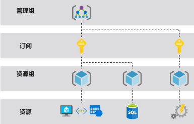

# Azure 资源管理器概述

Azure 资源管理器是 Azure 的部署和管理服务。 它提供一个管理层用于在 Azure 订阅中创建、更新和删除资源。 部署后，可以使用访问控制、锁和标记等管理功能来保护和组织资源。

若要了解 Azure 资源管理器模板，请参阅[模板部署概述](template-deployment-overview.md)。

## 一致的管理层

当用户从任意 Azure 工具、API 或 SDK 发送请求时，资源管理器将会接收该请求。 它会对该请求进行身份验证和授权。 资源管理器将请求发送到 Azure 服务，后者将执行请求的操作。 由于所有请求是通过同一个 API 处理的，因此在所有不同的工具中会看到一致的结果和功能。

下图演示了 Azure 资源管理器在处理 Azure 请求时发挥的作用。 

在门户中提供的所有功能也可以通过 PowerShell、Azure CLI、REST API 和客户端 SDK 来提供。 最初通过 API 发布的功能将在初次发布后的 180 天内在门户中提供。

## 术语

如果不熟悉 Azure 资源管理器，则可能不熟悉某些术语。

* **资源** - 可通过 Azure 获取的可管理项。 资源的示例包括虚拟机、存储帐户、Web 应用、数据库和虚拟网络。
* **资源组** — 一个容器，用于保存 Azure 解决方案的相关资源。 资源组包括你想要作为一个组进行管理的那些资源。 根据最适合组织的情况来决定哪些资源属于哪个资源组。 请参阅 [资源组](#resource-groups)。
* **资源提供程序** - 提供 Azure 资源的服务。 例如，Microsoft.Compute 就是一个常见的资源提供程序，它提供虚拟机资源。 Microsoft.Storage 是另一个常见的资源提供程序。 请参阅[资源提供程序和类型](resource-manager-supported-services.md)。
* **资源管理器模板** - 一个 JavaScript 对象表示法 (JSON) 文件，用于定义一个或多个要部署到资源组或订阅的资源。 使用模板能够以一致方式反复部署资源。 请参阅[模板部署概述](template-deployment-overview.md)。
* **声明性语法** — 一种语法，允许声明“以下是我想要创建的项目”，而不需要编写一系列编程命令来进行创建。 资源管理器模板便是声明性语法的其中一个示例。 在该文件中，可以定义要部署到 Azure 的基础结构的属性。  请参阅[模板部署概述](template-deployment-overview.md)。

## 使用 Resource Manager 的优势

使用资源管理器可以：

* 通过声明性模板而非脚本来管理基础结构。

* 以组的形式部署、管理和监视解决方案的所有资源，而不是单独处理这些资源。

* 在整个开发生命周期内重复部署解决方案，并确保以一致的状态部署资源。

* 定义各资源之间的依赖关系，使其按正确的顺序进行部署。

* 将访问控制应用到资源组中的所有服务，因为基于角色的访问控制 (RBAC) 已在本机集成到管理平台。

* 将标记应用到资源，以逻辑方式组织订阅中的所有资源。

* 通过查看一组共享相同标记的资源的成本来理清组织的帐单。

## 了解范围

Azure 提供四个级别的范围：[管理组](../governance/management-groups/index.md)、订阅、[资源组](#resource-groups)和资源。 下图显示了这些层的一个示例。

将在上述任何级别的作用域中应用管理设置。 所选的级别确定应用设置的广泛程度。 较低级别继承较高级别的设置。 例如，将[策略](../governance/policy/overview.md)应用于订阅时，该策略将应用于订阅中的所有资源组和资源。 在资源组上应用策略时，该策略将应用于资源组及其所有资源。 但是，其他资源组没有该策略分配。

可以将模板部署到管理组、订阅或资源组。

## 资源组

定义资源组时，需要考虑以下几个重要因素：

* 组中的所有资源应该共享相同的生命周期。 一起部署、更新和删除这些资源。 如果某个资源（例如数据库服务器）需要采用不同的部署周期，则它应在另一个资源组中。

* 每个资源只能在一个资源组中。

* 随时可以在资源组添加或删除资源。

* 可以将资源从一个资源组移到另一个组。 有关详细信息，请参阅[将资源移到新资源组或订阅](resource-group-move-resources.md)。

* 资源组可以包含位于不同区域的资源。

* 资源组可用于划分对管理操作的访问控制。

* 资源可与其他资源组中的资源进行交互。 如果两个资源相关，但不共享相同的生命周期，那么这种交互很常见（例如，Web 应用连接到数据库）。

创建资源组时，需要提供该资源组的位置。 你可能想知道，“为什么资源组需要一个位置？ 另外，如果资源的位置和资源组不同，那为什么资源组的位置很重要呢？ ” 资源组存储有关资源的元数据。 当指定资源组的位置时，也就指定了元数据的存储位置。 出于合规性原因，可能需要确保数据存储在某一特定区域。

如果资源组的区域暂时不可用，则无法更新资源组中的资源，因为元数据不可用。 其他区域中的资源仍将按预期运行，但你无法更新它们。 有关构建可靠应用程序的详细信息，请参阅[设计可靠的 Azure 应用程序](/azure/architecture/reliability/)。

## Azure 资源管理器的复原能力

Azure 资源管理器服务旨在实现复原能力和持续可用性。 REST API 中的资源管理器和控制平面操作（发送到 management.azure.com 的请求）具有以下特性：

* 跨区域分布。 某些服务具有区域性。

* 在具有多个可用性区域的位置上跨可用性区域（以及区域）分布。

* 不依赖于单个逻辑数据中心。

* 从未因维护活动而停机。

这种复原能力适用于通过资源管理器接收请求的服务。 例如，Key Vault 可以利用这种复原能力。

## 后续步骤

* 有关资源提供程序提供的所有操作，请参阅 [Azure REST API](/rest/api/azure/)。

* 若要了解有关移动资源的信息，请参阅[将资源移到新资源组或订阅](resource-group-move-resources.md)。

* 若要了解如何标记资源，请参阅[使用标记来组织 Azure 资源](resource-group-using-tags.md)。

* 若要了解如何锁定资源，请参阅[锁定资源以防止意外更改](resource-group-lock-resources.md)。

* 有关为部署创建模板的信息，请参阅[模板部署概述](template-deployment-overview.md)。
