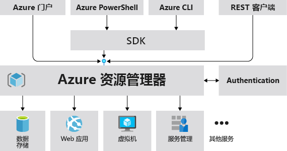
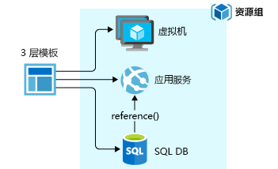
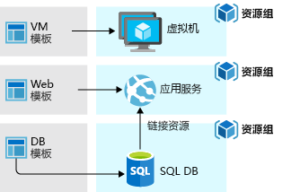

# <a name="azure-resource-manager-overview"></a>Azure 资源管理器概述

Azure 资源管理器是 Azure 的部署和管理服务。 它提供一致的管理层用于在 Azure 订阅中创建、更新和删除资源。 部署后，可以使用其访问控制、审核和标记功能来保护与组织资源。

通过门户、PowerShell、Azure CLI、REST API 或客户端 SDK 执行操作时，Azure 资源管理器 API 将处理你的请求。 由于所有请求是通过同一个 API 处理的，因此在所有不同的工具中会看到一致的结果和功能。 在门户中提供的所有功能也可以通过 PowerShell、Azure CLI、REST API 和客户端 SDK 来提供。 最初通过 API 发布的功能将在初次发布后的 180 天内在门户中提供。

下图显示各种工具如何与 Azure 资源管理器 API 交互。 API 将请求传递给 Resource Manager 服务，后者对请求进行身份验证和授权。 资源管理器随后将请求路由到相应的服务。



## <a name="terminology"></a>术语

如果不熟悉 Azure 资源管理器，则可能不熟悉某些术语。

* **资源** - 可通过 Azure 获取的可管理项。 资源的示例包括虚拟机、存储帐户、Web 应用、数据库和虚拟网络。
* **资源组** — 一个容器，用于保存 Azure 解决方案的相关资源。 资源组包括你想要作为一个组进行管理的那些资源。 根据对组织有利的原则，决定如何将资源分配到资源组。 请参阅 [资源组](#resource-groups)。
* **资源提供程序** - 提供 Azure 资源的服务。 例如，**Microsoft.Compute** 就是一个常见的资源提供程序，它提供虚拟机资源。 **Microsoft.Storage** 是另一个常见的资源提供程序。 请参阅 [资源提供程序](#resource-providers)。
* **资源管理器模板** - 一个 JavaScript 对象表示法 (JSON) 文件，用于定义一个或多个要部署到资源组或订阅的资源。 使用模板能够以一致方式反复部署资源。 请参阅 [模板部署](#template-deployment)。
* **声明性语法** — 一种语法，允许声明“以下是我想要创建的项目”，而不需要编写一系列编程命令来进行创建。 Resource Manager 模板便是声明性语法的其中一个示例。 在该文件中，可以定义要部署到 Azure 的基础结构的属性。

## <a name="the-benefits-of-using-resource-manager"></a>使用 Resource Manager 的优势

资源管理器提供多种优势：

* 可以以组的形式部署、管理和监视解决方案的所有资源，而不是单独处理这些资源。
* 可以在整个开发生命周期内重复部署解决方案，并确保以一致的状态部署资源。
* 可以通过声明性模板而非脚本来管理基础结构。
* 可以定义各资源之间的依赖关系，使其按正确的顺序进行部署。
* 可以将访问控制应用到资源组中的所有服务，因为基于角色的访问控制 (RBAC) 已在本机集成到管理平台。
* 可以将标记应用到资源，以逻辑方式组织订阅中的所有资源。
* 可以通过查看一组共享相同标记的资源的成本来理清组织的帐单。

## <a name="guidance"></a>指南
以下建议将帮助你在使用解决方案时充分利用 Resource Manager。

* 通过 Resource Manager 模板中的声明性语法而不是强制性的命令来定义和部署基础结构。
* 在模板中定义所有部署和配置步骤。 在设置解决方案时不应执行手动步骤。
* 运行强制性命令来管理资源，例如启动或停止应用或计算机。
* 排列资源组中具有相同生命周期的资源。 使用标记来组织其他所有资源。

有关企业可如何使用 Resource Manager 有效管理订阅的指南，请参阅 [Azure 企业基架 - 出于合规目的监管订阅](/azure/architecture/cloud-adoption-guide/subscription-governance?toc=%2fazure%2fazure-resource-manager%2ftoc.json)。

有关创建资源管理器模板的建议，请参阅 [Azure 资源管理器模板的最佳做法](template-best-practices.md)。

## <a name="resource-groups"></a>资源组
定义资源组时，需要考虑以下几个重要因素：

* 组中的所有资源应该共享相同的生命周期。 一起部署、更新和删除这些资源。 如果某个资源（例如数据库服务器）需要采用不同的部署周期，则它应在另一个资源组中。
* 每个资源只能在一个资源组中。
* 随时可以在资源组添加或删除资源。
* 可以将资源从一个资源组移到另一个组。 有关详细信息，请参阅[将资源移到新资源组或订阅](resource-group-move-resources.md)。
* 资源组可以包含位于不同区域的资源。
* 资源组可用于划分对管理操作的访问控制。
* 资源可与其他资源组中的资源进行交互。 如果两个资源相关，但不共享相同的生命周期，那么这种交互很常见（例如，Web 应用连接到数据库）。

创建资源组时，需要提供该资源组的位置。 你可能想知道，“为什么资源组需要一个位置？ 另外，如果资源的位置和资源组不同，那为什么资源组的位置很重要呢？ ” 资源组存储有关资源的元数据。 因此，当指定资源组的位置时，也就指定了元数据的存储位置。 出于合规性原因，可能需要确保数据存储在某一特定区域。

## <a name="resource-providers"></a>资源提供程序

每个资源提供程序提供一组资源以及用于处理这些资源的操作。 例如，若要存储密钥和密码，可以使用 **Microsoft.KeyVault** 资源提供程序。 此资源提供程序提供名为“保管库”的资源类型，用于创建密钥保管库。

资源类型的名称采用以下格式：{resource-provider}/{resource-type}。 Key Vault 的资源类型为 **Microsoft.KeyVault/vaults**。

开始部署资源之前，应了解可用的资源提供程序。 了解资源提供程序和资源的名称可帮助确定要部署到 Azure 的资源。 此外，还需要知道每种资源类型的有效位置和 API 版本。 有关详细信息，请参阅[资源提供程序和类型](resource-manager-supported-services.md)。

有关资源提供程序提供的所有操作，请参阅 [Azure REST API](/rest/api/azure/)。

## <a name="template-deployment"></a>模板部署

使用 Resource Manager 可以创建（JSON 格式的）模板，用于定义 Azure 解决方案的基础结构和配置。 使用模板，可以在解决方案的整个生命周期内重复部署该解决方案，确保以一致的状态部署资源。

若要了解模板的格式及其构造方法，请参阅[了解 Azure 资源管理器模板的结构和语法](resource-group-authoring-templates.md)。 若要查看资源类型的 JSON 语法，请参阅[定义 Azure 资源管理器模板中的资源](/azure/templates/)。

资源管理器像处理其他任何请求一样处理模板。 它解析模板，并将其语法转换为相应资源提供程序的 REST API 操作。 例如，当 Resource Manager 收到具有以下资源定义的模板：

```json
"resources": [
  {
    "apiVersion": "2016-01-01",
    "type": "Microsoft.Storage/storageAccounts",
    "name": "mystorageaccount",
    "location": "westus",
    "sku": {
      "name": "Standard_LRS"
    },
    "kind": "Storage",
    "properties": {
    }
  }
]
```

它将定义转换为以下 REST API 操作，后者将发送到 Microsoft.Storage 资源提供程序：

```HTTP
PUT
https://management.azure.com/subscriptions/{subscriptionId}/resourceGroups/{resourceGroupName}/providers/Microsoft.Storage/storageAccounts/mystorageaccount?api-version=2016-01-01
REQUEST BODY
{
  "location": "westus",
  "properties": {
  }
  "sku": {
    "name": "Standard_LRS"
  },
  "kind": "Storage"
}
```

模板和资源组的定义方式完全取决于用户及其所需的解决方案管理方式。 例如，可以通过单个模板将三层应用程序部署到单个资源组。



但无需在单个模板中定义整个基础结构。 通常，合理的做法是将部署要求划分成一组有针对性的模板。 可以轻松地将这些模板重复用于不同的解决方案。 若要部署特定的解决方案，请创建链接所有所需模板的主模板。 下图显示了如何通过包含三个嵌套模板的父模板部署三层解决方案。


要各层具有单独的生命周期，可将三个层部署到单独的资源组。 请注意，仍可将这些资源链接到其他资源组中的资源。



有关嵌套模板的信息，请参阅[将链接的模板用于 Azure 资源管理器](resource-group-linked-templates.md)。

Azure 资源管理器会分析依赖关系，以确保按正确的顺序创建资源。 如果一个资源依赖于另一个资源（例如虚拟机需要存储帐户才能访问磁盘）中的值，请设置依赖关系。 有关详细信息，请参阅[在 Azure 资源管理器模板中定义依赖关系](resource-group-define-dependencies.md)。

还可以使用模板对基础结构进行更新。 例如，可以将新的资源添加到应用程序，并为已部署的资源添加配置规则。 如果模板定义的资源已存在，则资源管理器会更新现有资源而不会创建新资源。

如果需要其他操作（例如，安装未包含在安装程序中的特定软件）时，资源管理器可提供所需的扩展。 如果已在使用配置管理服务（如 DSC、Chef 或 Puppet），则可以使用扩展来继续处理该服务。 有关虚拟机扩展的信息，请参阅[关于虚拟机扩展和功能](../virtual-machines/windows/extensions-features.md?toc=%2fazure%2fvirtual-machines%2fwindows%2ftoc.json)。

从门户创建解决方案时，该解决方案会自动包含部署模板。 无需从头开始创建模板，因为可以从解决方案的模板着手，并根据特定需求自定义该模板。 有关示例，请参阅[快速入门：使用 Azure 门户创建和部署 Azure 资源管理器模板](./resource-manager-quickstart-create-templates-use-the-portal.md)。 还可以通过导出资源组的当前状态或查看特定部署所用的模板来检索现有资源组的模板。 查看[导出的模板](resource-manager-export-template.md)是了解模板语法的有用方法。

最后，该模板将成为应用程序源代码的一部分。 可以将它签入源代码存储库，并随着应用程序的发展更新该模板。 可以通过 Visual Studio 编辑模板。

定义模板后，即可将资源部署到 Azure。 若要部署资源，请参阅：

* [使用 Resource Manager 模板和 Azure PowerShell 部署资源](resource-group-template-deploy.md)
* [使用 Resource Manager 模板和 Azure CLI 部署资源](resource-group-template-deploy-cli.md)
* [使用 Resource Manager 模板和 Azure 门户部署资源](resource-group-template-deploy-portal.md)
* [使用 Resource Manager 模板和 Resource Manager REST API 部署资源](resource-group-template-deploy-rest.md)

## <a name="safe-deployment-practices"></a>安全部署实践

将复杂服务部署到 Azure 时，你可能需要将服务部署到多个区域，并且在继续执行下一步骤前需要检查其运行状况。 可以使用 [Azure 部署管理器](deployment-manager-overview.md)来协调服务的分阶段推出。 通过分阶段推出服务，你可以在服务已部署到所有区域之前发现潜在的问题。 如果不需要这些预防措施，则执行上一部分中的部署操作是更好的选择。

部署管理器当前为专用预览版。

[!INCLUDE [arm-tutorials-quickstarts](../../includes/resource-manager-tutorials-quickstarts.md)]

## <a name="next-steps"></a>后续步骤

在本文中，你已学习了如何使用 Azure 资源管理器在 Azure 上部署和管理资源以及对其进行访问控制。 请前进到下一文章来学习如何部署你的第一个 Azure 资源管理器模板。

> [!div class="nextstepaction"]
> [快速入门：使用 Azure 门户创建和部署 Azure 资源管理器模板](./resource-manager-quickstart-create-templates-use-the-portal.md)
