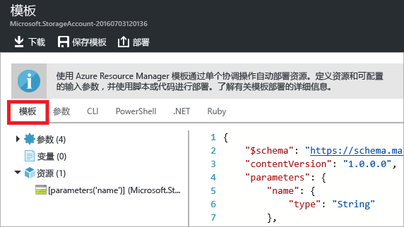
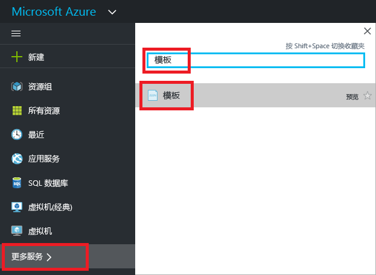
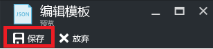

# <a name="export-an-azure-resource-manager-template-from-existing-resources"></a>从现有资源导出 Azure 资源管理器模板
本文介绍如何从订阅中的现有资源导出 Resource Manager 模板。 可以使用该生成的模板更好地了解模板语法。

可以通过两种方式来导出模板：

* 可以导出用于部署的实际模板。 导出的模板中包括的所有参数和变量与原始模板中显示的完全一样。 在已通过门户部署资源的情况下，若需了解如何通过模板来创建这些资源，则可使用此方法。 此模板可随时使用。 
* 可以导出已生成的表示资源组当前状态的模板。 导出的模板不以任何已用于部署的模板为依据。 它创建的模板是资源组的“快照”或“备份”。 导出的模板会有许多硬编码的值，其参数可能没有定义的那么多。 使用此选项可将资源重新部署到同一资源组。 若要将此模板用于其他资源组，可能需要对其进行大幅修改。

本文通过门户展示了这两种方法。

## <a name="deploy-resources"></a>部署资源
让我们开始将资源部署到 Azure，以便将其用作模板导出。 如果订阅中已有要导出到模板的资源组，则可跳过此部分。 本文剩余部分假定你已部署了本部分中介绍的 Web 应用和 SQL 数据库解决方案。 如果使用其他解决方案，则体验可能会稍有不同，但导出模板的步骤是相同的。 

1. 在 [Azure 门户](https://portal.azure.com)中，选择“创建资源”。
   
      
2. 搜索“Web 应用 + SQL”，然后在可用选项中选择它。
   
      

3. 选择**创建**。

      

4. 为 Web 应用和 SQL 数据库提供所需值。 选择**创建**。

      

部署可能需要几分钟时间。 部署完成后，订阅将包含解决方案。

## <a name="view-template-from-deployment-history"></a>在部署历史记录中查看模板
1. 转到新资源组的资源组。 可以看到，门户中显示了上次部署的结果。 选择此链接。
   
      
2. 可以看到该组的部署历史记录。 在本例中，门户可能只列出了一个部署。 选择此部署。
   
     
3. 门户会显示部署摘要。 摘要包括此部署及其操作的状态，以及为参数提供的值。 若要查看用于部署的模板，请选择“查看模板”。
   
     
4. Resource Manager 检索以下七个文件：
   
   1. **模板** - 定义解决方案基础结构的模板。 通过门户创建存储帐户时，Resource Manager 使用模板来部署该存储帐户，并保存该模板供将来参考。
   2. **参数** - 可用于在部署过程中传入值的参数文件。 它包含你在首次部署时提供的值。 重新部署模板时，可以更改这其中的任何值。
   3. **CLI** - 可用于部署模板的 Azure CLI 脚本文件。
   4. **PowerShell** - 可用于部署该模板的 Azure PowerShell 脚本文件。
   5. **.NET** - 可用于部署该模板的 .NET 类。
   6. **Ruby** - 可用于部署模板的 Ruby 类。
      
      默认情况下，门户会显示模板。
      
       
      
事实上，创建 Web 应用和 SQL 数据库时使用的就是此模板。 请注意，可以使用该模板包含的参数在部署时提供不同的值。 若要详细了解模板的结构，请参阅[创作 Azure 资源管理器模板](resource-group-authoring-templates.md)。

## <a name="export-the-template-from-resource-group"></a>从资源组导出模板
如果已手动更改了资源或将资源添加到多个部署中，则从部署历史记录中检索模板不能反映资源组的当前状态。 本部分介绍如何导出反映资源组当前状态的模板。 它用作资源组的快照，可用来重新部署到同一资源组。 若要将导出的模板用于其他解决方案，必须大幅修改它。

> [!NOTE]
> 无法导出包含超过 200 项资源的资源组模板。
> 
> 

1. 若要查看资源组的模板，请选择“自动化脚本”。
   
      
   
     Resource Manager 会评估资源组中的资源，并为这些资源生成一个模板。 并非所有资源类型都支持导出模板功能。 可能会出现一个错误，指出导出存在问题。 [修复导出问题](#fix-export-issues) 部分介绍了如何处理这些问题。
2. 将会再次出现六个可用于重新部署解决方案的文件。 但是，这一次模板稍有不同。 请注意，生成的模板包含的参数少于前一部分的模板所包含的。 另外，在此模板中，许多值（例如位置和 SKU 值）是硬编码的，并不接受参数值。 在重用该模板之前，可能需要对其进行编辑，以便更好地使用参数。 
   
3. 可通过几个选项继续使用此模板。 可以下载模板，并使用 JSON 编辑器本地使用它。 也可将模板保存到库，并通过门户使用它。
   
     如果习惯使用 [VS Code](https://code.visualstudio.com/) 或 [Visual Studio](vs-azure-tools-resource-groups-deployment-projects-create-deploy.md) 等 JSON 编辑器，建议本地下载模板，并使用相应编辑器。 若要在本地使用，请选择“下载”。
   
      
   
     如果没有安装 JSON 编辑器，可通过门户编辑模板。 本文剩余部分假设你已在门户中将模板保存到库。 但无论使用本地 JSON 编辑器还是通过门户，都要对模板进行相同的语法更改。 若要通过门户使用，请选择“添加到库”。
   
      
   
     将模板添加到库时，为模板提供名称和说明。 然后选择“保存”。
   
     
4. 要查看库中保存的模板，请选择“更多服务”，并键入“模板”以筛选结果，并选择“模板”。
   
      
5. 选择具有已保存名称的模板。
   
      

## <a name="customize-the-template"></a>自定义模板
若要为每个部署创建相同的 Web 应用和 SQL 数据库，则导出的模板可满足要求。 但是，Resource Manager 提供相关选项，因此使用它可以更灵活地部署模板。 本文介绍如何针对数据库管理员名称和密码来添加参数。 可以通过这个相同的方法，提高模板中其他值的灵活性。

1. 若要自定义模板，请选择“编辑”。
   
     
2. 选择模板。
   
     
3. 若要传递建议在部署过程中指定的值，请将下面的两个参数添加到模板中的 parameters 部分：

   ```json
   "administratorLogin": {
       "type": "String"
   },
   "administratorLoginPassword": {
       "type": "SecureString"
   },
   ```

4. 若要使用新参数，请替换 resources 节中的 SQL Server 定义。 请注意，administratorLogin 和 administratorLoginPassword 现在使用参数值。

   ```json
   {
       "comments": "Generalized from resource: '/subscriptions/{subscription-id}/resourceGroups/exportsite/providers/Microsoft.Sql/servers/tfserverexport'.",
       "type": "Microsoft.Sql/servers",
       "kind": "v12.0",
       "name": "[parameters('servers_tfserverexport_name')]",
       "apiVersion": "2014-04-01-preview",
       "location": "South Central US",
       "scale": null,
       "properties": {
           "administratorLogin": "[parameters('administratorLogin')]",
           "administratorLoginPassword": "[parameters('administratorLoginPassword')]",
           "version": "12.0"
       },
       "dependsOn": []
   },
   ```

6. 编辑完模板后，选择“确定”。
7. 选择“保存”以保存对模板所做的更改。
   
     
8. 若要重新部署已更新的模板，请选择“部署”。
   
     
9. 提供参数值，并选择要将资源部署到其中的资源组。


## <a name="fix-export-issues"></a>修复导出问题
并非所有资源类型都支持导出模板功能。 仅当从资源组导出（而不是从部署历史记录导出）时，才会看到导出问题。 如果上一个部署能够准确地代表资源组的当前状态，则应从部署历史记录而非资源组中导出模板。 只有在已更改资源组且更改未在单个模板中定义时，才应从资源组导出。

若要解决导出问题，请手动将缺少的资源添加回模板中。 错误消息内指出了无法导出的资源类型。 请在[模板引用](/azure/templates/)中查找该资源类型。 例如，若要手动添加虚拟网关，请参阅 [Microsoft.Network/virtualNetworkGateways 模板引用](/azure/templates/microsoft.network/virtualnetworkgateways)。 模板参考文档中提供了用于将资源添加到模板的 JSON。

获取资源的 JSON 格式后，需要获取资源值。 可以在 REST API 中对资源类型使用 GET 操作，从而查看资源值。 例如，若要获取虚拟网络网关值，请参阅[虚拟网络网关 - Get](/rest/api/network-gateway/virtualnetworkgateways/get)。

## <a name="next-steps"></a>后续步骤

* 可通过 [PowerShell](resource-group-template-deploy.md)、[Azure CLI](resource-group-template-deploy-cli.md) 或 [REST API](resource-group-template-deploy-rest.md) 部署模板。
* 若要了解如何通过 PowerShell 导出模板，请参阅[使用 PowerShell 导出 Azure 资源管理器模板](resource-manager-export-template-powershell.md)。
* 若要了解如何通过 Azure CLI 导出模板，请参阅[使用 Azure CLI 导出 Azure 资源管理器模板](resource-manager-export-template-cli.md)。

