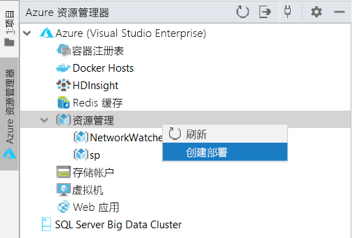
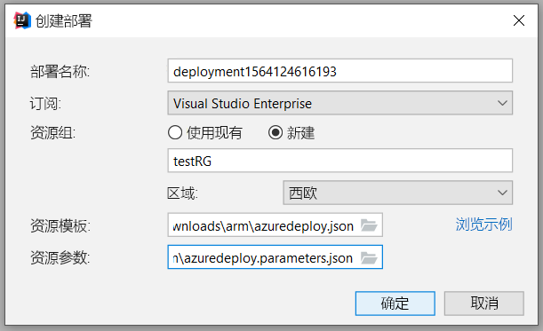
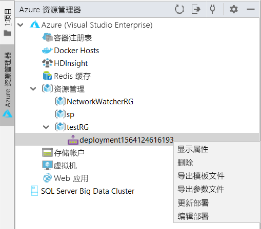
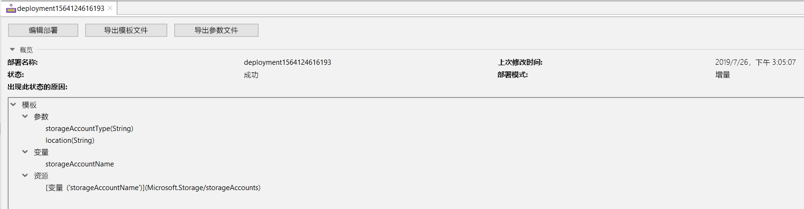
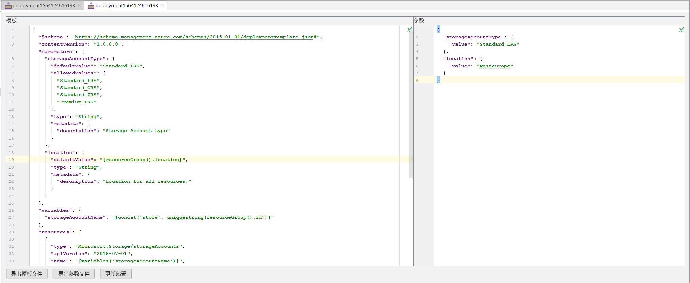
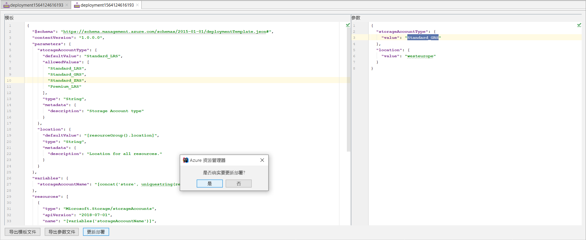
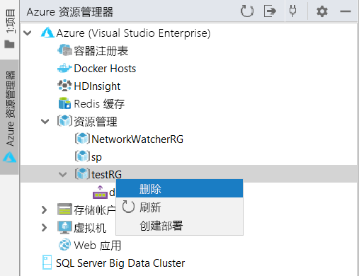

# 快速入门：使用 IntelliJ IDEA 创建和部署 Azure 资源管理器模板

了解如何使用 IntelliJ IDEA 将资源管理器模板部署到 Azure，以及如何直接从 IDE 编辑和更新该模板。 Resource Manager 模板为 JSON 文件，用于定义针对解决方案进行部署时所需的资源。 若要了解与部署和管理 Azure 解决方案相关联的概念，请参阅 [Azure 资源管理器概述](resource-group-overview.md)。

完成本教程后，部署 Azure 存储帐户。 可以通过同一过程来部署其他 Azure 资源。

如果还没有 Azure 订阅，可以在开始前[创建一个免费帐户](https://azure.microsoft.com/free/)。

## 先决条件

若要完成本文，需要做好以下准备：

* 已安装的 [IntelliJ IDEA](https://www.jetbrains.com/idea/download/) 旗舰版或社区版
* 已安装的 [Azure Toolkit for IntelliJ](https://plugins.jetbrains.com/plugin/8053)。有关详细信息，请查看 [IntelliJ 的插件管理指南](https://www.jetbrains.com/help/idea/managing-plugins.html)
* [登录](https://docs.microsoft.com/java/azure/intellij/azure-toolkit-for-intellij-sign-in-instructions)适用于 Azure Toolkit for IntelliJ 的 Azure 帐户

## 部署快速入门模板

无需从头开始创建模板，可以通过 [Azure 快速入门模板](https://azure.microsoft.com/resources/templates/)打开一个模板。 Azure 快速入门模板是资源管理器模板的存储库。 本快速入门中使用的模板称为[创建标准存储帐户](https://github.com/Azure/azure-quickstart-templates/tree/master/101-storage-account-create/)。 该模板定义 Azure 存储帐户资源。

1. 单击右键并将 [`azuredeploy.json`](https://raw.githubusercontent.com/Azure/azure-quickstart-templates/master/101-storage-account-create/azuredeploy.json) 和 [`azuredeploy.parameters.json`](https://raw.githubusercontent.com/Azure/azure-quickstart-templates/master/101-storage-account-create/azuredeploy.parameters.json) 保存到本地计算机。

1. 如果你已正确安装 Azure 工具包并已登录，IntelliJ IDEA 的侧栏中应会显示 Azure 资源管理器。 右键单击“资源管理”并选择“创建部署”。  

    

1. 配置“部署名称”、“订阅”、“资源组”和“区域”。     此处，我们要将模板部署到新资源组 `testRG`。 然后，选择 `azuredeploy.json` 作为**资源模板**的路径，并选择下载的 `azuredeploy.parameters.json` 作为**资源参数**。

    

1. 单击“确定”后，将启动部署。 在部署完成之前，可以在底部的 IntelliJ IDEA **状态栏**中查看进度。

    

## 浏览现有部署

1. 部署完成后，可以看到新资源组 `testRG` 以及新建的部署。 右键单击该部署可以看到可能的操作列表。 现在请选择“显示属性”。 

    

1. 此时会打开一个选项卡视图，其中显示了一些有用的属性，例如部署状态和模板结构。

    

## 编辑和更新现有部署

1. 从右键单击菜单或前面所示的“显示属性”视图中选择“编辑部署”。  此时会打开另一个选项卡视图，其中显示了 Azure 上的部署的模板和参数文件。 若要将这些文件保存到本地，可以单击“导出模板文件”或“导出参数文件”。  

    

1. 可在此页上编辑这两个文件，并将更改部署到 Azure。 此处，我们将参数文件中 **storageAccountType** 的值从 `Standard_LRS` 更改为 `Standard_GRS`。 然后，单击底部的“更新部署”并确认更新。 

    

1. 完成更新部署后，可在门户中检查创建的存储帐户是否已更改为 `Standard_GRS`。

## 清理资源

1. 不再需要 Azure 资源时，请通过删除资源组来清理部署的资源。 可在 Azure 门户或 Azure CLI 中执行此操作。 在 IntelliJ IDEA 的 Azure 资源管理器中，右键单击创建的**资源组**并选择“删除”。

    

> [!NOTE]
> 请注意，删除某个部署不会删除该部署创建的资源。 如果不再需要相应的资源组或特定资源，请将其删除。

## 后续步骤

本快速入门重点介绍了如何使用 IntelliJ IDEA 来部署 Azure 快速入门模板中的现有模板。 此外，介绍了如何查看和更新 Azure 上的现有部署。 Azure 快速入门模板中的模板可能并未提供你所需的一切。 若要详细了解模板开发，请参阅新的初学者教程系列：

> [!div class="nextstepaction"]
> [初学者教程](./template-tutorial-create-first-template.md)

> [!div class="nextstepaction"]
> [在 Azure 开发人员中心访问 Java](https://docs.microsoft.com/azure/java)
