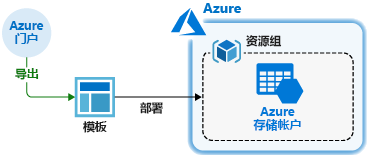
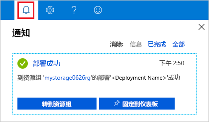
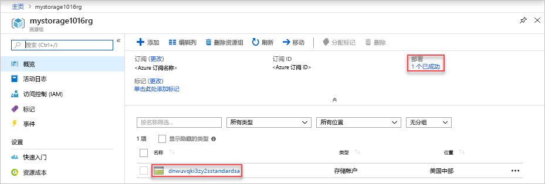

# <a name="quickstart-create-and-deploy-azure-resource-manager-templates-by-using-the-azure-portal"></a>快速入门：使用 Azure 门户创建和部署 Azure 资源管理器模板

了解如何使用 Azure 门户生成资源管理器模板，以及从门户编辑和部署该模板的过程。 Resource Manager 模板为 JSON 文件，用于定义针对解决方案进行部署时所需的资源。 若要了解与部署和管理 Azure 解决方案相关联的概念，请参阅 [Azure 资源管理器概述](resource-group-overview.md)。



完成本教程后，部署 Azure 存储帐户。 可以通过同一过程来部署其他 Azure 资源。

如果还没有 Azure 订阅，可以在开始前[创建一个免费帐户](https://azure.microsoft.com/free/)。

## <a name="generate-a-template-using-the-portal"></a>使用门户生成模板

从头开始创建资源管理器模板不是一项容易的任务，尤其是在不熟悉 Azure 部署和 JSON 格式的情况下。 可以使用 Azure 门户来配置资源（例如 Azure 存储帐户）。 在部署资源之前，可以将配置导出到资源管理器模板中。 可以保存模板，便于将来重复使用。

需要有经验的模板开发人员在尝试部署不熟悉的 Azure 资源时，会使用此方法来生成模板。 有关使用门户导出模板的更多信息，请参阅[将资源组导出到模板](./manage-resource-groups-portal.md#export-resource-groups-to-templates)。 查找工作模板的另一种方法是 [Azure 快速入门模板](https://azure.microsoft.com/resources/templates/)。

1. 登录到 [Azure 门户](https://portal.azure.com)。
2. 选择“创建资源” > “存储” > “存储帐户 - Blob、文件、表、队列”。   

    
3. 输入以下信息：

    |Name|值|
    |----|----|
    |**资源组**|选择“新建”  ，然后指定所选资源组的名称。 在屏幕截图中，资源组名称为 *mystorage1016rg*。 资源组是 Azure 资源的容器。 资源组方便 Azure 资源的管理。 |
    |**名称**|为存储帐户指定唯一的名称。 存储帐户名称在整个 Azure 中必须是唯一的，且仅包含小写字母和数字。 名称长度必须介于 3 到 24 个字符之间。 如果收到错误消息“存储帐户名称‘mystorage1016’已被占用”，请尝试使用“&lt;名称>存储&lt;MMDD 格式的今日日期>”，例如“johndolestorage1016”   。 有关详细信息，请参阅[命名规则和限制](/azure/cloud-adoption-framework/ready/considerations/naming-and-tagging#resource-naming)。|

    可对剩余的属性使用默认值。

    

    > [!NOTE]
    > 某些导出的模板需要经过一些编辑才能部署。

4. 在屏幕底部选择“查看 + 创建”。  请勿在下一步中选择“创建”  。
5. 在屏幕底部选择“下载自动化模板”。  门户显示生成的模板：

    

    主窗格会显示该模板。 它是包含六个顶级元素（`schema`、`contentVersion`、`parameters`、`variables`、`resources`、`output`）的 JSON 文件。 有关详细信息，请参阅[了解 Azure 资源管理器模板的结构和语法](./resource-group-authoring-templates.md)

    定义了六个参数。 其中一个名为 **storageAccountName**。 在上一屏幕截图中，第二个突出显示的部分显示如何在模板中引用此参数。 在下一部分，请编辑此模板，以便将生成的名称用于存储帐户。

    在模板中定义了一个 Azure 资源。 类型为 `Microsoft.Storage/storageAccounts`。 查看资源定义方式和定义结构。
6. 在屏幕顶部选择“下载”  。
7. 打开下载的 zip 文件，然后将“template.json”保存到计算机  。 在下一部分，请使用模板部署工具来编辑此模板。
8. 选择“参数”选项卡，查看为参数提供的值。  部署模板时，请写下这些值，下一部分需要它们。

    

    使用模板文件和参数文件可以创建一个资源（在本教程中为 Azure 存储帐户）。

## <a name="edit-and-deploy-the-template"></a>编辑和部署模板

可以使用 Azure 门户执行一些基本的模板编辑操作。 在本快速入门中，请使用名为“模板部署”的门户工具。   在本教程中使用模板部署，因此可以使用一个界面（Azure 门户）来完成整个教程。 若要编辑更复杂的模板，请考虑使用 [Visual Studio Code](./resource-manager-quickstart-create-templates-use-visual-studio-code.md)，因为它提供更丰富的编辑功能。

> [!IMPORTANT]
> 模板部署提供了用于测试简单模板的接口。 建议不要在生产环境中使用此功能， 而是将模板存储在 Azure 存储帐户或 GitHub 等源代码存储库中。

Azure 要求每个 Azure 服务都具有唯一的名称。 如果输入了已存在的存储帐户名，则部署可能失败。 若要避免此问题，可以修改模板，以便使用模板函数调用 `uniquestring()`，以生成唯一的存储帐户名。

1. 在 Azure 门户中，选择“创建资源”  。
2. 在“搜索市场”中键入“模板部署”，然后按 **ENTER**。  
3. 选择“模板部署”。 

    
4. 选择“创建”  。
5. 选择“在编辑器中生成自己的模板”  。
6. 选择“加载文件”，  然后按说明加载在上部分下载的 template.json。
7. 对模板进行以下三处更改：

    

   - 删除“storageAccountName”参数，如上一屏幕截图所示  。
   - 添加一个名为“storageAccountName”的变量，如上一屏幕截图所示  ：

       ```json
       "storageAccountName": "[concat(uniqueString(subscription().subscriptionId), 'storage')]"
       ```

       此处使用了两个模板函数：`concat()` 和 `uniqueString()`。
   - 更新 **Microsoft.Storage/storageAccounts** 资源的 name 元素，以使用新定义的变量而不是参数：

       ```json
       "name": "[variables('storageAccountName')]",
       ```

     最终的模板应如下所示：

     ```json
     {
       "$schema": "https://schema.management.azure.com/schemas/2015-01-01/deploymentTemplate.json#",
       "contentVersion": "1.0.0.0",
       "parameters": {
           "location": {
               "type": "string"
           },
           "accountType": {
               "type": "string"
           },
           "kind": {
               "type": "string"
           },
           "accessTier": {
               "type": "string"
           },
           "supportsHttpsTrafficOnly": {
               "type": "bool"
           }
       },
       "variables": {
           "storageAccountName": "[concat(uniqueString(subscription().subscriptionId), 'storage')]"
       },
       "resources": [
           {
               "name": "[variables('storageAccountName')]",
               "type": "Microsoft.Storage/storageAccounts",
               "apiVersion": "2018-07-01",
               "location": "[parameters('location')]",
               "properties": {
                   "accessTier": "[parameters('accessTier')]",
                   "supportsHttpsTrafficOnly": "[parameters('supportsHttpsTrafficOnly')]"
               },
               "dependsOn": [],
               "sku": {
                   "name": "[parameters('accountType')]"
               },
               "kind": "[parameters('kind')]"
           }
       ],
       "outputs": {}
     }
     ```
8. 选择“保存”。 
9. 输入以下值：

    |Name|值|
    |----|----|
    |**资源组**|选择在上一部分中创建的资源组名称。 |
    |**位置**|选择存储帐户的位置。 例如“美国中部”。  |
    |**帐户类型**|对于本快速入门，请输入 **Standard_LRS**。 |
    |**种类**|对于本快速入门，请输入“StorageV2”。  |
    |**访问层**|对于本快速入门，请输入“Hot”。  |
    |**启用仅限 Https 流量**| 对于本快速入门，请选择“true”。  |
    |**我同意上述条款和条件**|（选择）|

    下面是示例部署的屏幕截图：

    

10. 选择“购买”。 
11. 选择屏幕顶部的铃铛图标（通知）可查看部署状态。 此时会看到“部署正在进行”。  等待部署完成。

    

12. 从通知窗格选择“转到资源组”  。 将看到类似于以下的屏幕：

    

    可以看到部署状态为成功，资源组中只有一个存储帐户。 存储帐户名称是模板生成的唯一字符串。 若要详细了解如何使用 Azure 存储帐户，请参阅[快速入门：使用 Azure 门户上传、下载和列出 Blob](../storage/blobs/storage-quickstart-blobs-portal.md)。

## <a name="clean-up-resources"></a>清理资源

不再需要 Azure 资源时，请通过删除资源组来清理部署的资源。

1. 在 Azure 门户上的左侧菜单中选择“资源组”  。
2. 在“按名称筛选”字段中输入资源组名称。 
3. 选择资源组名称。  应会看到资源组中的存储帐户。
4. 在顶部菜单中选择“删除资源组”。 

## <a name="next-steps"></a>后续步骤

本教程已介绍如何通过 Azure 门户生成模板，以及如何使用门户部署模板。 本快速入门中使用的模板是包含一个 Azure 资源的简单模板。 如果模板较为复杂，使用 Visual Studio Code 或 Visual Studio 开发模板会更方便。 若要详细了解模板开发，请参阅新的初学者教程系列：

> [!div class="nextstepaction"]
> [初学者教程](./template-tutorial-create-first-template.md)