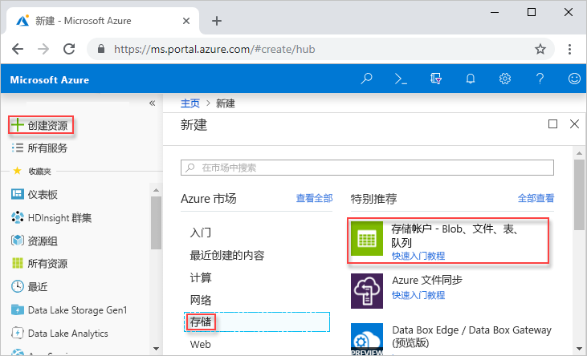
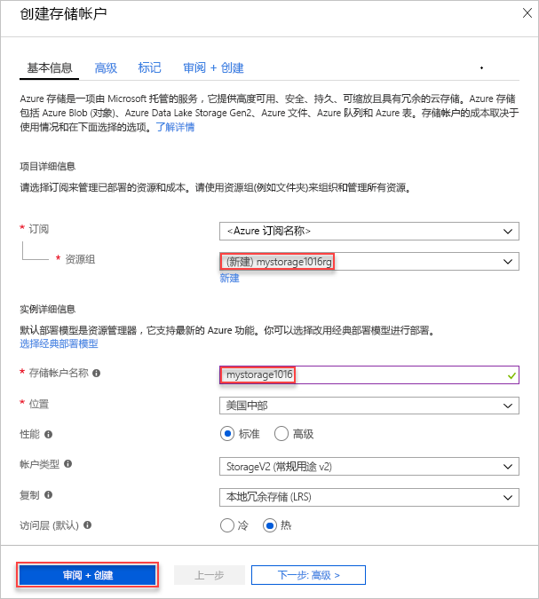
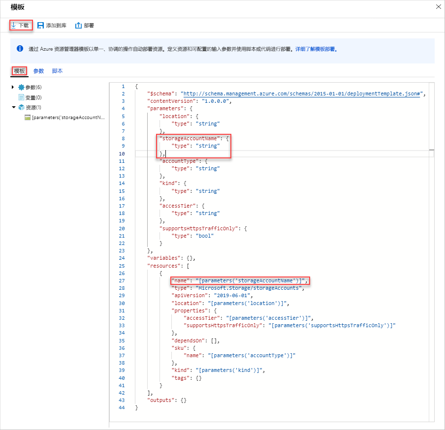
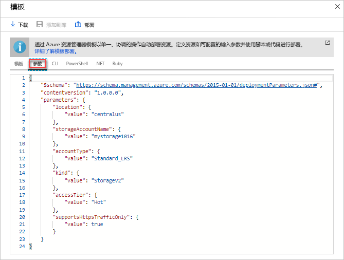
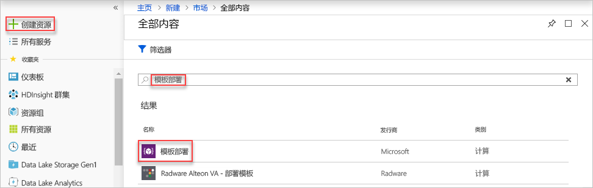
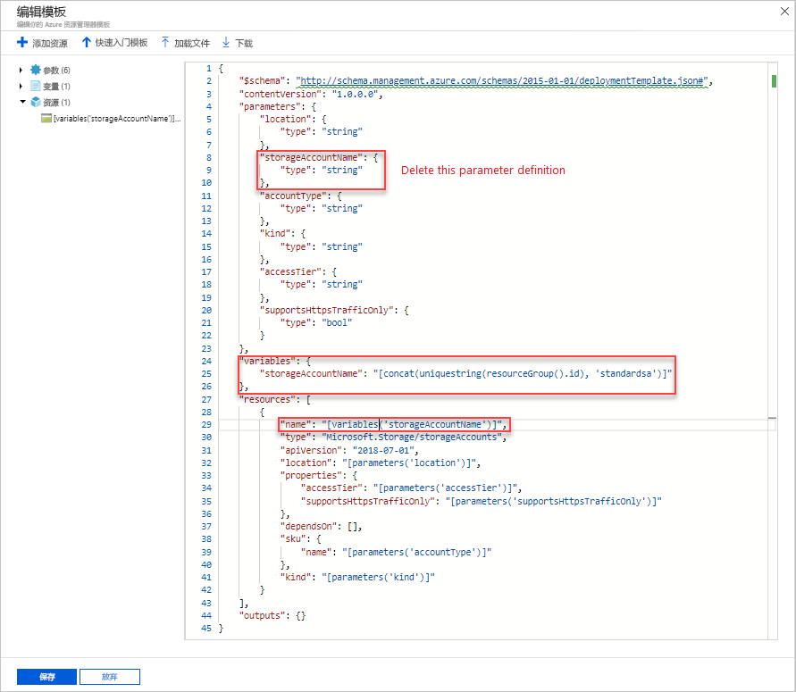
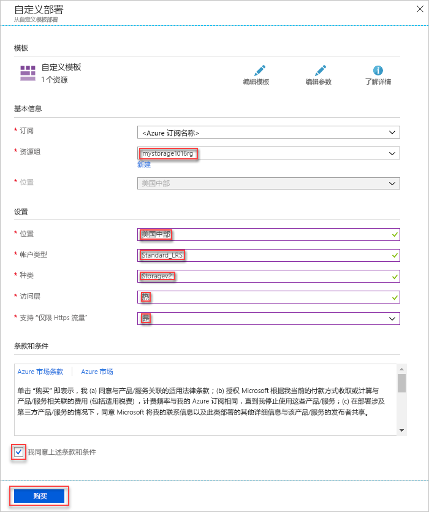

# <a name="quickstart-create-and-deploy-azure-resource-manager-templates-by-using-the-azure-portal"></a>快速入门：使用 Azure 门户创建和部署 Azure 资源管理器模板

了解如何使用 Azure 门户生成第一个 Azure 资源管理器模板，以及如何从门户编辑和部署该模板。

Resource Manager 模板为 JSON 文件，用于定义针对解决方案进行部署时所需的资源。 若要创建模板，不一定总要从头开始。 本教程将介绍如何从 Azure 门户生成模板。 然后，可以自定义模板并将其部署。

本教程中的说明将创建一个 Azure 存储帐户。 可以使用相同的过程来创建其他 Azure 资源。

如果还没有 Azure 订阅，可以在开始前[创建一个免费帐户](https://azure.microsoft.com/free/)。

## <a name="generate-a-template-using-the-portal"></a>使用门户生成模板

在本部分，我们将使用 Azure 门户创建一个存储帐户。 在部署存储帐户之前，可以使用相应的选项浏览门户根据配置生成的模板。 可以保存模板，便于将来重复使用。

1. 登录到 [Azure 门户](https://portal.azure.com)。
2. 选择“创建资源” > “存储” > “存储帐户 - Blob、文件、表、队列”。

    
3. 输入以下信息。 在下一步骤请务必选择“自动化选项”而不是“创建”，以便在部署模板之前可以查看它。

    - **名称**：为存储帐户指定唯一的名称。 在屏幕截图中，名称为 *mystorage0626*。
    - **资源组**：使用所选的名称创建新的 Azure 资源组。 在屏幕截图中，资源组名称为 *mystorage0626rg*。

    可对剩余的属性使用默认值。

    

    > [!NOTE]
    > 某些导出的模板需要经过一些编辑才能部署。

4. 选择屏幕底部的“自动化选项”。 门户在“模板”选项卡上上显示该模板：

    

    主窗格会显示该模板。 它是包含四个顶级元素的 JSON 文件。 有关详细信息，请参阅[了解 Azure 资源管理器模板的结构和语法](./resource-group-authoring-templates.md)

    **Parameter** 元素下面定义了五个参数。 若要查看在部署期间提供的值，请选择“参数”选项卡。

    

    这些值是在上一部分配置的。 使用模板和 parameters 文件可以创建一个 Azure 存储帐户。

5. 选项卡的顶部有三个菜单项：

    - **下载**：将模板和 parameters 文件下载到本地计算机。
    - **添加到库**：将模板添加到库，便于将来重复使用。
    - **部署**：将 Azure 存储帐户部署到 Azure。

    本教程使用“添加到库”选项。

6. 选择“添加到库”。
7. 在“名称”和“说明”中输入信息，然后选择“保存”。

> [!NOTE]
> 模板库功能以预览版提供。 大部分人会选择将模板保存到本地计算机，或者 Github 等公共存储。  

## <a name="edit-and-deploy-the-template"></a>编辑和部署模板

在本部分，我们将从模板库打开保存的模板、在门户中编辑该模板，然后部署修改后的模板。 若要编辑更复杂的模板，请考虑使用 Visual Studio Code，因为它提供更丰富的编辑功能。

1. 在 Azure 门户上的左侧菜单中选择“所有服务”，在筛选框中输入“模板”，然后选择“模板(预览版)”。

    
2. 选择在上一部分保存的模板。 屏幕截图中使用的名称为 *mystorage0626*。
3. 依次选择“编辑”、“已添加的模板”。

    

4. 添加 **variables** 元素并添加一个变量，如以下屏幕截图中所示：

    ```json
    "variables": {
        "storageAccountName": "[concat(uniquestring(resourceGroup().id), 'standardsa')]"
    },
    ```
    

    此处使用了两个函数：*concat()* 和 *uniqueString()*。 uniqueString() 可帮助创建资源的唯一名称。

5. 删除上面屏幕截图中突出显示的 **name** 参数。
6. 更新 **Microsoft.Storage/storageAccounts** 资源的 name 元素，以使用新定义的变量而不是参数：

    ```json
    "name": "[variables('storageAccountName')]",
    ```

    最终的模板应如下所示：

    ```json
    {
        "$schema": "https://schema.management.azure.com/schemas/2015-01-01/deploymentTemplate.json#",
        "contentVersion": "1.0.0.0",
        "parameters": {
            "location": {
                "type": "string"
            },
            "accountType": {
                "type": "string"
            },
            "kind": {
                "type": "string"
            },
            "httpsTrafficOnlyEnabled": {
                "type": "bool"
            }
        },
        "variables": {
            "storageAccountName": "[concat(uniquestring(resourceGroup().id), 'standardsa')]"
        },
        "resources": [
            {
                "apiVersion": "2018-02-01",
                "name": "[variables('storageAccountName')]",
                "location": "[parameters('location')]",
                "type": "Microsoft.Storage/storageAccounts",
                "sku": {
                    "name": "[parameters('accountType')]"
                },
                "kind": "[parameters('kind')]",
                "properties": {
                    "supportsHttpsTrafficOnly": "[parameters('httpsTrafficOnlyEnabled')]",
                    "encryption": {
                        "services": {
                            "blob": {
                                "enabled": true
                            },
                            "file": {
                                "enabled": true
                            }
                        },
                        "keySource": "Microsoft.Storage"
                    }
                },
                "dependsOn": []
            }
        ]
    }
    ```
7. 选择“确定”，然后选择“保存”以保存更改。
8. 选择“部署”。
9. 输入以下值：

    - **订阅**：选择自己的 Azure 订阅。
    - **资源组**：使用唯一的名称为资源组命名。
    - **位置**：选择资源组的位置。
    - **位置**：选择存储帐户的位置。  可以使用与资源组相同的位置。
    - **帐户类型**：对于本快速入门，请输入 **Standard_LRS**。
    - **种类**：对于本快速入门，请输入“存储”。
    - **启用仅限 Https 流量**。  对于本快速入门，请选择“false”。
    - **我同意上述条款和条件**：（选中）

    下面是示例部署的屏幕截图：

    

10. 选择“购买”。
11. 选择屏幕顶部的铃铛图标（通知）可查看部署状态。

## <a name="clean-up-resources"></a>清理资源

不再需要 Azure 资源时，请通过删除资源组来清理部署的资源。

1. 在 Azure 门户上的左侧菜单中选择“资源组”。
2. 在“按名称筛选”字段中输入资源组名称。
3. 选择资源组名称。  应会看到资源组中的存储帐户。
4. 在顶部菜单中选择“删除资源组”。

## <a name="next-steps"></a>后续步骤

本教程已介绍如何通过 Azure 门户生成模板，以及如何使用门户部署模板。 本快速入门中使用的模板是包含一个 Azure 资源的简单模板。 如果模板较为复杂，使用 Visual Studio Code 或 Visual Studio 开发模板会更方便。

> [!div class="nextstepaction"]
> [使用 Visual Studio Code 创建模板](./resource-manager-quickstart-create-templates-use-visual-studio-code.md)
