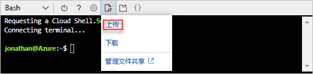
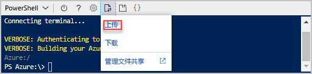

# <a name="quickstart-create-azure-resource-manager-templates-by-using-visual-studio-code"></a>快速入门：使用 Visual Studio Code 创建 Azure 资源管理器模板

了解如何使用 Visual Studio Code 和 Azure 资源管理器工具扩展创建和编辑 Azure 资源管理器模板。 可以在 Visual Studio Code 中不使用扩展创建资源管理器模板，但是该扩展提供自动完成选项，可以简化模板开发。 若要了解与部署和管理 Azure 解决方案相关联的概念，请参阅 [Azure 资源管理器概述](resource-group-overview.md)。

如果还没有 Azure 订阅，可以在开始前[创建一个免费帐户](https://azure.microsoft.com/free/)。

## <a name="prerequisites"></a>先决条件

若要完成本文，需要做好以下准备：

- [Visual Studio Code](https://code.visualstudio.com/)。
- 资源管理器工具扩展。 若要安装此扩展，请使用以下步骤：

    1. 打开 Visual Studio Code。
    2. 按 **CTRL+SHIFT+X** 打开“扩展”窗格
    3. 搜索“Azure 资源管理器工具”，然后选择“安装”。
    4. 选择“重新加载”完成扩展安装。

## <a name="open-a-quickstart-template"></a>打开快速入门模板

无需从头开始创建模板，可以通过 [Azure 快速入门模板](https://azure.microsoft.com/resources/templates/)打开一个模板。 Azure 快速入门模板是资源管理器模板的存储库。

本快速入门中使用的模板称为[创建标准存储帐户](https://azure.microsoft.com/resources/templates/101-storage-account-create/)。 该模板定义 Azure 存储帐户资源。

1. 在 Visual Studio Code 中，选择“文件”>“打开文件”。
2. 在“文件名”中粘贴以下 URL：

    ```url
    https://raw.githubusercontent.com/Azure/azure-quickstart-templates/master/101-storage-account-create/azuredeploy.json
    ```
3. 选择“打开”以打开该文件。
4. 选择“文件”>“另存为”，将该文件作为 **azuredeploy.json** 保存到本地计算机。

## <a name="edit-the-template"></a>编辑模板

若要了解如何使用 Visual Studio Code 编辑模板，请将额外的一个元素添加到 `outputs` 节。

1. 将额外的一个输出添加到导出的模板：

    ```json
    "storageUri": {
      "type": "string",
      "value": "[reference(variables('storageAccountName')).primaryEndpoints.blob]"
    }
    ```

    完成后，outputs 节如下所示：

    ```json
    "outputs": {
      "storageAccountName": {
        "type": "string",
        "value": "[variables('storageAccountName')]"
      },
      "storageUri": {
        "type": "string",
        "value": "[reference(variables('storageAccountName')).primaryEndpoints.blob]"
      }
    }
    ```

    如果在 Visual Studio Code 中复制并粘贴了代码，请尝试重新键入 **value** 元素，以体验资源管理器工具扩展的 IntelliSense 功能。

    

2. 选择“文件”>“保存”以保存文件。

## <a name="deploy-the-template"></a>部署模板

可通过多种方法来部署模板。  在本快速入门中，请使用 Azure Cloud shell。 Cloud Shell 支持 Azure CLI 和 Azure PowerShell。

1. 登录到 [Azure Cloud Shell](https://shell.azure.com)

    
2. 在 Cloud Shell 的左上角，它会显示 **PowerShell** 或 **Bash**。 若要使用 CLI，需打开一个 Bash 会话。 若要运行 PowerShell，需打开一个 PowerShell 会话。 选择向下箭头可在 Bash 与 PowerShell 之间切换。 请参阅上面的屏幕截图。 进行切换时，需重启 shell。
3. 依次选择“上传/下载文件”、“上传”。

    # <a name="clitabcli"></a>[CLI](#tab/CLI)

    
   
    # <a name="powershelltabpowershell"></a>[PowerShell](#tab/PowerShell)
    
    
    
    ---

    必须先上传模板文件，然后才能通过 shell 来部署它。
5. 选择在上一部分保存的文件。 默认名称为 **azuredeploy.json**。
6. 在 Cloud Shell 中，运行 **ls** 命令来验证是否已成功上传文件。 还可以使用 **cat** 命令来验证模板内容。 下图显示如何从 Bash 运行命令。  使用的命令与 PowerShell 会话中的命令相同。

    # <a name="clitabcli"></a>[CLI](#tab/CLI)

    
   
    # <a name="powershelltabpowershell"></a>[PowerShell](#tab/PowerShell)
    
    
    
    ---
7. 在 Cloud Shell 中运行以下命令。 选择用于显示 PowerShell 代码或 CLI 代码的选项卡。

    # <a name="clitabcli"></a>[CLI](#tab/CLI)
    ```azurecli
    echo "Enter the Resource Group name:" &&
    read resourceGroupName &&
    echo "Enter the name for this deployment:" &&
    read deploymentName &&
    echo "Enter the location (i.e. centralus):" &&
    read location &&
    az group create --name $resourceGroupName --location $location &&
    az group deployment create --name $deploymentName --resource-group $resourceGroupName --template-file "azuredeploy.json"
    ```
   
    # <a name="powershelltabpowershell"></a>[PowerShell](#tab/PowerShell)
    
    ```azurepowershell
    $resourceGroupName = Read-Host -Prompt "Enter the Resource Group name"
    $deploymentName = Read-Host -Prompt "Enter the name for this deployment"
    $location = Read-Host -Prompt "Enter the location (i.e. centralus)"
    
    New-AzureRmResourceGroup -Name $resourceGroupName -Location $location
    New-AzureRmResourceGroupDeployment -Name $deploymentName -ResourceGroupName $resourceGroupName -TemplateFile "azuredeploy.json"
    ```
    
    ---

    如果将模板文件保存到了 **azuredeploy.json** 之外的其他文件中，其更新其名称。

    以下屏幕截图显示了一个示例部署：

    # <a name="clitabcli"></a>[CLI](#tab/CLI)

    
   
    # <a name="powershelltabpowershell"></a>[PowerShell](#tab/PowerShell)
    
    
    
    ---

    输出部分的存储帐户名称和存储 URL 在屏幕截图上突出显示。 在下一步需要此存储帐户名称。

7. 运行以下 CLI 或 PowerShell 命令，列出新建的存储帐户：

    # <a name="clitabcli"></a>[CLI](#tab/CLI)
    ```azurecli
    echo "Enter the Resource Group name:" &&
    read resourceGroupName &&
    echo "Enter the Storage Account name:" &&
    read storageAccountName &&
    az storage account show --resource-group $resourceGroupName --name $storageAccountName
    ```
   
    # <a name="powershelltabpowershell"></a>[PowerShell](#tab/PowerShell)
    
    ```azurepowershell
    $resourceGroupName = Read-Host -Prompt "Enter the Resource Group name"
    $storageAccountName = Read-Host -Prompt "Enter the Storage Account name"
    Get-AzureRmStorageAccount -ResourceGroupName $resourceGroupName -Name $storageAccountName
    ```
    
    ---

## <a name="clean-up-resources"></a>清理资源

不再需要 Azure 资源时，请通过删除资源组来清理部署的资源。

1. 在 Azure 门户上的左侧菜单中选择“资源组”。
2. 在“按名称筛选”字段中输入资源组名称。
3. 选择资源组名称。  应会看到，该资源组中总共有六个资源。
4. 在顶部菜单中选择“删除资源组”。

## <a name="next-steps"></a>后续步骤

本快速入门的主要关注点是如何使用 Visual Studio Code 来编辑 Azure 快速入门模板中的现有模板。 此外还介绍了如何使用 Azure Cloud Shell 中的 CLI 或 PowerShell 来部署模板。 Azure 快速入门模板中的模板可能并未提供你所需的一切。 下一教程介绍如何从模板参考中查找信息，以便创建加密的 Azure 存储帐户。

> [!div class="nextstepaction"]
> [创建加密的存储帐户](./resource-manager-tutorial-create-encrypted-storage-accounts.md)
