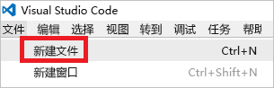
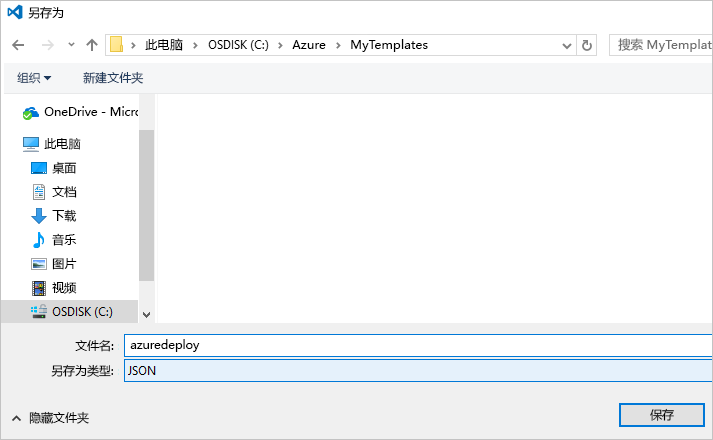

# <a name="use-visual-studio-code-extension-to-create-azure-resource-manager-template"></a>使用 Visual Studio Code 扩展创建 Azure 资源管理器模板
本文介绍在 Visual Studio Code 中安装和使用 Azure 资源管理器工具扩展有哪些好处。 可以在 VS Code 中创建不带扩展的资源管理器模板，但是该扩展提供自动完成选项，可以简化模板开发。 它会为用户建议可以在模板中使用的模板函数、参数和变量。

若要完成本文的操作，需安装 [Visual Studio Code](https://code.visualstudio.com/)。

若要了解与部署和管理 Azure 解决方案相关联的概念，请参阅 [Azure Resource Manager 概述](resource-group-overview.md)。

## <a name="create-the-template"></a>创建模板

本文基于在[创建和部署第一个 Azure 资源管理器模板](resource-manager-create-first-template.md)中创建的模板。 如果已有该模板，则可跳过此部分。

1. 如需创建该模板，请启动 VS Code。 选择“文件” > “新建文件”。 

   

2. 将以下 JSON 语法复制并粘贴到文件中：

   ```json
   {
     "$schema": "http://schema.management.azure.com/schemas/2015-01-01/deploymentTemplate.json#",
     "contentVersion": "1.0.0.0",
     "parameters": {
       "storageSKU": {
         "type": "string",
         "allowedValues": [
           "Standard_LRS",
           "Standard_ZRS",
           "Standard_GRS",
           "Standard_RAGRS",
           "Premium_LRS"
         ],
         "defaultValue": "Standard_LRS",
         "metadata": {
           "description": "The type of replication to use for the storage account."
         }
       },   
       "storageNamePrefix": {
         "type": "string",
         "maxLength": 11,
         "defaultValue": "storage",
         "metadata": {
           "description": "The value to use for starting the storage account name. Use only lowercase letters and numbers."
         }
       }
     },
     "variables": {
       "storageName": "[concat(toLower(parameters('storageNamePrefix')), uniqueString(resourceGroup().id))]"
     },
     "resources": [
       {
         "name": "[variables('storageName')]",
         "type": "Microsoft.Storage/storageAccounts",
         "apiVersion": "2016-01-01",
         "sku": {
           "name": "[parameters('storageSKU')]"
         },
         "kind": "Storage",
         "location": "[resourceGroup().location]",
         "tags": {},
         "properties": {
           "encryption":{
             "services":{
               "blob":{
                 "enabled":true
               }
             },
             "keySource":"Microsoft.Storage"
           }
         }
       }
     ],
     "outputs": {  }
   }
   ```

3. 在本地文件夹中将该文件另存为 azuredeploy.json。

   

## <a name="install-the-extension"></a>安装扩展

1. 在 VS Code 中选择“扩展”。

   

2. 搜索“Azure 资源管理器工具”，然后选择“安装”。

   

3. 若要完成扩展的安装，请选择“重新加载”。

## <a name="edit-the-template"></a>编辑模板

1. 打开 azuredeploy.json 文件。

2. 扩展会检索所有可用的[模板函数](resource-group-template-functions.md)， 并且会读取在模板中定义的参数和变量。 若要查看此功能，请向 outputs 节添加两个值。 在模板中，将 outputs 节替换为：

   ```json
   "outputs": { 
       "groupLocation": {
         "type": "string",
         "value": ""
       },
       "storageUri": {
         "type": "string",
         "value": ""
       }
   }
   ```

3. 将光标置于 groupLocation 中值的引号内。 键入左方括号 (`[`)。 注意，扩展会立即建议可用的模板函数。

   

4. 开始键入 resourceGroup。 显示 `resourceGroup()` 函数时，按 Tab 或 Enter。

   

5. 该扩展会填充函数语法。 [resourceGroup](resource-group-template-functions-resource.md#resourcegroup) 函数不接受参数。 在右圆括号后添加句点。 该扩展提供的属性适用于 `resourceGroup()` 函数返回的对象。 选择 `location`。

   

6. 在 location 后添加右方括号。

   ```json
   "outputs": { 
       "groupLocation": {
         "type": "string",
         "value": "[resourceGroup().location]"
       },
       "storageUri": {
         "type": "string",
         "value": ""
       }
   }
   ```

7. 现在，请将光标置于 storageUri 的引号内。 再次键入左方括号。 开始键入 reference。 选定该函数后，按 Tab 或 Enter。

   

8. [reference](resource-group-template-functions-resource.md#reference) 接受资源 ID 或资源名称作为参数。 变量中已经有了存储帐户的名称。 键入 var，然后选择 Ctrl+space。 该扩展会建议 variables 函数。

   

   按 Tab 或 Enter。

9. [variables](resource-group-template-functions-deployment.md#variables) 函数需要变量的名称。 在圆括号内添加单引号。 该扩展提供在模板中定义的变量的名称。

    

10. 选择 storageName 变量。 添加右方括号。 以下示例显示 outputs 节：

   ```json
   "outputs": { 
       "groupLocation": {
         "type": "string",
         "value": "[resourceGroup().location]"
       },
       "storageUri": {
         "type": "string",
         "value": "[reference(variables('storageName'))]"
       }
   }
   ```

最终模板为：

```json
{
  "$schema": "http://schema.management.azure.com/schemas/2015-01-01/deploymentTemplate.json#",
  "contentVersion": "1.0.0.0",
  "parameters": {
    "storageSKU": {
      "type": "string",
      "allowedValues": [
        "Standard_LRS",
        "Standard_ZRS",
        "Standard_GRS",
        "Standard_RAGRS",
        "Premium_LRS"
      ],
      "defaultValue": "Standard_LRS",
      "metadata": {
        "description": "The type of replication to use for the storage account."
      }
    },   
    "storageNamePrefix": {
      "type": "string",
      "maxLength": 11,
      "defaultValue": "storage",
      "metadata": {
        "description": "The value to use for starting the storage account name. Use only lowercase letters and numbers."
      }
    }
  },
  "variables": {
    "storageName": "[concat(toLower(parameters('storageNamePrefix')), uniqueString(resourceGroup().id))]"
  },
  "resources": [
    {
      "name": "[variables('storageName')]",
      "type": "Microsoft.Storage/storageAccounts",
      "apiVersion": "2016-01-01",
      "sku": {
        "name": "[parameters('storageSKU')]"
      },
      "kind": "Storage",
      "location": "[resourceGroup().location]",
      "tags": {},
      "properties": {
        "encryption":{
          "services":{
            "blob":{
              "enabled":true
            }
          },
          "keySource":"Microsoft.Storage"
        }
      }
    }
  ],
  "outputs": { 
    "groupLocation": {
      "type": "string",
      "value": "[resourceGroup().location]"
    },
    "storageUri": {
      "type": "string",
      "value": "[reference(variables('storageName'))]"
    }
  }
}
```

## <a name="deploy-template"></a>部署模板

已做好部署此模板的准备。 请使用 PowerShell 或 Azure CLI 创建一个资源组。 然后，将存储帐户部署到该资源组。

* 对于 PowerShell，请在包含模板的文件夹中使用以下命令：

   ```powershell
   Login-AzureRmAccount
   
   New-AzureRmResourceGroup -Name examplegroup -Location "South Central US"
   New-AzureRmResourceGroupDeployment -ResourceGroupName examplegroup -TemplateFile azuredeploy.json
   ```

* 若要在本地安装 Azure CLI，请在包含模板的文件夹中使用以下命令：

   ```azurecli
   az login

   az group create --name examplegroup --location "South Central US"
   az group deployment create --resource-group examplegroup --template-file azuredeploy.json
   ```

当部署完成后，会返回输出值。

## <a name="clean-up-resources"></a>清理资源

不再需要时，请通过删除资源组来清理部署的资源。

对于 PowerShell，请使用：

```powershell
Remove-AzureRmResourceGroup -Name examplegroup
```

对于 Azure CLI，请使用：

```azurecli
az group delete --name examplegroup
```

## <a name="next-steps"></a>后续步骤
* 若要详细了解模板的结构，请参阅 [Authoring Azure Resource Manager templates](resource-group-authoring-templates.md)（创作 Azure Resource Manager 模板）。
* 若要了解存储帐户的属性，请查看[存储帐户模板参考](/azure/templates/microsoft.storage/storageaccounts)。
* 若要查看许多不同类型的解决方案的完整模型，请参阅 [Azure Quickstart Templates](https://azure.microsoft.com/documentation/templates/)（Azure 快速入门模板）。

