# <a name="quickstart-create-azure-resource-manager-templates-with-visual-studio-code"></a>快速入门：使用 Visual Studio Code 创建 Azure 资源管理器模板

适用于 Visual Studio Code 的 Azure 资源管理器工具提供语言支持、资源片段和资源自动完成。 这些工具可帮助创建和验证 Azure 资源管理器模板。 在本快速入门中，你将使用扩展从头开始创建 Azure 资源管理器模板。 在此过程中，你将体验 ARM 模板片段、验证、完成和参数文件支持等扩展功能。

若要完成本快速入门，需要使用装有 [Azure 资源管理器工具扩展](https://marketplace.visualstudio.com/items?itemName=msazurermtools.azurerm-vscode-tools)的 [Visual Studio Code](https://code.visualstudio.com/)。 此外，需要安装 [Azure CLI](https://docs.microsoft.com/cli/azure/?view=azure-cli-latest) 或 [Azure PowerShell 模块](https://docs.microsoft.com/powershell/azure/new-azureps-module-az?view=azps-3.7.0)并完成身份验证。

如果还没有 Azure 订阅，可以在开始前[创建一个免费帐户](https://azure.microsoft.com/free/)。

## <a name="create-an-arm-template"></a>创建 ARM 模板

使用 Visual Studio Code 创建并打开名为 azuredeploy.json 的新文件。  在代码编辑器中输入 `arm`，该命令将启动用于创建 ARM 模板基架的 Azure 资源管理器片段。

选择 `arm!` 以创建一个仅限用于 Azure 资源组部署的模板。

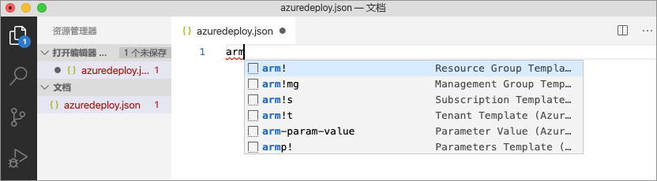

此片段将创建 ARM 模板的构建基块。

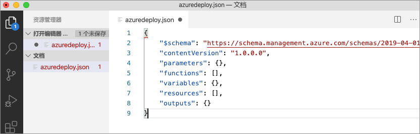

请注意，Visual Studio Code 语言模式已从“JSON”更改为“Azure 资源管理器模板”。   该扩展包含特定于 ARM 模板的语言服务器，该服务器提供特定于 ARM 模板的验证、完成和其他语言服务。


## <a name="add-an-azure-resource"></a>添加 Azure 资源

该扩展包含许多 Azure 资源的片段。 使用这些片段可以轻松地将资源添加到模板部署中。

将光标置于模板的 resources 块中，键入 `storage`，然后选择“arm-storage”片段。  

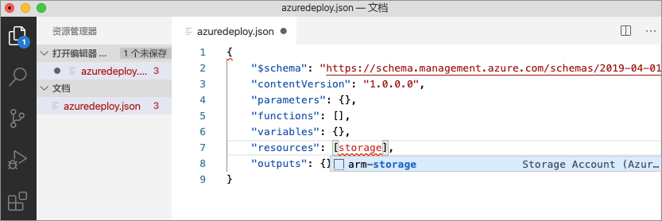

此操作会将一个存储资源添加到模板。

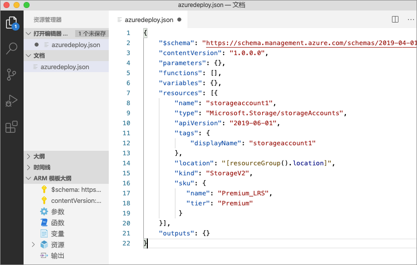

可以使用 Tab 键在存储帐户的各个可配置属性之间切换。 

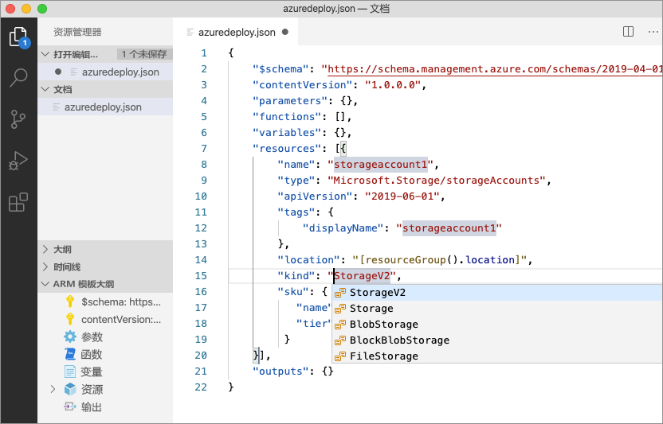

## <a name="completion-and-validation"></a>完成和验证

该扩展的最强大功能之一是与 Azure 架构的集成。 Azure 架构为扩展提供了验证和资源感知的完成功能。 让我们修改存储帐户，通过实际操作来了解验证和完成。 

首先，将存储帐户类型更新为某个无效值，例如 `megaStorage`。 可以看到，此操作导致生成了一条警告，指出 `megaStorage` 不是有效值。

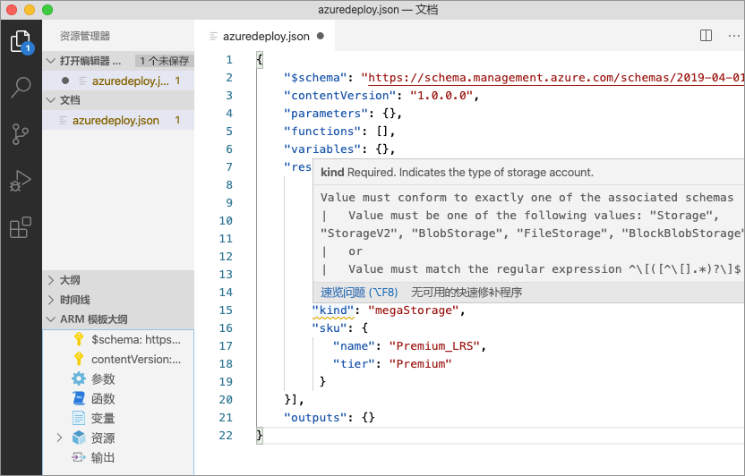

若要使用完成功能，请删除 `megaStorage`，将光标置于双引号内部，然后按 `ctrl` + `space`。 此操作会显示有效值的完成列表。

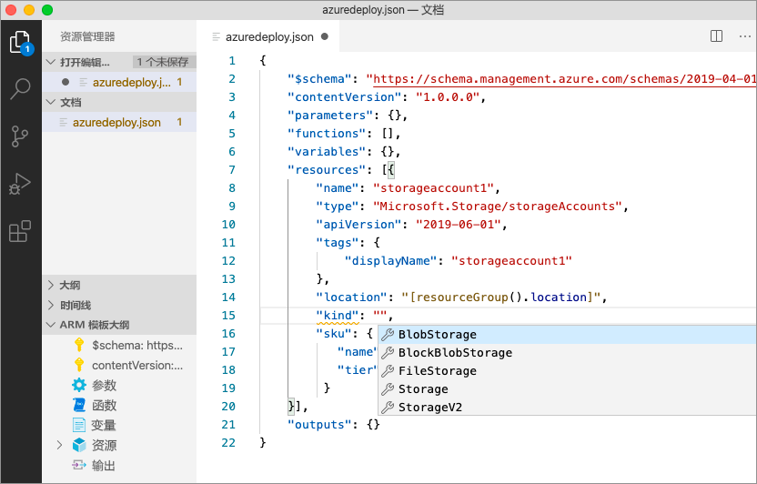

## <a name="add-template-parameters"></a>添加模板参数

现在，创建并使用一个参数来指定存储帐户名称。

将光标置于 parameters 块内，添加一个回车符，键入 `par`，然后选择 `arm-param-value` 片段。 此操作会将一个泛型参数添加到模板。

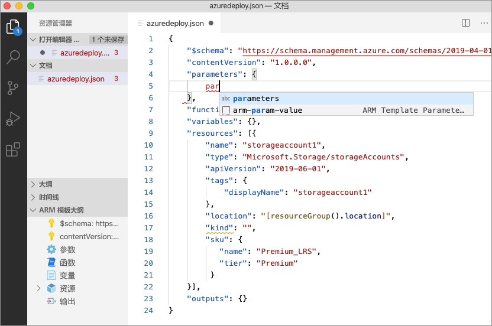

将参数名称更新为 `storageAccountName`，将说明更新为 `Storage Account Name`。

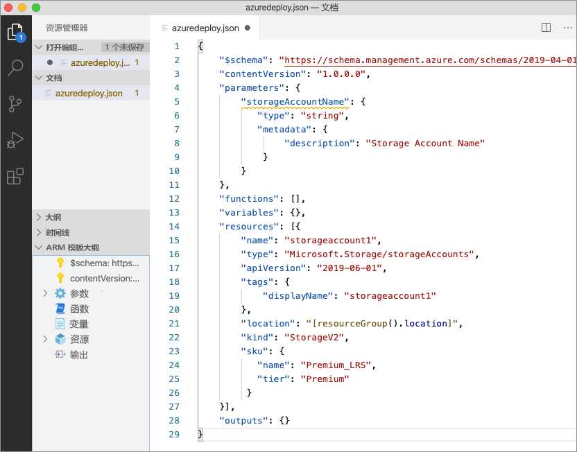

Azure 存储帐户名称的最小长度为 3 个字符，最大长度为 24 个字符。 将 `minLength` 和 `maxLength` 添加到参数，并提供适当的值。

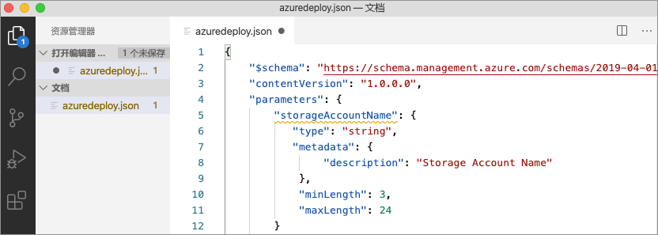

现在，在存储资源中，将名称属性更新为使用该参数。 为此，请删除当前名称。 输入双引号和左方括号 `[`，这会生成 ARM 模板函数的列表。 从列表中选择“parameters”。  

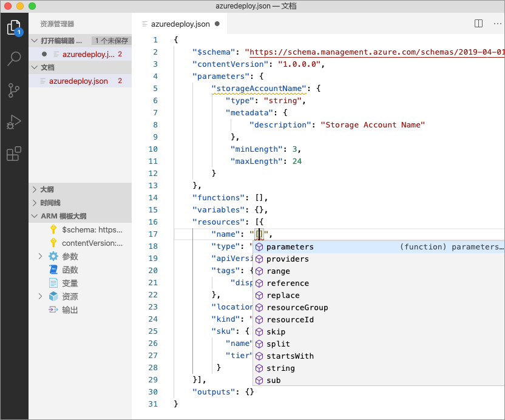

在圆括号内部输入单引号 `'` 会生成模板中定义的所有参数（在本例中为 storageAccountName）的列表。  选择该参数。

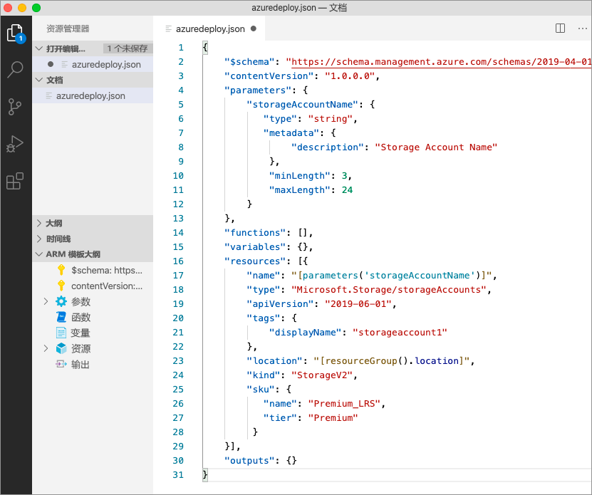

## <a name="create-a-parameter-file"></a>创建参数文件

使用 ARM 模板参数文件可以存储特定于环境的参数值，并在部署时以组的形式传递这些值。 例如，可以创建一个参数文件来包含特定于测试环境的值，并创建另一个参数文件以用于生产环境。

在扩展中可以从现有模板轻松创建参数文件。 若要创建，请在代码编辑器中右键单击模板，然后选择 `Select/Create Parameter File`。

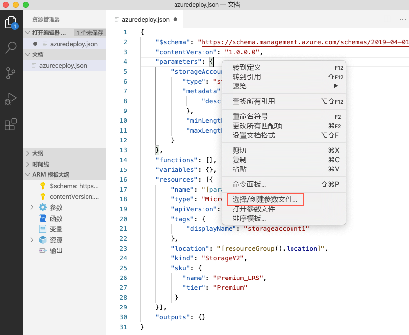

选择 `New` > `All Parameters`，然后选择参数文件的名称和位置。

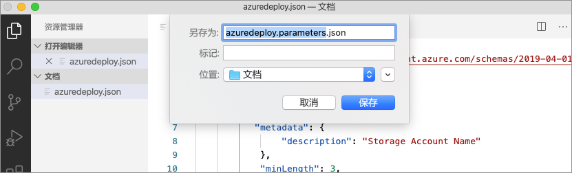

此操作会创建一个新的参数文件，并将该文件映射到从其创建了该文件的模板。 选择模板后，可以在 Visual Studio Code 状态栏中查看和修改当前的模板/参数文件映射。

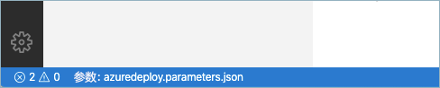

现在，参数文件已映射到模板，扩展会将模板和参数文件一同验证。 若要通过实际操作来了解此验证，请将一个双字符值添加到参数文件中的 `storageAccountName` 参数，然后保存该文件。

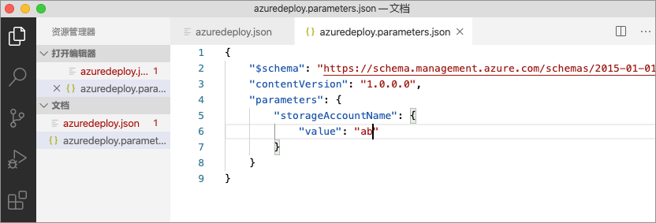

导航回到 ARM 模板，此时可以看到，其中引发了一个错误，指出值不符合参数条件。

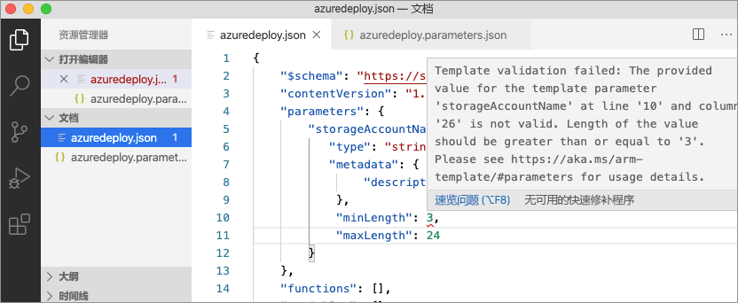

将值更新为某个适当值，保存文件，然后导航回到模板。 可以看到，有关参数的错误已解决。

## <a name="deploy-the-template"></a>部署模板

使用 `ctrl` + ```` ` ```` 组合键打开集成式 Visual Studio Code 终端，然后使用 Azure CLI 或 Azure PowerShell 模块来部署模板。

# <a name="cli"></a>[CLI](#tab/CLI)

```azurecli
az group create --name arm-vscode --location eastus

az deployment group create --resource-group arm-vscode --template-file azuredeploy.json --parameters azuredeploy.parameters.json
```

# <a name="powershell"></a>[PowerShell](#tab/PowerShell)

```azurepowershell
New-AzResourceGroup -Name arm-vscode -Location eastus

New-AzResourceGroupDeployment -ResourceGroupName arm-vscode -TemplateFile ./azuredeploy.json -TemplateParameterFile ./azuredeploy.parameters.json
```
---

## <a name="clean-up-resources"></a>清理资源

如果不再需要本文中创建的 Azure 资源，请使用 Azure CLI 或 Azure PowerShell 模块删除快速入门资源组。

# <a name="cli"></a>[CLI](#tab/CLI)

```azurecli
az group delete --name arm-vscode
```

# <a name="powershell"></a>[PowerShell](#tab/PowerShell)

```azurepowershell
Remove-AzResourceGroup -Name arm-vscode
```
---

## <a name="next-steps"></a>后续步骤

> [!div class="nextstepaction"]
> [初学者教程](./template-tutorial-create-first-template.md)
