# 通过 Visual Studio 创建和部署 Azure 资源组
使用 Visual Studio 和 [Azure SDK](https://azure.microsoft.com/downloads/)可以创建一个项目，用于将基础结构和代码部署到 Azure。 例如，你可以为应用定义 Web 主机、网站和数据库，然后将该基础结构与代码一起部署。 或者，你可以定义虚拟机、虚拟网络和存储帐户，然后连同虚拟机上执行的脚本一起部署该基础结构。 **Azure 资源组** 部署项目可让你通过单个可重复的的操作部署全部所需的资源。 有关部署和管理资源的详细信息，请参阅 [Azure Resource Manager 概述](resource-group-overview.md)。

Azure 资源组项目包含 Azure Resource Manager JSON 模板，用于定义部署到 Azure 的资源。 若要了解 Resource Manager 模板的元素，请参阅 [Authoring Azure Resource Manager templates](resource-group-authoring-templates.md)（创作 Azure Resource Manager 模板）。 Visual Studio 允许你编辑这些模板，并提供工具来简化模板的使用。

本文部署 Web 应用和 SQL 数据库。 但是，任何类型的资源的部署步骤几乎是相同的。 可以轻松地部署虚拟机及其相关资源。 Visual Studio 许多不同的入门模板用于部署常见方案。

本文介绍 Visual Studio 2017。 如果你使用 Visual Studio 2015 Update 2 以及用于 .NET 2.9 的 Microsoft Azure SDK，或者将 Visual Studio 2013 与 Azure SDK 2.9 配合使用，则你的体验大致相同。 可以使用 2.6 或更高版本的 Azure SDK；但是，用户界面体验可能会不同于本文所示的用户界面。 强烈建议先安装最新版本的 [Azure SDK](https://azure.microsoft.com/downloads/) ，再开始执行以下步骤。 

## 创建 Azure 资源组项目
在此过程中，使用“Web 应用 + SQL”模板创建 Azure 资源组项目  。

1. 在 Visual Studio 中，选择“文件”、“新建项目”，再选择“C#”或“Visual Basic”。 然后选择“云”和“Azure 资源组”项目。
   
    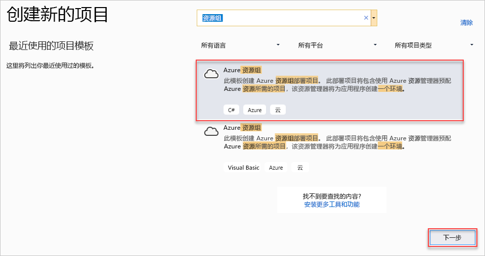
2. 选择要部署到 Azure Resource Manager 的模板。 可以看到，系统根据你要部署的项目类型提供了许多不同的选项。 就本文来说，请选择“Web 应用 + SQL”模板。
   
    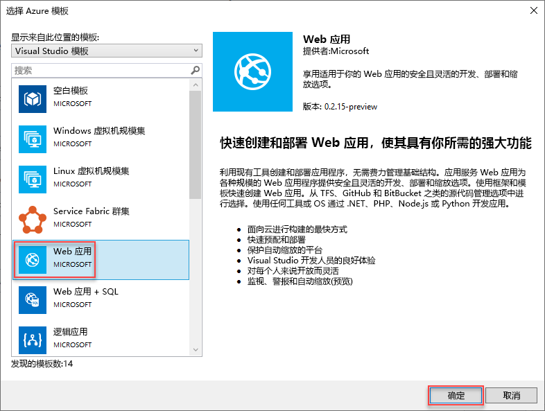
   
    选择的模板只是起点；你可以根据方案添加和删除资源。
   
   > [!NOTE]
   > Visual Studio 将在线检索可用模板的列表。 该列表可能会更改。
   > 
   > 
   
    Visual Studio 将创建 Web 应用和 SQL 数据库的资源组部署项目。
3. 若要查看创建的内容，请浏览部署项目中的节点。
   
    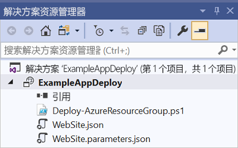
   
    由于针对本示例选择了“Web 应用 + SQL”模板，因此会看到以下文件。 
   
   | 文件名 | 说明 |
   | --- | --- |
   | Deploy-AzureResourceGroup.ps1 |一个 PowerShell 脚本，调用 PowerShell 命令以部署到 Azure Resource Manager。 **请注意** Visual Studio 使用此 PowerShell 脚本来部署你的模板。 对此脚本进行任何更改会影响 Visual Studio 中的部署，因此请务必小心。 |
   | WebSiteSQLDatabase.json |Resource Manager 模板，定义要部署到 Azure 的基础结构，以及在部署期间可以提供的参数。 它还定义各资源之间的依赖关系，以便 Resource Manager 按正确的顺序部署资源。 |
   | WebSiteSQLDatabase.parameters.json |包含模板所需值的参数文件。 需要传入这些参数值来自定义每个部署。 |
   
    所有资源组部署项目都包含这些基本文件。 其他项目可能包含其他文件以支持其他功能。

## 自定义 Resource Manager 模板
可以通过修改 JSON 模板（描述要部署的资源）来自定义部署项目。 JSON 是“JavaScript 对象表示法”的缩写，是一种易于使用的序列化数据格式。 JSON 文件使用在每个文件顶部引用的架构。 如果想要了解该架构，可以下载并分析它。 架构定义所允许的元素、字段的类型和格式、可能的枚举值，等等。 若要了解 Resource Manager 模板的元素，请参阅 [Authoring Azure Resource Manager templates](resource-group-authoring-templates.md)（创作 Azure Resource Manager 模板）。

若要使用模板，请打开 **WebSiteSQLDatabase.json**。

Visual Studio 编辑器提供了工具来帮助编辑 Resource Manager 模板。 “JSON 大纲”窗口可让你轻松查看模板中定义的元素  。

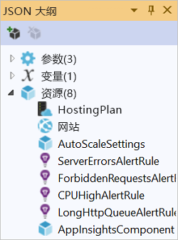

在大纲中选择任一元素会转到模板的该部分，并且突出显示相应的 JSON。

可以通过选择“JSON 大纲”窗口顶部的“添加资源”按钮，或右键单击“资源”，然后选择“添加新资源”，来添加资源。

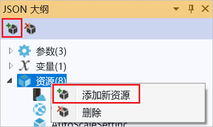

对于本教程，请选择“存储帐户”并指定其名称  。 提供一个名称，该名称不超过 11 个字符，并且只包含数字和小写字母。

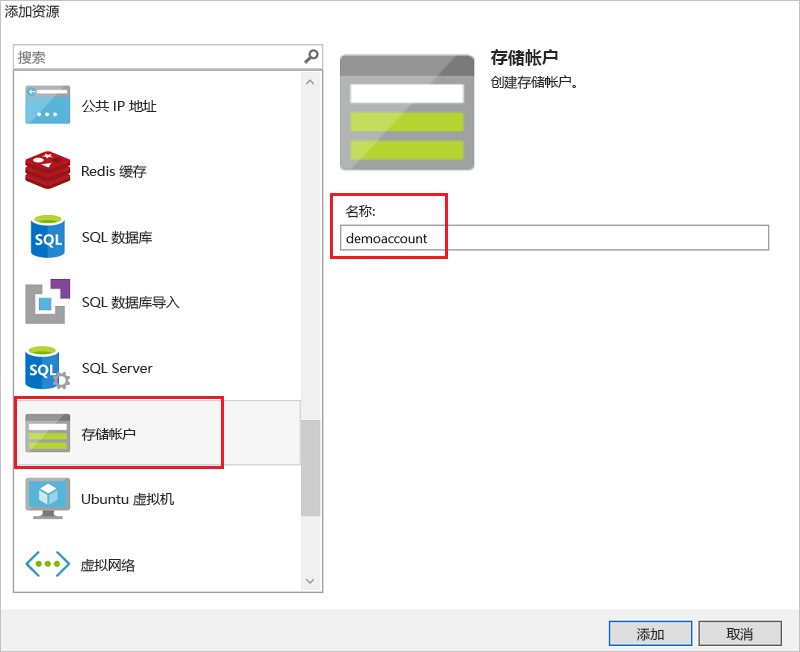

请注意，不仅会添加资源，而且还添加存储帐户类型的参数，以及存储帐户名称的变量。

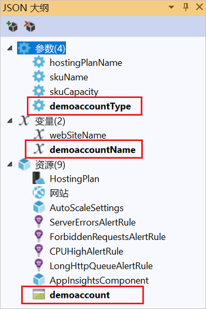

**storageType** 参数是使用允许的类型和默认类型预定义的。 你可以保留或根据方案编辑这些值。 如果不希望任何人通过此模板部署 **Premium_LRS** 存储帐户，请将它从允许的类型中删除。 

    "storageType": {
      "type": "string",
      "defaultValue": "Standard_LRS",
      "allowedValues": [
        "Standard_LRS",
        "Standard_ZRS",
        "Standard_GRS",
        "Standard_RAGRS"
      ]
    }

Visual Studio 还提供了 Intellisense 来帮助你了解编辑模板时可以使用哪些属性。 例如，若要编辑应用服务计划的属性，请导航到 **HostingPlan** 资源，并为 **properties** 添加值。 请注意，Intellisense 显示可用的值，并提供该值的描述。

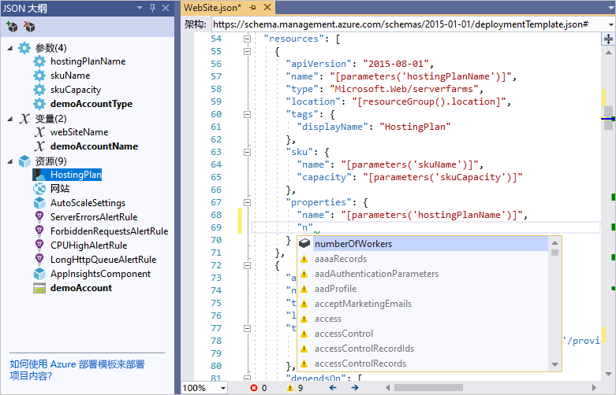

可以将 **numberOfWorkers** 设置为 1。

    "properties": {
      "name": "[parameters('hostingPlanName')]",
      "numberOfWorkers": 1
    }

## 将资源组部署到 Azure
现在你已准备好部署项目。 部署 Azure 资源组项目时，请将其部署到 Azure 资源组。 资源组是共享同一生命周期的资源的逻辑分组。

1. 在部署项目节点的快捷菜单中，选择“部署” > “新建”。
   
    
   
    此时将显示“部署到资源组”对话框  。
   
    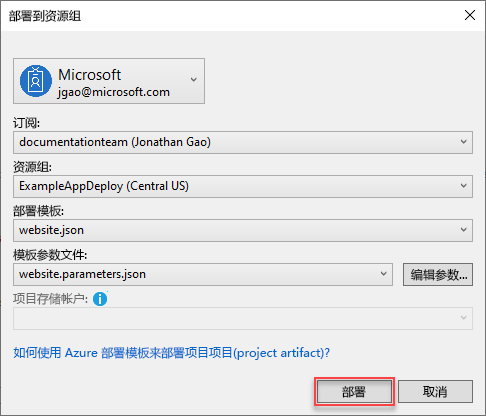
2. 在“资源组”下拉框中，选择现有资源组或创建新资源组。 若要创建资源组，请打开“资源组”下拉框，然后选择“新建”。
   
    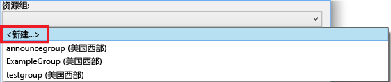
   
    此时将显示“创建资源组”对话框。 指定组的名称和位置，然后选择“创建”按钮。
   
    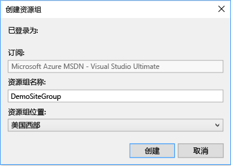
3. 选择“编辑参数”按钮以编辑部署的参数。
   
    
4. 提供空值参数的值，并选择“保存”按钮。 空值参数为 **hostingPlanName**、**administratorLogin**、**administratorLoginPassword** 和 **databaseName**。
   
    **hostingPlanName** 指定要创建的[应用服务计划](../app-service/azure-web-sites-web-hosting-plans-in-depth-overview.md)的名称。 
   
    **administratorLogin** 指定 SQL Server 管理员的用户名。 请勿使用常用的管理员名称，如 **sa** 或 **admin**。 
   
    **administratorLoginPassword** 指定 SQL Server 管理员的密码。 “在参数文件中以纯文本格式保存密码”选项不安全；所以，请勿选择此选项。 由于不以纯文本格式保存密码，因此在部署过程中需要再次提供此密码。 
   
    **databaseName** 指定要创建的数据库的名称。 
   
    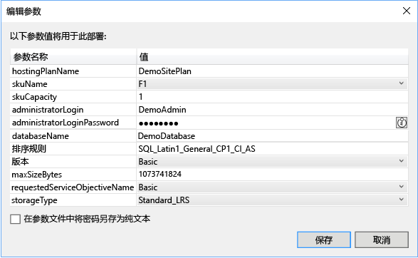
5. 选择“部署”按钮将项目部署到 Azure。 PowerShell 控制台将在 Visual Studio 实例外部打开。 出现密码输入提示时，在 PowerShell 控制台中输入 SQL Server 管理员密码。 **PowerShell 控制台可能隐藏在其他项目后面或最小化到任务栏。** 查找此控制台，选择它以提供密码。
   
   > [!NOTE]
   > Visual Studio 可能会要求安装 Azure PowerShell cmdlet。 需要安装 Azure PowerShell cmdlet 才能成功部署资源组。 如果出现提示，请安装 Azure PowerShell cmdlet。
   > 
   > 
6. 该部署可能需要几分钟时间。 在“输出”窗口中可查看部署状态。 完成部署后，最后一条消息指示部署成功，其内容与下面的消息类似：
   
        ... 
        18:00:58 - Successfully deployed template 'websitesqldatabase.json' to resource group 'DemoSiteGroup'.
7. 在浏览器中，打开 [Azure 门户](https://portal.azure.com/)并登录到你的帐户。 若要查看资源组，请选择“资源组”，然后选择已部署到的资源组。
   
    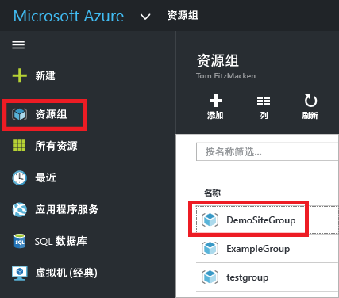
8. 将显示所有已部署的资源。 请注意，存储帐户的名称并不完全是添加资源时指定的名称。 存储帐户必须是唯一的。 模板自动向所提供的名称添加一个字符串，以便提供唯一名称。 
   
    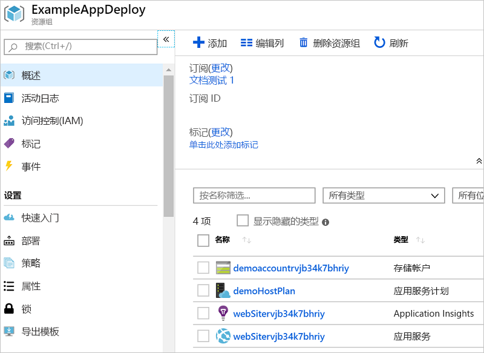
9. 如果做了更改并想要重新部署项目，可以从 Azure 资源组项目的快捷菜单中选择现有资源组。 在快捷菜单中，选择“部署”，然后选择已部署的资源组。
   
    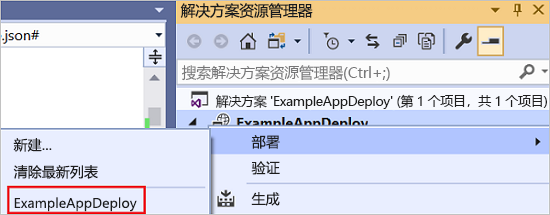

## 将代码与基础结构一起部署
此时，你已为应用部署基础结构，但尚未在项目中部署实际代码。 本文说明如何在部署期间部署 Web 应用和 SQL 数据库表。 如果是部署虚拟机而不是 Web 应用，你需要在部署过程中，在计算机上运行一些代码。 为 Web 应用部署代码的过程与设置虚拟机的过程几乎相同。

1. 将项目添加到 Visual Studio 解决方案。 右键单击解决方案，选择“添加” > “新建项目”。
   
    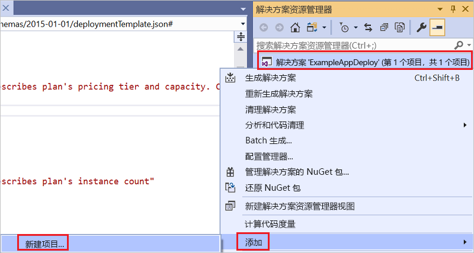
2. 添加 **ASP.NET Web 应用**。 
   
    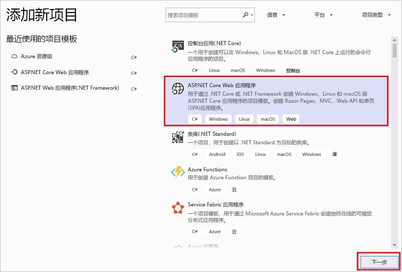
3. 选择 **MVC**。
   
    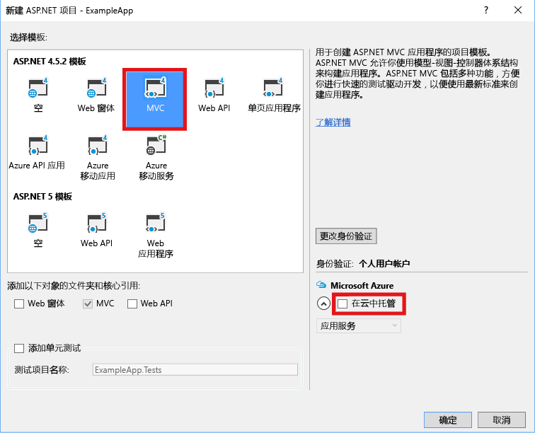
4. 在 Visual Studio 创建 Web 应用之后，可在解决方案中看到这两个项目。
   
    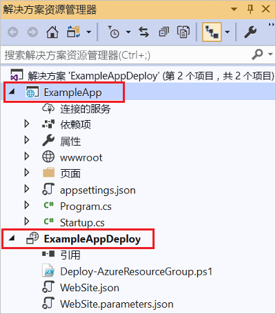
5. 现在，需要确保资源组项目与此新项目之间建立链接。 返回到资源组项目 (AzureResourceGroup1)。 右键单击“引用”，选择“添加引用”。
   
    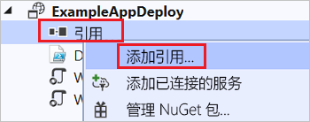
6. 选择创建的 Web 应用项目。
   
    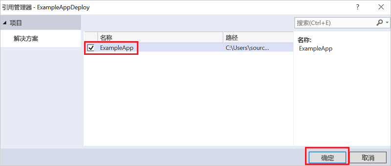
   
    通过添加引用，可以将 Web 应用项目链接到资源组项目中，并自动设置三个重要属性。 可以在“属性”窗口中看到针对该引用的属性。
   
      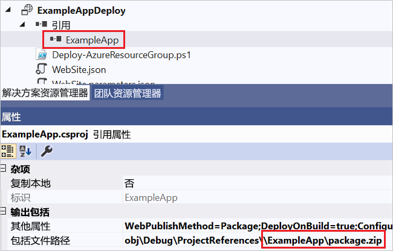
   
    属性包括：
   
   * “其他属性”包含要推送到 Azure 存储的 Web 部署包暂存位置。 请记下文件夹 (ExampleApp) 和文件 (package.zip)。 用户需要知道这些值，因为在部署应用时需提供这些值作为参数。 
   * “包含文件路径”包含创建包所在的路径。 “包含目标”包含部署执行的命令。 
   * 默认值“生成并打包”可让部署生成并创建 Web 部署包 (package.zip)  。  
     
     不需要使用发布配置文件，因为部署将从属性中获取所需的信息来创建包。
7. 返回到 WebSiteSQLDatabase.json，向模板添加资源。
   
    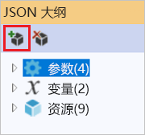
8. 这次选择“用于 Web 应用的 Web 部署”。 
   
    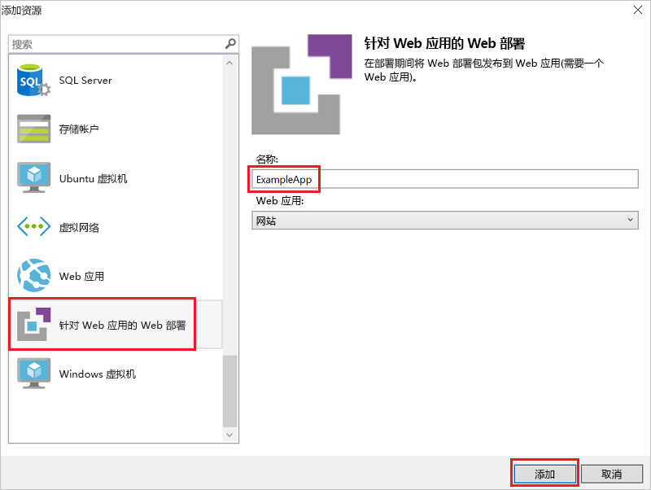
9. 将资源组项目重新部署到资源组。 这次还有一些新的参数。 不需要为 **_artifactsLocation** 或 **_artifactsLocationSasToken** 提供值，因为 Visual Studio 会自动生成这些值。 但是，必须将文件夹和文件名称设置为包含部署包的路径（在下图中显示为 **ExampleAppPackageFolder** 和 **ExampleAppPackageFileName**）。 提供之前在引用属性中看到的值（**ExampleApp** 和 **package.zip**）。
   
    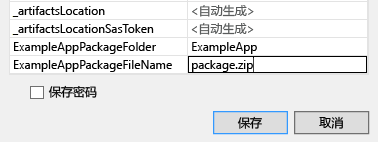
   
    对于“项目存储帐户”，选择部署此资源组时所用的帐户 。
10. 部署完毕后，请在门户中选择 Web 应用。 选择 URL 以浏览到此站点。
    
     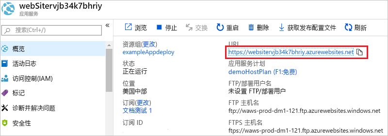
11. 请注意已成功部署默认的 ASP.NET 应用程序。
    
     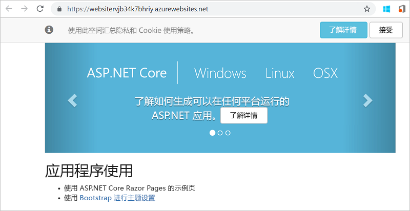

## 后续步骤
* 若要了解如何通过门户管理资源，请参阅[使用 Azure 门户管理 Azure 资源](resource-group-portal.md)。
* 若要详细了解模板，请参阅 [Authoring Azure Resource Manager templates](resource-group-authoring-templates.md)（创作 Azure Resource Manager 模板）。

