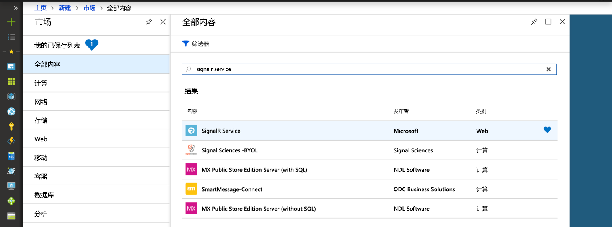
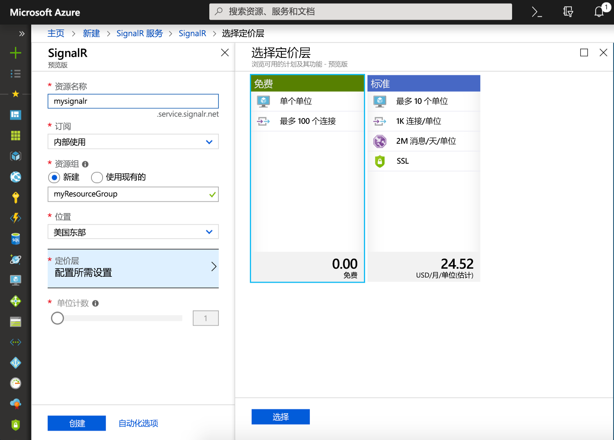

## 创建 Azure SignalR 服务实例

你的应用程序将连接到 Azure 中的 SignalR 服务实例。

1. 选择 Azure 门户左上角的“新建”按钮。 在“新建”屏幕中，在搜索框中键入“SignalR 服务”  ，然后按 Enter。

    

1. 从搜索结果中选择“SignalR 服务”  ，然后选择“创建”  。

1. 输入以下设置。

    | 设置      | 建议的值  | 说明                                        |
    | ------------ |  ------- | -------------------------------------------------- |
    | **资源名称** | 全局唯一名称 | 用于标识新的 SignalR 服务实例的名称。 有效的字符是 `a-z`、`0-9` 和 `-`。  | 
    | **订阅** | 订阅 | 在其下创建此新 SignalR 服务实例的订阅。 | 
    |  [资源组](../../azure-resource-manager/resource-group-overview.md) |  myResourceGroup | 要在其中创建 SignalR 服务实例的新资源组的名称。 | 
    | **位置** | 美国西部 | 选择你附近的[区域](https://azure.microsoft.com/regions/)。 |
    | **定价层** | 免费 | 免费试用 Azure SignalR 服务。 |
    | **单位计数** |  不适用 | 单位计数指定 SignalR 服务实例可以接受的连接数。 它只能在标准层中配置。 |
    | **服务模式** |  无服务器 | 用于 Azure Functions 或 REST API。 |

    

1. 选择“创建”  以开始部署 SignalR 服务实例。

1. 部署该实例后，在门户中打开它并找到其“设置”页。 仅当通过 Azure Functions 绑定或 REST API 使用 Azure SignalR 服务时，才将“服务模式”设置更改为“无服务器”  。 否则，将其保留在“经典”  或“默认”  中。