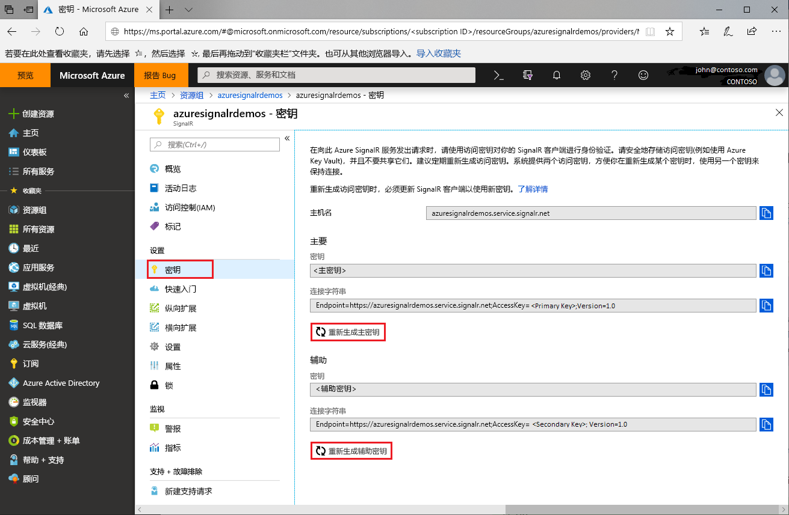

# Azure SignalR 服务的访问密钥轮换

每个 Azure SignalR 服务实例都有一对访问密钥：主要密钥和辅助密钥。 向服务发出请求时，这些密钥用于对 SignalR 客户端进行身份验证。 密钥与实例终结点 URL 相关联。 请保护好密钥并定期轮换。 你有两个访问密钥，因此，在重新生成其中的一个密钥时，可以使用另一个密钥来保持连接。

## 为何要轮换访问密钥？

出于安全原因和法规遵从要求，我们建议开发人员定期轮换访问密钥。

## 如何重新生成访问密钥？

1. 转到 [Azure 门户](https://portal.azure.com/)并使用自己的凭据登录。

1. 在要为其重新生成密钥的 Azure SignalR 服务实例中找到“密钥”部分。

1. 在导航菜单中单击“密钥”。

1. 单击“重新生成主要密钥”或“重新生成辅助密钥”。

随后将会创建并显示新的密钥和相应的连接字符串。

 

也可以使用 [Azure CLI](/cli/azure/ext/signalr/signalr/key?view=azure-cli-latest#ext-signalr-az-signalr-key-renew) 重新生成密钥。

## 使用新的连接字符串更新配置

1. 复制新生成的连接字符串。

1. 将所有配置更新为使用新连接字符串。

1. 根据需要重启应用程序。

## 强制重新生成访问密钥

在某些情况下，Azure SignalR 服务可能会强制要求重新生成访问密钥。 服务会通过电子邮件和门户通知告诉客户。 如果你收到此信件或者遇到访问密钥导致的服务故障，请遵照本指南轮换密钥。

## 后续步骤

我们建议定期轮换访问密钥，这是一种良好的安全做法。

本指南介绍了如何重新生成访问密钥。 请继续学习后续教程，了解如何使用 OAuth 或 Azure Functions 进行身份验证。

> [!div class="nextstepaction"]
> [与 ASP.NET Core 标识集成](./signalr-authenticate-oauth.md)

> [!div class="nextstepaction"]
> [生成带身份验证的无服务器实时应用](./signalr-authenticate-azure-functions.md)