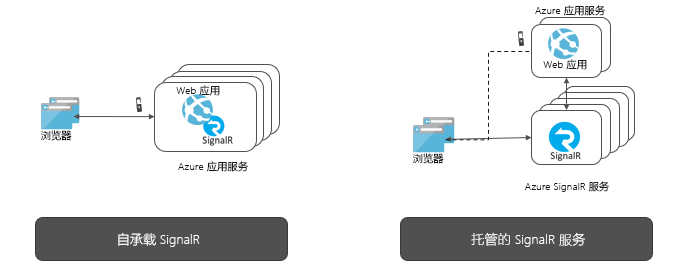

# 什么是 Azure SignalR 服务？

Azure SignalR Service 简化了通过 HTTP 向应用程序添加实时 Web 功能的过程。 这种实时功能允许服务将内容更新推送到连接的客户端，例如单页 Web 或移动应用程序。 因此，无需轮询服务器，或提交针对更新的新 HTTP 请求，即可更新客户端。

本文简要介绍了 Azure SignalR Service。

## Azure SignalR Service 的用途是什么？

需要将数据从服务器实时推送到客户端的任何方案都可以使用 Azure SignalR 服务。

通常需要轮询服务器的传统实时功能也可以使用 Azure SignalR 服务。

Azure SignalR 服务已在各种行业中使用，适用于需要实时内容更新的任何应用类型。 下面是适合使用 Azure SignalR 服务的一些示例：

* **高频率数据更新：** 游戏、投票、轮询、竞拍。
* **仪表板和监视：** 公司仪表板、金融市场数据、即时销量更新、多玩家游戏排行榜和 IoT 监视。
* **聊天：** 实时聊天室、聊天机器人、在线客户支持、实时购物助手、信使、游戏内聊天，等等。
* **地图实时定位：** 物流跟踪、交货状态跟踪、运输状态更新、GPS 应用。
* **实时定向广告：** 个性化的实时推送广告和套餐、交互式广告。
* **协作式应用：** 共同著作、白板应用和团队会议软件。
* **推送通知：** 社交网络、电子邮件、游戏、行程通知。
* **实时广播：** 实时音频/视频广播、实时字幕、翻译、活动/新闻广播。
* **IoT 和互联设备：** 实时 IoT 指标、远程控制、实时状态和位置跟踪。
* **自动化：** 基于上游事件的实时触发器。

## 使用 Azure SignalR 服务的优势是什么？

**基于标准：**

SignalR 提供用于生成实时 Web 应用程序的多种技术的抽象概念。 [Websocket](https://wikipedia.org/wiki/WebSocket) 是最佳传输，但在其他选项不可用时，则使用[服务器发送事件 (SSE)](https://wikipedia.org/wiki/Server-sent_events) 和长轮询等其他技术。 基于服务器和客户端上受支持的功能，SignalR 自动检测并初始化合适的传输。

**本机 ASP.NET Core 支持：**

SignalR 服务通过 ASP.NET Core 和 ASP.NET 提供本机编程体验。 使用 SignalR 服务开发新的 SignalR 应用程序，或者从基于现有 SignalR 的应用程序迁移到 SignalR 服务只需付出少量的精力。
SignalR 服务还支持 ASP.NET Core 的新功能：服务器端 Blazor。

**广泛的客户端支持：**

SignalR 服务适用于广泛的客户端，例如 Web 和移动浏览器、桌面应用、移动应用、服务器进程、IoT 设备和游戏控制台。 SignalR 服务以不同的语言提供 SDK。 除了本机 ASP.NET Core 或 ASP.NET C# SDK 以外，SignalR 服务还提供 JavaScript 客户端 SDK 来支持 Web 客户端和许多 JavaScript 框架。 Java 客户端 SDK 还支持 Java 应用程序，包括 Android 本机应用。 SignalR 服务支持 REST API，与 Azure Functions 和事件网格集成后无需服务器。

**处理大规模客户端连接：**

SignalR 服务是针对大规模实时应用程序设计的。 SignalR 服务允许多个实例配合工作，扩展到数百万个客户端连接。 该服务还支持多个全局区域，以实现分片、高可用性或灾难恢复目的。

**消除了自承载 SignalR 的负担：**

与自承载 SignalR 应用程序相比，改用 SignalR 服务后，无需管理用于处理规模和客户端连接的后端平面。 完全托管的服务还简化了 Web 应用程序并节省了托管成本。 SignalR 服务覆盖全球，提供一流的数据中心和网络，可扩展到数百万个连接，附带 SLA 保障，并且符合 Azure 的所有合规与安全标准。

**为不同的消息传送模式提供丰富的 API：**

SignalR 服务允许服务器将消息发送到特定的连接、所有连接或属于特定用户或已放置在任意组中的连接子集。

## 如何使用 Azure SignalR Service

可通过多种不同的方式对 Azure SignalR 服务编程，下面列出了一些示例：

- [扩展 ASP.NET Core SignalR 应用](signalr-concept-scale-aspnet-core.md) - 将 Azure SignalR Service 与ASP.NET Core SignalR 应用程序集成，以扩展到成千上万的连接  。
- [生成无服务器的实时应用](signalr-concept-azure-functions.md) - 使用 Azure Functions 与 Azure SignalR Service 的集成，以 JavaScript、C# 和 Java 等语言生成无服务器的实时应用  。
- [通过 REST API 将消息从服务器发送到客户端](https://github.com/Azure/azure-signalr/blob/dev/docs/rest-api.md) - Azure SignalR Service 提供的 REST API 使应用程序能够以任何支持 REST 的编程语言向使用 SignalR Service 连接的客户端发送消息  。
