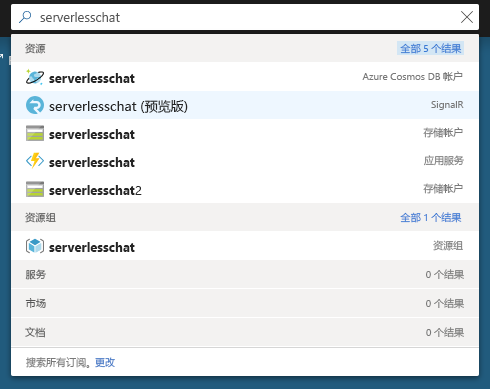
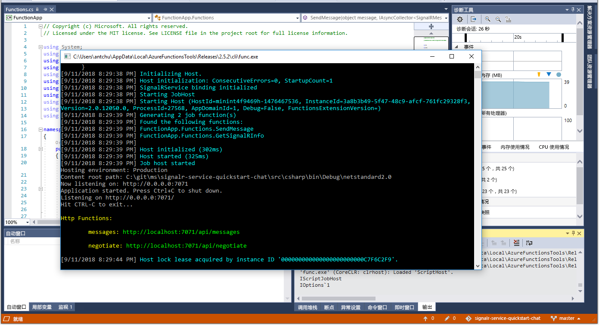

# <a name="quickstart-create-a-chat-room-with-azure-functions-and-signalr-service-using-c"></a>快速入门：使用 C\# 通过 Azure Functions 和 SignalR 服务创建聊天室

使用 Azure SignalR 服务可以轻松地将实时功能添加到应用程序。 Azure Functions 是一个无服务器平台，可让你在不管理任何基础结构的情况下运行代码。 本快速入门介绍了如何使用 SignalR 服务和 Functions 构建无服务器的实时聊天应用程序。

## <a name="prerequisites"></a>先决条件

如果尚未安装 Visual Studio 2017，可以下载并使用**免费的** [Visual Studio 2017 Community Edition](https://www.visualstudio.com/downloads/)。 在安装 Visual Studio 的过程中，请确保启用“Azure 开发”。

也可以使用 [Azure Functions Core Tools (v2)](https://github.com/Azure/azure-functions-core-tools#installing)、[.NET Core SDK](https://dotnet.microsoft.com/download) 以及你喜欢的代码编辑器在命令行（macOS、Windows 或 Linux）上运行本教程。

[!INCLUDE [quickstarts-free-trial-note](../../includes/quickstarts-free-trial-note.md)]

## <a name="log-in-to-azure"></a>登录 Azure

使用 Azure 帐户登录到 <https://portal.azure.com/> 的 Azure 门户。

[!INCLUDE [Create instance](includes/signalr-quickstart-create-instance.md)]

[!INCLUDE [Clone application](includes/signalr-quickstart-clone-application.md)]

## <a name="configure-and-run-the-azure-function-app"></a>配置和运行 Azure 函数应用

1. 启动 Visual Studio（或其他代码编辑器），并打开所克隆存储库的 *src/chat/csharp* 文件夹中的解决方案。

1. 在打开 Azure门户的浏览器中，通过在门户顶部的搜索框中搜索先前部署的 SignalR 服务实例的名称，确认该实例已成功创建。 选择该实例以将其打开。

    

1. 选择“密钥”以查看 SignalR 服务实例的连接字符串。

1. 选择并复制主连接字符串。

1. 返回到 Visual Studio 中，在解决方案资源管理器中，将 *local.settings.sample.json* 重命名 *local.settings.json*。

1. 在 **local.settings.json** 中，将连接字符串粘贴到 **AzureSignalRConnectionString** 设置的值中。 保存文件。

1. 打开 **Functions.cs**。 此函数应用中有两个 HTTP 触发的函数：

    - **GetSignalRInfo** - 使用 *SignalRConnectionInfo* 输入绑定来生成并返回有效的连接信息。
    - **SendMessage** - 在请求正文中接收聊天消息，并使用 *SignalR* 输出绑定将消息广播到所有连接的客户端应用程序。

1. 使用以下选项之一在本地启动 Azure 函数应用。

    - **Visual Studio**：在“调试”菜单中，选择“开始调试”以运行应用程序。

        

    - **命令行**：执行以下命令以启动函数主机。

        ```bash
        func start
        ```

[!INCLUDE [Run web application](includes/signalr-quickstart-run-web-application.md)]

[!INCLUDE [Cleanup](includes/signalr-quickstart-cleanup.md)]

## <a name="next-steps"></a>后续步骤

在本快速入门中，你在 Visual Studio 中生成并运行了一个实时无服务器应用程序。 接下来，详细了解如何使用 Visual Studio 开发和部署 Azure Functions。

> [!div class="nextstepaction"]
> [使用 Visual Studio 开发 Azure Functions](../azure-functions/functions-develop-vs.md)