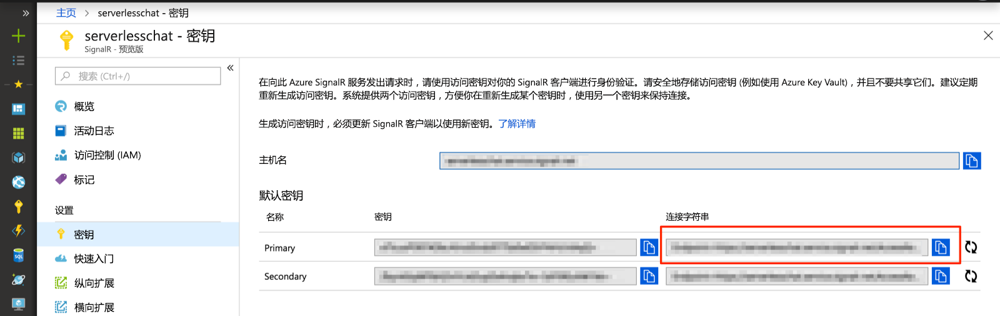

# <a name="quickstart-create-a-chat-room-with-azure-functions-and-signalr-service-using-java"></a>快速入门：使用 Java 通过 Azure Functions 和 SignalR 服务创建聊天室

使用 Azure SignalR 服务可以轻松地将实时功能添加到应用程序。 Azure Functions 是一个无服务器平台，可让你在不管理任何基础结构的情况下运行代码。 本快速入门介绍了如何使用 SignalR 服务和 Functions 构建无服务器的实时聊天应用程序。

## <a name="prerequisites"></a>先决条件

本快速入门可以在 macOS、Windows 或 Linux 上运行。

确保已安装了代码编辑器，例如 [Visual Studio Code](https://code.visualstudio.com/)。

安装 [Azure Functions Core Tools (v2)](https://github.com/Azure/azure-functions-core-tools#installing)，以便在本地运行 Azure Functions 应用。

> [!NOTE]
> 若要在 Java 中使用 SignalR 服务绑定，请确保使用的是 Azure Functions Core Tools（主机版本 2.0.12332）2.4.419 版或更高版本。

为了安装扩展，Azure Functions Core Tools 目前需要安装 [.NET Core SDK](https://www.microsoft.com/net/download)。 但是，构建 JavaScript Azure Function 应用不需要了解 .NET。

若要通过 Java 开发函数应用，必须安装以下软件：

* [Java 开发人员工具包](https://www.azul.com/downloads/zulu/)，版本 8。
* [Apache Maven](https://maven.apache.org) 3.0 或更高版本。

[!INCLUDE [quickstarts-free-trial-note](../../includes/quickstarts-free-trial-note.md)]

## <a name="log-in-to-azure"></a>登录 Azure

使用 Azure 帐户登录到 <https://portal.azure.com/> 的 Azure 门户。

[!INCLUDE [Create instance](includes/signalr-quickstart-create-instance.md)]

[!INCLUDE [Clone application](includes/signalr-quickstart-clone-application.md)]

## <a name="configure-and-run-the-azure-function-app"></a>配置和运行 Azure 函数应用

1. 在打开 Azure门户的浏览器中，通过在门户顶部的搜索框中搜索先前部署的 SignalR 服务实例的名称，确认该实例已成功创建。 选择该实例以将其打开。

    

1. 选择“密钥”以查看 SignalR 服务实例的连接字符串。

1. 选择并复制主连接字符串。

    

1. 在代码编辑器中，打开克隆存储库中的 *src/chat/java* 文件夹。

1. 将 *local.settings.sample.json* 重命名为 *local.settings.json*。

1. 在 **local.settings.json** 中，将连接字符串粘贴到 **AzureSignalRConnectionString** 设置的值中。 保存文件。

1. 包含这些函数的主文件位于 *src/chat/java/src/main/java/com/function/Functions.java* 中：

    - **negotiate** - 使用 *SignalRConnectionInfo* 输入绑定生成并返回有效的连接信息。
    - **sendMessage** - 在请求正文中接收聊天消息，并使用 *SignalR* 输出绑定将消息广播到所有连接的客户端应用程序。

1. 在终端中，确保你位于 *src/chat/java* 文件夹中。 生成函数应用。

    ```bash
    mvn clean package
    ```

1. 在本地运行函数应用。

    ```bash
    mvn azure-functions:run
    ```

[!INCLUDE [Run web application](includes/signalr-quickstart-run-web-application.md)]

[!INCLUDE [Cleanup](includes/signalr-quickstart-cleanup.md)]

## <a name="next-steps"></a>后续步骤

在本快速入门中，使用 Maven 生成并运行了一个实时无服务器应用程序。 接下来，了解如何从头开始创建 Java Azure Functions。

> [!div class="nextstepaction"]
> [使用 Java 和 Maven 创建第一个函数](../azure-functions/functions-create-first-java-maven.md)