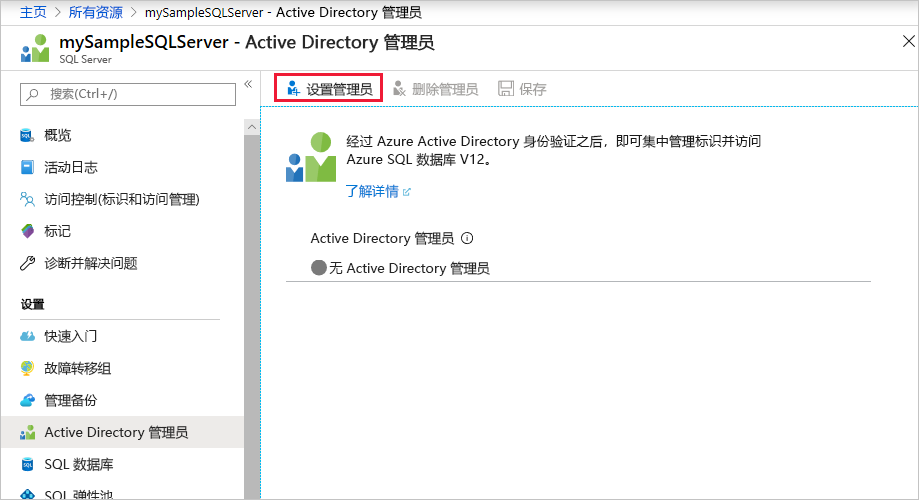
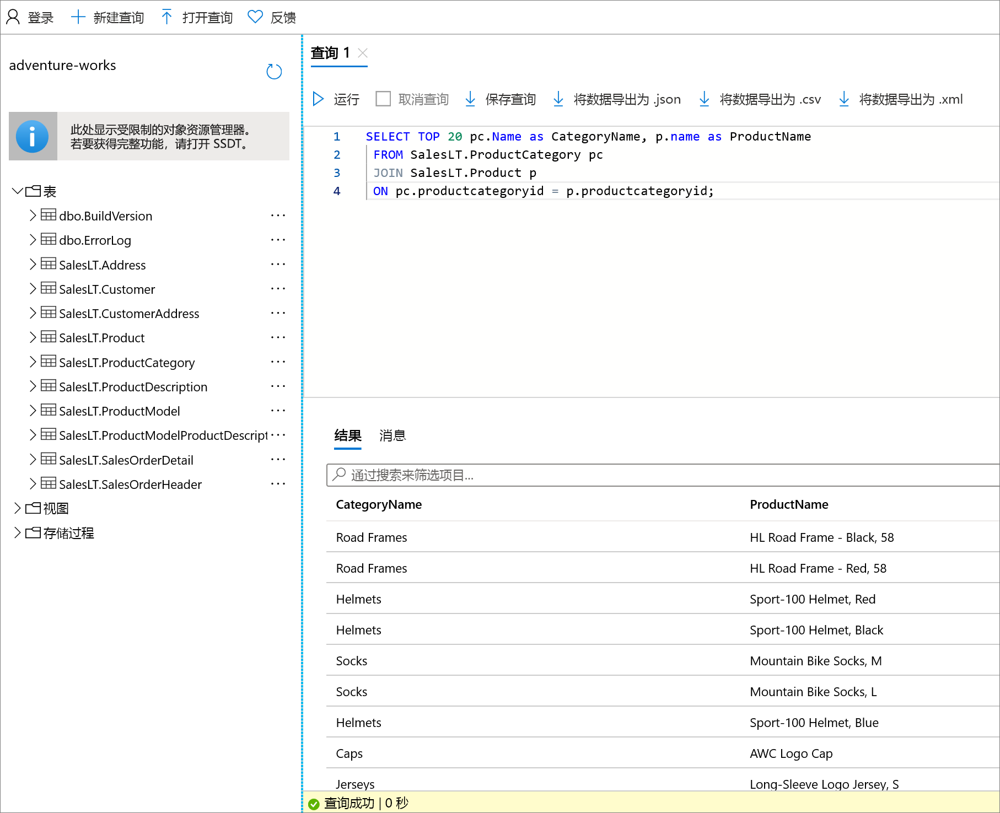

# <a name="quickstart-use-the-azure-portals-query-editor-preview-to-query-an-azure-sql-database"></a>快速入门：使用 Azure 门户的查询编辑器（预览）查询 Azure SQL 数据库
[!INCLUDE[appliesto-sqldb](../includes/appliesto-sqldb.md)]

查询编辑器是 Azure 门户中的一个工具，用于针对 Azure SQL 数据库中的数据库或 Azure Synapse Analytics 中的数据仓库运行 SQL 查询。 

在本快速入门中，你将使用查询编辑器针对数据库运行 Transact-SQL (T-SQL) 查询。

## <a name="prerequisites"></a>先决条件

需要 AdventureWorksLT 示例数据库才能完成本快速入门。 如果你没有 SQL 数据库中的 AdventureWorksLT 示例数据库的有效副本，请参阅以下快速入门快速创建一个副本：

- [快速入门：使用 Azure 门户、PowerShell 或 Azure CLI 创建 Azure SQL 数据库中的数据库](single-database-create-quickstart.md) 

### <a name="configure-network-settings"></a>配置网络设置

如果查询编辑器中出现以下错误之一：“本地网络设置可能正在阻止查询编辑器发出查询。请单击此处了解有关如何配置网络设置的说明”，或“无法与服务器建立连接。这可能表示本地防火墙配置或网络代理设置存在问题”，以下重要信息可帮助解决此问题：

> [!IMPORTANT]
> 查询编辑器使用端口 443 和 1443 进行通信。 确保已在这些端口上启用出站 HTTPS 流量。 还需要[将出站 IP 地址添加到服务器的允许防火墙规则中](firewall-create-server-level-portal-quickstart.md)，以访问数据库和数据仓库。


## <a name="open-the-sql-database-query-editor"></a>打开 SQL 数据库查询编辑器

1. 登录到 [Azure 门户](https://portal.azure.com/)并选择要查询的数据库。

2. 在“SQL 数据库”菜单中，选择“查询编辑器(预览)” 。

    


## <a name="establish-a-connection-to-the-database"></a>与数据库建立连接

即使已登录到门户，也仍需提供凭据才能访问数据库。 可以使用 SQL 身份验证或 Azure Active Directory 连接到数据库。

### <a name="connect-using-sql-authentication"></a>使用 SQL 身份验证进行连接

1. 在“登录”页上的“SQL Server 身份验证”下，输入有权访问数据库的用户的**登录名**和**密码**。  如果你不确定，请使用数据库服务器的服务器管理员的登录名和密码。

    

2. 选择“确定”。


### <a name="connect-using-azure-active-directory"></a>使用 Azure Active Directory 进行连接

配置一个 Azure Active Directory (Azure AD) 管理员即可使用单个标识登录到 Azure 门户和数据库。 若要使用 Azure AD 连接到数据库，请遵循以下步骤配置 SQL Server 实例的 Azure AD 管理员。

> [!NOTE]
> * Azure AD 管理员尚不支持电子邮件帐户（例如，outlook.com、gmail.com、yahoo.com 等）。 请确保选择在 Azure AD 中本机创建或联合到 Azure AD 中的用户。
> * Azure AD 管理员登录不适用于已启用双因素身份验证的帐户。

#### <a name="set-an-active-directory-admin-for-the-server"></a>为服务器设置 Active Directory 管理员

1. 在 Azure 门户中选择你的 SQL Server 实例。

2. 在“SQL Server”菜单中选择“Active Directory 管理员”。 

3. 在 SQL Server 的“Active Directory 管理员”页工具栏中选择“设置管理员”，然后选择充当 Azure AD 管理员的用户或组。 

    

4. 在“添加管理员”页上的搜索框中，输入要查找的用户或组，选择其作为管理员，然后选择“选择”按钮。 

5. 返回 SQL Server“Active Directory 管理员”页工具栏中，选择“保存” 。

### <a name="connect-to-the-database"></a>连接到数据库

6. 在“SQL Server”菜单中，选择“SQL 数据库”，然后选择数据库 。

7. 在“SQL 数据库”菜单中，选择“查询编辑器(预览)” 。 在“登录”页面中的“Active Directory 身份验证”标签下，将显示一条消息，说明你已登录（如果你是 Azure AD 管理员） 。然后选择“以 \<your user or group ID> 继续”按钮。 如果页面中指出你未成功登录，可能需要刷新页面。

## <a name="query-a-database-in-sql-database"></a>在 SQL 数据库中查询数据库

以下示例查询应该针对 AdventureWorksLT 示例数据库成功运行。

### <a name="run-a-select-query"></a>运行 SELECT 查询

1. 将以下查询粘贴到查询编辑器中：

   ```sql
    SELECT TOP 20 pc.Name as CategoryName, p.name as ProductName
    FROM SalesLT.ProductCategory pc
    JOIN SalesLT.Product p
    ON pc.productcategoryid = p.productcategoryid;
   ```

2. 选择“运行”，然后查看“结果”窗格中的输出。 

   

3. （可选）可将查询另存为 .sql 文件，或者将返回的数据导出为 .json、.csv 或 .xml 文件。

### <a name="run-an-insert-query"></a>运行 INSERT 查询

运行以下 [INSERT](/sql/t-sql/statements/insert-transact-sql/) T-SQL 语句，以将新产品添加到 `SalesLT.Product` 表中。

1. 将之前的查询替换为此查询。

    ```sql
    INSERT INTO [SalesLT].[Product]
           ( [Name]
           , [ProductNumber]
           , [Color]
           , [ProductCategoryID]
           , [StandardCost]
           , [ListPrice]
           , [SellStartDate]
           )
    VALUES
           ('myNewProduct'
           ,123456789
           ,'NewColor'
           ,1
           ,100
           ,100
           ,GETDATE() );
   ```


2. 选择“运行”在 `Product` 表中插入新行。 “消息”窗格显示“查询已成功：受影响的行：1” **。**


### <a name="run-an-update-query"></a>运行 UPDATE 查询

运行以下 [UPDATE](/sql/t-sql/queries/update-transact-sql/) T-SQL 语句以修改新产品。

1. 将之前的查询替换为此查询。

   ```sql
   UPDATE [SalesLT].[Product]
   SET [ListPrice] = 125
   WHERE Name = 'myNewProduct';
   ```

2. 选择“运行”更新 `Product` 表中的指定行。 “消息”窗格显示“查询已成功：受影响的行：1” **。**

### <a name="run-a-delete-query"></a>运行 DELETE 查询

运行以下 [DELETE](/sql/t-sql/statements/delete-transact-sql/) T-SQL 语句以删除新产品。

1. 将之前的查询替换为此查询：

   ```sql
   DELETE FROM [SalesLT].[Product]
   WHERE Name = 'myNewProduct';
   ```

2. 选择“运行”删除 `Product` 表中的指定行。 “消息”窗格显示“查询已成功：受影响的行：1” **。**


## <a name="query-editor-considerations"></a>查询编辑器注意事项

使用查询编辑器时，需要注意以下要点。

* 查询编辑器使用端口 443 和 1443 进行通信。 确保已在这些端口上启用出站 HTTPS 流量。 还需要将出站 IP 地址添加到服务器的允许防火墙规则中，以访问你的数据库和数据仓库。

* 如果有“专用链接”连接，则可使用查询编辑器而无需将客户端 IP 地址添加到 SQL 数据库防火墙中。

* 按 **F5** 刷新查询编辑器页，任何正在处理的查询都将丢失。

* 查询编辑器不支持连接到 `master` 数据库。

* 查询执行的超时为 5 分钟。

* 查询编辑器仅支持地理数据类型的柱面投影。

* 数据库表和视图不支持 IntelliSense，但编辑器支持自动补全已键入的名称。


## <a name="next-steps"></a>后续步骤

若要详细了解 Azure SQL 数据库支持的 Transact-SQL (T-SQL)，请参阅[解决迁移到 SQL 数据库过程中的 Transact-SQL 差异](transact-sql-tsql-differences-sql-server.md)。
