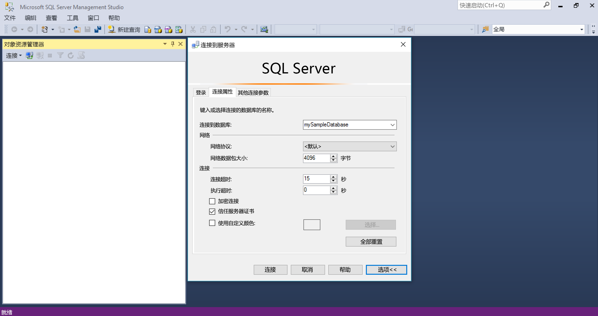
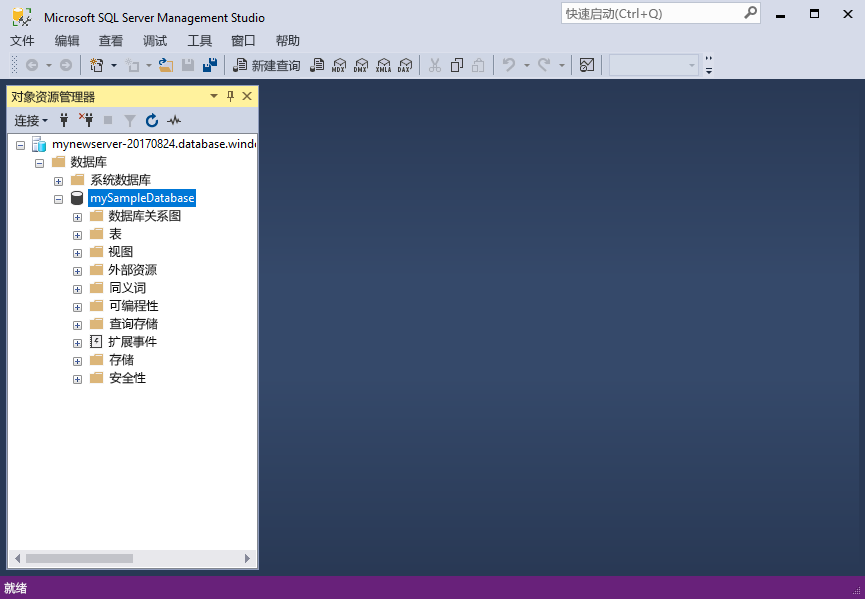
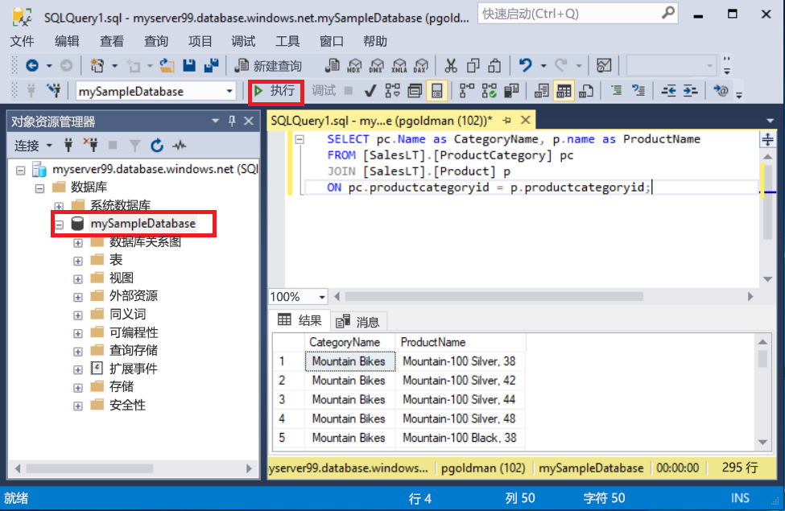
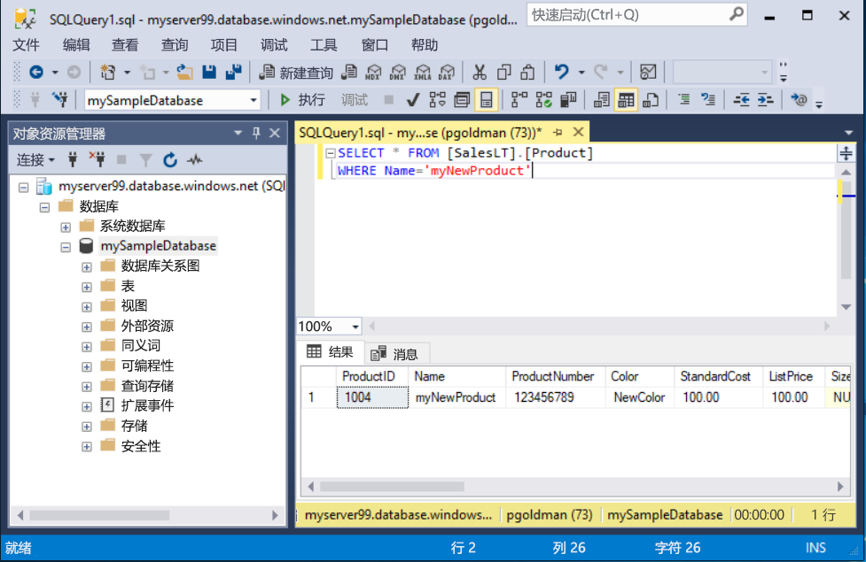

# <a name="quickstart-use-ssms-to-connect-to-and-query-azure-sql-database-or-azure-sql-managed-instance"></a>快速入门：使用 SSMS 连接到并查询 Azure SQL 数据库或 Azure SQL 托管实例
[!INCLUDE[appliesto-sqldb-sqlmi](../includes/appliesto-sqldb-sqlmi.md)]

本快速入门介绍如何使用 SQL Server Management Studio (SSMS) 连接到 Azure SQL 数据库或 Azure SQL 托管实例并运行一些查询。

## <a name="prerequisites"></a>先决条件

完成本快速入门需要以下各项：

- [SQL Server Management Studio (SSMS)](/sql/ssms/download-sql-server-management-studio-ssms/)。

- Azure SQL 数据库中的数据库。 可以根据下述快速入门之一，在 Azure SQL 数据库中创建数据库，然后对其进行配置：

  | 操作 | SQL 数据库 | SQL 托管实例 | Azure VM 上的 SQL Server |
  |:--- |:--- |:---|:---|
  | 创建| [Portal](single-database-create-quickstart.md) | [Portal](../managed-instance/instance-create-quickstart.md) | [门户](../virtual-machines/windows/sql-vm-create-portal-quickstart.md)
  || [CLI](scripts/create-and-configure-database-cli.md) | [CLI](https://medium.com/azure-sqldb-managed-instance/working-with-sql-managed-instance-using-azure-cli-611795fe0b44) |
  || [PowerShell](scripts/create-and-configure-database-powershell.md) | [PowerShell](../managed-instance/scripts/create-configure-managed-instance-powershell.md) | [PowerShell](../virtual-machines/windows/sql-vm-create-powershell-quickstart.md)
  | 配置 | [服务器级别 IP 防火墙规则](firewall-create-server-level-portal-quickstart.md)| [从 VM 进行连接](../managed-instance/connect-vm-instance-configure.md)|
  |||[从现场进行连接](../managed-instance/point-to-site-p2s-configure.md) | [连接到 SQL Server](../virtual-machines/windows/sql-vm-create-portal-quickstart.md)
  |加载数据|根据快速入门加载的 Adventure Works|[还原 Wide World Importers](../managed-instance/restore-sample-database-quickstart.md) | [还原 Wide World Importers](../managed-instance/restore-sample-database-quickstart.md) |
  |||从 [GitHub](https://github.com/Microsoft/sql-server-samples/tree/master/samples/databases/adventure-works) 所提供的 [BACPAC](database-import.md) 文件还原或导入 Adventure Works| 从 [GitHub](https://github.com/Microsoft/sql-server-samples/tree/master/samples/databases/adventure-works) 所提供的 [BACPAC](database-import.md) 文件还原或导入 Adventure Works|
  |||

  > [!IMPORTANT]
  > 本文中脚本的编写目的是使用 Adventure Works 数据库。 使用托管实例时，必须将 Adventure Works 数据库导入一个实例数据库，或者修改本文中的脚本，以便使用 Wide World Importers 数据库。

如果只是想要在不安装 SSMS 的情况下运行某些即席查询，请参阅[快速入门：使用 Azure 门户的查询编辑器查询 Azure SQL 数据库中的数据库](connect-query-portal.md)。

## <a name="get-server-connection-information"></a>获取服务器连接信息

获取连接到数据库所需的连接信息。 需要提供完全限定的[服务器](logical-servers.md)名称或主机名称、数据库名称和登录信息才能完成本快速入门。

1. 登录 [Azure 门户](https://portal.azure.com/)。

2. 导航到要查询的“数据库”或“托管实例”。

3. 在“概述”页上，在“Server 名称”旁查看 SQL 数据库中的数据库的完全限定服务器名称，或在“Host”旁边查看 VM 上 SQL 托管实例中或 SQL Server 实例中的托管实例的完全限定服务器名称（或 IP 地址）  。 若要复制服务器名称或主机名称，请将鼠标悬停在其上方，然后选择“复制”图标。

> [!NOTE]
> 有关 Azure VM 上的 SQL Server 的连接信息，请参阅[连接到 SQL Server](../virtual-machines/windows/sql-vm-create-portal-quickstart.md#connect-to-sql-server)

## <a name="connect-to-your-database"></a>连接到数据库

[!INCLUDE[ssms-connect-azure-ad](../includes/ssms-connect-azure-ad.md)]

在 SSMS 中连接至服务器。

> [!IMPORTANT]
> 服务器在端口 1433 上进行侦听。 若要从公司防火墙后连接到服务器，该防火墙必须打开此端口。

1. 打开 SSMS。

2. 此时会显示“连接到服务器”对话框。 输入以下信息：

   | 设置      | 建议的值    | 说明 |
   | ------------ | ------------------ | ----------- |
   | **服务器类型** | 数据库引擎 | 所需的值。 |
   | **服务器名称** | 完全限定的服务器名称 | 类似于 **servername.database.windows.net**。 |
   | **身份验证** | SQL Server 身份验证 | 本教程使用 SQL 身份验证。 |
   | **登录** | 服务器管理员帐户用户 ID | 用于创建服务器的服务器管理员帐户的用户 ID。 |
   | **密码** | 服务器管理员帐户密码 | 用于创建服务器的服务器管理员帐户的密码。 |
   ||||

     

> [!NOTE]
> 本教程使用 SQL Server 身份验证。

3. 选择“连接到服务器”对话框中的“选项” 。 在“连接到数据库”下拉菜单中，选择“mySampleDatabase” 。 完成[“先决条件”部分](#prerequisites)中的快速入门即可创建一个名为 mySampleDatabase 的 AdventureWorksLT 数据库。 如果 AdventureWorks 数据库的工作副本名称不同于 mySampleDatabase，请改为选择它。

     

4. 选择“连接” 。 此时会打开“对象资源管理器”窗口。

5. 若要查看数据库的对象，请展开“数据库”，然后展开你的数据库节点。

     

## <a name="query-data"></a>查询数据

运行此 [SELECT](/sql/t-sql/queries/select-transact-sql/) Transact-SQL 代码，按类别查询前 20 个产品。

1. 在对象资源管理器中，右键单击“mySampleDatabase”，并选择“新建查询” 。 此时会打开一个连接到数据库的新查询窗口。

2. 在查询窗口中粘贴以下 SQL 查询：

   ```sql
   SELECT pc.Name as CategoryName, p.name as ProductName
   FROM [SalesLT].[ProductCategory] pc
   JOIN [SalesLT].[Product] p
   ON pc.productcategoryid = p.productcategoryid;
   ```

3. 在工具栏上选择“执行”，以便运行查询并从 `Product` 和 `ProductCategory` 表检索数据。

    

### <a name="insert-data"></a>插入数据

运行此 [INSERT](/sql/t-sql/statements/insert-transact-sql/) Transact-SQL 代码，在 `SalesLT.Product` 表中创建新产品。

1. 将之前的查询替换为此查询。

   ```sql
   INSERT INTO [SalesLT].[Product]
           ( [Name]
           , [ProductNumber]
           , [Color]
           , [ProductCategoryID]
           , [StandardCost]
           , [ListPrice]
           , [SellStartDate] )
     VALUES
           ('myNewProduct'
           ,123456789
           ,'NewColor'
           ,1
           ,100
           ,100
           ,GETDATE() );
   ```

2. 选择“执行”在 `Product` 表中插入新行。 “消息”面板显示“(受影响的 1 行)” 。

#### <a name="view-the-result"></a>查看结果

1. 将之前的查询替换为此查询。

   ```sql
   SELECT * FROM [SalesLT].[Product]
   WHERE Name='myNewProduct'
   ```

2. 选择“执行”。 将显示以下结果。

   

### <a name="update-data"></a>更新数据

运行此 [UPDATE](/sql/t-sql/queries/update-transact-sql) Transact-SQL 代码以修改新产品。

1. 将上一个查询替换为此查询，以便返回前面创建的新记录：

   ```sql
   UPDATE [SalesLT].[Product]
   SET [ListPrice] = 125
   WHERE Name = 'myNewProduct';
   ```

2. 选择“执行”更新 `Product` 表中的指定行。 “消息”面板显示“(受影响的 1 行)” 。

### <a name="delete-data"></a>删除数据

运行此 [DELETE](/sql/t-sql/statements/delete-transact-sql/) Transact-SQL 代码以删除新产品。

1. 将之前的查询替换为此查询。

   ```sql
   DELETE FROM [SalesLT].[Product]
   WHERE Name = 'myNewProduct';
   ```

2. 选择“执行”删除 `Product` 表中的指定行。 “消息”面板显示“(受影响的 1 行)” 。

## <a name="next-steps"></a>后续步骤

- 有关 SSMS 的信息，请参阅 [SQL Server Management Studio](/sql/ssms/sql-server-management-studio-ssms/)。
- 若要使用 Azure 门户进行连接和查询，请参阅[使用 Azure 门户 SQL 查询编辑器进行连接和查询](connect-query-portal.md)。
- 若要使用 Visual Studio Code 进行连接和查询，请参阅[使用 Visual Studio Code 进行连接和查询](connect-query-vscode.md)。
- 若要使用 .NET 进行连接和查询，请参阅[使用 .NET 进行连接和查询](connect-query-dotnet-visual-studio.md)。
- 若要使用 PHP 进行连接和查询，请参阅[使用 PHP 进行连接和查询](connect-query-php.md)。
- 若要使用 Node.js 进行连接和查询，请参阅[使用 Node.js 进行连接和查询](connect-query-nodejs.md)。
- 若要使用 Java 进行连接和查询，请参阅[使用 Java 进行连接和查询](connect-query-java.md)。
- 若要使用 Python 进行连接和查询，请参阅[使用 Python 进行连接和查询](connect-query-python.md)。
- 若要使用 Ruby 进行连接和查询，请参阅[使用 Ruby 进行连接和查询](connect-query-ruby.md)。
