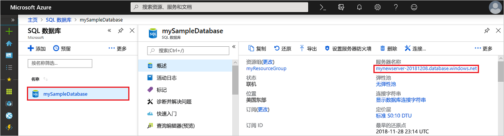
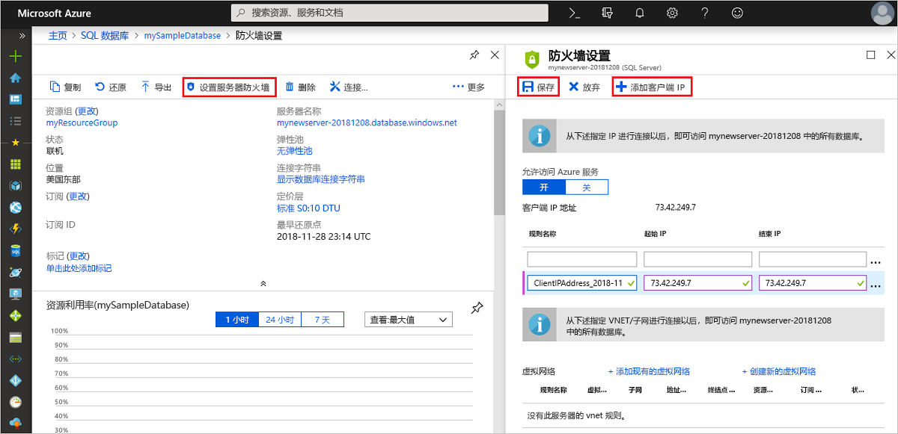

# 快速入门：通过 Azure 门户创建服务器级防火墙规则
[!INCLUDE[appliesto-sqldb](../includes/appliesto-sqldb.md)]

本快速入门详细介绍如何使用 Azure 门户在 Azure SQL 数据库中创建[服务器级防火墙规则](firewall-configure.md)，以便能够连接到[逻辑 SQL 服务器](logical-servers.md)、单一数据库、弹性池及其数据库。 若要从其他 Azure 资源和本地资源进行连接，必须使用防火墙规则。 服务器级防火墙规则不适用于 Azure SQL 托管实例。

## 先决条件

本快速入门使用[使用 Azure 门户创建单一数据库](single-database-create-quickstart.md)中创建的资源作为起点。

## 登录到 Azure 门户

登录 [Azure 门户](https://portal.azure.com/)。

## 创建服务器级 IP 防火墙规则

 SQL 数据库在服务器级别为单一数据库和共用数据库创建防火墙。 此防火墙阻止客户端应用程序和工具连接到服务器或其任何单一数据库或共用数据库，除非你创建 IP 防火墙规则来打开防火墙。 对于从 Azure 外部的 IP 地址进行的连接，请针对要连接到的特定 IP 地址或地址范围创建防火墙规则。 有关服务器级和数据库级 IP 防火墙规则的详细信息，请参阅[服务器级和数据库级 IP 防火墙规则](firewall-configure.md)。

> [!NOTE]
> 通过端口 1433 进行的 Azure SQL 数据库通信。 如果尝试从企业网络内部进行连接，则该网络的防火墙可能不允许经端口 1433 的出站流量。 如果是这样，则无法连接到服务器，除非 IT 部门打开了端口 1433。
> [!IMPORTANT]
> 0\.0.0.0 防火墙规则可让所有 Azure 服务通过服务器级防火墙规则，并尝试通过服务器连接到单一数据库或共用数据库。

按照以下步骤为客户端 IP 地址创建服务器级 IP 防火墙规则，以便仅针对该 IP 地址通过 Azure SQL 数据库防火墙启用外部连接。

1. 在[数据库](#prerequisites)部署完成后，从左侧菜单中选择“SQL 数据库”，然后在“SQL 数据库”页上选择“mySampleDatabase”  。 此时会打开数据库的概览页，其中显示了完全限定的服务器名称（例如 mynewserver-20170824.database.windows.net），并提供了其他配置的选项。

2. 请复制此完全限定的服务器名称，以便在其他快速入门中连接到服务器及其数据库时使用。

   

3. 在工具栏上选择“设置服务器防火墙”。 此时会打开服务器的“防火墙设置”页面。

   

4. 在工具栏上选择“添加客户端 IP”，将当前的 IP 地址添加到新的服务器级 IP 防火墙规则。 服务器级 IP 防火墙规则可以针对单个 IP 地址或一系列 IP 地址打开端口 1433。

   > [!IMPORTANT]
   > 默认情况下，所有 Azure 服务都禁止通过 Azure SQL 数据库防火墙进行访问。 如果要为所有 Azure 服务启用访问权限，请在此页上选择“开”。
   >

5. 选择“保存”。 此时会针对当前的 IP 地址创建服务器级 IP 防火墙规则，在服务器上打开端口 1433。

6. 关闭“防火墙设置”页。

使用 SQL Server Management Studio 或所选的其他工具，你现在可以使用之前创建的服务器管理员帐户从此 IP 地址连接到服务器及其数据库。

## 清理资源

若要转到[后续步骤](#next-steps)，以便了解如何使用多种不同的方法连接和查询数据库，请保存这些资源。 但是，如果希望删除在本快速入门中创建的资源，请执行以下步骤。

1. 在 Azure 门户的左侧菜单中，选择“资源组”，然后选择“myResourceGroup”。
2. 在资源组页上选择“删除”，在文本框中键入 **myResourceGroup**，然后选择“删除”。

## 后续步骤

- 有了数据库以后，即可使用一种偏好的工具或语言进行[连接和查询](connect-query-content-reference-guide.md)，包括
  - [使用 SQL Server Management Studio 连接和查询](connect-query-ssms.md)
  - [使用 Azure Data Studio 连接和查询](/sql/azure-data-studio/quickstart-sql-database?toc=/azure/sql-database/toc.json)
- 若要了解如何设计第一个数据库、创建表和插入数据，请参阅以下教程之一：
  - [使用 SSMS 在 Azure SQL 数据库中设计第一个单一数据库](design-first-database-tutorial.md)
  - [在 Azure SQL 数据库中设计单一数据库并使用 C# 和 ADO.NET 进行连接](design-first-database-csharp-tutorial.md)
