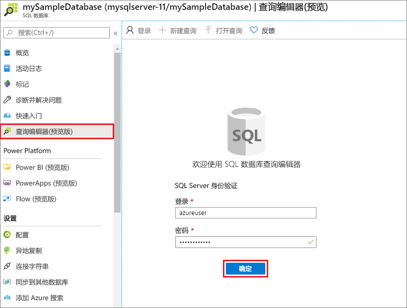

# <a name="quickstart-create-an-azure-sql-database-single-database"></a>快速入门：创建 Azure SQL 数据库单一数据库
[!INCLUDE[appliesto-sqldb](../includes/appliesto-sqldb.md)]

在本快速入门中，你将使用 Azure 门户、PowerShell 脚本或 Azure CLI 脚本创建单个 Azure SQL 数据库。 然后，在 Azure 门户中使用“查询编辑器”查询该数据库。

[单一数据库](single-database-overview.md)是适用于 Azure SQL 数据库的最快速且最简单的选项。 在[服务器](logical-servers.md)中管理单一数据库，该服务器位于指定 Azure 区域中的某个 [Azure 资源组](../../active-directory-b2c/overview.md)内。 在本快速入门中，你将为新数据库创建新的资源组和服务器。

可以在预配的计算层或无服务器计算层中创建单一数据库。  预配的数据库预先分配有固定数量的计算资源（包括 CPU 和内存），并使用两个[购买模型](purchasing-models.md)中的一个。 本快速入门使用[基于 vCore](service-tiers-vcore.md) 的购买模型创建预配的数据库，但你也可以选择[基于 DTU](service-tiers-dtu.md) 的模型。

无服务器计算层仅适用于基于 vCore 的购买模型，并提供自动缩放的计算资源范围，包括 CPU 和内存。 若要在无服务器计算层中创建单一数据库，请参阅[创建无服务器数据库](serverless-tier-overview.md#create-new-database-in-serverless-compute-tier)。

## <a name="prerequisite"></a>先决条件

- 一个有效的 Azure 订阅。 如果没有帐户，请[创建一个免费帐户](https://azure.microsoft.com/free/)。

## <a name="create-a-single-database"></a>创建单一数据库

[!INCLUDE [sql-database-create-single-database](../includes/sql-database-create-single-database.md)]

## <a name="query-the-database"></a>查询数据库

创建数据库后，可以使用 Azure 门户中内置的“查询编辑器”连接到该数据库并查询数据。

1. 在门户中搜索并选择“SQL 数据库”，然后从列表中选择你的数据库。
1. 在数据库的 SQL 数据库页的左侧菜单中，选择“查询编辑器(预览)” 。
1. 输入服务器管理员登录信息，然后选择“确定”。

   

1. 在“查询编辑器”窗格中输入以下查询。

   ```sql
   SELECT TOP 20 pc.Name as CategoryName, p.name as ProductName
   FROM SalesLT.ProductCategory pc
   JOIN SalesLT.Product p
   ON pc.productcategoryid = p.productcategoryid;
   ```

1. 选择“运行”，然后在“结果”窗格中查看查询结果。 

   

1. 关闭“查询编辑器”页，并在系统提示时选择“确定”，以放弃未保存的修改 。

## <a name="clean-up-resources"></a>清理资源

保留资源组、服务器和单一数据库可以继续执行后续步骤，并了解如何以不同的方法连接和查询数据库。

用完这些资源后，可以删除创建的资源组，这也会删除该资源组中的服务器和单一数据库。

### <a name="portal"></a>[门户](#tab/azure-portal)

若要使用 Azure 门户删除 **myResourceGroup** 及其包含的所有资源：

1. 在 Azure 门户中搜索并选择“资源组”，然后从列表中选择“myResourceGroup”。 
1. 在资源组页上，选择“删除资源组”。
1. 在“键入资源组名称”下输入 *myResourceGroup*，然后选择“删除”。 

### <a name="azure-cli"></a>[Azure CLI](#tab/azure-cli)

若要删除资源组及其包含所有资源，请使用该资源组的名称运行以下 Azure CLI 命令：

```azurecli-interactive
az group delete --name <your resource group>
```

### <a name="powershell"></a>[PowerShell](#tab/azure-powershell)

若要删除资源组及其包含所有资源，请使用该资源组的名称运行以下 PowerShell cmdlet：

```azurepowershell-interactive
Remove-AzResourceGroup -Name <your resource group>
```

---

## <a name="next-steps"></a>后续步骤

使用不同的工具与语言[连接和查询](connect-query-content-reference-guide.md)数据库：
> [!div class="nextstepaction"]
> [使用 SQL Server Management Studio 连接和查询](connect-query-ssms.md)
> [Connect and query using Azure Data Studio](/sql/azure-data-studio/quickstart-sql-database?toc=/azure/sql-database/toc.json)
