# 快速入门：创建 SQL 托管实例的托管实例
[!INCLUDE[appliesto-sqlmi](../includes/appliesto-sqlmi.md)]

本快速入门介绍了如何在 Azure 门户中创建 [Azure SQL 托管实例](sql-managed-instance-paas-overview.md)的托管实例。

> [!IMPORTANT]
> 有关限制，请参阅[支持的区域](resource-limits.md#supported-regions)和[支持的订阅类型](resource-limits.md#supported-subscription-types)。

## 创建托管实例

若要创建托管实例，请执行以下步骤： 

### 登录到 Azure 门户

如果没有 Azure 订阅，可以[创建一个免费帐户](https://azure.microsoft.com/free/)。

1. 登录 [Azure 门户](https://portal.azure.com/)。
1. 在 Azure 门户的左侧菜单上选择“Azure SQL”。 如果 **Azure SQL** 不在列表中，请选择“所有服务”，然后在搜索框中输入“Azure SQL”。
1. 选择“+添加”以打开“选择 SQL 部署选项”页。 通过在“SQL 托管实例”磁贴上选择“显示详细信息”，可以查看有关 Azure SQL 托管实例的其他信息 。
1. 选择“创建”。

   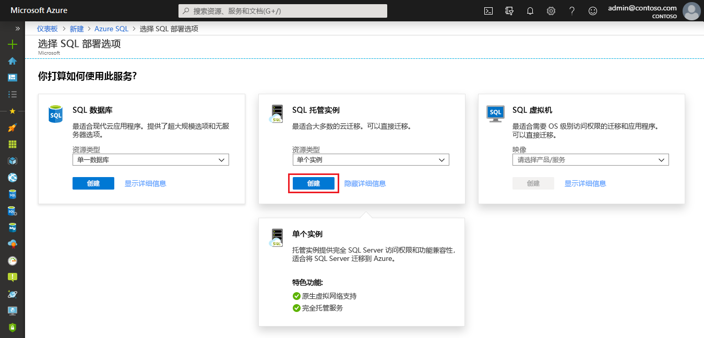

4. 使用“创建 Azure SQL 托管实例”预配窗体上的选项卡添加必需信息和可选信息。 以下部分介绍这些选项卡。

### “基本信息”选项卡

- 填写“基本信息”选项卡中的必需信息。这是预配托管实例所需的最少量信息。

   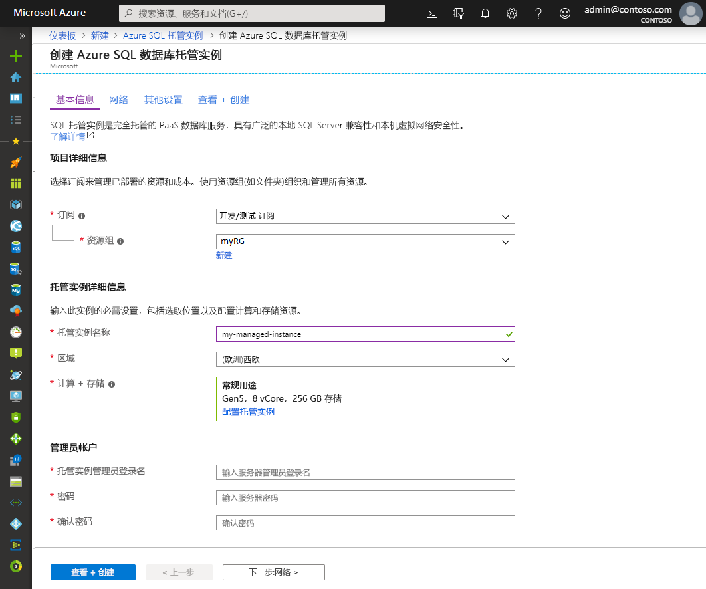

   参考下表来填写此选项卡中的所需信息。

   | 设置| 建议的值 | 说明 |
   | ------ | --------------- | ----------- |
   | **订阅** | 你的订阅。 | 你有权在其中创建新资源的订阅。 |
   | **资源组** | 新的或现有的资源组。|如需有效的资源组名称，请参阅 [Naming rules and restrictions](/azure/architecture/best-practices/resource-naming)（命名规则和限制）。|
   | **托管实例名称** | 任何有效的名称。|请参阅[命名规则和限制](/azure/architecture/best-practices/resource-naming)，了解什么是有效的名称。|
   | **区域** |要在其中创建托管实例的区域。|有关区域的信息，请参阅 [Azure 区域](https://azure.microsoft.com/regions/)。|
   | **托管实例管理员登录名** | 任何有效的用户名。 | 请参阅[命名规则和限制](/azure/architecture/best-practices/resource-naming)，了解什么是有效的名称。 不要使用“serveradmin”，因为这是保留的服务器级角色。|
   | **密码** | 任何有效的密码。| 密码必须至少 16 个字符，且符合[定义的复杂性要求](../../virtual-machines/windows/faq.md#what-are-the-password-requirements-when-creating-a-vm)。|

- 选择“配置托管实例”，以设置计算和存储资源的大小并查看定价层。 使用滑块或文本框指定存储量和虚拟核心数。 完成后，选择“应用”以保存所做的选择。 

   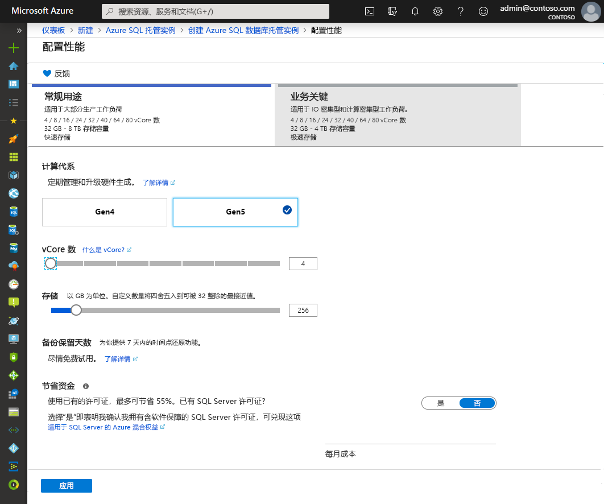

- 若要在创建 SQL 托管实例之前查看所做的选择，可选择“查看 + 创建”。 也可配置网络选项，方法是选择“下一步:网络”。

### “网络”选项卡

- 填写“网络”选项卡中的可选信息。如果省略此信息，门户会应用默认设置。

   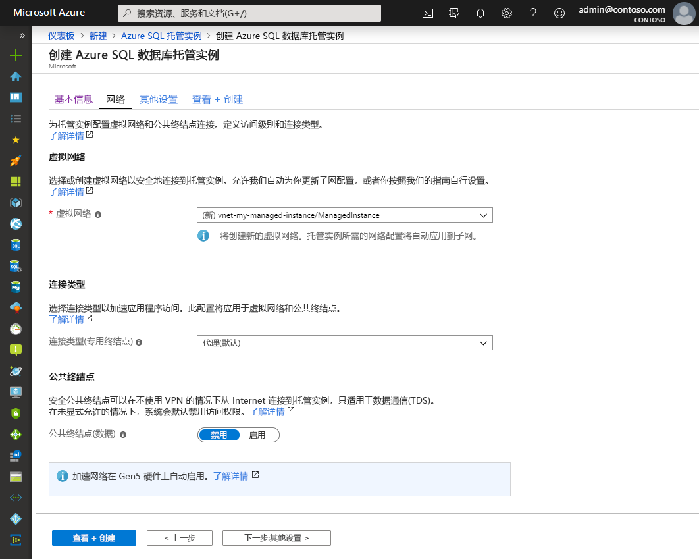

   参考下表来填写此选项卡中的所需信息。

   | 设置| 建议的值 | 说明 |
   | ------ | --------------- | ----------- |
   | **虚拟网络** | 选择“创建新的虚拟网络”或有效的虚拟网络和子网。| 如果网络或子网不可用，则必须先[对其进行修改以满足网络要求](vnet-existing-add-subnet.md)，然后再选择它作为新托管实例的目标。 有关为 SQL 托管实例配置网络环境所要满足的要求的信息，请参阅[为 SQL 托管实例配置虚拟网络](connectivity-architecture-overview.md)。 |
   | **连接类型** | 选择“代理”或“重定向”连接类型。|有关连接类型的详细信息，请参阅 [Azure SQL 托管实例连接类型](../database/connectivity-architecture.md#connection-policy)。|
   | **公共终结点**  | 选择“启用”。 | 若要通过公共数据终结点访问托管实例，需启用此选项。 | 
   | **允许的访问来源**（如果启用了“公共终结点”） | 选择一个选项。   |在门户体验中可以使用公共终结点配置安全组。     根据具体的方案选择以下选项之一：   <ul> <li>**Azure 服务**：从 Power BI 或另一多租户服务进行连接时，建议使用此选项。 </li> <li> **Internet**：用于测试，可让你快速运转托管实例。 建议不要将它用于生产环境。 </li> <li> **不允许访问**：此选项创建一个“拒绝”安全规则。 修改此规则才能通过公共终结点访问托管实例。 </li> </ul>   有关公共终结点安全性的详细信息，请参阅[通过公共终结点安全使用 Azure SQL 托管实例](public-endpoint-overview.md)。|

- 选择“查看 + 创建”，在创建托管实例之前查看所做的选择。 也可配置更多自定义设置，方法是选择“下一步:其他设置”。

### 其他设置

- 填写“附加设置”选项卡中的可选信息。如果省略此信息，门户会应用默认设置。

   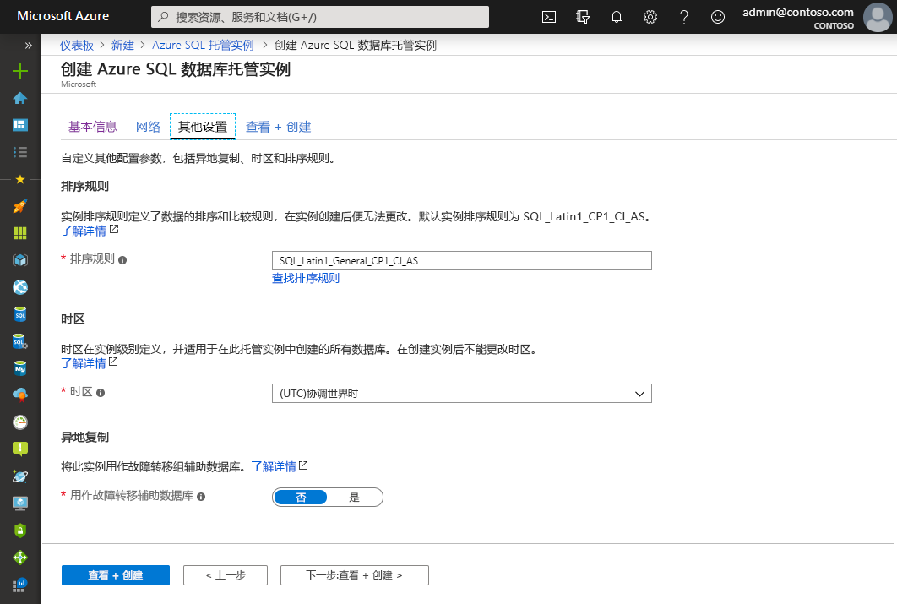

   参考下表来填写此选项卡中的所需信息。

   | 设置| 建议的值 | 说明 |
   | ------ | --------------- | ----------- |
   | **排序规则** | 选择需要用于托管实例的排序规则。 如果从 SQL Server 迁移数据库，请使用 `SELECT SERVERPROPERTY(N'Collation')` 检查源排序规则并使用该值。| 有关排序规则的信息，请参阅[设置或更改服务器排序规则](https://docs.microsoft.com/sql/relational-databases/collations/set-or-change-the-server-collation)。|   
   | **时区** | 选择要求托管实例遵循的时区。|有关详细信息，请参阅[时区](timezones-overview.md)。|
   | **用作故障转移辅助托管实例** | 请选择“是”。 | 启用此选项即可将托管实例用作故障转移组辅助托管实例。|
   | 主 SQL 托管实例（如果“用作故障转移辅助托管实例”设置为“是”）   | 选择一个现有的主托管实例，该实例会加入你要创建的托管实例所在的 DNS 区域。 | 此步骤会启用对故障转移组进行创建后配置的功能。 有关详细信息，请参阅[教程：将托管实例添加到故障转移组](failover-group-add-instance-tutorial.md)。|

## 查看 + 创建

1. 选择“查看 + 创建”选项卡，在创建托管实例之前查看所做的选择。

   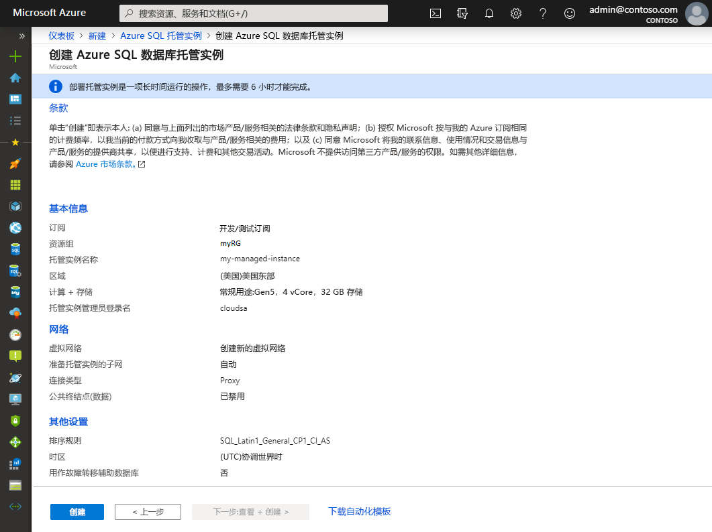

1. 选择“创建”，开始预配托管实例。

> [!IMPORTANT]
> 部署托管实例是一项运行时间很长的操作。 通常情况下，子网中第一个实例的部署时间比子网中已经有托管实例时实例的部署时间要长得多。 若要了解平均预配时间，请参阅 [SQL 托管实例管理操作](sql-managed-instance-paas-overview.md#management-operations)。

## 监视部署进度

1. 选择“通知”图标以查看部署状态。

   

1. 在通知中选择“正在进行的部署”以打开 SQL 托管实例窗口，进一步监视部署进度。 

> [!TIP]
> 如果关闭了 Web 浏览器或离开了部署进度屏幕，可遵循以下步骤返回到部署进度屏幕：
> 1. 在 Azure 门户中，打开要向其部署 SQL 托管实例的资源组（位于“基本信息”选项卡上）。
> 2. 选择“部署”。
> 3. 选择正在进行的 SQL 托管实例部署操作。

> [!IMPORTANT]
> 若要获取托管实例创建状态，需要有资源组的**读取权限**。 如果没有此权限，或者在托管实例创建过程中将其撤消，则可能会导致 SQL 托管实例在资源组部署列表中不可见。
>

## 查看创建的资源

成功部署托管实例后，若要查看创建的资源，请执行以下操作：

1. 打开托管实例的资源组。 

   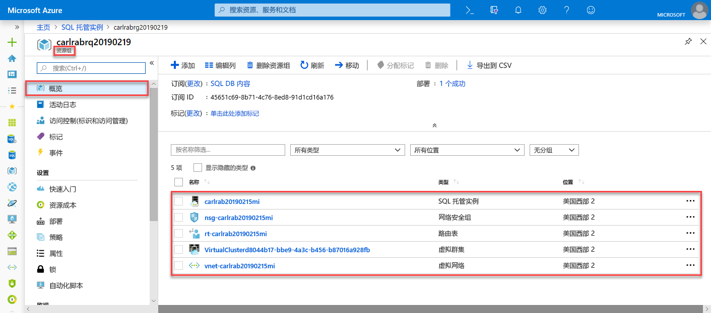

## 查看和微调网络设置

若要选择性地微调网络设置，请检查以下各项：

1. 选择路由表，查看为你创建的用户定义的路由 (UDR)。

   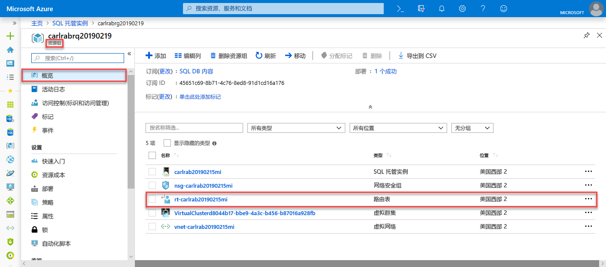

2. 在路由表中，查看用于通过 SQL 托管实例的虚拟网络路由流量的条目。 若要手动创建或配置路由表，请务必在 SQL 托管实例路由表中创建这些条目。

   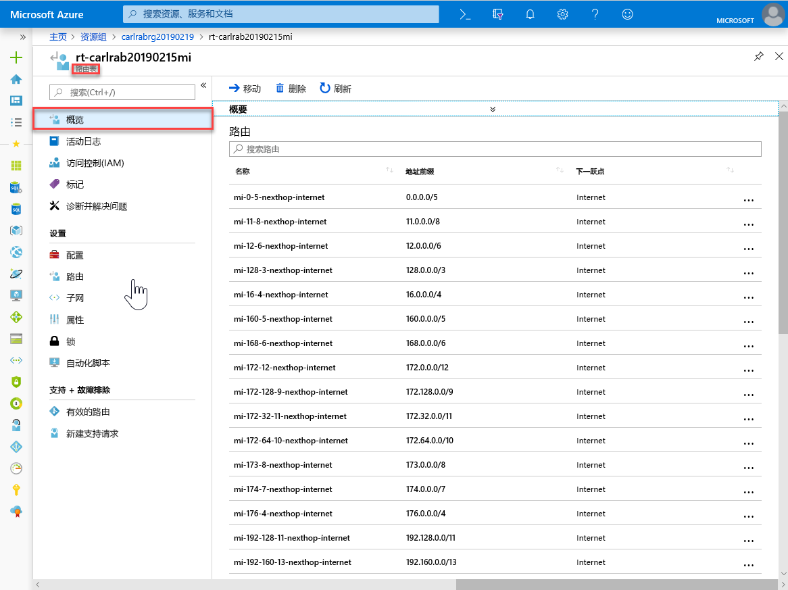

3. 返回到资源组并选择网络安全组。

   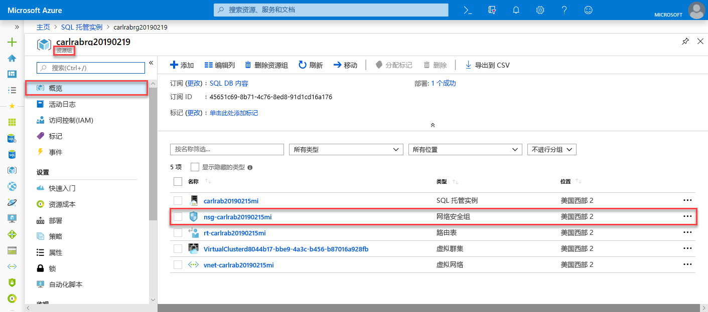

4. 查看入站和出站安全规则。 

   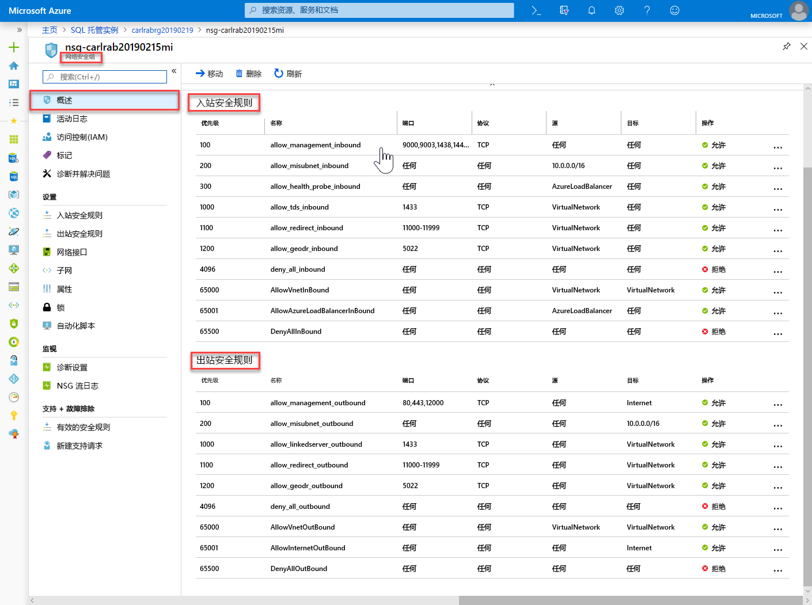

> [!IMPORTANT]
> 如果为 SQL 托管实例配置了公共终结点，则需要打开端口以允许网络流量从公共 Internet 连接到 SQL 托管实例. 有关详细信息，请参阅[为 SQL 托管实例配置公共终结点](public-endpoint-configure.md#allow-public-endpoint-traffic-on-the-network-security-group)。
>

## 检索 SQL 托管实例的连接详细信息

若要连接到 SQL 托管实例，请遵循以下步骤检索主机名和完全限定的域名 (FQDN)：

1. 返回资源组并选择托管实例。

   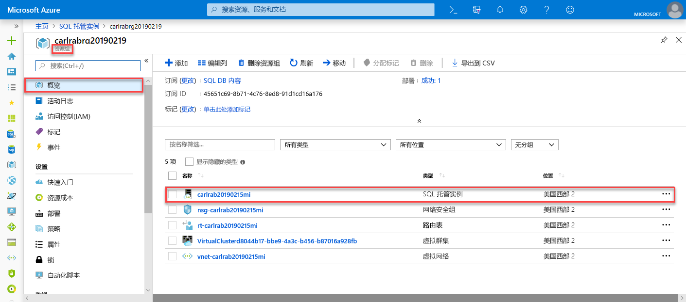

2. 在“概述”选项卡上，找到“主机”属性。  复制托管实例的主机名，该名称可在下一个快速入门中使用。

   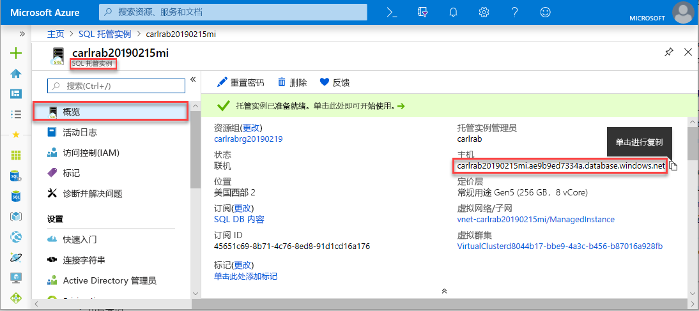

   复制的值表示可用于连接到 SQL 托管实例的完全限定域名 (FQDN)。 FQDN 类似于以下地址示例：*your_host_name.a1b2c3d4e5f6.database.windows.net*。

## 后续步骤

了解如何连接到 SQL 托管实例：
- 有关应用程序的连接选项概述，请参阅[将应用程序连接到 SQL 托管实例](connect-application-instance.md)。
- 有关介绍如何从 Azure 虚拟机连接到 SQL 托管实例的快速入门，请参阅[配置 Azure 虚拟机连接](connect-vm-instance-configure.md)。
- 有关介绍如何使用点到站点连接从本地客户端计算机连接到 SQL 托管实例的快速入门，请参阅[配置点到站点连接](point-to-site-p2s-configure.md)。

将现有 SQL Server 数据库从本地还原到 SQL 托管实例： 
- 使用[用于迁移的 Azure 数据库迁移服务](../../dms/tutorial-sql-server-to-managed-instance.md)从数据库备份文件还原。 
- 使用 [T-SQL RESTORE 命令](restore-sample-database-quickstart.md) 从数据库备份文件还原。

有关使用内置故障排除智能对 SQL 托管实例数据库性能进行的高级监视，请参阅[使用 Azure SQL Analytics 监视 Azure SQL 托管实例](../../azure-monitor/insights/azure-sql.md)。
