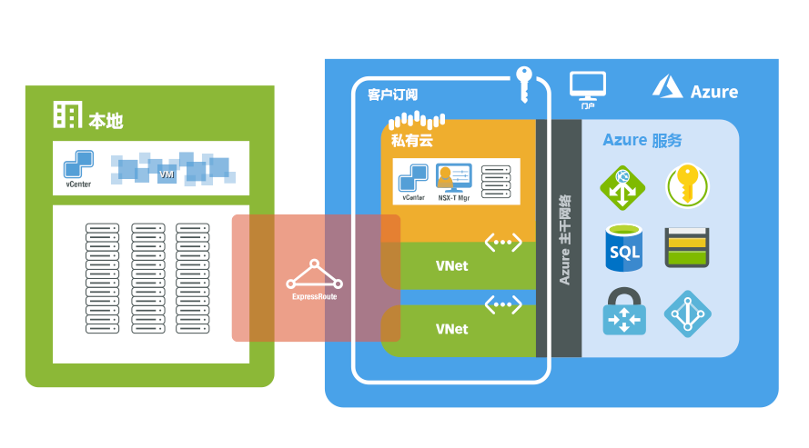

# 什么是 Azure VMware 解决方案 (AVS) 预览版？

Azure VMware 解决方案 (AVS) 可为你在 Azure 中提供私有云。 私有云包含从专用裸机 Azure 基础设施构建的 vSphere 群集。 可将私有云群集从 3 个主机扩展到 16 个主机，获得在单个私有云中部署多个群集的功能。 所有私有云中都预配了 vCenter Server、VSAN、vSphere 和 NSX-T。 可以从本地环境迁移工作负载、创建或部署新的虚拟机，并从私有云使用 Azure 服务。

AVS 是经过 VMware 验证的解决方案，我们会持续对其进行验证、测试、增强和升级操作。 私有云基础设施和软件由 Microsoft 管理和维护，使你可以专注于在私有云中开发和运行工作负载。

下图显示了 Azure、Azure 服务和本地环境中的私有云与 VNet 之间的邻近性。 从私有云对 Azure 服务或 VNet 进行网络访问可以提供 SLA 驱动的 Azure 服务终结点集成。 从本地环境进行的私有云访问使用 ExpressRoute Global Reach 建立私密且安全的连接。

## 主机、群集和私有云

AVS 私有云和群集是从裸机超融合 Azure 基础设施主机构建的。 高端主机具有 576 GB RAM 和 Intel 18 核 2.3 GHz 双处理器。 HE 主机具有两个 vSAN 磁盘组，其中采用总共 15.36 TB (SSD) 的原始 vSAN 容量层和 3.2 TB (NVMe) vSAN 缓存层。

通过 Azure 门户或 Azure CLI 部署新的私有云。

## 网络

部署私有云时，将创建用于管理、预配和 vMotion 的专用网络。 这些专用网络用于对 vCenter 和 NSX-T 管理器进行访问，以及用于虚拟机 vMotion 或部署。 可以从 Azure 中的 VNet 或从本地环境访问所有专用网络。 ExpressRoute Global Reach 用于将私有云连接到本地环境，此连接要求在订阅中提供一个使用 ExpressRoute 线路的 VNet。

部署私有云时，会预配对 Internet 和 Azure 服务的访问。 提供这种访问的目的是使生产工作负载网络中的 VM 能够使用 Azure 或基于 Internet 的服务。 默认情况下，会对新的私有云禁用 Internet 访问，但 Internet 访问可以随时启用或禁用。

有关网络和互连的详细信息，请参阅[网络概念](concepts-networking.md)一文。

## 访问和安全性

为了增强安全性，AVS 私有云使用 vSphere 基于角色的访问控制。 vSphere SSO LDAP 功能可与 Azure Active Directory 集成。 有关标识和特权的详细信息，请参阅[访问权限和标识概念](concepts-identity.md)一文。

默认已启用 vSAN 静态数据加密，此功能用于提供 vSAN 数据存储安全性。 [存储概念](concepts-storage.md)一文中对此做了详细介绍。

## 主机和软件生命周期维护

定期升级 AVS 私有云和 VMware 软件可确保安全性、稳定性并在私有云中运行最新的功能集。 [升级概念](concepts-upgrades.md)一文中提供了有关平台维护和升级的更多详细信息。

## 监视私有云

可以使用 [Azure Monitor 中的日志](../azure-monitor/overview.md)来收集 AVS 私有云中运行的虚拟机上的日志。 可以使用在本地 VM 上运行的相同查询，在 AVS 私有云运行的 Linux 和 Windows 虚拟机上[下载并安装 MMA 代理](../azure-monitor/platform/log-analytics-agent.md#installation-and-configuration)。 可以像平时在虚拟机上那样运行相同的查询。 若要详细了解如何创建查询，请参阅[如何编写查询](../azure-monitor/log-query/log-query-overview.md#how-can-i-learn-how-to-write-queries)。

## 后续步骤

下一步是了解关键的[私有云和群集概念](concepts-private-clouds-clusters.md)。

<!-- LINKS - external -->

<!-- LINKS - internal -->
[concepts-private-clouds-clusters]: ./concepts-private-clouds-clusters.md
