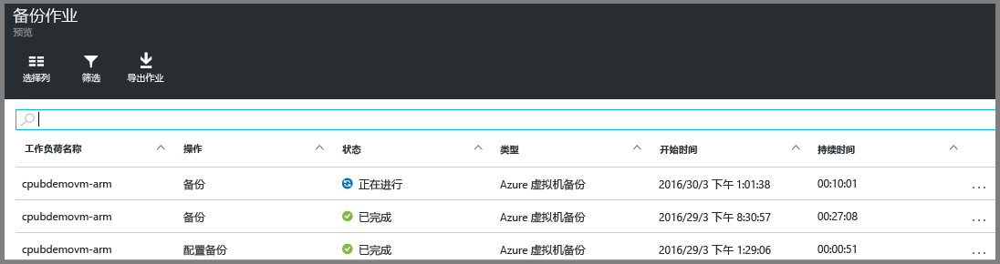

<properties
	pageTitle="备份 Azure Resource Manager 虚拟机 | Azure"
	description="使用本文中的 Azure 虚拟机备份过程来发现 ARM 虚拟机并将其注册和备份到恢复服务保管库。"
	services="backup"
	documentationCenter=""
	authors="markgalioto"
	manager="jwhit"
	editor=""
	keywords="虚拟机备份; 备份虚拟机; 备份和灾难恢复; arm vm 备份"/>

<tags
	ms.service="backup"
	ms.date="05/04/2016"
	wacn.date=""/>

# 备份 Azure Resource Manager (ARM) 虚拟机

> [AZURE.SELECTOR]
- [将 ARM VM 备份到 Azure](backup-azure-arm-vms.md)
- [备份 Azure 虚拟机](backup-azure-vms.md)

本文提供将 Azure Resource Manager (ARM) 虚拟机 (VM) 备份到恢复服务保管库的过程。备份 ARM VM 的工作主要是做好准备。在备份或保护 Azure 虚拟机之前，必须完成[先决条件](backup-azure-arm-vms-prepare.md)中的步骤来准备好 VM 的保护环境。完成先决条件中的步骤后，可以启动备份操作来创建 VM 的快照。

>[AZURE.NOTE] Azure 有两种用于创建和使用资源的部署模型：[Resource Manager 和经典部署模型](../resource-manager-deployment-model.md)。本文适用于 Resource Manager VM 和基于 ARM 的 VM。有关使用经典部署模型 VM 的详细信息，请参阅 [Back up Azure virtual machines（备份 Azure 虚拟机）](backup-azure-vms.md)。

有关其他信息，请参阅[在 Azure 中规划 VM 备份基础结构](backup-azure-vms-introduction.md)和 [Azure 虚拟机](https://azure.microsoft.com/documentation/services/virtual-machines/)。

## 触发备份作业

与恢复服务保管库关联的备份策略定义备份操作的运行频率和时间。默认情况下，第一个计划的备份是初始备份。在执行初始备份之前，“备份作业”边栏选项卡上的“上次备份状态”显示为“警告(等待初始备份)”。

除非初始备份预计马上开始，否则建议你运行“立即备份”。以下过程从保管库仪表板开始。当完成所有先决条件后，此过程可用于运行初始备份作业。如果已运行初始备份作业，此过程便不适用。关联的备份策略将确定后续的备份作业。

若要运行初始备份作业，请执行以下操作：

1. 在保管库仪表板上的“备份”磁贴中，单击“Azure 虚拟机”。 
    

    “备份项”边栏选项卡随即打开。

2. 在“备份项”边栏选项卡中，右键单击要备份的保管库，然后单击“立即备份”。

    

    随即会触发备份作业。 

    

3. 若要查看初始备份是否已完成，请在保管库仪表板的“备份任务”磁贴上单击“Azure 虚拟机”。

    

    “备份作业”边栏选项卡随即打开。

4. 在“备份作业”边栏选项卡中，可以看到所有作业的状态。

    

    >[AZURE.NOTE] 在执行备份操作的过程中，Azure 备份服务将向虚拟机中的备份扩展发出一条命令，以刷新所有写入并取得一致的快照。

    完成备份作业后，状态将变为“已完成”。

## 排查错误
如果你在备份虚拟机时遇到问题，请参阅 [VM 故障排除文章](backup-azure-vms-troubleshoot.md)以获取帮助。

## 后续步骤

保护 VM 后，请参阅以下文章了解可对 VM 执行的其他管理任务，以及如何还原 VM。

- [管理和监视你的虚拟机](backup-azure-manage-vms.md)
- [恢复虚拟机](backup-azure-arm-restore-vms.md)

<!---HONumber=Mooncake_0606_2016-->