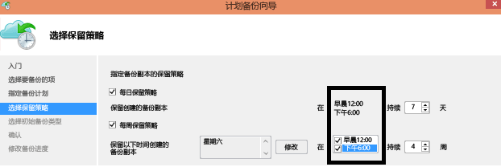

# Azure 备份 - 常见问题

本文回答有关 Azure 备份服务的常见问题。

## 恢复服务保管库

### 在每个 Azure 订阅中可以创建的保管库数量是否有任何限制？

是的。 在 Azure 备份支持的区域中，可以为每个订阅最多创建 500 个恢复服务保管库。 如果需要更多保管库，请创建另一订阅。

### 可针对每个保管库注册的服务器/计算机数量是否有限制？

每个保管库最多可以注册 1000 个 Azure 虚拟机。 如果你使用的是 Microsoft Azure 备份代理，则每个保管库最多可以注册 50 MARS 代理。 并且可以向保管库注册 50 MABS server/DPM 服务器。

### 可以在保管库中保护多少数据源/项？

可以在保管库中跨所有工作负荷（IaaS VM、SQL、AFS 等）保护多达 2000 个数据源/项。
例如，如果已在保管库中保护 500 个 VM 和 400 个 Azure 文件共享，则最多还能在其中保护 1100 个 SQL 数据库。

### 每个保管库可以创建多少项策略？

每个保管库最多只能有 200 项策略。

### 如果本组织有一个保管库，如何在还原数据时将数据与保管库中的其他服务器隔离？

设置备份时，你想要一起恢复的服务器数据应使用相同密码。 如果要将恢复隔离到一个特定服务器或多个服务器，仅使用该服务器的密码。 例如，人力资源服务器可能使用一个加密通行短语，会计结算服务器使用另一个通行短语，而存储服务器使用第三个通行短语。

### 是否可以在订阅之间移动我的保管库？

是的。 若要移动恢复服务保管库，请参阅此[文章](backup-azure-move-recovery-services-vault.md)

### 是否可以将备份数据移动到另一个保管库？

不是。 保管库中存储的备份数据无法移动到不同的保管库。

### 能否在备份后从 GRS 更改为 LRS？

不是。 仅在存储任何备份之后，恢复服务保管库才可更改存储选项。

### 是否可以对备份到恢复服务保管库的 VM 执行项级别还原 (ILR)？

- 由 Azure VM 备份支持的 Azure VM 支持 ILR。 有关详细信息，请参阅相关[文章](backup-azure-restore-files-from-vm.md)
- Azure 备份服务器或 System Center DPM 备份的本地 VM 的联机恢复点不支持 ILR。

## Azure 备份代理

### 在哪里可以找到有关 Azure VM 备份的 Azure 备份代理的常见问题？

- 有关在 Azure VM 上运行的代理，请阅读此[常见问题解答](backup-azure-vm-backup-faq.md)。
- 如需用于备份 Azure 文件夹的代理，请阅读此[常见问题解答](backup-azure-file-folder-backup-faq.md)。

## 常规备份

### 备份计划是否有限制？

是的。

- 可以备份 Windows Server 或 Windows 计算机，最多一天三次。 可以将计划策略设置为每日或每周计划。
- 可以备份 DPM，最多一天两次。 可以将计划策略设置为每日、每周、每月或每年。
- Azure VM 可每日备份一次。

### 支持哪些操作系统进行备份？

Azure 备份支持操作系统对文件和文件夹以及使用 Azure 备份服务器和 DPM 保护的工作负载应用程序进行备份。

**OS** | **SKU** | **详细信息**
--- | --- | ---
工作站 | |
Windows 10 64 位 | Enterprise、Pro、Home | 计算机应运行最新服务包和更新。
Windows 8.1 64 位 | Enterprise、Pro | 计算机应运行最新服务包和更新。
Windows 8 64 位 | Enterprise、Pro | 计算机应运行最新服务包和更新。
Windows 7 64 位 | Ultimate、Enterprise、Professional、Home Premium、Home Basic、Starter | 计算机应运行最新服务包和更新。
Server (服务器) | |
Windows Server 2019 64 位 | Standard、Datacenter、Essentials | 使用最新服务包/更新。
Windows Server 2016 64 位 | Standard、Datacenter、Essentials | 使用最新服务包/更新。
Windows Server 2012 R2 64 位 | Standard、Datacenter、Foundation | 使用最新服务包/更新。
Windows Server 2012 64 位 | Datacenter、Foundation、Standard | 使用最新服务包/更新。
Windows Storage Server 2016 64 位 | Standard、Workgroup | 使用最新服务包/更新。
Windows Storage Server 2012 R2 64 位 | Standard、Workgroup、Essential | 使用最新服务包/更新。
Windows Storage Server 2012 64 位 | Standard、Workgroup | 使用最新服务包/更新。
Windows Server 2008 R2 SP1 64 位 | Standard、Enterprise、Datacenter、Foundation | 使用最新更新。
Windows Server 2008 64 位 | Standard、Enterprise、Datacenter | 使用最新更新。

Azure 备份不支持 32 位操作系统。

对于 Azure VM Linux 备份，Azure 备份支持 [Azure 认可的分发版列表](../virtual-machines/linux/endorsed-distros.md)，但 Core OS Linux 和 32 位操作系统除外。 只要 VM 上装有 VM 代理且支持 Python，其他自带 Linux 发行版应该也能正常运行。

### 是否存在数据备份的大小限制？

大小限制如下所示：

OS/计算机 | 数据源的大小限制
--- | ---
Windows 8 或更高版本 | 54,400 GB
Windows 7 |1700 GB
Windows Server 2012 或更高版本 | 54,400 GB
Windows Server 2008、Windows Server 2008 R2 | 1700 GB
Azure VM | 请参阅[AZURE VM 备份的支持矩阵](https://docs.microsoft.com/azure/backup/backup-support-matrix-iaas#vm-storage-support)

### 如何确定数据源大小？

下表说明了如何确定每个数据源大小。

**数据源** | **详细信息**
--- | ---
数据量(Volume) |从正在备份的单个卷 VM 备份的数据量。
SQL Server 数据库 |正在备份的单个 SQL 数据库的大小。
SharePoint | 正在备份的 SharePoint 场中内容和配置数据库的总和。
Exchange |正在备份 Exchange 服务器中所有 Exchange 数据库的总和。
BMR/系统状态 |正在备份计算机的 BMR 或系统状态的每个副本。

### 使用恢复服务保管库备份的数据量是否有限制？

可以使用恢复服务保管库备份的总数据量没有限制。 单个数据源（Azure Vm 除外）的大小最大可为 54400 GB。 有关限制的详细信息，请参阅[支持矩阵中的保管库限制部分](https://docs.microsoft.com/azure/backup/backup-support-matrix#vault-support)。

### 为什么传输到恢复服务保管库的数据的大小小于选择进行备份的数据？

从 Azure 备份代理、DPM 和 Azure 备份服务器备份的数据都会在传输之前进行压缩和加密。 应用压缩和加密后，保管库中的数据将减少 30-40%。

### 可以从保管库中的恢复点删除单个文件吗？

不可以，Azure 备份不支持从存储的备份中删除或清除单个项。

### 如果在备份作业开始后取消，是否会删除已传输的备份数据？

不是。 在备份作业取消之前传输到保管库中的所有数据将保留在保管库中。

- Azure 备份使用检查点机制，在备份过程中偶尔要对备份数据添加检查点。
- 由于备份数据中有检查点，下次备份过程可以验证文件的完整性。
- 下一次备份作业将是以前备份的数据的增量。 增量备份仅传输新增或更改的数据，这相当于更好地利用带宽。

如果取消了 Azure VM 的备份作业，则已传输的数据会被忽略。 下次备份作业将传输上次成功的备份作业之后的增量数据。

## 保留和恢复

### DPM 和不带 DPM 的 Windows 计算机的保留策略是否相同？

是的，它们都有每日、每周、每月和每年保留策略。

### 能否自定义保留策略？

是的，可以自定义策略。 例如，可以配置每周和每日保留期要求，但不能配置每年和每月保留期要求。

### 是否可以对备份计划和保留策略使用不同时间？

不是。 只能在备份时间点应用保留策略。 例如，此图显示了午夜 12 点和下午 6 点创建的备份的保留策略。

### 如果备份保留了很长一段时间，是否需要更多时间才能恢复较旧的数据点？

不是。 恢复最旧或最新时间点所需的时间相同。 每个恢复点的行为类似一个完整的点。

### 如果每个恢复点相当于完整的点，它会影响总体可计费备份存储吗？

典型的长期保留点产品将备份数据存储为完整的点。

- 完整点的存储 *效率不高* ，但能使还原变得更方便和快速。
- 增量复制是*高效*存储，但要求你还原数据链，这会影响恢复时间

Azure 备份存储体系结构提供这两个领域的最佳产品，它以最佳方式用于快速恢复的数据存储中，产生较低的存储成本。 这种方法可确保提高（入口和出口）带宽使用效率。 数据存储量和恢复数据所需的时间都会尽量减少。 了解有关[增量备份](https://azure.microsoft.com/blog/microsoft-azure-backup-save-on-long-term-storage/)的更多信息。

### 可创建的恢复点数量是否有限制？

最多可为单个受保护实例创建 9999 个恢复点。 受保护的实例包括计算机、服务器（物理或虚拟）或备份到 Azure 的工作负载。

- 了解有关[备份和保留](./backup-support-matrix.md)的更多信息。

### 我可以将备份到 Azure 的数据恢复多少次？

从 Azure 备份执行恢复的次数没有限制。

### 还原数据时，Azure 的出口流量是否需要付费？

不是。 恢复是免费的，不收取传出流量费。

### 如果更改备份策略，会发生什么情况？

应用新策略时，将遵循新策略的计划和保留期。

- 如果延长保留期，则会对现有的恢复点进行标记，按新策略要求保留它们。
- 如果缩短保留期，则会将其标记为在下一清理作业中删除，随后会将其删除。

## 加密

### 发送到 Azure 的数据会加密吗？

是的。 使用 AES256 在本地计算机上对数据进行加密。 数据通过安全的 HTTPS 链接发送。 在云中传输的数据仅在存储和恢复服务之间通过 HTTPS 链接进行保护。 iSCSI 协议可保护恢复服务和用户计算机之间传输的数据。 安全隧道用于保护 iSCSI 通道。

### Azure 中的备份数据也会加密吗？

是的。 Azure 中的数据为静态加密。

- 对于本地备份，使用在备份到 Azure 时提供的密码提供静态加密。
- 对于 Azure VM，使用存储服务加密 (SSE) 对数据进行静态加密。

Microsoft 不会解密任何位置的备份数据。

### 用于加密备份数据的加密密钥的最小长度是多少？

使用 Azure 备份代理时，加密密钥至少应该为 16 个字符。 就 Azure VM 来说，Azure KeyVault 所使用的密钥没有长度限制。

### 如果我丢失了加密密钥，会发生什么情况？ 能否恢复数据？ Microsoft 能否恢复数据？

用于加密备份数据的密钥仅出现在你的站点上。 Microsoft 不会在 Azure 中保留副本，并且无权访问密钥。 如果错放密钥，Microsoft 将无法恢复备份数据。

## 后续步骤

阅读其他常见问题：

- 有关 Azure VM 备份的[常见问题](backup-azure-vm-backup-faq.md)。
- 有关 Azure 备份代理的[常见问题](backup-azure-file-folder-backup-faq.md)
