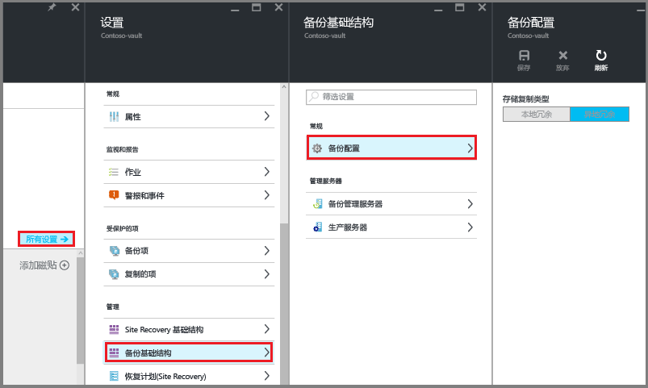

# <a name="preparing-to-back-up-workloads-using-azure-backup-server"></a>准备使用 Azure 备份服务器来备份工作负荷
> [!div class="op_single_selector"]
> * [Azure 备份服务器](backup-azure-microsoft-azure-backup.md)
> * [SCDPM](backup-azure-dpm-introduction.md)
>
>

本文介绍如何准备环境，以使用 Azure 备份服务器来备份工作负荷。 使用 Azure 备份服务器，可以通过一个控制台保护应用程序工作负载，如 Hyper-V VM、Microsoft SQL Server、SharePoint Server、Microsoft Exchange 和 Windows 客户端。

> [!NOTE]
> Azure 备份服务器现在可以保护 VMware VM 并提供改进的安全功能。 请按照下面各部分所述操作，安装此产品；应用更新 1 和最新 Azure 备份代理。 若要详细了解如何使用 Azure 备份服务器备份 VMware 服务器，请参阅[使用 Azure 备份服务器备份 VMware 服务器](backup-azure-backup-server-vmware.md)一文。 若要了解安全功能，请参阅 [Azure 备份安全功能文档](backup-azure-security-feature.md)。
>
>

还可以在 Azure 中保护基础结构即服务 (IaaS) 工作负荷（例如 VM）。

> [!NOTE]
> Azure 有两种用于创建和使用资源的部署模型：[Resource Manager 部署模型和经典部署模型](../azure-resource-manager/resource-manager-deployment-model.md)。 本文提供有关还原使用 Resource Manager 模型部署的 VM 的信息和过程。
>
>

Azure 备份服务器从 Data Protection Manager (DPM) 继承了大量工作负荷备份功能。 此文章链接到 DPM 文档，以介绍一些共享功能。 尽管 Azure 备份服务器与 DPM 有许多相同的功能。 Azure 备份服务器不备份到磁带，也不与 System Center 集成。

## <a name="choose-an-installation-platform"></a>选择安装平台
若要启动并运行 Azure 备份服务器，首先要设置 Windows Server。 服务器可在 Azure 中或者在本地。

### <a name="using-a-server-in-azure"></a>使用 Azure 中的服务器
选择用于运行 Azure 备份服务器的服务器时，建议从 Windows Server 2012 R2 Datacenter 或 Windows Server 2016 Datacenter 库映像开始。 [在 Azure 门户中创建第一个 Windows 虚拟机](../virtual-machines/virtual-machines-windows-hero-tutorial.md?toc=%2fazure%2fvirtual-machines%2fwindows%2ftoc.json)一文提供了如何在 Azure 中开始使用建议的虚拟机的教程，即使以前从未使用过 Azure 也没关系。 建议服务器虚拟机 (VM) 至少必须符合以下要求：3.5GB RAM 的双核 A2 标准。

使用 Azure 备份服务器保护工作负荷有许多细微差异需要注意。 可通过[将 DPM 安装为 Azure 虚拟机](https://technet.microsoft.com/library/jj852163.aspx)一文了解这些细微差异。 部署计算机前，请先阅读完本文。

### <a name="using-an-on-premises-server"></a>使用本地服务器
如果不希望在 Azure 中运行基本服务器，则可以在 Hyper-V VM、VMware VM 或物理主机上运行服务器。 建议服务器硬件至少必须符合以下要求：双核和 4GB RAM。 下表列出了支持的操作系统：

| 操作系统 | 平台 | SKU |
|:--- | --- |:--- |
| Windows Server 2016 和最新的 SP |64 位 |Standard、Datacenter、Essentials (MABS v2 onwards) |
| Windows Server 2012 R2 和最新的 SP |64 位 |Standard、Datacenter、Foundation |
| Windows Server 2012 和最新的 SP |64 位 |Datacenter、Foundation、Standard |
| Windows Storage Server 2012 R2 和最新的 SP |64 位 |Standard、Workgroup |
| Windows Storage Server 2012 和最新的 SP |64 位 |Standard、Workgroup |

可以使用 Windows Server 重复数据删除来删除 DPM 存储中的重复数据。 了解有关在 Hyper-V VM 中部署时 [DPM 和重复数据删除](https://technet.microsoft.com/library/dn891438.aspx)如何配合工作的详细信息。

> [!NOTE]
> Azure 备份服务器设计为在专用的单一用途服务器上运行。 不能在以下计算机上安装 Azure 备份服务器：
> - 作为域控制器运行的计算机
> - 安装了应用程序服务器角色的计算机
> - 作为 System Center Operations Manager 管理服务器的计算机
> - 运行 Exchange Server 的计算机
> - 作为群集节点的计算机

始终将 Azure 备份服务器加入域。 如果计划将服务器移到其他域，请先安装 Azure 备份服务器，然后将服务器加入到新域。 部署之后，*不支持*将现有 Azure 备份服务器计算机移到新域中。

无论是将备份数据发送到 Azure 还是在本地保留，都必须将 Azure 备份服务器注册到恢复服务保管库。

[!INCLUDE [backup-create-rs-vault.md](../../includes/backup-create-rs-vault.md)]

### <a name="set-storage-replication"></a>设置存储复制
存储复制选项可让用户在异地冗余存储与本地冗余存储之间进行选择。 默认情况下，恢复服务保管库使用异地冗余存储。 如果此保管库是主保管库，请保留异地冗余存储这一存储选项。 如果想要一个更便宜、但持久性不太高的选项，请选择本地冗余存储。 请参阅 [Azure 存储复制概述](../storage/common/storage-redundancy.md)部分，深入了解[异地冗余](../storage/common/storage-redundancy-grs.md)和[本地冗余](../storage/common/storage-redundancy-lrs.md)存储选项。

若要编辑存储复制设置，请执行以下操作：

1. 选择保管库以打开保管库仪表板和“设置”菜单。 如果“设置”菜单未打开，请在保管库仪表板中单击“所有设置”。
2. 在“设置”菜单中，单击“备份基础结构” > “备份配置”，打开“备份配置”边栏选项卡。 在“备份配置”菜单中，选择保管库的存储复制选项。

    

    选择好保管库的存储选项后，可以开始将 VM 与保管库相关联。 若要开始关联，请发现及注册 Azure 虚拟机。

## <a name="software-package"></a>软件包
### <a name="downloading-the-software-package"></a>下载软件包
1. 登录到 [Azure 门户](https://portal.azure.com/)。
2. 如果已打开恢复服务保管库，请转到步骤 3。 如果未打开恢复服务保管库，而是位于 Azure 门户中，请在主菜单中单击“浏览”。

   * 在资源列表中，键入“恢复服务”。
   * 开始键入时，会根据输入筛选该列表。 出现“恢复服务保管库”时，请单击它。

     

     此时会显示恢复服务保管库列表。
   * 在恢复服务保管库列表中选择一个保管库。

     此时会打开选定的保管库仪表板。

     
3. 默认情况下会打开“设置”边栏选项卡。 如果“设置”边栏选项卡已关闭，请单击“设置”将它打开。

    
4. 单击“备份”打开“开始使用”向导。

    

    在打开的“开始备份”边栏选项卡中，会自动选择“备份目标”。

    

5. 在“备份目标”边栏选项卡中，从“工作负荷的运行位置”菜单中选择“本地”。

    

    从“希望备份什么内容?”下拉菜单上，选择想要使用 Azure 备份服务器保护的工作负荷，并单击“确定”。

    “开始备份”向导可切换“准备基础结构”选项以将工作负荷备份到 Azure。

   > [!NOTE]
   > 如果只想备份文件和文件夹，建议使用 Azure 备份代理，并遵循[初步了解：备份文件和文件夹](backup-try-azure-backup-in-10-mins.md)一文中的指南。 如果要保护的不止是文件和文件夹，或者计划在将来扩大保护需求，请选择这些工作负荷。
   >
   >

    

6. 在打开的“准备基础结构”边栏选项卡中，单击用于安装 Azure 备份服务器和下载保管库凭据的“下载”链接。 在将 Azure 备份服务器注册到恢复服务保管库期间，请使用保管库凭据。 使用此链接，会转到“下载中心”，可以从中下载软件包。

    

7. 选择所有文件，并单击“**下一步**”。 下载 Microsoft Azure 备份下载页中的所有文件，并将所有文件放在同一个文件夹中。

    

    由于所有文件的下载大小合计超过了 3G，在 10Mbps 下载链路上可能需要 60 分钟才能完成下载。

### <a name="extracting-the-software-package"></a>解压缩软件包
下载所有文件之后，单击 **MicrosoftAzureBackupInstaller.exe**。 这会启动“**Microsoft Azure 备份安装向导**”，并将安装程序文件解压缩到指定的位置。 继续运行向导，并单击“**解压缩**”按钮开始解压缩过程。

> [!WARNING]
> 至少需要有 4GB 的可用空间才能解压缩安装程序文件。
>
>


解压缩过程完成后，请选中相应的框，以启动刚刚解压缩的 *setup.exe* 来开始安装 Microsoft Azure 备份服务器，并单击“**完成**”按钮。

### <a name="installing-the-software-package"></a>安装软件包
1. 单击“**Microsoft Azure 备份**”以启动安装向导。

    
2. 在“欢迎”屏幕上单击“**下一步**”按钮。 随后将转到“*先决条件检查*”部分。 在此屏幕上单击“检查”，以确定是否符合 Azure 备份服务器的硬件和软件先决条件。 如果完全符合所有先决条件，将看到一条指明计算机符合要求的消息。 单击“**下一步**”按钮。

    
3. Microsoft Azure 备份服务器需要 SQL Server Standard。 而且，如果你不想使用自己的 SQL，Azure 备份服务器安装包还会根据需要随附相应的 SQL Server 二进制文件。 在开始全新安装 Azure 备份服务器时，应该选择“**在此安装程序中安装新的 SQL Server 实例**”，并单击“**检查并安装**”按钮。 成功安装必备组件后，单击“**下一步**”。

    

    如果发生故障并且系统建议重新启动计算机，请按说明操作，并单击“**再次检查**”。

   > [!NOTE]
   > Azure 备份服务器不能与远程 SQL Server 实例配合使用。 Azure 备份服务器使用的实例需在本地。
   >
   >
4. 提供 Microsoft Azure 备份服务器文件的安装位置，并单击“**下一步**”。

    

    备份到 Azure 需要有暂存位置。 请确保暂存位置的空间至少为要备份到云的数据的 5%。 在磁盘保护方面，安装完成之后需要配置独立的磁盘。 有关存储池的详细信息，请参阅[配置存储池和磁盘存储](https://technet.microsoft.com/library/hh758075.aspx)。
5. 为受限的本地用户帐户提供强密码，并单击“**下一步**”。

    
6. 选择是否要使用 *Microsoft 更新*来检查更新，并单击“**下一步**”。

   > [!NOTE]
   > 我们建议让 Windows 更新重定向到 Microsoft 更新，此网站为 Windows 和 Microsoft Azure 备份服务器等其他产品提供了安全更新与重要更新。
   >
   >

    
7. 复查“*设置摘要*”，并单击“**安装**”。

    
8. 安装会分阶段进行。 第一个阶段，会在服务器上安装 Microsoft Azure 恢复服务代理。 向导还会检查 Internet 连接。 如果可以连接到 Internet，则可以继续安装，否则需要提供代理详细信息以连接到 Internet。

    下一个步骤是配置 Microsoft Azure 恢复服务代理。 在配置过程中，必须提供保管库凭据，以向恢复服务保管库注册计算机。 还需要提供通行短语来加密/解密 Azure 与本地之间发送的数据。 可以自动生成通行短语，或提供自己的通行短语（最少包含 16 个字符）。 请继续运行向导，直到代理已完成配置。

    
9. Microsoft Azure 备份服务器注册成功完成后，整个安装向导将继续安装和配置 SQL Server 及 Azure 备份服务器的组件。 SQL Server 组件安装完成后，将安装 Azure 备份服务器组件。

    

安装步骤完成后，会一同创建产品的桌面图标。 双击该图标即可启动该产品。

### <a name="add-backup-storage"></a>添加备份存储
第一个备份副本保存在已附加到 Azure 备份服务器计算机的存储中。 有关添加磁盘的详细信息，请参阅[配置存储池和磁盘存储](https://technet.microsoft.com/library/hh758075.aspx)。

> [!NOTE]
> 即使你打算将数据发送到 Azure，也需要添加备份存储。 在当前的 Azure 备份服务器体系结构中，Azure 备份保管库将保存数据的*第二个*副本，而本地存储将保存第一个（必需的）备份副本。
>
>

## <a name="network-connectivity"></a>网络连接
Azure 备份服务器需要连接到 Azure 备份服务才能成功运行。 若要验证计算机是否已连接到 Azure，请在 Azure 备份服务器 PowerShell 控制台中使用 ```Get-DPMCloudConnection``` cmdlet。 如果该 cmdlet 的输出为 TRUE，则表示已建立连接，否则表示未建立连接。

同时，Azure 订阅必须处于正常运行状态。 若要了解订阅的状态并对其进行管理，请登录到[订阅门户](https://account.windowsazure.com/Subscriptions)。

了解 Azure 连接和 Azure 订阅的状态后，可以使用下表来确定提供的备份/还原功能受到了哪些影响。

| 连接状态 | Azure 订阅 | 备份到 Azure | 备份到磁盘 | 从 Azure 还原 | 从磁盘还原 |
| --- | --- | --- | --- | --- | --- |
| 已连接 |活动 |允许 |允许 |允许 |允许 |
| 已连接 |已过期 |已停止 |已停止 |允许 |允许 |
| 已连接 |已取消预配 |已停止 |已停止 |已停止且已删除 Azure 恢复点 |已停止 |
| 连接断开超过 15 天 |活动 |已停止 |已停止 |允许 |允许 |
| 连接断开超过 15 天 |已过期 |已停止 |已停止 |允许 |允许 |
| 连接断开超过 15 天 |已取消预配 |已停止 |已停止 |已停止且已删除 Azure 恢复点 |已停止 |

### <a name="recovering-from-loss-of-connectivity"></a>连接断开后进行恢复
如果防火墙或代理导致无法访问 Azure，需要将防火墙/代理配置文件中的以下域地址列入允许列表：

* www.msftncsi.com
* \*.Microsoft.com
* \*.WindowsAzure.com
* \*.microsoftonline.com
* \*.windows.net

在 Azure 备份服务器计算机上还原与 Azure 的连接之后，可执行的操作取决于 Azure 订阅状态。 上表详细列出了有关计算机在“连接”之后允许的操作的信息。

### <a name="handling-subscription-states"></a>处理订阅状态
可以将 Azure 订阅从“*已过期*”或“*已取消预配*”状态更改为“*活动*”状态。 但是，当状态不是“*活动*”时，此操作对产品的行为会造成某些影响：

* “*已取消预配*”的订阅在取消预配的这段期间将失去功能。 切换为“*活动*”后，将恢复产品的备份/还原功能。 此外，只要以够长的保留期来保存本地磁盘上的备份数据，则还可以检索这些数据。 但是，一旦订阅进入“*已取消预配*”状态，Azure 中的备份数据便会丢失且不可检索。
* “*已过期*”的订阅只会在恢复“*活动*”状态之前失去功能。 在订阅处于“*已过期*”期间计划的任何备份都不会运行。

## <a name="troubleshooting"></a>故障排除
如果 Microsoft Azure 备份服务器在安装阶段（或者备份或还原时）失败并出现错误，请参阅此[错误代码文档](https://support.microsoft.com/kb/3041338)以获取详细信息。
此外，还可以参考 [Azure 备份相关的常见问题](backup-azure-backup-faq.md)

## <a name="next-steps"></a>后续步骤
可以在 Microsoft TechNet 站点上获取有关[为 DPM 准备环境](https://technet.microsoft.com/library/hh758176.aspx)的详细信息。 其中还包含有关可在其上部署和使用 Azure 备份服务器的受支持配置的信息。

请参阅这些文章，以深入了解如何使用 Microsoft Azure 备份服务器来保护工作负荷。

* [SQL Server 备份](backup-azure-backup-sql.md)
* [SharePoint Server 备份](backup-azure-backup-sharepoint.md)
* [备用服务器备份](backup-azure-alternate-dpm-server.md)
