# 备份资源管理器部署中的 Windows 系统状态
本文介绍了如何将 Windows Server 系统状态备份到 Azure。 本教程旨在引导完成基本操作。

如果想要深入了解 Azure 备份，请阅读此 [概述](backup-introduction-to-azure-backup.md)。

如果还没有 Azure 订阅，可以先创建一个 [免费帐户](https://azure.microsoft.com/free/)，这样就可以访问任何 Azure 服务。

## 创建恢复服务保管库
要备份 Windows Server 系统状态，需要在想要存储数据的区域内创建一个恢复服务保管库。 还需要确定复制存储的方式。

### 创建恢复服务保管库
1. 如果尚未登录 [Azure 门户](https://portal.azure.com/)，请使用 Azure 订阅登录。
2. 在“中心”菜单中单击“所有服务”，然后在资源列表中键入“恢复服务”并单击“恢复服务保管库”。

      

    如果在订阅中有恢复服务保管库，则会列出这些保管库。
3. 在“恢复服务保管库”菜单中，单击“添加”。

    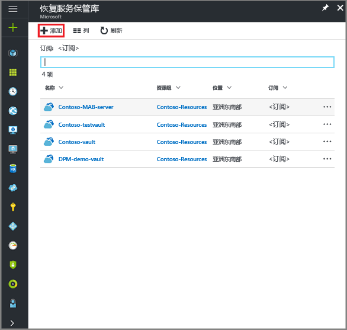

    此时会打开恢复服务保管库边栏选项卡，其中会提示提供“名称”、“订阅”、“资源组”和“位置”。

    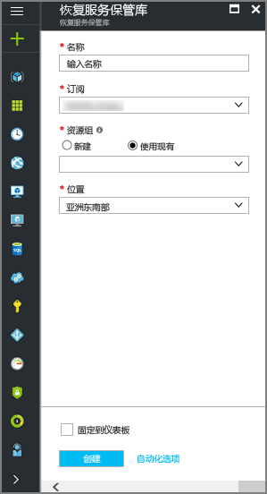

4. 对于“名称”，请输入一个友好名称以标识保管库 。 名称对于 Azure 订阅需要是唯一的。 键入包含 2 到 50 个字符的名称。 名称必须以字母开头，只能包含字母、数字和连字符。

5. 在“订阅”部分，通过下拉菜单选择 Azure 订阅。 如果只使用一个订阅，则会显示该订阅，用户可以跳到下一步。 如果不确定要使用哪个订阅，请使用默认的（或建议的）订阅。 仅当组织帐户与多个 Azure 订阅关联时，才会有多个选项。

6. 在“资源组”部分：

    * 如果要创建资源组，请选择“新建”。
    或
    * 选择“使用现有项”，并单击下拉菜单查看可用的资源组列表。

  有关资源组的完整信息，请参阅 [Azure 资源管理器概述](../azure-resource-manager/resource-group-overview.md)。

7. 单击“位置”，为保管库选择地理区域  。 此选项决定了备份数据要发送到的地理区域。

8. 在恢复服务保管库边栏选项卡的底部，单击“创建”。

    创建恢复服务保管库可能需要数分钟。 可以在门户右上区域监视状态通知。 创建保管库后，它会显示在“恢复服务保管库”的列表中。 如果在几分钟后看不到保管库，请单击“刷新”。

     

    一旦在恢复服务保管库列表中看到保管库，即可设置存储冗余。

### 为保管库设置存储冗余
在创建恢复服务保管库时，请确保存储冗余配置为所希望的方式。

1. 在“恢复服务保管库”边栏选项卡中，单击新保管库。

    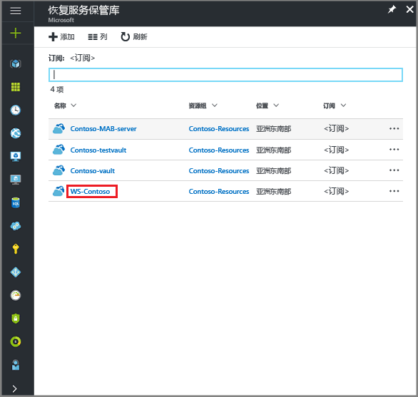

    选择保管库时，“恢复服务保管库”边栏选项卡会缩窄，“设置”边栏选项卡（*顶部有保管库的名称*）和保管库详细信息边栏选项卡会打开。

    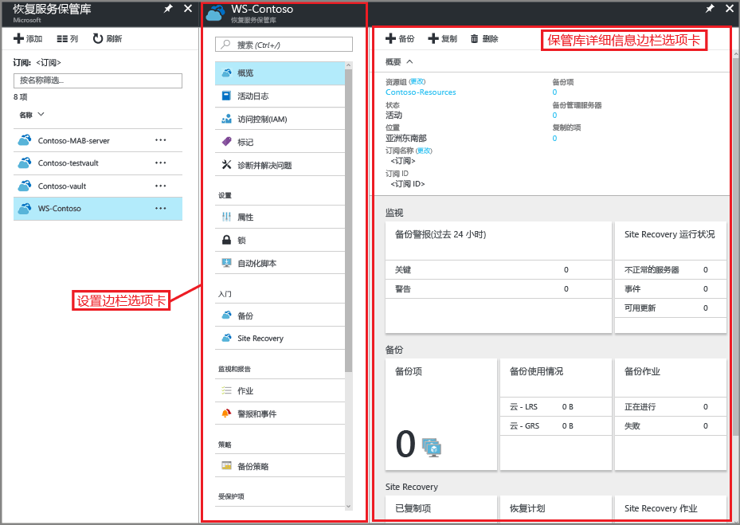
2. 在新保管库的“设置”边栏选项卡中，使用垂直滚动条向下滚动到“管理”部分，并单击“备份基础结构”。
    此时会打开“备份基础结构”边栏选项卡。
3. 在“备份基础结构”边栏选项卡中，单击“备份配置”打开“备份配置”边栏选项卡。

    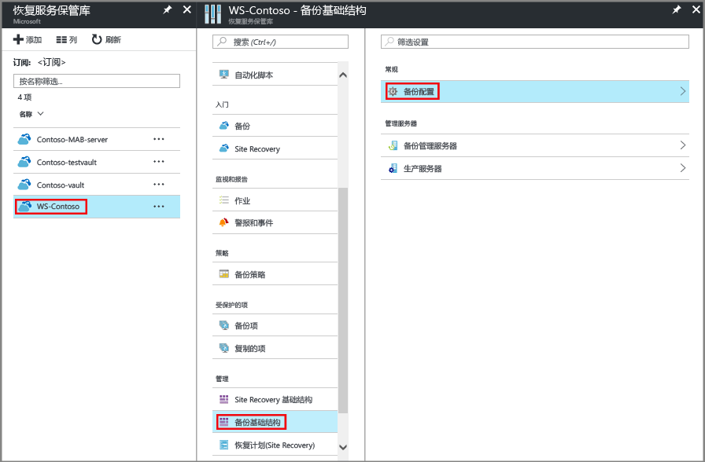
4. 为保管库选择合适的存储复制选项。

    

    默认情况下，保管库具有异地冗余存储。 如果使用 Azure 作为主要备份存储终结点，请继续使用“异地冗余”。 如果不使用 Azure 作为主要的备份存储终结点，则请选择“本地冗余”，减少 Azure 存储费用。 请在此[存储冗余概述](../storage/common/storage-redundancy.md)中深入了解[异地冗余](../storage/common/storage-redundancy-grs.md)和[本地冗余](../storage/common/storage-redundancy-lrs.md)存储选项。

创建保管库之后，即可对其进行配置，以便备份 Windows 系统状态。

## 配置保管库
1. 在“恢复服务保管库”边栏选项卡（对应于刚创建的保管库）的“开始”部分单击“备份”，并在“开始使用备份”边栏选项卡上选择“备份目标”。

    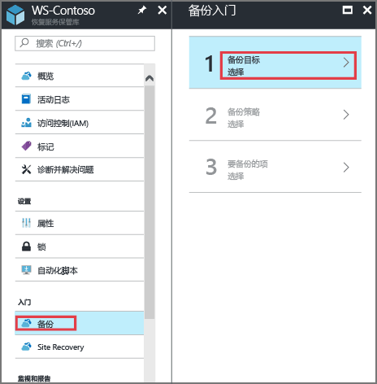

    此时会打开“备份目标”边栏选项卡。

    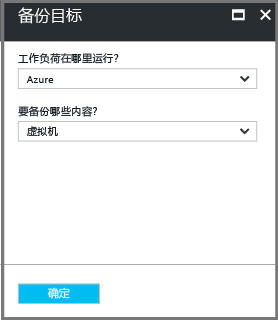

2. 从“工作负荷的运行位置?”下拉菜单中选择“本地”。

    之所以选择“本地”，是因为 Windows Server 或 Windows 计算机是不在 Azure 中的物理机。

3. 从“要备份的项?”菜单中选择“系统状态”，并单击“确定”。

    

    单击“确定”后，会在“备份目标”旁边显示一个复选标记，并会打开“准备基础结构”边栏选项卡。

    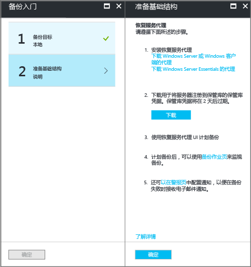

4. 在“准备基础结构”边栏选项卡上，单击“下载 Windows Server 或 Windows 客户端的代理”。

    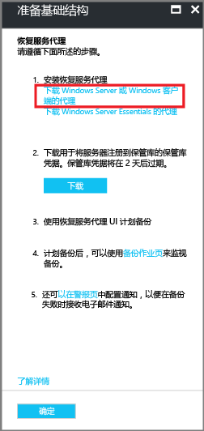

    如果使用的是 Windows Server Essential，则选择下载 Windows Server Essential 的代理。 弹出菜单会提示用户运行或保存 MARSAgentInstaller.exe。

    

5. 在下载弹出窗口中单击“保存”。

    默认情况下，**MARSagentinstaller.exe** 文件将保存到 Downloads 文件夹。 下载完安装程序以后，会显示一个弹出窗口，询问用户是要运行安装程序，还是要打开文件夹。

    

    此时还不需要安装代理。 下载保管库凭据之后，即可安装代理。

6. 在“准备基础结构”边栏选项卡上，单击“下载”。

    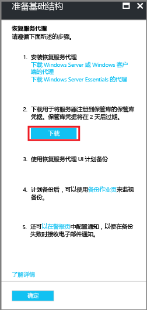

    保管库凭据下载到 Downloads 文件夹。 下载完保管库凭据以后，会显示一个弹出窗口，询问用户是要打开还是要保存凭据。 单击“ **保存**”。 如果意外地单击了“打开”，可以让尝试打开保管库凭据的对话框关闭。 不能打开保管库凭据。 继续下一步。 保管库凭据位于 Downloads 文件夹中。   

    
> [!NOTE]
> 保管库凭据只能保存到打算使用代理的 Windows Server 的本地位置。 
>

[!INCLUDE [backup-upgrade-mars-agent.md](../../includes/backup-upgrade-mars-agent.md)]

## 安装并注册代理

> [!NOTE]
> 尚未推出通过 Azure 门户启用备份这一功能。 使用 Microsoft Azure 恢复服务代理备份 Windows Server 的系统状态。
>

1. 在 Downloads 文件夹（或其他保存位置）中找到并双击 **MARSagentinstaller.exe**。

    安装程序会在提取、安装和注册恢复服务代理时提供一系列的消息。

    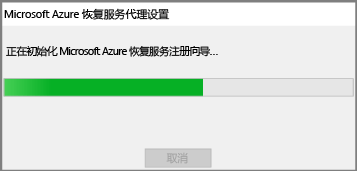

2. 完成 Microsoft Azure 恢复服务代理安装向导。 要完成该向导，需要：

   * 选择安装和缓存文件夹的位置。
   * 如果使用代理服务器来连接 Internet，请提供代理服务器信息。
   * 如果使用经过身份验证的代理，请提供用户名和密码详细信息。
   * 提供已下载的保管库凭据
   * 将加密通行短语保存在安全的位置。

     > [!NOTE]
     > 如果丢失或忘记了通行短语，Microsoft 无法帮助你恢复备份数据。 请将文件保存在安全的位置。 还原备份时需要用到此文件。
     >
     >

现已安装代理，且已向保管库注册计算机。 接下来可以配置和计划备份。

## 备份 Windows Server 系统状态 
初始备份包括两个任务：

* 计划备份
* 首次备份系统状态

若要完成初始备份，请使用 Microsoft Azure 恢复服务代理。

> [!NOTE]
> 可以在 Windows Server 2008 R2 到 Windows Server 2016 上备份系统状态。 客户端 SKU 不支持系统状态备份。 系统状态不会显示为 Windows 客户端或 Windows Server 2008 SP2 计算机选项。
>
>

### 计划备份作业

1. 打开 Microsoft Azure 恢复服务代理。 可以通过在计算机中搜索 **Microsoft Azure 备份**找到该代理。

    

2. 在恢复服务代理中，单击“ **计划备份**”。

    

3. 在计划备份向导的“开始使用”页上，单击“**下一步**”。

4. 在“选择要备份的项”页上，单击“**添加项**”。

5. 选择“系统状态”，并单击“确定”。

6. 单击“资源组名称” 的 Azure 数据工厂。

7. 在后续页中选择系统状态备份所需的备份频率和保留策略。 

8. 在“确认”页上复查信息，并单击“**完成**”。

9. 在向导完成创建备份计划后，请单击“**关闭**”。

### 首次备份 Windows Server 系统状态

1. 请确保需要重启的 Windows Server 没有挂起的更新。

2. 在恢复服务代理中单击“ **立即备份** ”，以通过网络完成初始种子设定。

    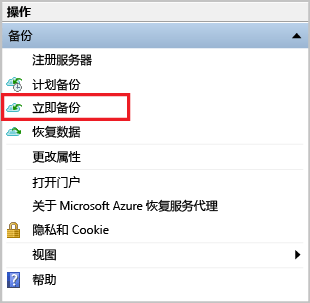

3. 在出现的“选择备份项”屏幕上选择“系统状态”，然后单击“下一步”。

4. 在“确认”页上复查“立即备份向导”用于备份计算机的设置。 然后单击“**备份**”。

4. 单击“**关闭**”以关闭向导。 如果在备份过程完成之前关闭向导，向导将继续在后台运行。

完成初始备份后，备份控制台中会显示“**作业已完成**”状态。

  

## 有疑问？
如果有疑问，或者希望包含某种功能，请 [给我们反馈](http://aka.ms/azurebackup_feedback)。

## 后续步骤
* 详细了解如何 [备份 Windows 计算机](backup-configure-vault.md)。
* 至此，你已备份 Windows Server 系统状态，接下来可以[管理保管库和服务器](backup-azure-manage-windows-server.md)了。
* 如果需要还原备份，请参阅[将文件还原到 Windows 计算机](backup-azure-restore-windows-server.md)一文。
