# 将 Azure 虚拟机备份到恢复服务保管库
> [!div class="op_single_selector"]
> * [使用恢复服务保管库保护 VM](backup-azure-vms-first-look-arm.md)
> * [使用备份保管库保护 VM](backup-azure-vms-first-look.md)
>
>

本教程将引导你完成创建恢复服务保管库和备份 Azure 虚拟机 (VM) 的步骤。 恢复服务保管库保护：

* Azure Resource Manager 部署型 VM
* 经典 VM
* 标准存储 VM
* 高级存储 VM
* 在托管磁盘上运行的 VM
* 使用 Azure 磁盘加密进行加密的 VM，以及 BEK 和 KEK
* 使用 VSS 对 Windows VM 进行应用程序一致性备份，以及使用自定义快照前和快照后脚本对 Linux VM 进行应用程序一致性备份

有关保护高级存储 VM 的详细信息，请参阅[备份和还原高级存储 VM](backup-introduction-to-azure-backup.md#using-premium-storage-vms-with-azure-backup)一文。 有关支持托管磁盘 VM 的详细信息，请参阅[备份和还原托管磁盘上的 VM](backup-introduction-to-azure-backup.md#using-managed-disk-vms-with-azure-backup)。 若要详细了解适用于 Linux VM 备份的前脚本和后脚本框架，请参阅[使用前脚本和后脚本进行应用程序一致性 Linux VM 备份] (https://docs.microsoft.com/azure/backup/backup-azure-linux-app-consistent)。

若要详细了解可备份和不可备份的内容，请参阅[此处](backup-azure-vms-prepare.md#limitations-when-backing-up-and-restoring-a-vm)

> [!NOTE]
> 本教程假设 Azure 订阅中已有 VM，且已采取措施允许备份服务访问 VM。
>
>

[!INCLUDE [learn-about-Azure-Backup-deployment-models](../../includes/backup-deployment-models.md)]

根据想要保护的虚拟机数量，可从不同的起点开始。 如果想通过一次操作备份多台虚拟机，请转到恢复服务保管库，并[从保管库仪表板启动备份作业](backup-azure-vms-first-look-arm.md#configure-the-backup-job-from-the-recovery-services-vault)。 如果想要备份单台虚拟机，可以从 VM 管理边栏选项卡启动备份作业。

## 从 VM 管理边栏选项卡配置备份作业

执行以下步骤，在 Azure 门户的虚拟机管理边栏选项卡中配置备份作业。 这些步骤不适用于经典门户中的虚拟机。

1. 登录到 [Azure 门户](https://portal.azure.com/)。
2. 在“中心”菜单上，单击“更多服务”，然后在“筛选器”对话框中键入“虚拟机”。 键入时，系统将筛选出资源列表。 看到虚拟机时，请选择它。

  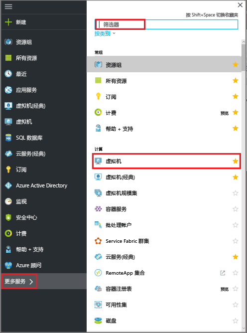

  将显示订阅中的虚拟机 (VM) 列表。

  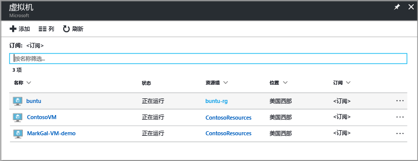

3. 从列表中选择要备份的 VM。

  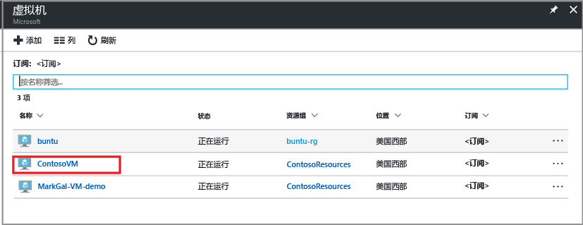

  选择 VM 时，虚拟机列表会移至左侧，并且虚拟机管理边栏选项卡和虚拟机仪表板将打开。  
 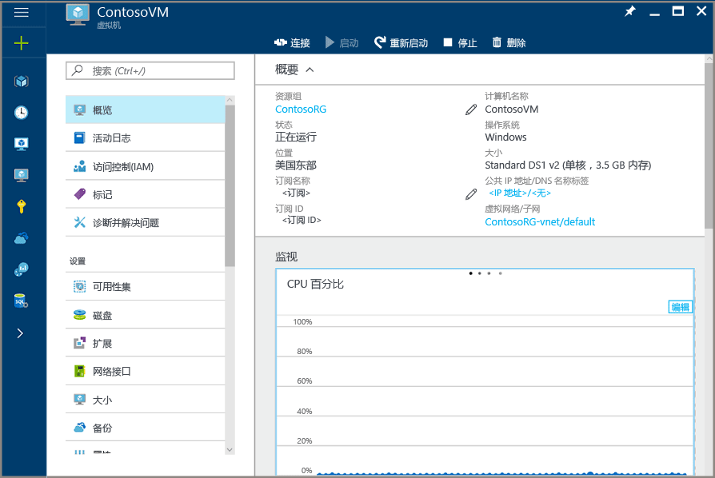

4. 在 VM 管理边栏选项卡上的“设置”部分中，单击“备份”。  

  

  此时将打开“启用备份”边栏选项卡。

  

5. 对于恢复服务保管库，请单击“选择现有”，并从下拉列表中选择保管库。

  

  如果没有恢复服务保管库，或想要使用新的保管库，可单击“新建”并提供新保管库的名称。 将在与虚拟机相同的资源组和相同的位置中创建新保管库。 如果想要使用不同的值创建恢复服务保管库，请参阅如何[创建恢复服务保管库](backup-azure-vms-first-look-arm.md#create-a-recovery-services-vault-for-a-vm)部分。

6. 若要查看备份策略的详细信息，请单击“备份策略”。

  “备份策略”边栏选项卡将打开，并提供所选策略的详细信息。 如果存在其他策略，可使用下拉菜单选择不同的备份策略。 如果要创建策略，请从下拉菜单中选择“新建”。 有关定义备份策略的说明，请参阅[定义备份策略](backup-azure-vms-first-look-arm.md#defining-a-backup-policy)。 若要保存对备份策略所做的更改并返回“启用备份”边栏选项卡，请单击“确定”。

  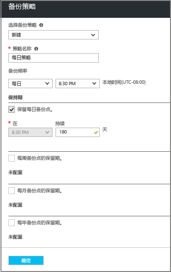

7. 在“启用备份”边栏选项卡中，单击“启用备份”对策略进行部署。 部署策略时，会将策略与保管库和虚拟机进行关联。

  

8. 可通过门户中显示的通知跟踪配置进度。 以下示例显示“部署已启动”。

  

9. 配置进度完成后，在 VM 管理边栏选项卡上，单击“备份”打开“备份项”边栏选项卡并查看详细信息。

  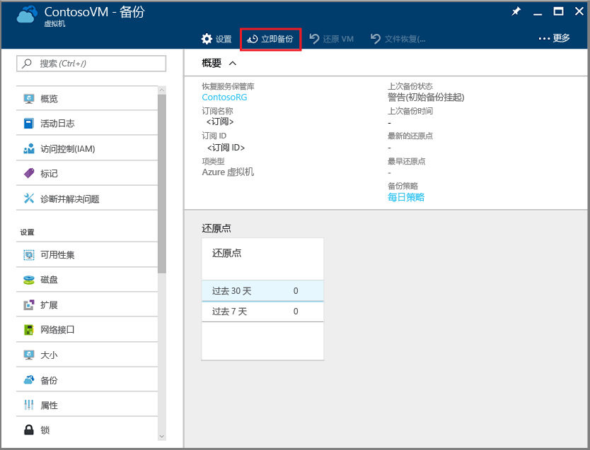

  完成初始备份之前，“上次备份状态”显示为“警告(初始备份挂起)”。 若要查看下一个计划的备份作业的进行时间，请在“备份策略”下单击该策略的名称。 “备份策略”边栏选项卡将打开，并显示计划的备份时间。

10. 若要运行备份作业并创建初始恢复点，请在“备份”保管库边栏选项卡上单击“立即备份”。

  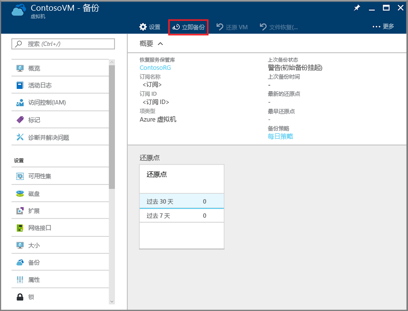

  “立即备份”边栏选项卡随即打开。

  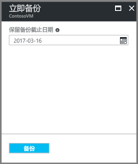

11. 在“立即备份”边栏选项卡上，单击日历图标，使用日历控件选择保留此恢复点的最后一天，然后单击“备份”。

  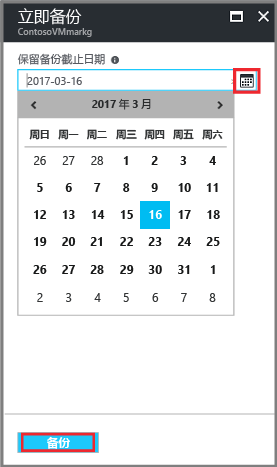

  部署通知会告知你备份作业已触发，并且你可以在“备份作业”页面上监视作业的进度。

## 从恢复服务保管库配置备份作业
若要配置备份作业，请完成以下步骤。  

1. 为虚拟机创建恢复服务保管库。
2. 使用 Azure 门户选择方案、设置备份策略，并标识要保护的项。
3. 运行初始备份。

## 为 VM 创建恢复服务保管库
恢复服务保管库是存储所有按时间创建的备份和恢复点的实体。 恢复服务保管库还包含应用到受保护 VM 的备份策略。

> [!NOTE]
> 备份 VM 是在本地执行的过程。 无法将某个位置的 VM 备份到另一个位置的恢复服务保管库。 因此，对于包含要备份的 VM 的具有 Azure 位置，必须至少有一个恢复服务保管库。
>
>

若要创建恢复服务保管库，请执行以下操作：

1. 如果尚未登录 [Azure 门户](https://portal.azure.com/)，请使用 Azure 订阅登录。
2. 在“中心”菜单上，单击“更多服务”，然后在“筛选器”对话框中键入“恢复服务”。 键入时，系统将筛选出资源列表。 在列表中看见“恢复服务保管库”时，请单击它。

    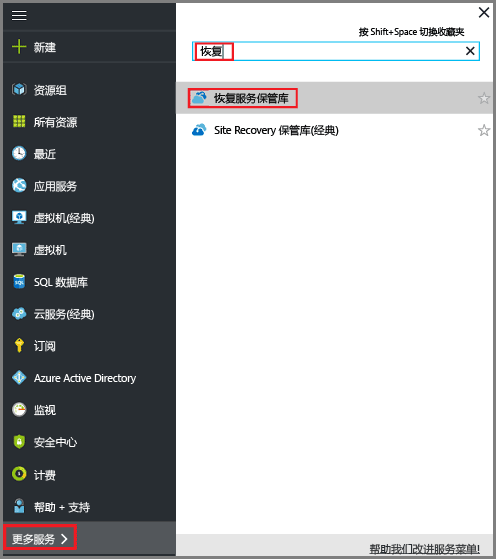  

    如果在订阅中有恢复服务保管库，则会列出这些保管库。

    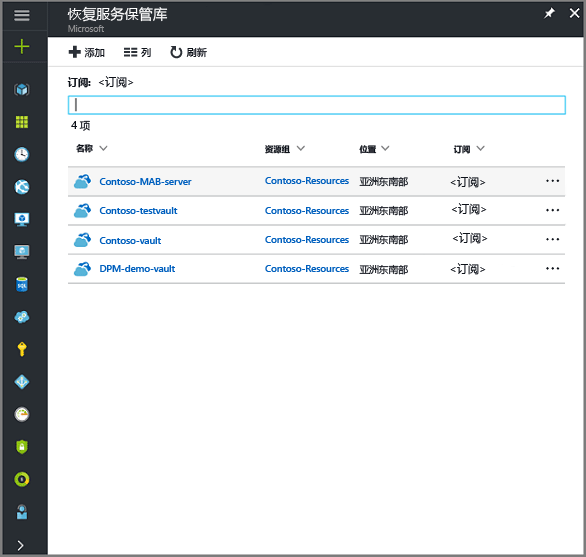
3. 在“恢复服务保管库”菜单中，单击“添加”。

    

    此时将打开恢复服务保管库边栏选项卡，其中会提示你提供“名称”、“订阅”、“资源组”和“位置”。

    

4. 对于“名称”，请输入一个友好名称以标识保管库 。 名称对于 Azure 订阅需要是唯一的。 键入包含 2 到 50 个字符的名称。 名称必须以字母开头，只能包含字母、数字和连字符。

5. 在“订阅”部分，通过下拉菜单选择 Azure 订阅。 如果只使用一个订阅，则会显示该订阅，用户可以跳到下一步。 如果不确定要使用哪个订阅，请使用默认的（或建议的）订阅。 仅当组织帐户与多个 Azure 订阅关联时，才会有多个选项。

6. 在“资源组”部分：

    * 如果要创建资源组，请选择“新建”。
    或
    * 选择“使用现有项”，然后单击下拉菜单查看可用的资源组列表。

  有关资源组的完整信息，请参阅 [Azure Resource Manager 概述](../azure-resource-manager/resource-group-overview.md)。

7. 单击“位置”，为保管库选择地理区域  。 此选项决定了备份数据要发送到的地理区域。

  > [!IMPORTANT]
  > 如果你不确定 VM 的所在位置，请关闭保管库创建对话框，并转到门户中的虚拟机列表。 如果多个区域中有虚拟机，请在每个区域中创建恢复服务保管库。 请先在第一个位置创建保管库，然后转到下一个位置。 无需指定用于存储备份数据的存储帐户 - 恢复服务保管库和 Azure 备份服务会自动处理存储。
  >

8. 在恢复服务保管库边栏选项卡的底部，单击“创建”。

    创建恢复服务保管库可能需要数分钟。 可以在门户右上区域监视状态通知。 创建保管库后，它将显示在“恢复服务保管库”的列表中。 如果在几分钟后看不到保管库，请单击“刷新”。

     

    一旦在恢复服务保管库列表中看到保管库，即可设置存储冗余。

现已创建保管库，接下来请了解如何设置存储复制。

### 设置存储复制
存储复制选项可让你在异地冗余存储与本地冗余存储之间进行选择。 默认情况下，保管库具有异地冗余存储。 如果恢复服务保管库是主备份，请将存储复制选项设置为异地冗余存储。 如果想要一个更便宜、但持久性不高的选项，请选择“本地冗余存储”。 请参阅 [Azure 存储复制概述](../storage/storage-redundancy.md)部分，深入了解[异地冗余](../storage/storage-redundancy.md#geo-redundant-storage)和[本地冗余](../storage/storage-redundancy.md#locally-redundant-storage)存储选项。

若要编辑存储复制设置，请执行以下操作：

1. 在“恢复服务保管库”边栏选项卡中，选择新保管库。

  

  选择保管库时，“设置”边栏选项卡（顶部有保管库的名称）和保管库详细信息边栏选项卡会打开。

  

2. 在新保管库的“设置”边栏选项卡中，使用垂直滚动条向下滚动到“管理”部分，然后单击“备份基础结构”。
    此时会打开“备份基础结构”边栏选项卡。
3. 在“备份基础结构”边栏选项卡中，单击“备份配置”打开“备份配置”边栏选项卡。

    
4. 为你的保管库选择合适的存储复制选项。

    

    默认情况下，保管库具有异地冗余存储。 如果使用 Azure 作为主要备份存储终结点，请继续使用“异地冗余”。 如果不使用 Azure 作为主要的备份存储终结点，则请选择“本地冗余”，减少 Azure 存储费用。 请在此[存储冗余概述](../storage/storage-redundancy.md)中深入了解[异地冗余](../storage/storage-redundancy.md#geo-redundant-storage)和[本地冗余](../storage/storage-redundancy.md#locally-redundant-storage)存储选项。

## 选择备份目标、设置策略并定义要保护的项
在向保管库注册 VM 前，请先执行发现过程，以确保能够识别任何添加到订阅中的新虚拟机。 该过程将在 Azure 上查询订阅中的虚拟机列表和其他信息，例如云服务名称、区域等。 在 Azure 门户中，方案是指要放入恢复服务保管库中的项。 策略是有关恢复点创建频率和时间的计划。 策略还包含恢复点的保留范围。

1. 如果已打开恢复服务保管库，请转到步骤 2。 否则，请在“中心”菜单上单击“更多服务”，然后在资源列表中键入“恢复服务”并单击“恢复服务保管库”。

      

    此时将显示恢复服务保管库列表。

    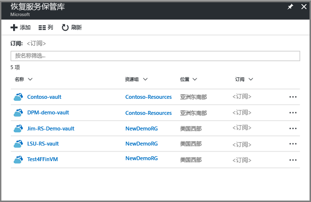

    从恢复服务保管库的列表中，选择一个保管库以打开其仪表板。

     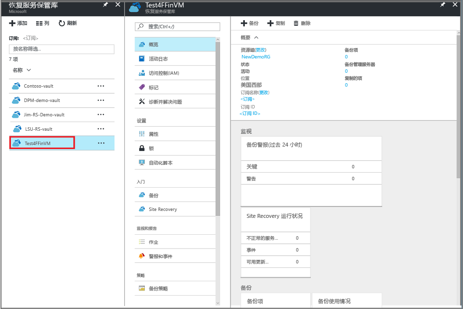

2. 在保管库仪表板菜单中，单击“备份”打开“备份”边栏选项卡。

    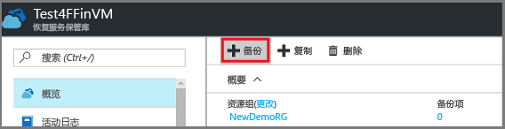

    此时会打开“备份”和“备份目标”边栏选项卡。

    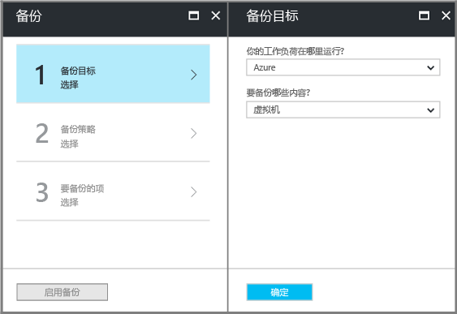
3. 在“备份目标”边栏选项卡上，从“工作负荷的运行位置”下拉菜单中选择 Azure。 从“希望备份的内容”下拉列表中选择虚拟机，然后单击“确定”。

    这些操作将向保管库注册 VM 扩展。 随即关闭“备份目标”边栏选项卡，然后打开“备份策略”边栏选项卡。

    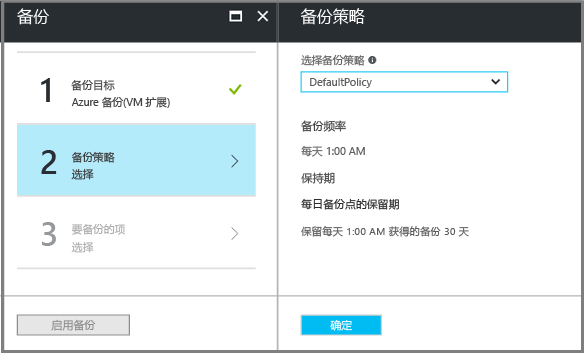

4. 在“备份策略”边栏选项卡中，选择要应用到保管库的备份策略。

    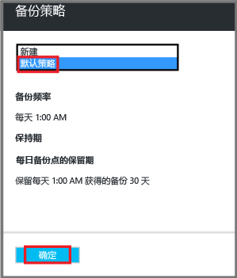

    默认策略的详细信息将在下拉菜单下列出。 如果要创建策略，请从下拉菜单中选择“新建”。 有关定义备份策略的说明，请参阅[定义备份策略](backup-azure-vms-first-look-arm.md#defining-a-backup-policy)。
    单击“确定”，将备份策略与保管库关联。

    随即关闭“备份策略”边栏选项卡，然后打开“选择虚拟机”边栏选项卡。
5. 在“选择虚拟机”边栏选项卡中，选择要与指定策略关联的虚拟机，然后单击“确定”。

    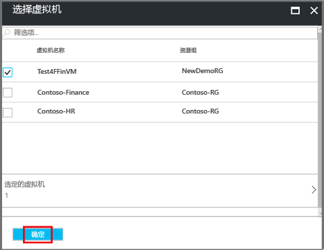

    所选虚拟机已验证。 如果未看到应出现的虚拟机，请检查它们是否在恢复服务保管库所在的同一 Azure 位置中。 恢复服务保管库的位置显示在保管库仪表板上。

6. 现在已定义保管库的所有设置，接下来请在“备份”边栏选项卡中，单击“启用备份”将策略部署到保管库和 VM。 部署备份策略不会创建虚拟机的初始恢复点。

    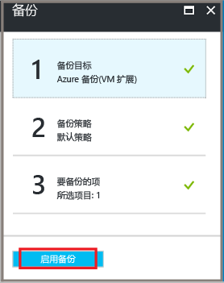

成功启用备份后，你的备份策略将按计划执行。 但是，将继续启动第一个备份作业。

## 初始备份
在虚拟机上部署备份策略后，并不意味着已备份好数据。 默认情况下，第一个计划的备份（在备份策略中定义）是初始备份。 在执行初始备份之前，“**备份作业**”边栏选项卡上的“上次备份状态”显示为“**警告(等待初始备份)**”。

除非初始备份预计马上开始，否则建议运行“立即备份” 。

若要运行初始备份作业，请执行以下操作：

1. 在保管库仪表板上，单击“备份项”下的数字，或单击“备份项”磁贴。  
  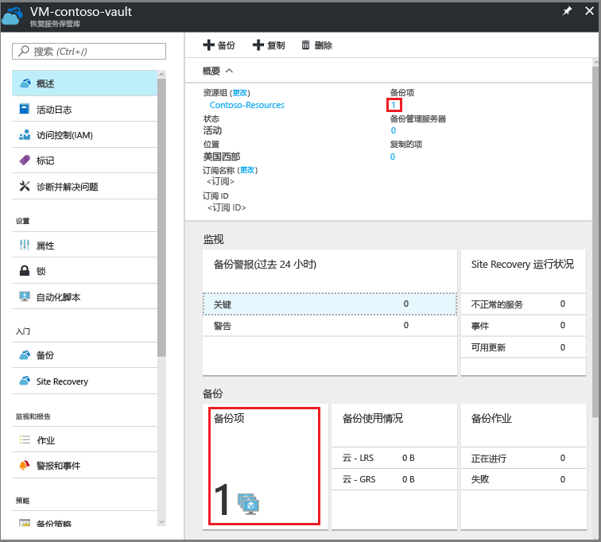

  “**备份项**”边栏选项卡随即打开。

  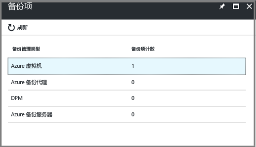

2. 在“备份项”边栏选项卡上，选择项。

  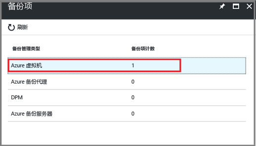

  “备份项”列表随即打开。  

  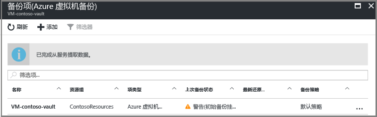

3. 在“备份项”列表中，单击省略号“...”以打开上下文菜单。

  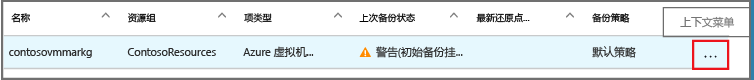

  上下文菜单随即打开。

  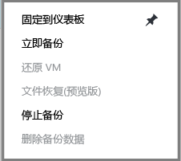

4. 在上下文菜单上，单击“立即备份”。

  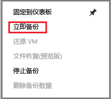

  “立即备份”边栏选项卡随即打开。

  

5. 在“立即备份”边栏选项卡上，单击日历图标，使用日历控件选择保留此恢复点的最后一天，然后单击“备份”。

  

  部署通知会告知你备份作业已触发，并且你可以在“备份作业”页面上监视作业的进度。 创建初始备份可能需要一些时间，具体取决于 VM 的大小。

6. 若要查看或跟踪初始备份的状态，请在保管仪表板的“备份作业”磁贴上，单击“正在进行”。

  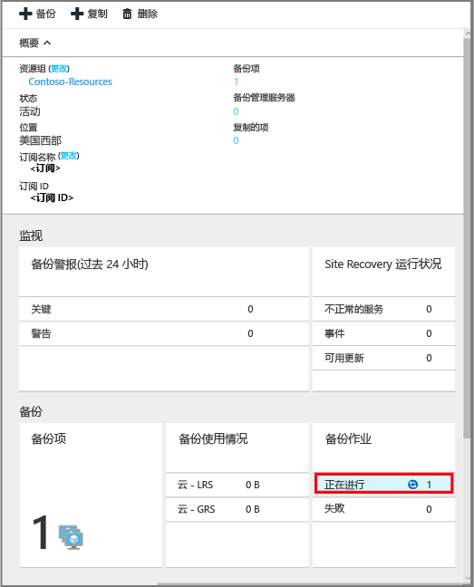

  “备份作业”边栏选项卡随即打开。

  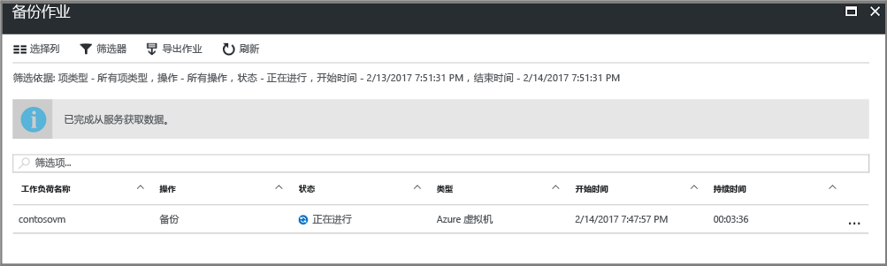

  在“**备份作业**”边栏选项卡中，可以看到所有作业的状态。 请查看 VM 的备份作业仍在进行中，还是已完成。 完成备份作业后，状态将变为“已完成”。

  > [!NOTE]
  > 在执行备份操作的过程中，Azure 备份服务将向每个 VM 中的备份扩展发出一条命令，刷新所有写入并取得一致快照。
  >
  >

[!INCLUDE [backup-create-backup-policy-for-vm](../../includes/backup-create-backup-policy-for-vm.md)]

## 在虚拟机中安装 VM 代理
此信息是根据需要提供的。 Azure VM 代理必须安装在 Azure 虚拟机上，备份扩展才能运行。 但是，如果 VM 创建自 Azure 资源库，则 VM 代理已存在于虚拟机上。 从本地数据中心迁移的 VM 上未安装 VM 代理。 在这种情况下，需要安装 VM 代理。 如果在备份 Azure VM 时遇到问题，请先检查是否已在虚拟机上正确安装 Azure VM 代理（请参阅下表）。 如果要创建自定义 VM，[请先确保已选中“安装 VM 代理”复选框](../virtual-machines/windows/classic/agents-and-extensions.md?toc=%2fazure%2fvirtual-machines%2fwindows%2fclassic%2ftoc.json)，然后再预配虚拟机。

了解 [VM 代理](https://go.microsoft.com/fwLink/?LinkID=390493&clcid=0x409)以及[如何安装它](../virtual-machines/windows/classic/manage-extensions.md?toc=%2fazure%2fvirtual-machines%2fwindows%2fclassic%2ftoc.json)。

下表提供了适用于 Windows 和 Linux VM 的 VM 代理的其他信息。

| **操作** | **Windows** | **Linux** |
| --- | --- | --- |
| 安装 VM 代理 |<li>下载并安装 [代理 MSI](http://go.microsoft.com/fwlink/?LinkID=394789&clcid=0x409)。 你需要有管理员权限才能完成安装。 <li>[更新 VM 属性](http://blogs.msdn.com/b/mast/archive/2014/04/08/install-the-vm-agent-on-an-existing-azure-vm.aspx) ，指明已安装代理。 |<li> 从 GitHub 安装最新的 [Linux 代理](https://github.com/Azure/WALinuxAgent) 。 你需要有管理员权限才能完成安装。 <li> [更新 VM 属性](http://blogs.msdn.com/b/mast/archive/2014/04/08/install-the-vm-agent-on-an-existing-azure-vm.aspx) ，指明已安装代理。 |
| 更新 VM 代理 |更新 VM 代理与重新安装 [VM 代理二进制文件](http://go.microsoft.com/fwlink/?LinkID=394789&clcid=0x409)一样简单。  确保在更新 VM 代理时，没有任何正在运行的备份操作。 |按照[更新 Linux VM 代理](../virtual-machines/linux/update-agent.md?toc=%2fazure%2fvirtual-machines%2flinux%2ftoc.json)中的说明进行操作。  确保在更新 VM 代理时，没有任何正在运行的备份操作。 |
| 验证 VM 代理安装 |<li>导航到 Azure VM 中的 *C:\WindowsAzure\Packages* 文件夹。 <li>你应会发现 WaAppAgent.exe 文件已存在。<li> 右键单击该文件，转到“**属性**”，然后选择“**详细信息**”选项卡。 “产品版本”字段应为 2.6.1198.718 或更高。 |不适用 |

### 备份扩展
在虚拟机上安装 VM 代理后，Azure 备份服务会将备份扩展安装到 VM 代理上。 Azure 备份服务会无缝地升级和修补备份扩展，不需用户进行额外的干预。

备份服务会安装备份扩展，即使 VM 未运行。 VM 运行时，很有可能会获得应用程序一致的恢复点。 但是，即使 VM 已关闭并且无法安装扩展，Azure 备份服务也会继续备份 VM。 此类型的备份称为脱机 VM，并且恢复点会*在崩溃时保持一致性*。

## 故障排除信息
如果你在完成本文中的某些任务时遇到问题，请参阅 [故障排除指南](backup-azure-vms-troubleshoot.md)。

## 定价
Azure VM 备份的成本取决于受保护实例的数目。 如需受保护实例的定义，请参阅[什么是受保护实例](backup-introduction-to-azure-backup.md#what-is-a-protected-instance)。 如果需要通过示例来了解如何计算虚拟机的备份费用，请参阅[受保护实例的计算方法](backup-azure-vms-introduction.md#calculating-the-cost-of-protected-instances)。 请参阅“Azure 备份定价”页，了解[备份定价](https://azure.microsoft.com/pricing/details/backup/)。

## 有疑问？
如果你有疑问，或者希望包含某种功能，请 [给我们反馈](http://aka.ms/azurebackup_feedback)。

