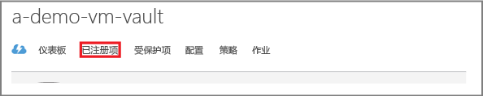
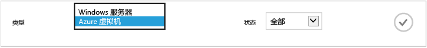
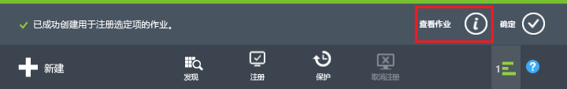
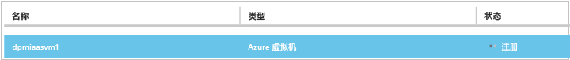
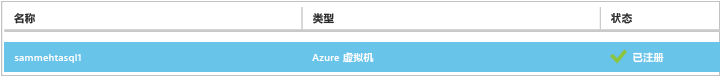
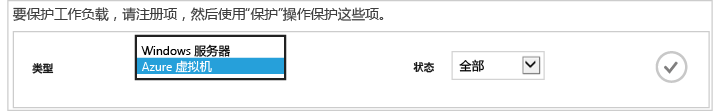
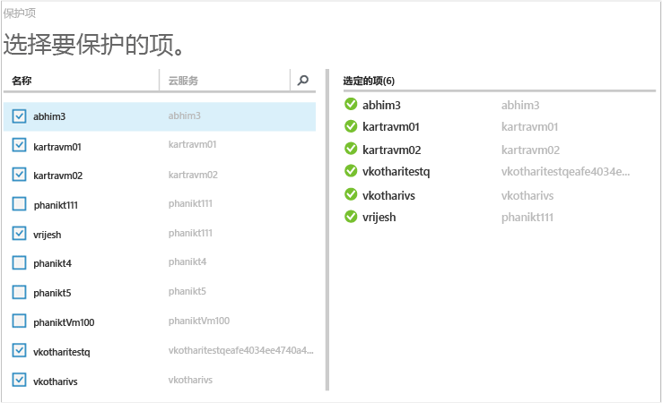
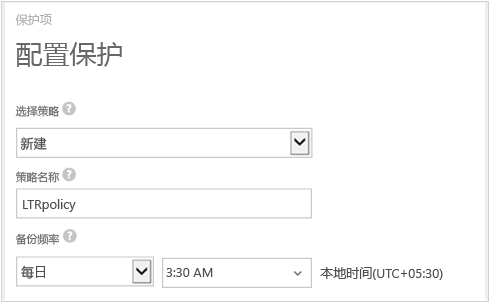
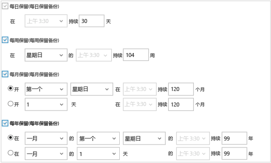

# 先睹为快：备份 Azure 虚拟机
> [!div class="op_single_selector"]
> * [使用恢复服务保管库保护 VM](backup-azure-vms-first-look-arm.md)
> * [使用备份保管库保护 Azure VM](backup-azure-vms-first-look.md)
>
>

本教程将引导你完成将 Azure 虚拟机 (VM) 备份到 Azure 的备份保管库的步骤。 本文介绍用于备份 VM 的经典模型或服务管理器部署模型。 以下步骤仅适用于在经典门户中创建的备份保管库。 Microsoft 建议新部署使用 Resource Manager 模型。

如果你对将 VM 备份到属于资源组的恢复服务保管库感兴趣，请参阅 [初步了解：使用恢复服务保管库保护 VM](backup-azure-vms-first-look-arm.md)。

若要顺利完成本教程，必须满足以下先决条件：

* 你已在 Azure 订阅中创建了一个 VM。
* VM 已连接到 Azure 公共 IP 地址。 有关更多信息，请参阅[网络连接](backup-azure-vms-prepare.md#network-connectivity)。

> [!NOTE]
> Azure 有两种用于创建和使用资源的部署模型： [Resource Manager 部署模型和经典部署模型](../azure-resource-manager/resource-manager-deployment-model.md)。 本教程适用于在经典门户中创建的虚拟机。
>
>

## 创建备份保管库
备份保管库是存储所有按时间创建的备份和恢复点的实体。 备份保管库还包含将应用到要备份的虚拟机的备份策略。

> [!IMPORTANT]
> 从 2017 年 3 月份开始，无法再使用经典门户来创建备份保管库。 现有备份保管库仍然受支持，并且可以[使用 Azure PowerShell 创建备份保管库](./backup-client-automation-classic.md#create-a-backup-vault)。 不过，Microsoft 建议你为所有部署创建恢复服务保管库，因为将来只会对恢复服务保管库进行增强。

## 发现并注册 Azure 虚拟机
向保管库注册 VM 之前，请运行发现过程以识别所有新 VM。 该过程将在订阅中返回虚拟机列表和其他信息，例如云服务名称、区域等。

1. 登录到 [Azure 经典门户](http://manage.windowsazure.com/)
2. 在 Azure 经典门户中，单击“ **恢复服务** ”打开恢复服务保管库列表。
    
3. 从保管库列表中，选择要备份 VM 的保管库。

    当你选择保管库时，它将在“ **快速启动** ”页面中打开
4. 在保管库菜单中，单击“ **已注册的项**”。

    
5. 在“**类型**”菜单中选择“**Azure 虚拟机**”。

    
6. 单击页面底部的“**发现**”。
    

    发现过程可能会需要几分钟，将以表格显示虚拟机。 屏幕底部有一个通知，让你知道系统正在运行发现过程。

    

    发现过程完成后，该通知会变化。

    
7. 单击页面底部的“**注册**”。
    
8. 在“**注册项**”快捷菜单中，选择你要注册的虚拟机。

   > [!TIP]
   > 可以一次注册多个虚拟机。
   >
   >

    为每一个选定的虚拟机创建一个作业。
9. 单击通知中的“**查看作业**”，转到“**作业**”页。

    

    虚拟机还会出现在注册项列表中，并会显示注册操作的状态。

    

    操作完成后，状态会改变以反映“ *已注册* ”状态。

    

## 在虚拟机中安装 VM 代理
Azure VM 代理必须安装在 Azure 虚拟机上，备份扩展才能运行。 如果 VM 是从 Azure 库创建的，则该 VM 上已包含 VM 代理；你可以跳到[保护 VM](backup-azure-vms-first-look.md#create-the-backup-policy)。

如果你的 VM 是从本地数据中心迁移的，则该 VM 上可能尚未安装 VM 代理。 必须先在虚拟机上安装 VM 代理，然后才能继续保护 VM。 有关安装 VM 代理的详细步骤，请参阅 [“备份 VMs”一文中“VM 代理”部分](backup-azure-vms-prepare.md#vm-agent)。

## 创建备份策略
在触发初始备份作业之前，请设置计划来规定何时创建备份快照。 规定备份快照创建时间以及快照保留时长的计划就是备份策略。 保留期信息基于祖父-父-子备份轮转方案。

1. 导航到备份保管库（位于 Azure 经典门户的“恢复服务”下），然后单击“已注册项”。
2. 从下拉菜单中选择“**Azure 虚拟机**”。

    
3. 单击页面底部的“ **保护** ”。
    

    此时将显示“ **保护项** ”向导，其中 *只* 列出了已注册但未受保护的虚拟机。

    
4. 选择要保护的虚拟机。

    如果存在两个以上的同名虚拟机，请使用云服务来区别虚拟机。
5. 在“ **配置保护** ”菜单中，选择现有策略或创建新策略，以保护你标识的虚拟机。

    新备份保管库与一个默认策略相关联。 此策略在每天晚上创建每日快照，该每日快照将保留 30 天。 每个备份策略可以有多个关联的虚拟机。 但无论何时，该虚拟机只能与一个策略相关联。

    

   > [!NOTE]
   > 备份策略包括计划备份的保留期方案。 如果选择现有的备份策略，则不能修改下一步的保留期选项。
   >
   >
6. 在“ **保留范围** ”中，定义特定备份点的每日、每周、每月和每年范围。

    

    保留策略指定存储备份的时间长短。 你可以根据备份的时间指定不同的保留策略。
7. 单击“作业”查看“配置保护”作业的列表。

    

    现在你已创建策略，接下来请转到下一步骤，运行初始备份。

## 初始备份
在虚拟机受到策略保护后，可以在“ **受保护的项** ”选项卡上查看该关系。 在执行初始备份之前，“保护状态”将显示为“受保护 - (等待初始备份)”。 默认情况下，第一个计划的备份是 *初始备份*。

若要立即开始初始备份，请执行以下操作：

1. 在“受保护的项”页底部，单击“立即备份”。
    

    Azure 备份服务将为初始备份操作创建备份作业。
2. 单击“**作业**”选项卡查看作业列表。

    

    完成初始备份后，“ **受保护的项** ”选项卡中的虚拟机状态将显示为“ *受保护*”。

    

   > [!NOTE]
   > 备份虚拟机是在本地完成的过程。 你不能将一个区域的虚拟机备份到另一个区域的备份保管库。 因此，对于每个需要备份 VM 的 Azure 区域，需要在该区域中至少创建一个备份保管库。
   >
   >

## 后续步骤
成功备份 VM 后，你可能需要执行几个相关的步骤。 最合理的步骤是熟悉将数据还原到 VM 的操作。 但是，有几个管理任务可帮助你了解如何确保数据安全和成本最小化。

* [管理和监视你的虚拟机](backup-azure-manage-vms.md)
* [恢复虚拟机](backup-azure-restore-vms.md)
* [故障排除指南](backup-azure-vms-troubleshoot.md)

## 有疑问？
如果你有疑问，或者希望包含某种功能，请 [给我们反馈](http://aka.ms/azurebackup_feedback)。

