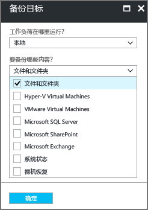

# 通过 Resource Manager 部署模型将 Windows Server 或客户端备份到 Azure
本文介绍如何通过 Resource Manager 部署模型使用 Azure 备份将 Windows Server（或 Windows 客户端）文件和文件夹备份到 Azure。

## 开始之前
要将服务器或客户端备份到 Azure，需要一个 Azure 帐户。 如果没有帐户，只需几分钟的时间就能创建一个[免费帐户](https://azure.microsoft.com/free/)。

## 创建恢复服务保管库
恢复服务保管库是存储所有按时间创建的备份和恢复点的实体。 恢复服务保管库还包含应用到受保护文件和文件夹的备份策略。 在创建恢复服务保管库时，还应选择适当的存储冗余选项。

### 创建恢复服务保管库
1. 如果尚未登录 [Azure 门户](https://portal.azure.com/)，请使用 Azure 订阅登录。
2. 在“中心”菜单中单击“所有服务”，然后在资源列表中键入“恢复服务”并单击“恢复服务保管库”。

      

    如果在订阅中有恢复服务保管库，则会列出这些保管库。

3. 在“恢复服务保管库”菜单中，单击“添加”。

    

    此时会打开恢复服务保管库边栏选项卡，其中会提示提供“名称”、“订阅”、“资源组”和“位置”。

    

4. 对于“名称”，请输入一个友好名称以标识保管库 。 名称对于 Azure 订阅需要是唯一的。 键入包含 2 到 50 个字符的名称。 名称必须以字母开头，只能包含字母、数字和连字符。

5. 在“订阅”部分，通过下拉菜单选择 Azure 订阅。 如果只使用一个订阅，则会显示该订阅，用户可以跳到下一步。 如果不确定要使用哪个订阅，请使用默认的（或建议的）订阅。 仅当组织帐户与多个 Azure 订阅关联时，才会有多个选项。

6. 在“资源组”部分：

    * 如果要创建新的资源组，请选择“新建”。
    或
    * 选择“使用现有项”，并单击下拉菜单查看可用的资源组列表。

  有关资源组的完整信息，请参阅 [Azure 资源管理器概述](../azure-resource-manager/resource-group-overview.md)。

7. 单击“位置”，为保管库选择地理区域  。 此选项决定了备份数据要发送到的地理区域。

8. 在恢复服务保管库边栏选项卡的底部，单击“创建”。

  创建恢复服务保管库可能需要数分钟。 可以在门户右上区域监视状态通知。 创建保管库后，它会显示在“恢复服务保管库”的列表中。 如果在几分钟后看不到保管库，请单击“刷新”。

   

  一旦在恢复服务保管库列表中看到保管库，即可设置存储冗余。

### 设置存储冗余
在首次创建恢复服务保管库时，需确定复制存储的方式。

1. 在“恢复服务保管库”边栏选项卡中，单击新保管库。

    

    选择保管库时，“恢复服务保管库”边栏选项卡会缩窄，“设置”边栏选项卡（*顶部有保管库的名称*）和保管库详细信息边栏选项卡会打开。

    

2. 在新保管库的“设置”边栏选项卡中，使用垂直滚动条向下滚动到“管理”部分，并单击“备份基础结构”。

  此时会打开“备份基础结构”边栏选项卡。

3. 在“备份基础结构”边栏选项卡中，单击“备份配置”打开“备份配置”边栏选项卡。

  

4. 为保管库选择合适的存储复制选项。

  

  默认情况下，保管库具有异地冗余存储。 如果使用 Azure 作为主要备份存储终结点，请继续使用“异地冗余”。 如果不使用 Azure 作为主要的备份存储终结点，则请选择“本地冗余”，减少 Azure 存储费用。 请在此[存储冗余概述](../storage/common/storage-redundancy.md)中深入了解[异地冗余](../storage/common/storage-redundancy.md#geo-redundant-storage)和[本地冗余](../storage/common/storage-redundancy.md#locally-redundant-storage)存储选项。

现在已创建了一个保管库，可以准备基础结构以备份文件和文件夹了，方法是下载并安装 Microsoft Azure 恢复服务代理、下载保管库凭据，并使用这些凭据向保管库注册该代理。

## 配置保管库

1. 在“恢复服务保管库”边栏选项卡（对应于刚创建的保管库）的“开始”部分单击“备份”，并在“开始使用备份”边栏选项卡上选择“备份目标”。

  

  此时会打开“备份目标”边栏选项卡。 如果之前已配置了恢复服务保管库，在恢复服务保管库边栏选项卡上单击“备份”时，“备份目标”边栏选项卡将打开。

  

2. 从“工作负荷的运行位置?”下拉菜单中选择“本地”。

  之所以选择“本地”，是因为 Windows Server 或 Windows 计算机是不在 Azure 中的物理机。

3. 从“要备份的项?”菜单中选择“文件和文件夹”，并单击“确定”。

  

  单击“确定”后，会在“备份目标”旁边显示一个复选标记，并会打开“准备基础结构”边栏选项卡。

  

4. 在“准备基础结构”边栏选项卡上，单击“下载 Windows Server 或 Windows 客户端的代理”。

  

  如果使用的是 Windows Server Essential，则选择下载 Windows Server Essential 的代理。 弹出菜单会提示用户运行或保存 MARSAgentInstaller.exe。

  

5. 在下载弹出窗口中单击“保存”。

  默认情况下，**MARSagentinstaller.exe** 文件将保存到 Downloads 文件夹。 下载完安装程序以后，会显示一个弹出窗口，询问用户是要运行安装程序，还是要打开文件夹。

  

  此时还不需要安装代理。 下载保管库凭据之后，即可安装代理。

6. 在“准备基础结构”边栏选项卡上，单击“下载”。

  

  保管库凭据下载到 Downloads 文件夹。 下载完保管库凭据以后，会显示一个弹出窗口，询问用户是要打开还是要保存凭据。 单击“ **保存**”。 如果意外地单击了“打开”，可以让尝试打开保管库凭据的对话框关闭。 不能打开保管库凭据。 继续下一步。 保管库凭据位于 Downloads 文件夹中。   

  

## 安装并注册代理

> [!NOTE]
> 尚未推出通过 Azure 门户启用备份这一功能。 请使用 Microsoft Azure 恢复服务代理备份文件和文件夹。
>

1. 在 Downloads 文件夹（或其他保存位置）中找到并双击 **MARSagentinstaller.exe**。

  安装程序会在提取、安装和注册恢复服务代理时提供一系列的消息。

  

2. 完成 Microsoft Azure 恢复服务代理安装向导。 要完成该向导，需要：

  * 选择安装和缓存文件夹的位置。
  * 如果使用代理服务器来连接 Internet，请提供代理服务器信息。
  * 如果使用经过身份验证的代理，请提供用户名和密码详细信息。
  * 提供已下载的保管库凭据
  * 将加密通行短语保存在安全的位置。

  > [!NOTE]
  > 如果丢失或忘记了通行短语，Microsoft 无法帮助你恢复备份数据。 请将文件保存在安全的位置。 还原备份时需要用到此文件。
  >
  >

现已安装代理，且已向保管库注册计算机。 接下来可以配置和计划备份。

## 网络和连接要求

如果计算机/代理具有有限的 internet 访问，请确保计算机/代理上的防火墙设置配置为允许以下 URL：  
    1. www.msftncsi.com
    2. *.Microsoft.com
    3. *.WindowsAzure.com
    4. *.microsoftonline.com
    5. *.windows.net

## 创建备份策略
备份策略是有关以下事项的计划：何时创建恢复点，以及恢复点保留的时间长度。 可以使用 Microsoft Azure 备份代理为文件和文件夹创建备份策略。

### 创建备份计划
1. 打开 Microsoft Azure 备份代理。 可以通过在计算机中搜索 **Microsoft Azure 备份**找到该代理。

    
2. 在备份代理的“操作”窗格中，单击“计划备份”以启动计划备份向导。

    

3. 在计划备份向导的“开始使用”页上，单击“下一步”。
4. 在“选择要备份的项”页上，单击“添加项”。

  “选择项”对话框随即打开。

5. 选择要保护的文件和文件夹，并单击“确定”。
6. 在“选择要备份的项”页上，单击“下一步”。
7. 在“指定备份计划”页上，指定备份计划，并单击“下一步”。

    可以计划每日（频率为一天最多三次）或每周备份。

    

   > [!NOTE]
   > 有关如何指定备份计划的详细信息，请参阅 [使用 Azure 备份来取代磁带基础结构](backup-azure-backup-cloud-as-tape.md)一文。
   >
   >

8. 在“选择保留策略”页上，为备份副本选择具体的保留策略，并单击“下一步”。

    保留策略指定备份将存储的时间长度。 可以根据备份的创建时间指定不同的保留策略，而不只是为所有备份点指定一个“通用的策略”。 可以根据需要修改每日、每周、每月和每年保留策略。
9. 在“选择初始备份类型”页上，选择初始备份类型。 将“**自动通过网络**”选项保持选中状态，并单击“**下一步**”。

    可以通过网络自动备份，或者脱机备份。 本文的余下部分介绍自动备份过程。 如果想要执行脱机备份，请查看 [Azure 备份中的脱机备份工作流](backup-azure-backup-import-export.md) 以了解更多信息。
10. 在“确认”页上复查信息，并单击“**完成**”。
11. 在向导完成创建备份计划后，请单击“**关闭**”。

### 启用网络限制
Microsoft Azure 备份代理提供了网络限制。 限制功能将控制数据传输期间的网络带宽使用方式。 如果需要在上班时间内备份数据，但不希望备份程序干扰其他 Internet 流量，此控制机制很有帮助。 限制适用于备份和还原活动。

> [!NOTE]
> 网络限制在 Windows Server 2008 R2 SP1、Windows Server 2008 SP2 或 Windows 7（带 Service Pack）上不可用。 Azure 备份网络限制功能需要在本地操作系统上使用服务质量 (QoS)。 虽然 Azure 备份可以保护这些操作系统，但这些平台上的可用 QoS 版本不兼容 Azure 备份网络限制。 网络限制可用于所有其他[支持的操作系统](backup-azure-backup-faq.md)。
>
>

**启用网络限制**

1. 在 Microsoft Azure 备份代理中，单击“更改属性”。

    
2. 在“**限制**”选项卡上，选中“**为备份操作启用 Internet 带宽使用限制**”复选框。

    
3. 启用限制后，指定在“**工作时间**”和“**非工作时间**”允许使用多少带宽进行备份数据传输。

    带宽值从每秒 512 千字节 (Kbps) 开始，最高可为每秒 1,023 兆字节 (MBps)。 还可以指定“**工作时间**”的开始和结束时间，以及一周中有哪几天被视为工作日。 指定的工作时间以外的时间视为非工作时间。
4. 单击“确定”。

### 首次备份文件和文件夹
1. 在“备份代理”中单击“立即备份”，以通过网络完成初始种子设定。

    
2. 在“确认”页上复查“立即备份向导”用于备份计算机的设置。 然后单击“**备份**”。
3. 单击“**关闭**”以关闭向导。 如果在备份过程完成之前执行此操作，向导将继续在后台运行。

完成初始备份后，备份控制台中会显示“**作业已完成**”状态。

## 有疑问？
如果有疑问，或者希望包含某种功能，请 [给我们反馈](http://aka.ms/azurebackup_feedback)。

## 后续步骤
有关备份 VM 或其他工作负荷的详细信息，请参阅：

* 备份文件和文件夹后，可以 [管理保管库和服务器](backup-azure-manage-windows-server.md)。
* 如果需要还原备份，请参阅[将文件还原到 Windows 计算机](backup-azure-restore-windows-server.md)一文。
