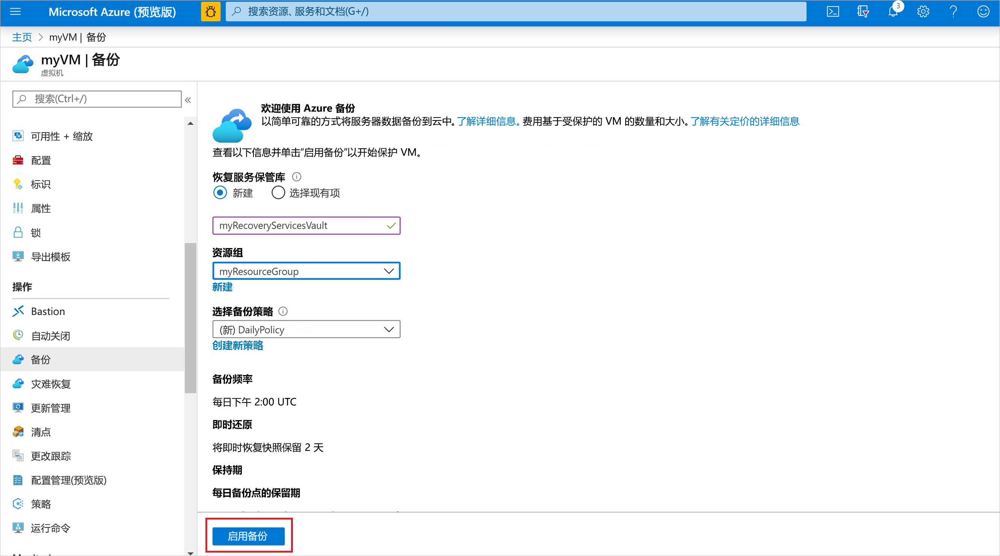
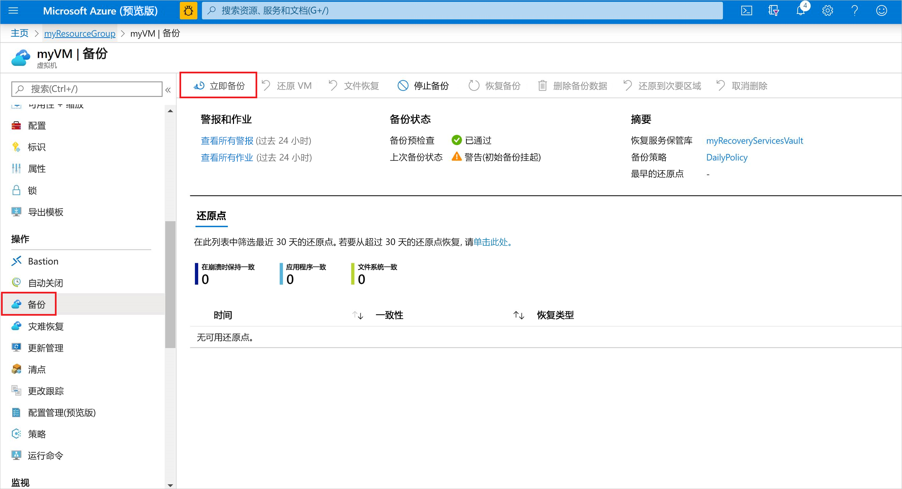
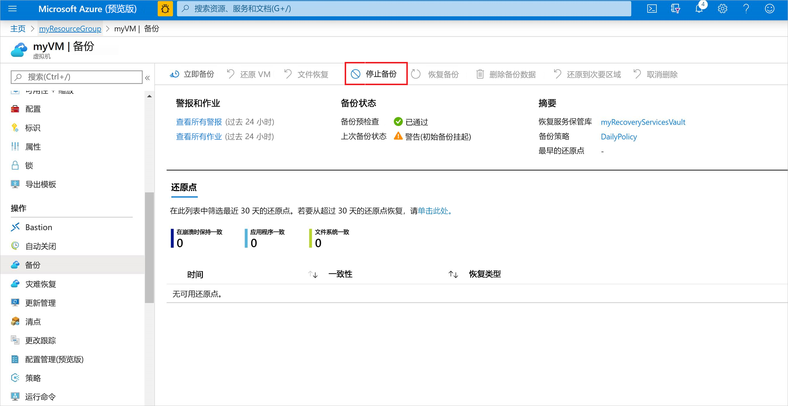

# 在 Azure 中备份虚拟机
可以通过 Azure 门户创建 Azure 备份。 此方法提供基于浏览器的用户界面用于创建和配置 Azure 备份及所有相关的资源。 可以通过定期创建备份来保护数据。 Azure 备份可创建恢复点，这些恢复点可存储在异地冗余的恢复保管库中。 本文详细介绍如何使用 Azure 门户备份虚拟机 (VM)。 

参考本快速入门可在现有的 Azure VM 上备份。 如果需要创建 VM，可以[使用 Azure 门户创建 VM](../virtual-machines/windows/quick-create-portal.md)。

## 登录 Azure

通过 http://portal.azure.com 登录到 Azure 门户。

## 选择要备份的 VM
在恢复服务保管库中创建一个简单的已计划每日备份。 

1. 在左侧菜单中选择“虚拟机”。 
2. 从列表中选择要备份的 VM。 如果使用了 VM 快速入门教程中的示例命令，VM 在 *myResourceGroup* 资源组中名为 *myVM*。
3. 在“操作”部分，选择“备份”。 此时会打开“启用备份”窗口。

## 在 VM 上启用备份
恢复服务保管库是一个逻辑容器，用于存储每个受保护资源（例如 Azure VM）的备份数据。 运行受保护资源的备份作业时，该作业会在恢复服务保管库中创建一个恢复点。 然后，可以使用其中一个恢复点将数据还原到给定的时间点。

1. 选择“新建”并提供新保管库的名称，例如 *myRecoveryServicesVault*。
2. 选择“使用现有”（如果尚未选择），并从下拉菜单中选择 VM 的资源组。

    

    默认情况下，保管库是针对异地冗余存储设置的。 为了进一步保护数据，此存储冗余级别可确保将备份数据复制到距离主要区域数百英里以外的 Azure 次要区域。

    创建并使用策略来定义备份作业的运行时间以及恢复点的存储期限。 默认保护策略每天运行备份作业，并将恢复点保留 30 天。 可以使用这些默认策略值来快速保护 VM。 

3. 若要接受默认备份策略值，请选择“启用备份”。

片刻之后即可创建恢复服务保管库。

## 启动备份作业
可以立即开始备份，而不用等待默认策略根据计划的时间运行作业。 这第一个备份作业会创建完整恢复点。 此初始备份后的每个备份作业会创建增量恢复点。 增量恢复点有利于存储并具有时效性，因为它们仅传输自上次备份以来所做的更改。

1. 在 VM 的“备份”窗口中，选择“立即备份”。

    

2. 若要接受 30 天备份保留策略，请保留默认的“保留备份截止日期”日期。 若要启动作业，请选择“备份”。

## 监视备份作业
VM 的“备份”窗口中显示了备份的状态，以及已完成的还原点数目。 VM 备份作业完成后，“概述”窗口的右侧会显示有关“上次备份时间”、“最新还原点”和“最旧还原点”的信息。

## 清理部署
如果不再需要，可以在 VM 上禁用保护，删除还原点和恢复服务保管库，然后删除资源组和关联的 VM 资源

如果想要继续学习有关如何还原 VM 数据的备份教程，请跳过本部分中的步骤，并转到[后续步骤](#next-steps)。

1. 选择 VM 的“备份”选项。

2. 选择“...更多”显示更多选项，再选择“停止备份”。

    

3. 从下拉菜单中选择“删除备份数据”。

4. 在“键入备份项的名称”对话框中输入 VM 名称，例如 *myVM*。 选择“停止备份”

    停止 VM 备份并删除恢复点之后，可以删除资源组。 如果使用了现有的 VM，你可能希望保留资源组和 VM。

5. 在左侧菜单中，选择“资源组”。 
6. 从列表中选择自己的资源组。 如果使用了 VM 快速入门教程中的示例命令，资源组名为 *myResourceGroup*。
7. 选择“删除资源组”。 若要确认删除，请输入资源组名称，选择“删除”。

    

## 后续步骤
本快速入门介绍了如何创建恢复服务保管库，如何在 VM 上启用保护，以及如何创建初始恢复点。 若要详细了解 Azure 备份和恢复服务，请继续学习其他教程。

> [!div class="nextstepaction"]
> [备份多个 Azure VM](./tutorial-backup-vm-at-scale.md)
