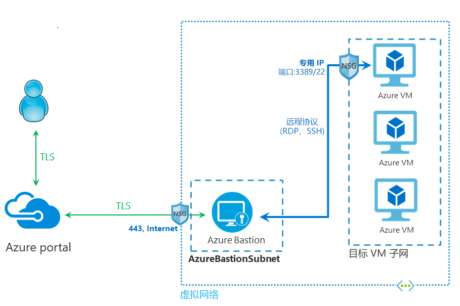

# 什么是 Azure Bastion？ （预览版）

Azure Bastion 服务是的一种新型的完全托管平台 PaaS 服务，可在虚拟网络中进行预配。 可通过 SSL 直接在 Azure 门户中实现与虚拟机之间的安全、无缝 RDP/SSH 连接。 在你通过 Azure Bastion 连接时，你的虚拟机无需公共 IP 地址。

 Bastion 为预配它的虚拟网络中所有的 VM 提供安全的 RDP 和 SSH 连接。 使用 Azure Bastion 可防止虚拟机向外部公开 RDP/SSH 端口，同时仍然使用 RDP/SSH 提供安全访问。 使用 Azure Bastion，可直接从 Azure 门户连接到虚拟机。 无需额外的客户端、代理或软件。

> [!IMPORTANT]
> 此公共预览版在提供时没有附带服务级别协议，不应用于生产工作负荷。 某些功能可能不受支持或受到约束，或者不一定在所有 Azure 位置都可用。 有关详细信息，请参阅 [Microsoft Azure 预览版补充使用条款](https://azure.microsoft.com/support/legal/preview-supplemental-terms/)。
>

## 体系结构

Azure Bastion 部署在虚拟网络中，部署后，它可为虚拟网络中的所有虚拟机提供安全的 RDP/SSH 连接体验。 在虚拟网络中预配 Azure Bastion 服务后，即可在同一虚拟网络中的所有 VM 上获得 RDP/SSH 体验。 此部署是按每个虚拟网络执行的，而不是按每个订阅/帐户或虚拟机执行的。

RDP 和 SSH 是连接 Azure 中运行的工作负载的基本方法。 不要通过 Internet 公开 RDP/SSH 端口，这被视为一个严重的威胁面。 这通常是由于协议漏洞造成的。 若要包含此威胁面，可以在外围网络的公共端部署 bastion 主机（也称为跳转服务器）。 Bastion 主机服务器在设计和配置上考虑了抵御攻击。 Bastion 服务器还为位于 bastion 后以及网络内的工作负载提供 RDP 和 SSH 连接。

此图显示了 Azure Bastion 部署体系结构。 在此图中：

* Bastion 主机部署在虚拟网络中。
* 用户使用任何 HTML5 浏览器连接到 Azure 门户。
* 用户选择要连接到的虚拟机。
* 单击一下，在浏览器中打开 RDP/SSH 会话。
* Azure VM 无需公共 IP。

## 主要功能

在公共预览期间可尝试以下功能：

* 在 Azure 门户中直接使用 RDP 和 SSH 连接  ：可以通过单击无缝体验直接在 Azure 门户中进行 RDP 和 SSH 会话。
* 通过 SSL 和防火墙遍历进行 RDP/SSH 远程会话  ：Azure Bastion 使用基于 HTML5 的 Web 客户端，该客户端自动流式传输到本地设备，使你通过端口 443 上的 SSL 进行 RDP/SSH 会话，支持安全遍历公司防火墙。
* Azure VM 无需公共 IP  ：Azure Bastion 使用 VM 上的专用 IP 打开与 Azure 虚拟机的 RDP/SSH 连接。 虚拟机无需公共 IP。
* 轻松管理 NSG  ：Azure Bastion 是 Azure 提供的完全托管平台 PaaS 服务，其内部进行了加固，以提供安全的 RDP/SSH 连接。 无需在 Azure Bastion 子网上应用任何 NSG。 由于 Azure Bastion 通过专用 IP 连接到虚拟机，所以可将 NSG 配置为仅允许来自 Azure Bastion 的 RDP/SSH。 这样消除了每次需要安全地连接到虚拟机时管理 NSG 的麻烦。
* 端口扫描防护  ：因为无需将虚拟机公开到公共 Internet，因此可防止 VM 受到虚拟网络外部的恶意用户的端口扫描。
* **防止零日漏洞。仅在一个位置强化：** Azure Bastion 是完全托管平台 PaaS 服务。 由于它位于虚拟网络外围，因此你无需担心如何强化虚拟网络中的每个虚拟机。 Azure 平台通过使 Azure Bastion 保持强化且始终保持最新版本，防止零日漏洞。

## 常见问题解答

[!INCLUDE [Bastion FAQ](../../includes/bastion-faq-include.md)]

## 后续步骤

* [创建 Azure Bastion 主机资源](bastion-create-host-portal.md)。
* 了解 Azure 的一些其他关键[网络功能](../networking/networking-overview.md)。
