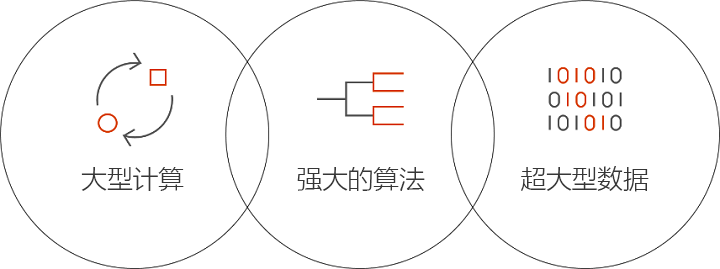

# Azure 中的 Batch AI 是什么？
Batch AI 是一项托管的服务，可以让数据科学家和 AI 研究人员在 Azure 虚拟机（包括带 GPU 支持的 VM）群集上训练 AI 和其他机器学习模型。 你只需描述作业要求，在何处查找输入和存储输出，其余的由 Batch AI 处理。  
 
## 为何使用 Batch AI？ 
开发强大的 AI 算法是计算密集型迭代过程。 数据科学家和 AI 研究人员需要处理的数据集正变得越来越大。 他们开发的模型所使用的层越来越多，而针对超参数优化进行网络设计时，所需要的试验也越来越多。 若要高效地这样做，需要每个模型使用多个 CPU 或 GPU、并行运行试验，以及使用共享存储来训练数据、日志和模型输出。   
 

数据科学家和 AI 研究人员是各自领域的专家，但在大规模管理基础结构方面却可能是外行。 大规模开发 AI 需要执行许多基础结构任务：预配 VM 群集、安装软件和容器、将工作排队、确定作业优先级并对作业进行计划、处理故障、分配数据、共享结果、缩放管理成本所需的资源，以及与工具和工作流集成。 Batch AI 负责处理这些任务。 
 
## 什么是 Batch AI？ 

Batch AI 提供专用于 AI 训练和测试的资源管理和作业计划功能。 关键功能包括： 

* 进行长时间运行的批处理作业、迭代试验和交互式训练 
* 自动或手动缩放使用 GPU 或 CPU 的 VM 群集 
* 配置 VM 之间的以及适用于远程访问的 SSH 通信 
* 支持任何深度学习或机器学习框架，并优化适用于常用工具包（例如 [Microsoft 认知工具包](https://github.com/Microsoft/CNTK) (CNTK)、[TensorFlow](https://www.tensorflow.org/)、[Chainer](https://chainer.org/)）的配置 
* 基于优先级的作业队列，可以共享群集并利用低优先级 VM 和预订实例  
* 灵活的存储选项，包括 Azure 文件和托管 NFS 服务器 
* 将远程文件共享装载到 VM 和可选容器中 
* 提供作业状态，并在 VM 故障时重启 
* 访问输出日志、stdout、stderr 和模型，包括从 Azure 存储流式传输的内容 
* Azure [命令行界面](/cli/azure) (CLI)，用于 [Python](https://github.com/Azure/azure-sdk-for-python)、[C#](https://www.nuget.org/packages/Microsoft.Azure.Management.BatchAI/1.0.0-preview) 和 Java 的 SDK，在 Azure 门户中进行监视，以及与 Microsoft AI 工具集成 

Batch AI SDK 支持编写多种脚本或应用程序，用于管理训练管道以及与工具集成。 此 SDK 目前提供 Python、C#、Java 和 REST API。  
 

Batch AI 使用 Azure 资源管理器进行控制平面操作（创建、列出、获取、删除）。 Azure Active Directory 用于身份验证和基于角色的访问控制。  
 
## 如何使用 Batch AI 

若要使用 Batch AI，请定义并管理群集和作业。 

 
**群集**描述计算要求： 
* 需要在其中运行的 Azure 区域 
* 要使用的 VM 的系列和大小 - 例如，包含 4 个 NVIDIA K80 GPU 的 NC24 VM 
* VM 的数目，或者进行自动缩放所需的最小和最大数目 
* VM 映像 - 例如，Ubuntu 16.04 LTS 或 [Microsoft 深度学习虚拟机](https://azuremarketplace.microsoft.com/marketplace/apps/microsoft-ads.dsvm-deep-learning)
* 任何需要装载的远程文件共享卷 - 例如，来自 Azure 文件的卷或者 Batch AI 托管的 NFS 服务器的卷 
* 可以在 VM 上配置的用户名和 SSH 密钥或密码，用于进行调试所需的交互式登录  
 

**作业**描述： 
* 要使用的群集和区域 
* 多少 VM 用于作业 
* 需要在启动时传递到作业的输入和输出目录， 通常使用在群集设置过程中装载的共享文件系统 
* 一个可选容器，用于运行软件或运行安装脚本 
* 特定于 AI 框架的配置或命令行和参数，用于启动作业 
 

请通过 [Azure CLI](/cli/azure) 以及适用于群集和作业的配置文件开始使用 Batch AI。 可以使用此方法根据需要快速创建群集，并通过运行作业来试验网络设计或超参数。  
 

有了 Batch AI，就可以轻松地通过多个 GPU 来并行工作。 需要跨多个 GPU 来缩放作业时，可以通过 Batch AI 在 VM 之间设置安全的网络连接。 使用 InfiniBand 时，Batch AI 会配置驱动程序并跨作业的多个节点启动 MPI。  

## 数据管理
Batch AI 为训练脚本、数据和输出提供灵活的选项：
  
* “本地磁盘”用于早期试验以及规模较小的数据集。 就这种情况来说，可能需要通过 SSH 连接到虚拟机，以便编辑脚本和读取日志。 

* 使用“Azure 文件”可以跨多个作业共享训练数据，并将输出日志和模型存储在单个位置。 

* 设置 **NFS 服务器**可以支持更大规模的训练用数据和 VM。 Batch AI 可以设置一个 NFS 服务器，用作特殊的群集类型，其磁盘在 Azure 存储中受支持。 
 
* 可以通过**并行文件系统**提高数据的可伸缩性并实现并行训练。 虽然 Batch AI 不管理并行文件系统，但示例部署模板仍适用于 Lustre、Gluster 和 BeeGFS。  

## 后续步骤

* 开始使用 [Azure CLI](quickstart-cli.md) 或 [Python](quickstart-python.md) 创建第一个 Batch AI 训练作业。
* 查看适用于不同框架的示例[训练诀窍](https://github.com/Azure/BatchAI)。

