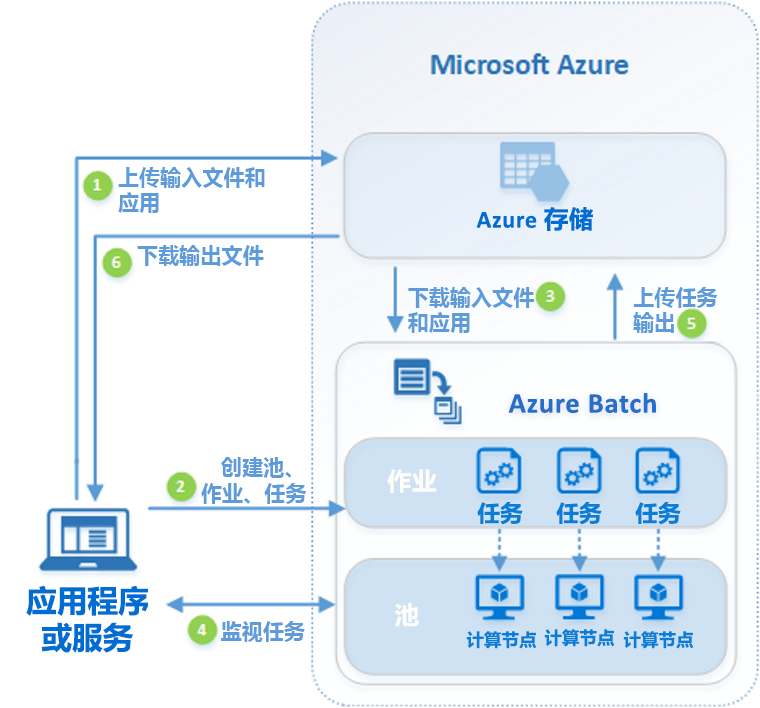

# 什么是 Azure Batch？

使用 Azure Batch 在 Azure 中高效运行大规模并行和高性能计算 (HPC) 批处理作业。 Azure Batch 可创建和管理计算节点（虚拟机）池、安装要运行的应用程序，以及计划要在节点上运行的作业。 没有要安装、管理或缩放的群集或作业计划程序软件。 只需使用 [Batch API 和工具](batch-apis-tools.md)、命令行脚本或 Azure 门户来配置、管理和监视作业即可。

开发人员可以使用 Batch 作为平台服务，在需要大规模执行的情况下生成 SaaS 应用程序或客户端应用。 例如，可使用 Batch 生成一项服务来为某家财务服务公司运行 Monte Carlo 风险模拟，或者生成一项服务来处理多个图像。

使用 Batch 不会产生额外的费用。 仅针对所使用的基础资源（例如虚拟机、存储和网络）计费。

有关 Batch 与 Azure 中其他 HPC 解决方案选项的比较，请参阅 [Azure 上的高性能计算 (HPC)](/azure/architecture/topics/high-performance-computing/)。

## 运行并行工作负荷

Batch 很适合处理本质并行（也称为“易并行”）的工作负荷。 本质上会并行运行的工作负载包含可独立运行的应用程序，其中每个实例会完成一部分工作。 应用程序在执行时，可能会访问一些公共数据，但不会与该应用程序的其他实例通信。 因此，本质并行工作负荷可以大规模运行，具体取决于可以用来同时运行应用程序的计算资源的量。

可以带到 Batch 来处理的本质并行工作负荷的示例包括：

- 使用 Monte Carlo 模拟进行财务风险建模
- VFX 和 3D 图像渲染
- 图像分析和处理
- 媒体转码
- 基因序列分析
- 光学字符识别 (OCR)
- 数据引入、处理和 ETL 操作
- 软件测试性执行

也可使用 Batch 来[运行紧密耦合的工作负载](batch-mpi.md)；在这些工作负载中，你运行的应用程序需要相互通信，而不是独立运行。 紧密耦合应用程序通常使用消息传递接口 (MPI) API。 可以使用 [Microsoft MPI](/message-passing-interface/microsoft-mpi) 或 Intel MPI，通过 Batch 来运行紧密耦合工作负荷。 通过专用的 [HPC](../virtual-machines/sizes-hpc.md) 和 [GPU 优化型](../virtual-machines/sizes-gpu.md) VM 大小来提高应用程序性能。

紧密耦合工作负荷的一些示例：

- 有限元素分析
- 流体动力学
- 多节点 AI 训练

许多紧密耦合作业可以使用 Batch 来并行运行。 例如，通过更改管道宽度对液体在管道中的流动进行多次模拟。

## 其他 Batch 功能

更高级别的特定于工作负荷的功能也适用于 Azure Batch：

- Batch 支持大规模[渲染工作负荷](batch-rendering-service.md)，使用的渲染工具包括 Autodesk Maya、3ds Max、Arnold 和 V-Ray。 
- R 用户可以安装 [doAzureParallel R 包](https://github.com/Azure/doAzureParallel)，在 Batch 池中轻松地横向扩展 R 算法的执行。

还可以在更大型的 Azure 工作流中运行 Batch 作业，以便转换 [Azure 数据工厂](../data-factory/transform-data-using-dotnet-custom-activity.md)等工具管理的数据。

## 工作原理

Batch 的常用方案涉及在计算节点池中横向扩展本质并行工作（例如渲染 3D 场景的图像）。 此池可以是“渲染场”，为渲染作业提供数十、数百甚至数千个核心。

下图显示一个常见 Batch 工作流中的步骤，其中有一个客户端应用程序或托管服务使用 Batch 运行并行工作负荷。

|步骤  |说明  |
|---------|---------|
|1.将**输入文件**和处理这些文件的**应用程序**上传到 Azure 存储帐户。     |输入文件可以是应用程序处理的任何数据，例如财务建模数据或要转码的视频文件。 应用程序文件可以包含处理数据的脚本或应用程序，例如媒体转码器。|
|2.创建一个包含 Batch 帐户中的计算节点的 Batch 池、一个用于在池中运行工作负载的作业，以及作业中的任务  。     | [计算节点](nodes-and-pools.md)是执行[任务](jobs-and-tasks.md)的 VM。 指定池的属性，例如节点的数目和大小、Windows 或 Linux VM 映像，以及在节点加入池时要安装的应用程序。 管理池的成本和大小，方法是使用[低优先级 VM](batch-low-pri-vms.md)，或者在工作负载变化时[自动缩放](batch-automatic-scaling.md)节点数。   当你将任务添加到作业时，Batch 服务自动计划任务在池中的计算节点上执行。 每项任务使用上传的应用程序来处理输入文件。 |
|3.将**输入文件**和**应用程序**下载到 Batch     |每个任务都可在执行之前将要处理的输入数据下载到所分配的节点中。 如果应用程序尚未安装在池节点上，可以改从此处下载它。 完成从 Azure 存储进行的下载以后，任务就会在分配的节点上执行。|
|4.监视**任务执行情况**     |可以在运行任务时查询 Batch，以便监视作业及其任务的进度。 客户端应用程序或服务通过 HTTPS 与 Batch 服务通信。 由于监视的任务可能成千上万，而这些任务又运行在成千上万的计算节点上，因此请确保[高效查询批处理服务](batch-efficient-list-queries.md)。|
|5.上传**任务输出**     |当任务完成时，它们可以将其输出数据上传到 Azure 存储。 也可直接从计算节点上的文件系统检索文件。|
|6.下载**输出文件**     |当监视检测到作业中的任务已完成时，客户端应用程序或服务可以下载需进一步处理的输出数据。|

请记住，上述工作流只是使用 Batch 的其中一种方式，还有许多其他功能和选项。 例如，可以在每个计算节点上执行[多个并行任务](batch-parallel-node-tasks.md)。 或者，也可使用[作业准备和完成任务](batch-job-prep-release.md)为作业准备节点，用完后进行清理。

有关池、节点、作业和任务等功能的概述，请参阅 [Batch 服务工作流和资源](batch-service-workflow-features.md)。 另请参阅最新的 [Batch 服务更新](https://azure.microsoft.com/updates/?product=batch)。

## 后续步骤

阅读以下快速入门文章之一，开始使用 Azure Batch：
- [使用 Azure CLI 运行第一个 Batch 作业](quick-create-cli.md)
- [使用 Azure 门户运行第一个 Batch 作业](quick-create-portal.md)
- [使用 .NET API 运行第一个 Batch 作业](quick-run-dotnet.md)
- [使用 Python API 运行第一个 Batch 作业](quick-run-python.md)
