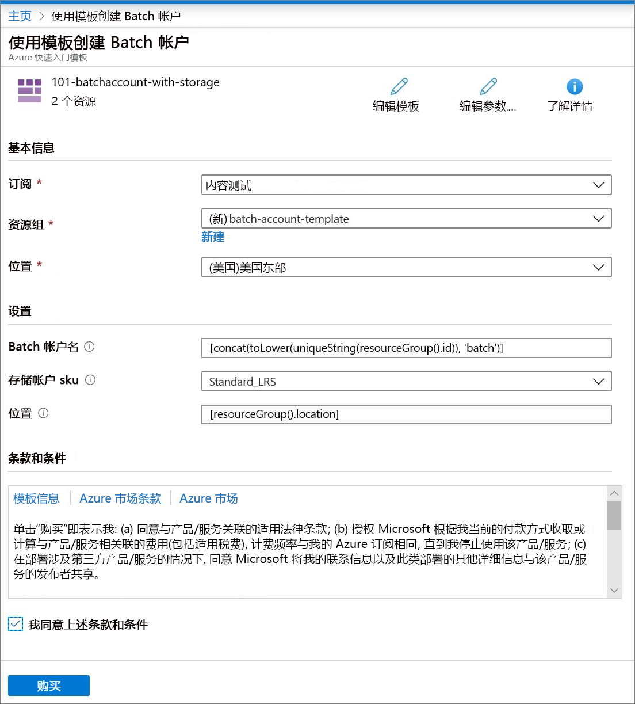

# 快速入门：使用 Azure 资源管理器模板创建 Batch 帐户

需要一个 Batch 帐户来创建计算资源（计算节点池）和批处理作业。 可将 Azure 存储帐户与 Batch 帐户关联，后者可以用于为大多数现实世界的工作负荷部署应用程序和存储输入和输出数据。 本快速入门介绍如何使用 Azure 资源管理器模板创建 Batch 帐户，包括存储。 完成本快速入门以后，你会了解 Batch 服务的重要概念，并可使用更逼真的工作负荷进行更大规模的 Batch 试用。

[!INCLUDE [About Azure Resource Manager](../../includes/resource-manager-quickstart-introduction.md)]

## 先决条件

必须拥有一个有效的 Azure 订阅。

- [!INCLUDE [quickstarts-free-trial-note](../../includes/quickstarts-free-trial-note.md)]

## 创建存储帐户

### 查看模板

本快速入门中使用的模板来自 [Azure 快速启动模板](https://azure.microsoft.com/resources/templates/101-batchaccount-with-storage/)。

:::code language="json" source="~/quickstart-templates/101-batchaccount-with-storage/azuredeploy.json" range="1-80" highlight="36-69":::

该模板中定义了两个 Azure 资源：

- [Microsoft.Storage/storageAccounts](https://docs.microsoft.com/azure/templates/microsoft.storage/storageaccounts)：创建存储帐户。
- [Microsoft.Batch/batchAccounts](https://docs.microsoft.com/azure/templates/microsoft.batch/batchaccounts)：创建 Batch 帐户。

### 部署模板

1. 选择下图登录到 Azure 并打开一个模板。 该模板将创建一个 Azure Batch 帐户和一个存储帐户。

   

1. 选择或输入以下值。

   

   - 订阅：选择一个 Azure 订阅。
   - 资源组：选择“新建”，输入资源组的唯一名称，然后单击“确定”。 
   - 位置：选择一个位置。 例如“美国中部”。
   - Batch 帐户名：保留默认值。
   - 存储帐户 sku：选择一个存储帐户类型。 例如 Standard_LRS。
   - 位置：保留默认值，以便资源与资源组位于相同位置。
   - 我同意上述条款和条件：选择。

1. 选择“购买”。

几分钟后，应会看到一条通知指出已成功创建 Batch 帐户。

在此示例中，使用 Azure 门户部署模板。 除了 Azure 门户，还可以使用 Azure PowerShell、Azure CLI 和 REST API。 若要了解其他部署方法，请参阅[部署模板](../azure-resource-manager/templates/deploy-powershell.md)。

## 验证部署

可以通过导航到你创建的资源组在 Azure 门户中验证部署。 在“概述”屏幕上，确认是否存在 Batch 帐户和存储帐户。

## 清理资源

如果打算继续使用后续的[教程](./tutorial-parallel-dotnet.md)，则可能需要保留这些资源。 或者，如果不再需要这些资源，可以[删除资源组](../azure-resource-manager/management/delete-resource-group.md?tabs=azure-portal#delete-resource-group)，此操作还将删除你创建的 Batch 帐户和存储帐户。

## 后续步骤

本快速入门创建了 Batch 帐户和存储帐户。 若要详细了解 Azure Batch，请继续学习 Azure Batch 教程。

> [!div class="nextstepaction"]
> [Azure Batch 教程](./tutorial-parallel-dotnet.md)
