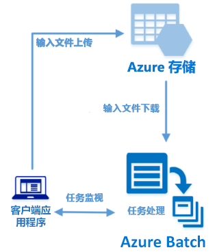

# <a name="quickstart-run-your-first-batch-job-with-the-python-api"></a>快速入门：使用 Python API 运行第一个 Batch 作业

本快速入门通过基于 Azure Batch Python API 生成的应用程序运行 Azure Batch 作业。 此应用将多个输入数据文件上传到 Azure 存储，然后创建包含 Batch 计算节点（虚拟机）的*池*。 再然后，它创建一个示例*作业*，以便运行*任务*，在池中使用基本命令来处理每个输入文件。 完成本快速入门以后，你会了解 Batch 服务的重要概念，并可使用更逼真的工作负荷进行更大规模的 Batch 试用。
 


[!INCLUDE [quickstarts-free-trial-note.md](../../includes/quickstarts-free-trial-note.md)]

## <a name="prerequisites"></a>先决条件

* [Python 2.7、3.3 或更高版本](https://www.python.org/downloads/)

* [pip](https://pip.pypa.io/en/stable/installing/) 包管理器

* Azure Batch 帐户和关联的 Azure 存储帐户。 若要创建这些帐户，请参阅 Batch 快速入门（使用 [Azure 门户](quick-create-portal.md)或 [Azure CLI](quick-create-cli.md)）。 

## <a name="sign-in-to-azure"></a>登录 Azure

在 [https://portal.azure.com](https://portal.azure.com) 中登录 Azure 门户。

[!INCLUDE [batch-common-credentials](../../includes/batch-common-credentials.md)]

## <a name="download-the-sample"></a>下载示例

从 GitHub [下载或克隆示例应用](https://github.com/Azure-Samples/batch-python-quickstart)。 若要使用 Git 客户端克隆示例应用存储库，请使用以下命令：

```
git clone https://github.com/Azure-Samples/batch-python-quickstart.git
```

导航到包含 Python 脚本 `python_quickstart_client.py` 的目录。

在 Python 开发环境中使用 `pip` 安装所需的包。

```bash
pip install -r requirements.txt
```

打开 `python_quickstart_client.py` 文件。 使用为帐户获取的值更新 Batch 帐户和存储帐户凭据字符串。 例如：


```Python
_BATCH_ACCOUNT_NAME = 'mybatchaccount'
_BATCH_ACCOUNT_KEY = 'xxxxxxxxxxxxxxxxE+yXrRvJAqT9BlXwwo1CwF+SwAYOxxxxxxxxxxxxxxxx43pXi/gdiATkvbpLRl3x14pcEQ=='
_BATCH_ACCOUNT_URL = 'https://mybatchaccount.mybatchregion.batch.azure.com'
_STORAGE_ACCOUNT_NAME = 'mystorageaccount'
_STORAGE_ACCOUNT_KEY = 'xxxxxxxxxxxxxxxxy4/xxxxxxxxxxxxxxxxfwpbIC5aAWA8wDu+AFXZB827Mt9lybZB1nUcQbQiUrkPtilK5BQ=='
```

## <a name="run-the-app"></a>运行应用程序

若要查看操作中的 Batch 工作流，请运行脚本：

```
python python_quickstart_client.py
```

运行脚本后，请查看代码，了解应用程序的每个部分的作用。 

运行示例应用程序时，控制台输出如下所示。 在执行期间启动池的计算节点时，会遇到暂停并看到`Monitoring all tasks for 'Completed' state, timeout in 00:30:00...`。 任务会排队，在第一个计算节点运行后马上运行。 转到 [Azure 门户](https://portal.azure.com)中的 Batch 帐户，监视 Batch 帐户中的池、计算节点、作业和任务。

```
Sample start: 12/4/2017 4:02:54 PM

Container [input] created.
Uploading file taskdata0.txt to container [input]...
Uploading file taskdata1.txt to container [input]...
Uploading file taskdata2.txt to container [input]...
Creating pool [PythonQuickstartPool]...
Creating job [PythonQuickstartJob]...
Adding 3 tasks to job [PythonQuickstartJob]...
Monitoring all tasks for 'Completed' state, timeout in 00:30:00...
```

任务完成后，会看到每个任务的输出，如下所示：

```
Printing task output...
Task: Task0
Node: tvm-2850684224_3-20171205t000401z
Standard out:
Batch processing began with mainframe computers and punch cards. Today it still plays a central role in business, engineering, science, and other pursuits that require running lots of automated tasks....
...
```

以默认配置运行应用程序时，典型的执行时间大约为 3 分钟。 初始池设置需要最多时间。

## <a name="review-the-code"></a>查看代码

本快速入门中的 Python 应用执行以下操作：

* 将三个小的文本文件上传到 Azure 存储帐户中的 Blob 容器。 这些文件是供 Batch 任务处理的输入。
* 创建一个池，其中包含两个运行 Ubuntu 16.04 LTS 的计算节点。
* 创建一个作业和三个任务，它们需要在节点上运行。 每个任务都使用 Bash shell 命令行来处理一个输入文件。
* 显示文件返回的任务。

有关详细信息，请参阅文件 `python_quickstart_client.py` 和以下部分。 

### <a name="preliminaries"></a>初步操作

为了与存储帐户交互，应用使用 [azure-storage-blob](https://pypi.python.org/pypi/azure-storage-blob) 包来创建 [BlockBlobService](/python/api/azure.storage.blob.blockblobservice.blockblobservice) 对象。

```python
blob_client = azureblob.BlockBlobService(
    account_name=_STORAGE_ACCOUNT_NAME,
    account_key=_STORAGE_ACCOUNT_KEY)
```

应用使用 `blob_client` 引用在存储帐户中创建容器，然后将数据文件上传到该容器。 存储中的文件定义为 Batch [ResourceFile](/python/api/azure.batch.models.resourcefile) 对象，Batch 随后可以将这些对象下载到计算节点。

```python
input_file_paths = [os.path.realpath('./data/taskdata0.txt'),
                    os.path.realpath('./data/taskdata1.txt'),
                    os.path.realpath('./data/taskdata2.txt')]
input_files = [
    upload_file_to_container(blob_client, input_container_name, file_path)
    for file_path in input_file_paths]
```

应用创建的 [BatchServiceClient](/python/api/azure.batch.batchserviceclient) 对象用于创建和管理 Batch 服务中的池、作业和任务。 示例中的 Batch 客户端使用共享密钥身份验证。 Batch 还支持 Azure Active Directory 身份验证。

```python
credentials = batchauth.SharedKeyCredentials(_BATCH_ACCOUNT_NAME,
    BATCH_ACCOUNT_KEY)

batch_client = batch.BatchServiceClient(
    credentials,
    base_url=_BATCH_ACCOUNT_URL)
```


### <a name="create-a-pool-of-compute-nodes"></a>创建计算节点池

为了创建 Batch 池，此应用使用 [PoolAddParameter](/python/api/azure.batch.models.pooladdparameter) 类来设置节点数、VM 大小和池配置。 在这里，[VirtualMachineConfiguration](/python/api/azure.batch.models.virtualmachineconfiguration) 对象指定对 Azure 市场中发布的 Ubuntu Server 16.04 LTS 映像的 [ImageReference](/python/api/azure.batch.models.imagereference)。 Batch 支持 Azure 市场中的各种 Linux 和 Windows Server 映像以及自定义 VM 映像。

节点数 (`_POOL_NODE_COUNT`) 和 VM 大小 (`_POOL_VM_SIZE`) 是定义的常数。 此示例默认创建的池包含 2 个大小为 *Standard_A1_v2* 的节点。 就此快速示例来说，建议的大小在性能和成本之间达成了很好的平衡。

[pool.add](/python/api/azure.batch.operations.pooloperations#azure_batch_operations_PoolOperations_add) 方法将池提交到 Batch 服务。

```python
new_pool = batch.models.PoolAddParameter(
    id=pool_id,
    virtual_machine_configuration=batchmodels.VirtualMachineConfiguration(
        image_reference=batchmodels.ImageReference(
            publisher="Canonical",
            offer="UbuntuServer",
            sku="16.04-LTS",
            version="latest"
            ),
        node_agent_sku_id="batch.node.ubuntu 16.04"),
    vm_size=_POOL_VM_SIZE,
    target_dedicated_nodes=_POOL_NODE_COUNT
)
batch_service_client.pool.add(new_pool)
```

### <a name="create-a-batch-job"></a>创建 Batch 作业

Batch 作业是对一个或多个任务进行逻辑分组。 作业包含任务的公用设置，例如优先级以及运行任务的池。 此应用使用 [JobAddParameter](/python/api/azure.batch.models.jobaddparameter) 类在池中创建作业。 [job.add](/python/api/azure.batch.operations.joboperations#azure_batch_operations_JobOperations_add) 方法将池提交到 Batch 服务。 作业一开始没有任务。

```python
job = batch.models.JobAddParameter(
    job_id,
    batch.models.PoolInformation(pool_id=pool_id))
batch_service_client.job.add(job)
```

### <a name="create-tasks"></a>创建任务

此应用使用 [TaskAddParameter](/python/api/azure.batch.models.taskaddparameter) 类创建任务对象的列表。 每个任务都使用 `command_line` 参数来处理输入 `resource_files` 对象。 在示例中，命令行运行 Bash shell `cat` 命令来显示文本文件。 此命令是一个用于演示的简单示例。 使用 Batch 时，可以在命令行中指定应用或脚本。 Batch 提供多种将应用和脚本部署到计算节点的方式。

然后，应用使用 [task.add_collection](/python/api/azure.batch.operations.taskoperations#azure_batch_operations_TaskOperations_add_collection) 方法将任务添加到作业，使任务按顺序在计算节点上运行。 

```python
tasks = list()

for idx, input_file in enumerate(input_files): 
    command = "/bin/bash -c \"cat {}\"".format(input_file.file_path)
    tasks.append(batch.models.TaskAddParameter(
        id='Task{}'.format(idx),
        command_line=command,
        resource_files=[input_file]
    )
)
batch_service_client.task.add_collection(job_id, tasks)
```

### <a name="view-task-output"></a>查看任务输出

此应用监视任务状态，确保任务完成。 然后，应用显示由每个已完成任务生成的 `stdout.txt` 文件。 如果任务成功运行，任务命令的输出将写入到 `stdout.txt`：

```python
tasks = batch_service_client.task.list(job_id)

for task in tasks:
    
    node_id = batch_service_client.task.get(job_id, task.id).node_info.node_id
    print("Task: {}".format(task.id))
    print("Node: {}".format(node_id))

    stream = batch_service_client.file.get_from_task(job_id, task.id, _STANDARD_OUT_FILE_NAME)

    file_text = _read_stream_as_string(
        stream,
        encoding)
    print("Standard output:")
    print(file_text)
```

## <a name="clean-up-resources"></a>清理资源

应用自动删除所创建的存储容器，并允许你选择是否删除 Batch 池和作业。 只要有节点在运行，就会对池收费，即使没有计划作业。 不再需要池时，请将其删除。 删除池时会删除节点上的所有任务输出。 

若不再需要资源组、Batch 帐户和存储帐户，请将其删除。 为此，请在 Azure 门户中选择 Batch 帐户所在的资源组，然后单击“删除资源组”。

## <a name="next-steps"></a>后续步骤

本快速入门运行了使用 Batch Python API 生成的小应用，目的是创建 Batch 池和 Batch 作业。 该作业运行了示例任务，并下载了在节点上产生的输出。 了解 Batch 服务的重要概念以后，即可使用更逼真的工作负荷进行更大规模的 Batch 试用。 若要详细了解 Azure Batch 并使用实际的应用程序演练并行工作负荷，请继续学习 Batch Python 教程。

> [!div class="nextstepaction"]
> [使用 Python 处理并行工作负荷](tutorial-parallel-python.md)
