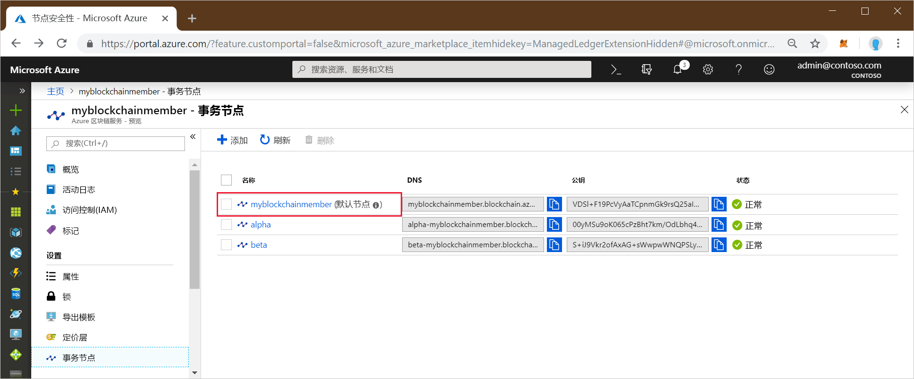
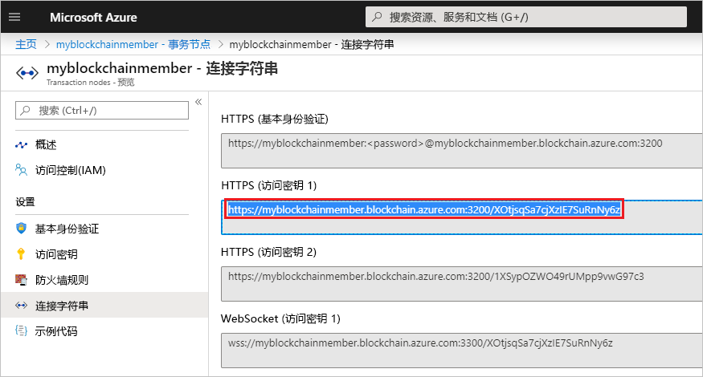

# <a name="quickstart-use-geth-to-attach-to-an-azure-blockchain-service-transaction-node"></a>快速入门：使用 Geth 附加到 Azure 区块链服务事务节点

在本快速入门中，你将使用 Geth 客户端附加到 Azure 区块链服务事务节点上的 Geth 实例。 附加后，你将使用 Geth JavaScript 控制台调用 web3 JavaScript Dapp API。

[!INCLUDE [quickstarts-free-trial-note](../../../includes/quickstarts-free-trial-note.md)]

## <a name="prerequisites"></a>先决条件

* 安装 [Geth](https://github.com/ethereum/go-ethereum/wiki/geth)
* 完整[快速入门：使用 Azure 门户创建区块链成员](create-member.md)或[快速入门：通过 Azure CLI 创建 Azure 区块链服务区块链成员](create-member-cli.md)

## <a name="get-geth-connection-string"></a>获取 Geth 连接字符串

可以在 Azure 门户中获取 Azure 区块链服务事务节点的 Geth 连接字符串。

1. 登录到 [Azure 门户](https://portal.azure.com)。
1. 转到你的 Azure 区块链服务成员。 选择“事务节点”  和默认事务节点链接。

    

1. 选择“连接字符串”  。
1. 从“HTTPS(访问密钥 1)”  中复制连接字符串。 下一部分中需要使用此字符串。

    

## <a name="connect-to-geth"></a>连接到 Geth

1. 打开命令提示符或 shell。
1. 使用 Geth attach 子命令附加到你的事务节点上正在运行的 Geth 实例。 将连接字符串粘贴为 attach 子命令的参数。 例如：

    ``` bash
    geth attach <connection string>
    ```

1. 连接到事务节点的 Ethereum 控制台后，可以调用 web3 JavaScript Dapp API 或管理 API。

    例如，使用以下 API 来找到 chainId。

    ``` bash
    admin.nodeInfo.protocols.istanbul.config.chainId
    ```

    在此示例中，chainId 为 661。

    

1. 若要从控制台断开连接，请键入 `exit`。

## <a name="next-steps"></a>后续步骤

在本快速入门中，你使用 Geth 客户端附加到了 Azure 区块链服务事务节点上的 Geth 实例。 尝试下一个教程，使用适用于 Ethereum 的 Azure 区块链开发工具包通过事务创建、生成、部署和执行智能合同函数。

> [!div class="nextstepaction"]
> [在 Azure 区块链服务中创建、生成和部署智能合同](send-transaction.md)
