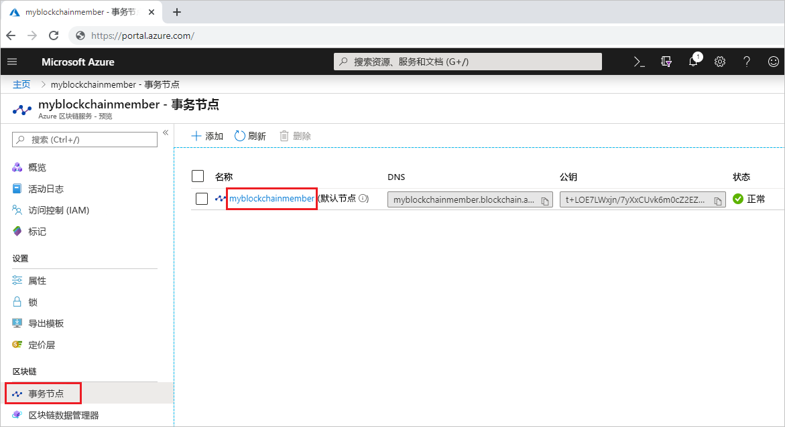
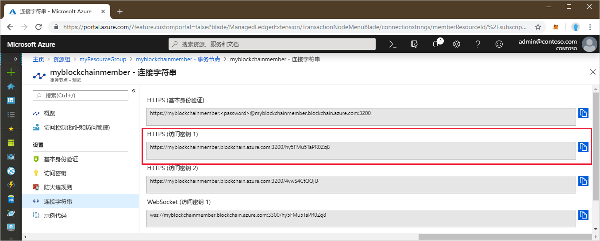
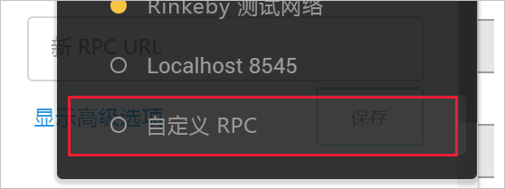
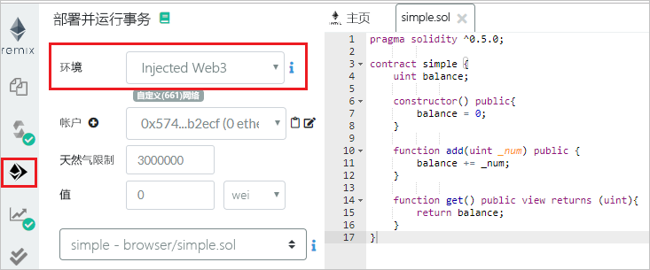
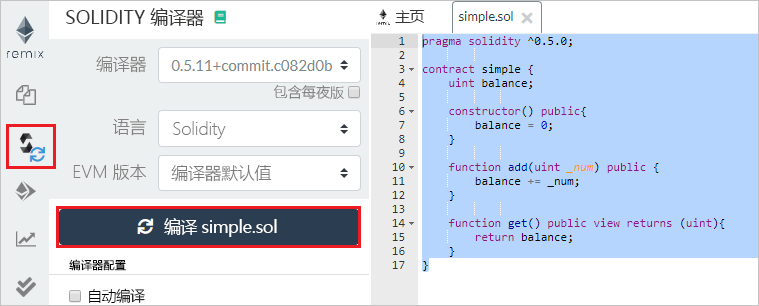
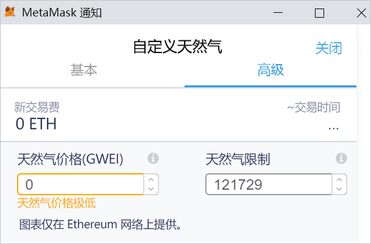
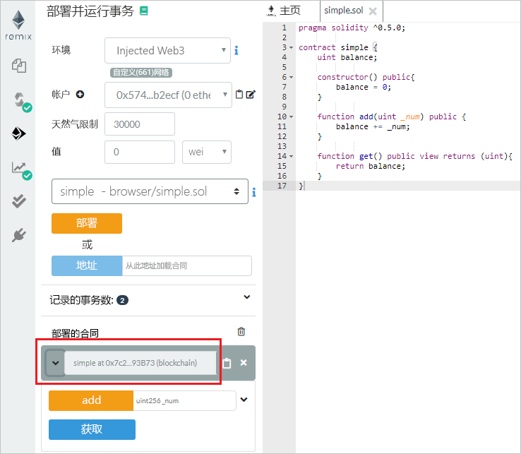
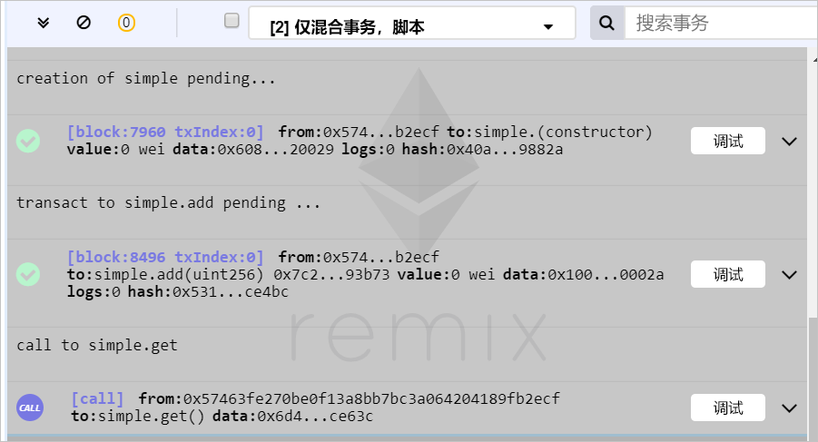

# <a name="quickstart-use-metamask-to-connect-and-deploy-a-smart-contract"></a>快速入门：使用 MetaMask 进行连接并部署智能合同

在本快速入门中，你将使用 MetaMask 连接到 Azure 区块链服务网络，并使用 Remix 来部署智能合同。 Metamask 是一个浏览器扩展，用于管理 Ether 钱包并执行智能合同操作。

[!INCLUDE [quickstarts-free-trial-note](../../../includes/quickstarts-free-trial-note.md)]

## <a name="prerequisites"></a>先决条件

* [创建 Azure 区块链成员](create-member.md)
* 安装 [MetaMask 浏览器扩展](https://metamask.io)
* 生成 MetaMask[钱包](https://metamask.zendesk.com/hc/en-us/articles/360015488971-New-to-MetaMask-Learn-How-to-Setup-MetaMask-the-First-Time)

## <a name="get-endpoint-address"></a>获取终结点地址

你需要具有 Azure 区块链服务终结点地址才能连接到区块链网络。 可以在 Azure 门户中找到终结点地址和访问密钥。

1. 登录到 [Azure 门户](https://portal.azure.com)。
1. 导航到你的 Azure 区块链服务成员。 选择“事务节点”和默认事务节点链接。

    

1. 选择“连接字符串”>“访问密钥”。
1. 从 **“HTTPS(访问密钥 1)”** 中复制终结点地址。 下一部分中需要使用此地址。

    

## <a name="connect-metamask"></a>连接 MetaMask

1. 打开 MetaMask 浏览器扩展并登录。
1. 在网络下拉列表中，选择“自定义 RPC”。

    

1. 在“新建网络”>“新建 RPC URL”中，输入在上一部分中复制的终结点地址。
1. 选择“保存”。

    如果连接成功，则专用网络会显示在网络下拉列表中。

    

## <a name="deploy-smart-contract"></a>部署智能合同

Remix 是一个基于浏览器的 Solidity 开发环境。 将 MetaMask 与 Remix 一起使用，你可以部署智能合同以及对其采取操作。

1. 在浏览器中，导航到 `https://remix.ethereum.org`。
1. 选择“运行”。 

    MetaMask 将“环境”设置为“Injected Web3”，将“帐户”设置为你的网络。

    

1. 选择“创建新文件”。

    将新文件命名为 `simple.sol`。

    

    选择“确定”。

1. 在 Remix 编辑器中，粘贴以下 **simple 智能合同**代码。

    ```solidity
    pragma solidity ^0.5.0;
             
    contract simple {
        uint balance;
                 
        constructor() public{
            balance = 0;
        }
                 
        function add(uint _num) public {
            balance += _num;
        }
                 
        function get() public view returns (uint){
            return balance;
        }
    }
    ```

    **simple 合同**声明了一个名为 **balance** 的状态变量。 定义了两个函数。 **add** 函数将一个数字加到 **balance**。 **get** 函数返回 **balance** 的值。

1. 若要编译该合同，请选择“编译”>“开始编译”。 如果成功，则会显示一个带有合同名称的绿色框。

    

1. 若要执行该合同，请选择“运行”选项卡。选择 **simple** 合同，然后选择“部署”。

    

1. 将显示一个 MetaMask 通知，提示你没有足够的资金来执行此事务。

    对于公共区块链网络，你需要使用 Ether 来支付事务成本。 因为这是联盟中的一个专用网络，因此可以将天然气价格设置为零。

1.  选择“天然气费用”>“编辑”>“高级”，将“天然气价格”设置为 0。

    

    选择“保存”。

1. 选择“确认”以将智能合同部署到区块链。
1. 在“已部署的合同”部分中，展开 **simple** 合同。

    

    这里有两个操作：**添加**和**获取**，它们映射到合同中定义的函数。

1. 若要在区块链上执行**添加**事务，请输入要添加的数字，然后选择“添加”。
1. 与部署合同时类似，将显示一个 MetaMask 通知，提示你没有足够的资金来执行此事务。

    因为这是联盟中的一个专用网络，因此可以将天然气价格设置为零。

1.  选择“天然气费用”>“编辑”>“高级”，将“天然气价格”设置为 0，然后选择“保存”。
1. 选择“确认”以在区块链上执行此事务。
1. 选择“获取”操作。 这是对查询节点数据的调用。 不需要使用事务。
1. 在 Remix 的调试窗格中，可以看到区块链上的事务的详细信息。

    

    你可以看到 **simple** 合同创建，**simple.add** 的事务以及对 **simple.get** 的调用。

1. 还可以看到 MetaMask 中的事务历史记录。 打开 MetaMask 浏览器扩展。
1. 在“历史记录”部分中，可以看到已部署的合同和事务的日志。

## <a name="next-steps"></a>后续步骤

在本快速入门中，你使用 MetaMask 浏览器扩展连接到了 Azure 区块链服务事务节点，部署了智能合同，并向区块链发送了一个事务。 请尝试下一教程来使用 Truffle 部署并发送事务。

> [!div class="nextstepaction"]
> [发送事务](send-transaction.md)