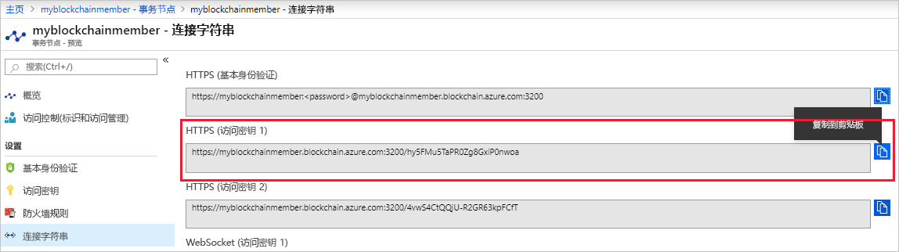

# <a name="quickstart-use-truffle-to-connect-to-a-transaction-node"></a>快速入门：使用 Truffle 连接到事务节点

Truffle 是一个区块链开发环境，可以用来连接到 Azure 区块链服务事务节点。

[!INCLUDE [quickstarts-free-trial-note](../../../includes/quickstarts-free-trial-note.md)]

## <a name="prerequisites"></a>先决条件

* [创建 Azure 区块链成员](create-member.md)
* 安装 [Truffle](https://github.com/trufflesuite/truffle)。 Truffle 要求安装多个工具，包括 [Node.js](https://nodejs.org)、[Git](https://git-scm.com/book/en/v2/Getting-Started-Installing-Git)。
* 安装 [Python 2.7.15](https://www.python.org/downloads/release/python-2715/)。 Web3 需要 Python。

## <a name="create-truffle-project"></a>创建 Truffle 项目

1. 打开 Node.js 命令提示符或 shell。
1. 将目录更改为你要在其中创建 Truffle 项目目录的位置。
1. 为该项目创建一个目录并将路径更改为新目录。 例如，

    ``` bash
    mkdir truffledemo
    cd truffledemo
    ```

1. 初始化 Truffle 项目。

    ``` bash
    truffle init
    ```

1. 在项目文件夹中安装 Ethereum JavaScript API web3。 当前需要 web3 版本 1.0.0-beta.37。

    ``` bash
    npm install web3@1.0.0-beta.37
    ```

    在安装过程中可能会收到 npm 警告。
    
## <a name="configure-truffle-project"></a>配置 Truffle 项目

若要配置 Truffle 项目，需要从 Azure 门户获取一些事务节点信息。

### <a name="transaction-node-endpoint-addresses"></a>事务节点终结点地址

1. 在 Azure 门户中，导航到默认事务节点并选择“事务节点”>“连接字符串”。 
1. 复制并保存“HTTPS (访问密钥 1)”中的终结点 URL  。 稍后在本教程中，需要在智能合同配置文件中提供终结点地址。

    

### <a name="edit-configuration-file"></a>编辑配置文件

接下来，需要使用事务节点终结点更新 Truffle 配置文件。

1. 在 **truffledemo** 项目文件夹中，通过编辑器打开 Truffle 配置文件 `truffle-config.js`。
1. 将该文件的内容替换为以下配置信息。 添加包含终结点地址的变量。 将尖括号替换为在前面部分中收集的值。

    ``` javascript
    var defaultnode = "<default transaction node connection string>";   
    var Web3 = require("web3");
    
    module.exports = {
      networks: {
        defaultnode: {
          provider: new Web3.providers.HttpProvider(defaultnode),
          network_id: "*"
        }
      }
    }
    ```

1. 保存对 `truffle-config.js` 的更改。

## <a name="connect-to-transaction-node"></a>连接到事务节点

使用 Web3 连接到事务节点  。

1. 使用 Truffle 控制台连接到默认事务节点。 在命令提示符下或 shell 中运行以下命令：

    ``` bash
    truffle console --network defaultnode
    ```

    Truffle 连接到默认事务节点并提供交互式控制台。

    你可以调用 **web3** 对象上的方法来与事务节点进行交互。

1. 调用 **getBlockNumber** 方法来返回当前的块编号。

    ```bash
    web3.eth.getBlockNumber();
    ```

    示例输出：

    ```bash
    truffle(defaultnode)> web3.eth.getBlockNumber();
    18567
    ```
1. 退出 Truffle 控制台。

    ```bash
    .exit
    ```

## <a name="next-steps"></a>后续步骤

在本快速入门中，你创建了一个 Truffle 项目来连接到你的 Azure 区块链服务默认事务节点。

尝试下一教程，使用适用于 Ethereum 和 Truffle 的 Azure 区块链开发工具包，通过联盟区块链网络上的事务执行智能合同函数。

> [!div class="nextstepaction"]
> [在 Azure 区块链服务上使用智能合同](send-transaction.md)
